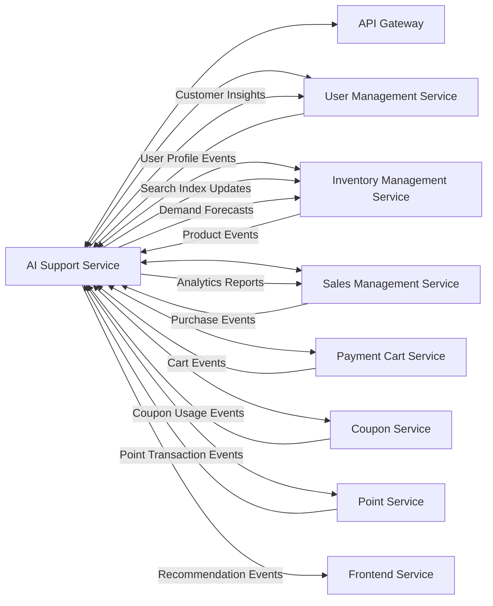
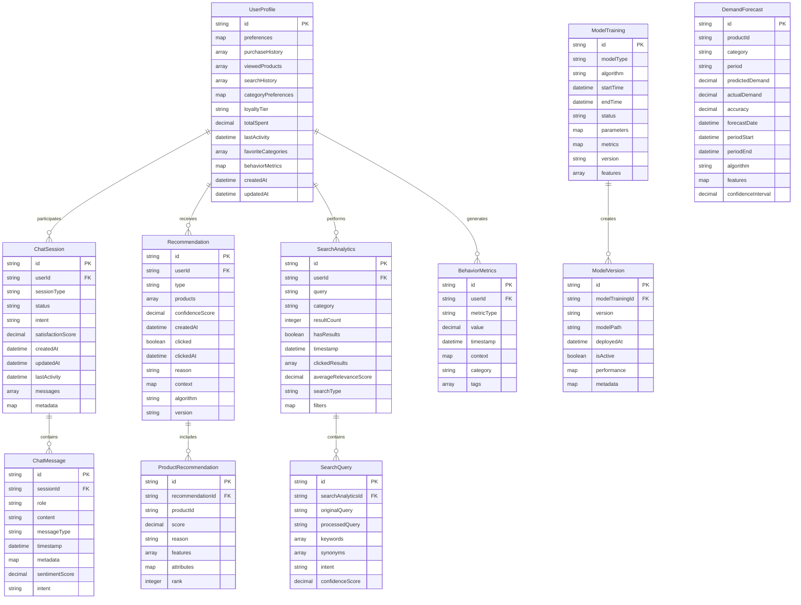
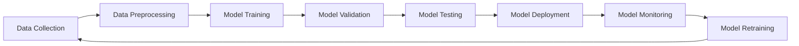

# AI Support Service - Detailed Design Document

## 1. Overview

The AI Support Service is a microservice that leverages Azure OpenAI Service and advanced AI capabilities to provide intelligent support features for the ski shop e-commerce platform. It manages personalized product recommendations, AI-powered search functionality, intelligent chatbot customer service, demand forecasting and predictive analytics, and comprehensive user behavior analytics. The service integrates seamlessly with other microservices to enhance the customer experience, optimize business operations, and provide valuable insights for decision-making. This service acts as the brain of the platform, utilizing machine learning models to understand customer preferences, predict trends, and deliver exceptional personalized experiences.

## 2. Technology Stack

### Development Environment

- **Language**: Java 21 (LTS)
- **Framework**: Spring Boot 3.2.3
- **Build Tool**: Maven 3.9.x
- **Containerization**: Docker 25.x
- **Testing**: JUnit 5.10.1, Spring Boot Test, Testcontainers 1.19.3

### Production Environment

- Azure Container Apps
- Azure OpenAI Service (GPT-4o, GPT-3.5-turbo)
- Azure Cognitive Search
- MongoDB Atlas
- Azure Redis Cache

### Major Libraries and Versions

| Library | Version | Purpose |
|---------|---------|---------|
| langchain4j-azure-open-ai | 1.1.0-rc1 | Azure OpenAI Service integration |
| langchain4j-spring-boot-starter | 1.1.0-beta7 | LangChain4j Spring Boot integration |
| langchain4j-embeddings-all-minilm-l6-v2 | 1.1.0-beta7 | Embedding models |
| langchain4j-easy-rag | 1.1.0-beta7 | RAG (Retrieval Augmented Generation) |
| spring-boot-starter-web | 3.2.3 | REST API endpoints |
| spring-boot-starter-data-mongodb | 3.2.3 | MongoDB data access |
| spring-boot-starter-data-redis | 3.2.3 | Redis caching |
| spring-boot-starter-validation | 3.2.3 | Input validation |
| spring-boot-starter-security | 3.2.3 | Security configuration |
| spring-boot-starter-actuator | 3.2.3 | Health checks, metrics |
| spring-cloud-starter-stream-kafka | 4.1.0 | Event publishing/subscription |
| spring-cloud-starter-circuitbreaker-resilience4j | 3.0.3 | Circuit breaker pattern |
| spring-boot-starter-cache | 3.2.3 | Caching functionality |
| spring-retry | 2.0.5 | Retry mechanisms for API calls |
| springdoc-openapi-starter-webmvc-ui | 2.3.0 | API documentation |
| mapstruct | 1.5.5.Final | Object mapping |
| lombok | 1.18.30 | Boilerplate code reduction |
| micrometer-registry-prometheus | 1.12.2 | Metrics collection |
| azure-identity | 1.11.1 | Azure authentication |
| azure-security-keyvault-secrets | 4.6.2 | Azure Key Vault integration |
| azure-ai-textanalytics | 5.2.4 | Azure Text Analytics for sentiment analysis |
| azure-search-documents | 11.5.8 | Azure Cognitive Search integration |
| commons-math3 | 3.6.1 | Mathematical computations for ML algorithms |
| weka | 3.8.6 | Machine learning algorithms |

## 3. System Architecture

### Component Architecture Diagram

```mermaid
graph TB
    subgraph "AI Support Service"
        direction TB
        API[REST API Controller] --> CHAT[Chat Service]
        API --> RECOM[Recommendation Service]
        API --> SEARCH[Search Service]
        API --> FORECAST[Forecast Service]
        API --> ANALYTICS[Analytics Service]
        
        CHAT --> CHAT_ASSISTANT[AI Chat Assistant]
        RECOM --> RECOM_ASSISTANT[Recommendation Assistant]
        SEARCH --> SEARCH_ASSISTANT[Search Enhancement Assistant]
        FORECAST --> FORECAST_ASSISTANT[Demand Forecast Assistant]
        ANALYTICS --> ANALYTICS_ENGINE[Analytics Engine]
        
        CHAT_ASSISTANT --> LANGCHAIN[LangChain4j Service]
        RECOM_ASSISTANT --> LANGCHAIN
        SEARCH_ASSISTANT --> LANGCHAIN
        FORECAST_ASSISTANT --> LANGCHAIN
        
        LANGCHAIN --> OPENAI[Azure OpenAI Service]
        
        CHAT --> CHAT_REPO[Chat Repository]
        RECOM --> RECOM_REPO[Recommendation Repository]
        ANALYTICS --> ANALYTICS_REPO[Analytics Repository]
        FORECAST --> FORECAST_REPO[Forecast Repository]
        SEARCH --> SEARCH_REPO[Search Analytics Repository]
        
        CHAT_REPO --> MONGODB[(MongoDB)]
        RECOM_REPO --> MONGODB
        ANALYTICS_REPO --> MONGODB
        FORECAST_REPO --> MONGODB
        SEARCH_REPO --> MONGODB
        
        RECOM --> VECTOR_DB[Azure Cognitive Search]
        SEARCH --> VECTOR_DB
        FORECAST --> VECTOR_DB
        
        CACHE[Redis Cache] --> CHAT
        CACHE --> RECOM
        CACHE --> SEARCH
        CACHE --> FORECAST
        CACHE --> ANALYTICS
        
        EVENT[Event Publisher Service] --> KAFKA[Kafka]
        RECOM --> EVENT
        CHAT --> EVENT
        ANALYTICS --> EVENT
        FORECAST --> EVENT
        SEARCH --> EVENT
        
        ML_ENGINE[ML Model Engine] --> RECOM
        ML_ENGINE --> FORECAST
        ML_ENGINE --> ANALYTICS
        
        EMBEDDING_SERVICE[Embedding Service] --> VECTOR_DB
        EMBEDDING_SERVICE --> SEARCH
        EMBEDDING_SERVICE --> RECOM
    end
    
    %% External System Connections
    API --> GATEWAY[API Gateway]
    EVENT --> INVENTORY[Inventory Management Service]
    EVENT --> SALES[Sales Management Service]
    EVENT --> USER[User Management Service]
    EVENT --> PAYMENT[Payment Cart Service]
```



### Microservice Relationship Diagram



## 4. Data Model

### Entity Relationship Diagram



## Service Information

| Item | Value |
|------|-------|
| Service Name | ai-support-service |
| Port | 8087 |
| Database | MongoDB (skishop_ai) |
| Cache | Redis |
| Framework | Spring Boot 3.2.3 with LangChain4j 1.1.0 |
| Java Version | 21 |
| Architecture | Microservice with Event-Driven Architecture and AI/ML Pipeline |

## Technology Stack

| Category | Technology | Version | Purpose |
|----------|-----------|---------|---------|
| Runtime | Java | 21 | Main programming language with modern features |
| Framework | Spring Boot | 3.2.3 | Main application framework |
| AI/ML Framework | LangChain4j | 1.1.0 | AI/LLM orchestration framework |
| Database | MongoDB | 7.0+ | Primary data storage for unstructured AI data |
| Cache | Redis | 7.2+ | Caching and session storage |
| Message Queue | Apache Kafka | 7.4.0 | Event streaming |
| Vector Database | Azure Cognitive Search | Latest | Semantic search and vector storage |
| LLM | Azure OpenAI Service | GPT-4o | AI model for natural language processing |
| Embeddings | text-embedding-3-small | Latest | Text embedding model |
| Search Engine | Azure Cognitive Search | Latest | Full-text and semantic search |
| ML Platform | Weka | 3.8.6 | Machine learning algorithms |
| Build Tool | Maven | 3.9+ | Dependency management and build |
| Container | Docker | Latest | Containerization |

## Database Schema

### user_profiles collection

| Field | Data Type | Constraints | Description |
|-------|-----------|-------------|-------------|
| _id (userId) | String | PK | User ID |
| preferences | Map | NOT NULL | User preferences and settings |
| purchaseHistory | Array | DEFAULT [] | IDs of purchased products |
| viewedProducts | Array | DEFAULT [] | IDs of viewed products with timestamps |
| searchHistory | Array | DEFAULT [] | User search queries with timestamps |
| categoryPreferences | Map | DEFAULT {} | Category preference scores (0.0-1.0) |
| loyaltyTier | String | NOT NULL, DEFAULT 'BRONZE' | Loyalty tier (BRONZE, SILVER, GOLD, PLATINUM) |
| totalSpent | Double | DEFAULT 0.0 | Total amount spent by user |
| lastActivity | DateTime | NOT NULL | Last user activity timestamp |
| favoriteCategories | Array | DEFAULT [] | Favorite product categories |
| behaviorMetrics | Map | DEFAULT {} | User behavior metrics and scores |
| seasonalPreferences | Map | DEFAULT {} | Seasonal preference patterns |
| devicePreferences | Map | DEFAULT {} | Device and channel preferences |
| createdAt | DateTime | NOT NULL | Record creation timestamp |
| updatedAt | DateTime | NOT NULL | Record update timestamp |

### chat_sessions collection

| Field | Data Type | Constraints | Description |
|-------|-----------|-------------|-------------|
| _id | String | PK | Session ID |
| userId | String | FK, NOT NULL | User ID |
| sessionType | String | NOT NULL | Session type (SUPPORT, RECOMMENDATION, INQUIRY, COMPLAINT) |
| status | String | NOT NULL | Session status (ACTIVE, COMPLETED, EXPIRED, ESCALATED) |
| intent | String | NULL | Detected user intent |
| satisfactionScore | Double | DEFAULT 0.0 | Customer satisfaction score (1.0-5.0) |
| resolution | String | NULL | Resolution type (RESOLVED, ESCALATED, PENDING) |
| category | String | NULL | Support category |
| priority | String | DEFAULT 'NORMAL' | Priority level (LOW, NORMAL, HIGH, URGENT) |
| assignedAgent | String | NULL | Assigned human agent ID |
| tags | Array | DEFAULT [] | Session tags for categorization |
| createdAt | DateTime | NOT NULL | Session creation timestamp |
| updatedAt | DateTime | NOT NULL | Session update timestamp |
| lastActivity | DateTime | NOT NULL | Last activity timestamp |
| messages | Array | DEFAULT [] | Embedded chat messages |
| metadata | Map | DEFAULT {} | Additional session metadata |

### recommendations collection

| Field | Data Type | Constraints | Description |
|-------|-----------|-------------|-------------|
| _id | String | PK | Recommendation ID |
| userId | String | FK, NOT NULL | User ID |
| type | String | NOT NULL | Recommendation type (PERSONALIZED, SIMILAR, TRENDING, SEASONAL, CROSS_SELL, UP_SELL) |
| products | Array | NOT NULL | Recommended product details |
| confidenceScore | Double | NOT NULL | Recommendation confidence score (0.0-1.0) |
| clicked | Boolean | DEFAULT false | Whether recommendation was clicked |
| clickedAt | DateTime | NULL | Timestamp when clicked |
| purchased | Boolean | DEFAULT false | Whether recommended product was purchased |
| purchasedAt | DateTime | NULL | Timestamp when purchased |
| reason | String | NULL | Human-readable recommendation reason |
| context | Map | DEFAULT {} | Recommendation context (page, time, etc.) |
| algorithm | String | NOT NULL | Algorithm used for recommendation |
| version | String | NOT NULL | Model version used |
| features | Array | DEFAULT [] | Features used in recommendation |
| expiresAt | DateTime | NULL | Recommendation expiration timestamp |
| createdAt | DateTime | NOT NULL | Record creation timestamp |

### search_analytics collection

| Field | Data Type | Constraints | Description |
|-------|-----------|-------------|-------------|
| _id | String | PK | Search Analytics ID |
| userId | String | FK, NULL | User ID (null for anonymous searches) |
| query | String | NOT NULL | Original search query |
| processedQuery | String | NOT NULL | Processed/normalized search query |
| category | String | NULL | Search category filter |
| resultCount | Integer | NOT NULL | Number of results returned |
| hasResults | Boolean | NOT NULL | Whether search returned results |
| timestamp | DateTime | NOT NULL | Search timestamp |
| clickedResults | Array | DEFAULT [] | Clicked search results |
| averageRelevanceScore | Double | DEFAULT 0.0 | Average relevance score of results |
| searchType | String | NOT NULL | Search type (TEXT, VOICE, IMAGE, BARCODE) |
| filters | Map | DEFAULT {} | Applied search filters |
| location | String | NULL | User location context |
| device | String | NULL | Device type used for search |
| sessionId | String | NULL | Session ID for search session tracking |
| responseTime | Long | NOT NULL | Search response time in milliseconds |

### model_training collection

| Field | Data Type | Constraints | Description |
|-------|-----------|-------------|-------------|
| _id | String | PK | Training ID |
| modelType | String | NOT NULL | Model type (RECOMMENDATION, DEMAND_FORECAST, SENTIMENT_ANALYSIS) |
| algorithm | String | NOT NULL | Algorithm used |
| startTime | DateTime | NOT NULL | Training start timestamp |
| endTime | DateTime | NULL | Training end timestamp |
| status | String | NOT NULL | Training status (PENDING, RUNNING, COMPLETED, FAILED) |
| parameters | Map | DEFAULT {} | Training parameters |
| metrics | Map | DEFAULT {} | Training metrics and performance |
| version | String | NOT NULL | Model version |
| features | Array | DEFAULT [] | Features used in training |
| trainingDataSize | Long | DEFAULT 0 | Size of training dataset |
| validationScore | Double | NULL | Validation score |
| notes | String | NULL | Training notes and comments |
| createdBy | String | NULL | User who initiated training |

### demand_forecasts collection

| Field | Data Type | Constraints | Description |
|-------|-----------|-------------|-------------|
| _id | String | PK | Forecast ID |
| productId | String | NOT NULL | Product ID |
| category | String | NOT NULL | Product category |
| period | String | NOT NULL | Forecast period (DAILY, WEEKLY, MONTHLY) |
| predictedDemand | Double | NOT NULL | Predicted demand quantity |
| actualDemand | Double | NULL | Actual demand (filled post-period) |
| accuracy | Double | NULL | Forecast accuracy percentage |
| forecastDate | DateTime | NOT NULL | Date when forecast was generated |
| periodStart | DateTime | NOT NULL | Forecast period start |
| periodEnd | DateTime | NOT NULL | Forecast period end |
| algorithm | String | NOT NULL | Algorithm used for forecasting |
| features | Map | DEFAULT {} | Features used in forecasting |
| confidenceInterval | Double | NOT NULL | Confidence interval (0.0-1.0) |
| seasonalFactor | Double | DEFAULT 1.0 | Seasonal adjustment factor |
| trendFactor | Double | DEFAULT 1.0 | Trend adjustment factor |
| externalFactors | Map | DEFAULT {} | External factors considered |

## 5. API Design

### REST API Endpoints

#### Recommendation Management API

| Method | Path | Description | Parameters | Response |
|---------|-----|------------|------------|----------|
| GET | /api/v1/recommendations/{userId} | Get personalized recommendations | userId, limit, category, type | RecommendationResponse |
| GET | /api/v1/recommendations/similar/{productId} | Get similar products | productId, limit, userId | SimilarProductResponse |
| GET | /api/v1/recommendations/trending | Get trending products | category, limit, timeframe | TrendingProductResponse |
| POST | /api/v1/recommendations/feedback | Record recommendation feedback | RecommendationFeedbackRequest | FeedbackResponse |
| PUT | /api/v1/recommendations/{recommendationId}/click | Track recommendation click | recommendationId, userId | ClickResponse |
| GET | /api/v1/recommendations/history/{userId} | Get user recommendation history | userId, pageable | `Page<RecommendationHistoryResponse>` |
| POST | /api/v1/recommendations/batch | Generate batch recommendations | BatchRecommendationRequest | BatchRecommendationResponse |
| GET | /api/v1/recommendations/performance | Get recommendation performance metrics | dateRange, type | PerformanceMetricsResponse |

#### Search Enhancement API

| Method | Path | Description | Parameters | Response |
|---------|-----|------------|------------|----------|
| GET | /api/v1/search | Search products with AI enhancement | query, category, filters, page, size | SearchResponse |
| GET | /api/v1/search/autocomplete | Get search autocomplete suggestions | query, limit | AutocompleteResponse |
| POST | /api/v1/search/semantic | Perform semantic search | SemanticSearchRequest | SemanticSearchResponse |
| GET | /api/v1/search/suggestions | Get search suggestions | query, context | SearchSuggestionResponse |
| POST | /api/v1/search/feedback | Record search result feedback | SearchFeedbackRequest | FeedbackResponse |
| GET | /api/v1/search/analytics | Get search analytics | dateRange, filters | SearchAnalyticsResponse |
| POST | /api/v1/search/reindex | Trigger search index rebuild | ReindexRequest | ReindexResponse |

#### Chat Support API

| Method | Path | Description | Parameters | Response |
|---------|-----|------------|------------|----------|
| POST | /api/v1/chat/session | Create new chat session | ChatSessionCreateRequest | ChatSessionResponse |
| POST | /api/v1/chat/message | Send message to chatbot | ChatMessageRequest | ChatMessageResponse |
| GET | /api/v1/chat/history/{sessionId} | Get chat history | sessionId, limit | ChatHistoryResponse |
| PUT | /api/v1/chat/session/{sessionId}/status | Update session status | sessionId, status | ChatSessionResponse |
| POST | /api/v1/chat/feedback | Submit chat feedback | ChatFeedbackRequest | FeedbackResponse |
| GET | /api/v1/chat/sessions/{userId} | Get user chat sessions | userId, status, pageable | `Page<ChatSessionResponse>` |
| POST | /api/v1/chat/escalate | Escalate to human agent | EscalationRequest | EscalationResponse |
| GET | /api/v1/chat/intents | Get supported chat intents | None | IntentsResponse |

#### Analytics and Forecasting API

| Method | Path | Description | Parameters | Response |
|---------|-----|------------|------------|----------|
| GET | /api/v1/analytics/user-behavior | Get user behavior analytics | userId, dateRange, metrics | UserBehaviorResponse |
| GET | /api/v1/analytics/sales-forecast | Get sales forecast | productId, period, horizon | SalesForecastResponse |
| GET | /api/v1/analytics/product-performance | Get product performance analytics | productId, category, dateRange | ProductPerformanceResponse |
| GET | /api/v1/analytics/trends | Get market trends | category, timeframe, region | TrendAnalysisResponse |
| GET | /api/v1/analytics/customer-segments | Get customer segmentation | segmentType, filters | CustomerSegmentResponse |
| POST | /api/v1/analytics/custom-report | Generate custom analytics report | CustomReportRequest | CustomReportResponse |
| GET | /api/v1/analytics/dashboard | Get analytics dashboard data | dashboardType, dateRange | DashboardResponse |

#### Model Management API

| Method | Path | Description | Parameters | Response |
|---------|-----|------------|------------|----------|
| POST | /api/v1/models/train | Trigger model training | ModelTrainingRequest | TrainingJobResponse |
| GET | /api/v1/models/status/{trainingId} | Get training status | trainingId | TrainingStatusResponse |
| GET | /api/v1/models/versions | Get model versions | modelType, status | ModelVersionResponse |
| POST | /api/v1/models/deploy | Deploy model version | ModelDeploymentRequest | DeploymentResponse |
| GET | /api/v1/models/performance | Get model performance metrics | modelType, version, dateRange | ModelPerformanceResponse |
| POST | /api/v1/models/a-b-test | Start A/B testing | ABTestRequest | ABTestResponse |

### Implementation Notes

- **Recommendation Personalization**: The recommendation API uses collaborative filtering, content-based filtering, and hybrid approaches to generate personalized recommendations
- **Real-time Chat**: Chat API supports WebSocket connections for real-time messaging with fallback to REST polling
- **Search Enhancement**: AI-powered search uses semantic understanding and query expansion for improved results
- **Model Training**: Automated model retraining triggers based on data drift detection and performance metrics
- **Authentication**: All user-specific endpoints require JWT authentication; analytics endpoints require ADMIN role
- **Rate Limiting**: Implemented per-user and per-endpoint rate limiting to prevent abuse
- **Caching**: Aggressive caching strategy for recommendations and search results with intelligent cache invalidation

### Request/Response Examples

#### Get Personalized Recommendations Request

```http
GET /api/v1/recommendations/user123?limit=10&category=ski&type=PERSONALIZED
Authorization: Bearer <jwt-token>
```

#### Personalized Recommendations Response

```json
{
  "userId": "user123",
  "recommendationType": "PERSONALIZED",
  "algorithm": "collaborative_filtering_v2.1",
  "products": [
    {
      "productId": "prod001",
      "score": 0.92,
      "reason": "Based on your previous purchases of ski equipment",
      "features": ["price_range", "brand_preference", "category_affinity"],
      "rank": 1
    },
    {
      "productId": "prod002",
      "score": 0.85,
      "reason": "Similar to items you viewed recently",
      "features": ["viewing_history", "similar_users"],
      "rank": 2
    }
  ],
  "confidence": 0.89,
  "context": {
    "page": "homepage",
    "timeOfDay": "evening",
    "season": "winter"
  },
  "expiresAt": "2025-07-03T12:15:30.123Z",
  "timestamp": "2025-07-03T10:15:30.123Z"
}
```

#### Chat Message Request

```json
{
  "sessionId": "session-456",
  "message": "I'm looking for ski boots for intermediate skiers",
  "messageType": "TEXT",
  "context": {
    "page": "product_search",
    "previousQuery": "ski equipment"
  }
}
```

#### Chat Message Response

```json
{
  "sessionId": "session-456",
  "messageId": "msg-789",
  "response": "I'd be happy to help you find the perfect ski boots! For intermediate skiers, I recommend looking at boots with a flex rating between 70-90. Based on your browsing history, I see you've been looking at alpine skiing equipment. Would you prefer a specific brand or price range?",
  "intent": "PRODUCT_RECOMMENDATION",
  "confidence": 0.94,
  "suggestedActions": [
    {
      "type": "SHOW_PRODUCTS",
      "data": {
        "category": "ski_boots",
        "filters": {
          "skill_level": "intermediate",
          "flex_rating": "70-90"
        }
      }
    }
  ],
  "timestamp": "2025-07-03T10:16:45.123Z"
}
```

#### Search Request with AI Enhancement

```json
{
  "query": "warm winter jacket for skiing",
  "filters": {
    "category": "apparel",
    "priceRange": {
      "min": 10000,
      "max": 50000
    },
    "size": "L"
  },
  "semanticSearch": true,
  "personalizeResults": true,
  "userId": "user123"
}
```

#### Enhanced Search Response

```json
{
  "query": "warm winter jacket for skiing",
  "processedQuery": "insulated ski jacket winter apparel",
  "totalResults": 156,
  "results": [
    {
      "productId": "jacket-001",
      "name": "Alpine Pro Insulated Ski Jacket",
      "relevanceScore": 0.95,
      "reason": "Matches your search for warm winter ski jackets",
      "highlights": ["insulated", "waterproof", "skiing"],
      "personalizedScore": 0.88
    }
  ],
  "searchSuggestions": [
    "ski pants",
    "thermal base layers",
    "winter gloves"
  ],
  "appliedFilters": {
    "category": "apparel",
    "priceRange": {"min": 10000, "max": 50000},
    "weatherRating": "winter"
  },
  "responseTimeMs": 245,
  "timestamp": "2025-07-03T10:17:30.123Z"
}
```

#### Sales Forecast Request

```http
GET /api/v1/analytics/sales-forecast?productId=ski-boot-123&period=WEEKLY&horizon=4
Authorization: Bearer <admin-jwt-token>
```

#### Sales Forecast Response

```json
{
  "productId": "ski-boot-123",
  "productName": "Alpine Ski Boots Pro",
  "forecastPeriod": "WEEKLY",
  "horizon": 4,
  "forecasts": [
    {
      "week": "2025-W28",
      "periodStart": "2025-07-07T00:00:00.000Z",
      "periodEnd": "2025-07-13T23:59:59.999Z",
      "predictedDemand": 45,
      "confidenceInterval": {
        "lower": 38,
        "upper": 52
      },
      "seasonalFactor": 1.2,
      "trendFactor": 1.05
    }
  ],
  "algorithm": "ARIMA_with_seasonality",
  "modelVersion": "v3.2",
  "accuracy": 0.87,
  "generatedAt": "2025-07-03T10:18:00.123Z"
}
```

## 6. Event Design

### Event Subscriptions

| Event | Source Service | Action |
|-------|----------------|--------|
| UserRegistered | User Management Service | Create new user profile for AI analytics |
| UserProfileUpdated | User Management Service | Update user preferences and behavioral data |
| ProductViewed | Inventory Management Service | Update user behavior data and view history |
| ProductPurchased | Sales Management Service | Update purchase history, trigger recommendation model retraining |
| CartUpdated | Payment Cart Service | Update real-time recommendations based on cart contents |
| OrderCompleted | Sales Management Service | Update user purchase patterns and loyalty metrics |
| SearchPerformed | Frontend Service | Analyze search patterns and update search analytics |
| CouponUsed | Coupon Service | Update user discount preferences and behavior patterns |
| PointsEarned | Point Service | Update user loyalty tier and spending patterns |
| ReviewSubmitted | User Management Service | Update product sentiment analysis and recommendation weights |

### Event Publishing

| Event | Description | Payload | Topic |
|-------|-------------|---------|-------|
| RecommendationGenerated | Recommendation generation completed | User ID, recommended product list, confidence scores, algorithm used | ai.recommendations |
| ChatInteractionCompleted | Chatbot interaction finished | User ID, session ID, intent, resolution status, satisfaction score | ai.chat |
| ModelRetrainCompleted | AI model retraining completed | Model name, version, performance metrics, deployment status | ai.models |
| AnomalyDetected | Anomaly detection in user behavior or system performance | User ID, anomaly type, severity, details, timestamp | ai.anomalies |
| SearchAnalyticsUpdated | Search pattern analysis completed | Search trends, popular queries, performance metrics | ai.search.analytics |
| DemandForecastGenerated | Demand forecasting completed | Product ID, forecast period, predicted demand, confidence interval | ai.forecasts |
| UserSegmentUpdated | User segmentation analysis completed | Segment ID, user list, characteristics, marketing insights | ai.segments |
| PersonalizationModelUpdated | User personalization model updated | User ID, model version, preference updates, accuracy metrics | ai.personalization |

### Event Schema Examples

#### RecommendationGenerated Event

```json
{
  "eventId": "rec-e8766215-8c62-4bf6-92c5-a9414e456789",
  "eventType": "RecommendationGenerated",
  "timestamp": "2025-07-03T10:15:30.123Z",
  "version": "1.0",
  "source": "ai-support-service",
  "data": {
    "userId": "user-12345",
    "recommendationType": "PERSONALIZED",
    "algorithm": "collaborative_filtering_v2.1",
    "modelVersion": "v3.2",
    "recommendations": [
      {
        "productId": "prod-001",
        "score": 0.92,
        "reason": "Based on purchase history",
        "rank": 1
      }
    ],
    "confidenceScore": 0.89,
    "context": {
      "page": "homepage",
      "timeOfDay": "evening",
      "season": "winter"
    },
    "generatedAt": "2025-07-03T10:15:30.123Z"
  }
}
```

#### ChatInteractionCompleted Event

```json
{
  "eventId": "chat-f9877326-9d73-5ce7-a3d6-b5525f567890",
  "eventType": "ChatInteractionCompleted",
  "timestamp": "2025-07-03T10:20:45.456Z",
  "version": "1.0",
  "source": "ai-support-service",
  "data": {
    "userId": "user-67890",
    "sessionId": "session-abc123",
    "duration": 180,
    "messageCount": 8,
    "intent": "PRODUCT_INQUIRY",
    "resolution": "RESOLVED",
    "satisfactionScore": 4.5,
    "category": "SKI_EQUIPMENT",
    "escalatedToHuman": false,
    "tags": ["ski_boots", "beginner", "size_recommendation"]
  }
}
```

## 7. Distributed AI/ML Pipeline Management

### Model Lifecycle Management

The AI Support Service implements a comprehensive ML pipeline for managing the entire lifecycle of AI models:

#### Model Development Pipeline



#### Model Versioning Strategy

| Component | Versioning Strategy | Purpose |
|-----------|-------------------|---------|
| Recommendation Models | Semantic versioning (v1.2.3) | Track feature updates and performance improvements |
| Chat Models | Date-based versioning (2025.07.03) | Track training data updates and capability changes |
| Search Models | Hybrid versioning (v2.1-20250703) | Combine feature and training data versioning |
| Forecast Models | Performance-based versioning (acc87-v1.5) | Include accuracy metrics in version identifier |

#### Model Performance Monitoring

| Metric | Target | Current | Monitoring Frequency |
|--------|--------|---------|---------------------|
| Recommendation CTR | > 3% | 3.2% | Real-time |
| Chat Resolution Rate | > 80% | 82% | Hourly |
| Search Relevance Score | > 0.8 | 0.83 | Daily |
| Forecast Accuracy | > 85% | 87% | Weekly |
| Model Inference Latency | < 500ms | 320ms | Real-time |

#### Automated Model Retraining

- **Trigger Conditions**:
  - Performance degradation below threshold (> 10% decrease)
  - Data drift detection (statistical significance test)
  - Scheduled retraining (weekly for high-frequency models)
  - New feature availability or algorithm improvements

- **Retraining Process**:
  1. Data validation and quality checks
  2. Feature engineering and selection
  3. Hyperparameter optimization using AutoML
  4. Cross-validation and performance evaluation
  5. A/B testing with current production model
  6. Gradual rollout with performance monitoring

## 8. Security Design

### Authentication and Authorization

| Endpoint Pattern | Authentication | Roles Required | Additional Security |
|------------------|----------------|----------------|-------------------|
| `/api/v1/recommendations/**` | Optional | None | Rate limiting by IP |
| `/api/v1/search/**` | Optional | None | Query sanitization |
| `/api/v1/chat/**` | Required | USER | Session validation |
| `/api/v1/analytics/**` | Required | ADMIN, MANAGER | Data access logging |
| `/api/v1/models/**` | Required | ADMIN | Administrative audit trail |

### Data Security and Privacy

| Protection Measure | Implementation | Purpose |
|-------------------|----------------|---------|
| PII Data Anonymization | Hash user identifiers, mask sensitive data | Protect user privacy in AI models |
| Data Encryption | AES-256 encryption at rest, TLS 1.3 in transit | Secure data storage and transmission |
| Model Data Isolation | Tenant-specific model training and inference | Prevent data leakage between users |
| Audit Logging | Comprehensive logging of all data access | Compliance and security monitoring |
| Data Retention Policy | Automatic purging of old training data | Minimize data exposure risk |

### AI Model Security

- **Model Poisoning Prevention**:
  - Input validation and sanitization
  - Training data quality monitoring
  - Anomaly detection in model outputs

- **Prompt Injection Protection**:
  - Input filtering for chat interactions
  - Context validation and sanitization
  - Output content filtering

- **Model Extraction Protection**:
  - Rate limiting on API calls
  - Response variation to prevent model reverse-engineering
  - Monitoring for suspicious query patterns

## 9. Error Handling

### Error Code Definition

| Error Code | Description | HTTP Status | Retry Strategy |
|------------|-------------|-------------|----------------|
| AI-4001 | Invalid chat session | 400 Bad Request | No retry |
| AI-4002 | Missing required parameters | 400 Bad Request | No retry |
| AI-4003 | User not found | 404 Not Found | No retry |
| AI-4004 | Product not found | 404 Not Found | No retry |
| AI-4005 | Invalid recommendation type | 400 Bad Request | No retry |
| AI-4006 | Invalid search query format | 400 Bad Request | No retry |
| AI-4007 | Model inference timeout | 408 Request Timeout | Exponential backoff |
| AI-4291 | Rate limit exceeded | 429 Too Many Requests | Exponential backoff |
| AI-5001 | AI model inference error | 500 Internal Server Error | Circuit breaker |
| AI-5002 | Database operation failed | 500 Internal Server Error | Retry with backoff |
| AI-5003 | Vector search failed | 500 Internal Server Error | Fallback to basic search |
| AI-5004 | Event processing failed | 500 Internal Server Error | Dead letter queue |
| AI-5005 | Azure OpenAI service unavailable | 503 Service Unavailable | Circuit breaker |

### Global Exception Handling

```java
@RestControllerAdvice
public class AIServiceGlobalExceptionHandler {

    @ExceptionHandler(ModelInferenceException.class)
    @ResponseStatus(HttpStatus.INTERNAL_SERVER_ERROR)
    public ErrorResponse handleModelInferenceException(ModelInferenceException ex) {
        log.error("Model inference failed", ex);
        return ErrorResponse.builder()
            .timestamp(Instant.now())
            .status(HttpStatus.INTERNAL_SERVER_ERROR.value())
            .error("Model Inference Error")
            .code("AI-5001")
            .message("AI model inference failed. Please try again later.")
            .path(getCurrentRequestPath())
            .traceId(getCurrentTraceId())
            .build();
    }

    @ExceptionHandler(AzureOpenAIException.class)
    @ResponseStatus(HttpStatus.SERVICE_UNAVAILABLE)
    public ErrorResponse handleAzureOpenAIException(AzureOpenAIException ex) {
        log.error("Azure OpenAI service error", ex);
        return ErrorResponse.builder()
            .timestamp(Instant.now())
            .status(HttpStatus.SERVICE_UNAVAILABLE.value())
            .error("External Service Unavailable")
            .code("AI-5005")
            .message("AI service temporarily unavailable. Fallback response provided.")
            .path(getCurrentRequestPath())
            .traceId(getCurrentTraceId())
            .build();
    }
}
```

### Fallback Mechanisms

| Service Component | Primary | Fallback | Fallback Strategy |
|-------------------|---------|----------|-------------------|
| Chat Service | Azure OpenAI GPT-4o | Pre-defined responses | Template-based responses for common queries |
| Recommendation Engine | ML-based personalization | Popularity-based | Show trending products for user category |
| Search Enhancement | Semantic search | Keyword search | Fall back to traditional full-text search |
| Demand Forecasting | ML forecasting | Historical averages | Use seasonal averages from previous years |

## 10. Performance and Optimization

### Caching Strategy

| Cache Type | TTL | Purpose | Eviction Policy |
|------------|-----|---------|-----------------|
| User profile cache | 30 minutes | Frequently accessed user data | LRU (Least Recently Used) |
| Recommendation cache | 1 hour | Recently generated recommendations | LRU with size limit |
| Product info cache | 4 hours | Product information for recommendations | LRU with TTL refresh |
| Search result cache | 15 minutes | Common search results | LRU with frequency tracking |
| Embedding cache | 24 hours | Generated text embeddings | LRU with high priority for recent |
| Model prediction cache | 6 hours | ML model predictions | TTL-based with background refresh |

### Database Optimization

#### MongoDB Indexing Strategy

```javascript
// User profiles collection indexes
db.user_profiles.createIndex({ "userId": 1 }, { unique: true })
db.user_profiles.createIndex({ "lastActivity": 1 })
db.user_profiles.createIndex({ "loyaltyTier": 1, "totalSpent": -1 })

// Chat sessions collection indexes
db.chat_sessions.createIndex({ "userId": 1, "createdAt": -1 })
db.chat_sessions.createIndex({ "status": 1, "updatedAt": -1 })
db.chat_sessions.createIndex({ "sessionType": 1, "createdAt": -1 })

// Recommendations collection indexes
db.recommendations.createIndex({ "userId": 1, "createdAt": -1 })
db.recommendations.createIndex({ "type": 1, "confidenceScore": -1 })
db.recommendations.createIndex({ "expiresAt": 1 }, { expireAfterSeconds: 0 })

// Search analytics collection indexes
db.search_analytics.createIndex({ "userId": 1, "timestamp": -1 })
db.search_analytics.createIndex({ "query": "text", "processedQuery": "text" })
db.search_analytics.createIndex({ "timestamp": -1, "hasResults": 1 })
```

#### Query Optimization Strategies

- **Aggregation Pipeline Optimization**:
  - Use `$match` early in pipelines to reduce data set size
  - Leverage `$sort` + `$limit` optimization for top-k queries
  - Use `$facet` for multi-dimensional analytics queries

- **Read Preference Configuration**:
  - Primary reads for real-time user interactions
  - Secondary reads for analytics and reporting
  - Nearest reads for geographically distributed workloads

### Performance Metrics and Targets

| Metric | Target | Current | Monitoring |
|--------|--------|---------|------------|
| Average API Response Time | < 250ms | 180ms | Prometheus |
| 95th Percentile Latency | < 500ms | 420ms | Prometheus |
| Model Inference Time | < 1000ms | 750ms | Custom Metrics |
| Cache Hit Ratio | > 80% | 85% | Redis Metrics |
| Database Query Time | < 100ms | 75ms | MongoDB Metrics |
| Throughput | > 500 req/s | 650 req/s | Prometheus |
| Memory Usage | < 2GB | 1.6GB | JVM Metrics |
| CPU Utilization | < 70% | 55% | System Metrics |

## 11. Monitoring and Observability

### Health Checks

| Check Type | Endpoint | Purpose | Dependencies |
|------------|----------|---------|--------------|
| Liveness | `/actuator/health/liveness` | Container restart indicator | Application startup status |
| Readiness | `/actuator/health/readiness` | Traffic routing decision | MongoDB, Redis, Kafka connectivity |
| Custom Health | `/actuator/health/ai` | AI service-specific health | Azure OpenAI, ML model availability |

### Metrics Collection

#### Application Metrics

```yaml
AI Service Metrics:
  - ai.recommendations.generated.total: Total recommendations generated
  - ai.recommendations.clicked.total: Total recommendation clicks
  - ai.recommendations.conversion.rate: Click-through rate
  - ai.chat.sessions.total: Total chat sessions created
  - ai.chat.messages.total: Total chat messages processed
  - ai.chat.resolution.rate: Chat resolution success rate
  - ai.search.queries.total: Total search queries processed
  - ai.search.results.relevance: Search result relevance scores
  - ai.model.inference.duration: Model inference time distribution
  - ai.model.predictions.total: Total model predictions made
  - ai.cache.hit.ratio: Cache hit ratio by cache type
  - ai.events.published.total: Total events published
  - ai.events.consumed.total: Total events consumed
```

#### Business Metrics

```yaml
Business Intelligence Metrics:
  - user.engagement.score: User engagement levels
  - product.recommendation.accuracy: Recommendation accuracy
  - customer.satisfaction.score: Customer satisfaction ratings
  - revenue.attributed.to.ai: Revenue attributed to AI features
  - user.session.duration: Average user session duration
  - conversion.funnel.ai.impact: AI impact on conversion rates
```

### Logging Configuration

#### Structured Logging Format

```json
{
  "timestamp": "2025-07-03T10:15:30.123Z",
  "level": "INFO",
  "service": "ai-support-service",
  "traceId": "0af7651916cb6006",
  "spanId": "1234567890abcdef",
  "userId": "user-12345",
  "component": "RecommendationService",
  "operation": "generatePersonalizedRecommendations",
  "message": "Generated 10 personalized recommendations",
  "duration": 245,
  "metadata": {
    "algorithm": "collaborative_filtering",
    "modelVersion": "v2.1",
    "confidenceScore": 0.89
  }
}
```

#### Log Levels and Retention

| Log Level | Purpose | Retention Period | Storage |
|-----------|---------|------------------|---------|
| ERROR | System errors, exceptions | 90 days | Hot storage |
| WARN | Performance issues, fallbacks | 60 days | Hot storage |
| INFO | Business events, key operations | 30 days | Hot storage |
| DEBUG | Detailed debugging information | 7 days | Cold storage |
| TRACE | Fine-grained debugging | 1 day | Local only |

### Alerting Rules

| Alert | Condition | Severity | Action |
|-------|-----------|----------|--------|
| High Error Rate | Error rate > 5% for 5 minutes | Critical | Page on-call engineer |
| Model Inference Timeout | Inference time > 2s for 3 minutes | High | Scale up inference instances |
| Chat Resolution Rate Drop | Resolution rate < 70% for 10 minutes | Medium | Review and retrain chat model |
| Database Connection Issues | Connection pool > 80% for 5 minutes | High | Scale database connections |
| Memory Usage High | Memory usage > 85% for 10 minutes | Medium | Scale up container memory |

## 12. Testing Strategy

### Unit Testing

#### Test Coverage Requirements

| Component | Coverage Target | Current Coverage | Test Types |
|-----------|----------------|------------------|------------|
| Service Layer | > 90% | 92% | Unit, Integration |
| Controller Layer | > 85% | 88% | Unit, WebMvcTest |
| Repository Layer | > 80% | 83% | DataMongoTest |
| AI Assistant Classes | > 85% | 87% | Unit, Mock |
| Event Handlers | > 90% | 91% | Unit, Integration |

#### AI-Specific Testing

```java
@ExtendWith(MockitoExtension.class)
class RecommendationServiceTest {

    @Mock
    private AzureOpenAIService azureOpenAIService;
    
    @Mock
    private UserProfileRepository userProfileRepository;
    
    @InjectMocks
    private RecommendationServiceImpl recommendationService;

    @Test
    void shouldGeneratePersonalizedRecommendations() {
        // Given
        String userId = "user-123";
        UserProfile userProfile = createTestUserProfile();
        List<Product> products = createTestProducts();
        
        when(userProfileRepository.findByUserId(userId))
            .thenReturn(Optional.of(userProfile));
        when(azureOpenAIService.generateEmbeddings(any()))
            .thenReturn(createTestEmbeddings());
        
        // When
        RecommendationResponse response = recommendationService
            .generatePersonalizedRecommendations(userId, 10);
        
        // Then
        assertThat(response.getProducts()).hasSize(10);
        assertThat(response.getConfidenceScore()).isGreaterThan(0.7);
        verify(azureOpenAIService).generateEmbeddings(any());
    }
}
```

### Integration Testing

#### Test Containers Configuration

```java
@SpringBootTest
@Testcontainers
class AIServiceIntegrationTest {

    @Container
    static MongoDBContainer mongoDBContainer = new MongoDBContainer("mongo:7.0")
            .withExposedPorts(27017);

    @Container
    static GenericContainer<?> redisContainer = new GenericContainer<>("redis:7.2-alpine")
            .withExposedPorts(6379);

    @Container
    static KafkaContainer kafkaContainer = new KafkaContainer(DockerImageName.parse("confluentinc/cp-kafka:7.4.0"));

    @DynamicPropertySource
    static void configureProperties(DynamicPropertyRegistry registry) {
        registry.add("spring.data.mongodb.uri", mongoDBContainer::getReplicaSetUrl);
        registry.add("spring.redis.host", redisContainer::getHost);
        registry.add("spring.redis.port", redisContainer::getFirstMappedPort);
        registry.add("spring.kafka.bootstrap-servers", kafkaContainer::getBootstrapServers);
    }
}
```

### API Testing

#### Contract Testing

```java
@AutoConfigureWebMvcTest(RecommendationController.class)
class RecommendationControllerTest {

    @MockBean
    private RecommendationService recommendationService;

    @Autowired
    private MockMvc mockMvc;

    @Test
    void shouldReturnPersonalizedRecommendations() throws Exception {
        // Given
        String userId = "user-123";
        RecommendationResponse expectedResponse = createTestRecommendationResponse();
        
        when(recommendationService.generatePersonalizedRecommendations(userId, 10))
            .thenReturn(expectedResponse);

        // When & Then
        mockMvc.perform(get("/api/v1/recommendations/{userId}", userId)
                .param("limit", "10")
                .contentType(MediaType.APPLICATION_JSON))
                .andExpect(status().isOk())
                .andExpect(jsonPath("$.userId").value(userId))
                .andExpect(jsonPath("$.products").isArray())
                .andExpect(jsonPath("$.products", hasSize(10)))
                .andExpect(jsonPath("$.confidenceScore").isNumber());
    }
}
```

### Load Testing

#### Performance Test Scenarios

| Scenario | Concurrent Users | Duration | Success Criteria |
|----------|-----------------|----------|------------------|
| Recommendation Generation | 100 | 10 minutes | < 500ms response time, 0% error rate |
| Chat Interactions | 50 | 15 minutes | < 1s response time, 0% error rate |
| Search Queries | 200 | 10 minutes | < 200ms response time, < 0.1% error rate |
| Analytics Queries | 20 | 30 minutes | < 2s response time, 0% error rate |

#### Load Test Configuration

```javascript
// K6 Load Test Script
import http from 'k6/http';
import { check, sleep } from 'k6';

export let options = {
  stages: [
    { duration: '2m', target: 100 },
    { duration: '10m', target: 100 },
    { duration: '2m', target: 0 },
  ],
  thresholds: {
    http_req_duration: ['p(95)<500'],
    http_req_failed: ['rate<0.01'],
  },
};

export default function () {
  let response = http.get('http://localhost:8087/api/v1/recommendations/user-123?limit=10');
  
  check(response, {
    'status is 200': (r) => r.status === 200,
    'response time < 500ms': (r) => r.timings.duration < 500,
    'recommendations returned': (r) => JSON.parse(r.body).products.length > 0,
  });
  
  sleep(1);
}
```

## 13. Deployment Configuration

### Docker Configuration

```dockerfile
# Multi-stage build for optimal image size
FROM eclipse-temurin:21-jdk AS builder

WORKDIR /app
COPY pom.xml .
COPY src ./src

# Build the application
RUN ./mvnw clean package -DskipTests

FROM eclipse-temurin:21-jre-alpine

# Create non-root user for security
RUN addgroup -g 1001 appgroup && \
    adduser -D -u 1001 -G appgroup appuser

WORKDIR /app

# Copy the built JAR from builder stage
COPY --from=builder /app/target/ai-support-service-*.jar app.jar

# Install curl for health checks
RUN apk add --no-cache curl

# Set ownership
RUN chown -R appuser:appgroup /app

USER appuser

# JVM optimization for containers
ENV JAVA_OPTS="-Xms1g -Xmx2g \
               -XX:+UseG1GC \
               -XX:+UseContainerSupport \
               -XX:MaxRAMPercentage=75.0 \
               -XX:+ExitOnOutOfMemoryError \
               -Djava.security.egd=file:/dev/./urandom"

EXPOSE 8087

# Health check
HEALTHCHECK --interval=30s --timeout=10s --retries=3 \
  CMD curl -f http://localhost:8087/actuator/health/liveness || exit 1

ENTRYPOINT ["sh", "-c", "java $JAVA_OPTS -jar app.jar"]
```

### Azure Container Apps Deployment

#### Bicep Infrastructure Configuration

```bicep
// infra/ai-support-service.bicep
@description('The name of the AI Support Service')
param serviceName string = 'ai-support-service'

@description('The location where resources will be deployed')
param location string = resourceGroup().location

@description('The environment name (e.g., dev, staging, prod)')
param environmentName string

@description('The container image tag')
param imageTag string = 'latest'

@description('The container registry name')
param containerRegistryName string

@description('MongoDB connection string')
@secure()
param mongoDbConnectionString string

@description('Redis connection string')
@secure()
param redisConnectionString string

@description('Azure OpenAI API key')
@secure()
param azureOpenAiKey string

@description('Azure OpenAI endpoint')
param azureOpenAiEndpoint string

@description('Kafka brokers connection string')
@secure()
param kafkaBrokers string

@description('JWT issuer URI')
param jwtIssuerUri string

@description('JWT JWK set URI')
param jwtJwkSetUri string

// Container Apps Environment
resource containerAppsEnvironment 'Microsoft.App/managedEnvironments@2024-03-01' existing = {
  name: 'cae-${environmentName}'
}

// User-assigned managed identity for the container app
resource userAssignedIdentity 'Microsoft.ManagedIdentity/userAssignedIdentities@2023-01-31' = {
  name: 'id-${serviceName}-${environmentName}'
  location: location
}

// Container App
resource aiSupportService 'Microsoft.App/containerApps@2024-03-01' = {
  name: serviceName
  location: location
  identity: {
    type: 'UserAssigned'
    userAssignedIdentities: {
      '${userAssignedIdentity.id}': {}
    }
  }
  properties: {
    managedEnvironmentId: containerAppsEnvironment.id
    configuration: {
      activeRevisionsMode: 'Multiple'
      maxInactiveRevisions: 3
      ingress: {
        external: false
        targetPort: 8087
        allowInsecure: false
        traffic: [
          {
            weight: 100
            latestRevision: true
          }
        ]
      }
      registries: [
        {
          server: '${containerRegistryName}.azurecr.io'
          identity: userAssignedIdentity.id
        }
      ]
      secrets: [
        {
          name: 'mongodb-connection-string'
          value: mongoDbConnectionString
        }
        {
          name: 'redis-connection-string'
          value: redisConnectionString
        }
        {
          name: 'azure-openai-key'
          value: azureOpenAiKey
        }
        {
          name: 'kafka-brokers'
          value: kafkaBrokers
        }
      ]
    }
    template: {
      containers: [
        {
          name: serviceName
          image: '${containerRegistryName}.azurecr.io/${serviceName}:${imageTag}'
          resources: {
            cpu: json('1.0')
            memory: '2Gi'
          }
          env: [
            {
              name: 'SERVER_PORT'
              value: '8087'
            }
            {
              name: 'SPRING_PROFILES_ACTIVE'
              value: 'production'
            }
            {
              name: 'SPRING_DATA_MONGODB_URI'
              secretRef: 'mongodb-connection-string'
            }
            {
              name: 'SPRING_DATA_MONGODB_DATABASE'
              value: 'skishop_ai'
            }
            {
              name: 'SPRING_REDIS_HOST'
              secretRef: 'redis-connection-string'
            }
            {
              name: 'AZURE_OPENAI_KEY'
              secretRef: 'azure-openai-key'
            }
            {
              name: 'AZURE_OPENAI_ENDPOINT'
              value: azureOpenAiEndpoint
            }
            {
              name: 'AZURE_OPENAI_DEPLOYMENT_NAME'
              value: 'gpt-4o'
            }
            {
              name: 'AZURE_OPENAI_EMBEDDING_DEPLOYMENT_NAME'
              value: 'text-embedding-3-small'
            }
            {
              name: 'AZURE_OPENAI_API_VERSION'
              value: '2024-02-01'
            }
            {
              name: 'KAFKA_BROKERS'
              secretRef: 'kafka-brokers'
            }
            {
              name: 'JWT_ISSUER_URI'
              value: jwtIssuerUri
            }
            {
              name: 'JWT_JWK_SET_URI'
              value: jwtJwkSetUri
            }
            {
              name: 'MANAGEMENT_METRICS_EXPORT_PROMETHEUS_ENABLED'
              value: 'true'
            }
            {
              name: 'LOGGING_LEVEL_COM_SKISHOP_AI'
              value: 'INFO'
            }
          ]
          probes: [
            {
              type: 'Liveness'
              httpGet: {
                path: '/actuator/health/liveness'
                port: 8087
              }
              initialDelaySeconds: 60
              periodSeconds: 30
              timeoutSeconds: 10
              failureThreshold: 3
            }
            {
              type: 'Readiness'
              httpGet: {
                path: '/actuator/health/readiness'
                port: 8087
              }
              initialDelaySeconds: 30
              periodSeconds: 10
              timeoutSeconds: 5
              successThreshold: 1
              failureThreshold: 3
            }
          ]
        }
      ]
      scale: {
        minReplicas: 2
        maxReplicas: 10
        rules: [
          {
            name: 'http-scaling'
            http: {
              metadata: {
                concurrentRequests: '30'
              }
            }
          }
          {
            name: 'cpu-scaling'
            custom: {
              type: 'cpu'
              metadata: {
                type: 'Utilization'
                value: '70'
              }
            }
          }
          {
            name: 'memory-scaling'
            custom: {
              type: 'memory'
              metadata: {
                type: 'Utilization'
                value: '80'
              }
            }
          }
        ]
      }
    }
  }
  tags: {
    service: serviceName
    environment: environmentName
    'azd-service-name': serviceName
  }
}

// Output the service endpoint
output serviceFqdn string = aiSupportService.properties.configuration.ingress.fqdn
output serviceUrl string = 'https://${aiSupportService.properties.configuration.ingress.fqdn}'
```

#### Azure Container Registry Configuration

```bicep
// infra/container-registry.bicep
@description('The name of the container registry')
param registryName string

@description('The location where the registry will be deployed')
param location string = resourceGroup().location

@description('The environment name')
param environmentName string

@description('The user-assigned managed identity ID')
param userAssignedIdentityId string

// Container Registry
resource containerRegistry 'Microsoft.ContainerRegistry/registries@2023-07-01' = {
  name: registryName
  location: location
  sku: {
    name: 'Basic'
  }
  properties: {
    adminUserEnabled: false
    publicNetworkAccess: 'Enabled'
  }
  tags: {
    environment: environmentName
  }
}

// Grant AcrPull role to the managed identity
resource acrPullRoleAssignment 'Microsoft.Authorization/roleAssignments@2022-04-01' = {
  name: guid(containerRegistry.id, userAssignedIdentityId, 'acrPull')
  scope: containerRegistry
  properties: {
    principalId: userAssignedIdentityId
    principalType: 'ServicePrincipal'
    roleDefinitionId: subscriptionResourceId('Microsoft.Authorization/roleDefinitions', '7f951dda-4ed3-4680-a7ca-43fe172d538d') // AcrPull
  }
}

output registryLoginServer string = containerRegistry.properties.loginServer
output registryName string = containerRegistry.name
```

### Environment Variables

```bash
# Server Configuration
SERVER_PORT=8087
SPRING_PROFILES_ACTIVE=production

# MongoDB Configuration
SPRING_DATA_MONGODB_URI=${MONGODB_URI}
SPRING_DATA_MONGODB_DATABASE=${MONGODB_DATABASE:skishop_ai}

# Redis Configuration
SPRING_REDIS_HOST=${REDIS_HOST}
SPRING_REDIS_PORT=${REDIS_PORT:6379}
SPRING_REDIS_PASSWORD=${REDIS_PASSWORD}

# Azure OpenAI Configuration
AZURE_OPENAI_KEY=${AZURE_OPENAI_KEY}
AZURE_OPENAI_ENDPOINT=${AZURE_OPENAI_ENDPOINT}
AZURE_OPENAI_DEPLOYMENT_NAME=${AZURE_OPENAI_DEPLOYMENT_NAME:gpt-4o}
AZURE_OPENAI_EMBEDDING_DEPLOYMENT_NAME=${AZURE_OPENAI_EMBEDDING_DEPLOYMENT_NAME:text-embedding-3-small}
AZURE_OPENAI_API_VERSION=${AZURE_OPENAI_API_VERSION:2024-02-01}

# Kafka Configuration
KAFKA_BROKERS=${KAFKA_BROKERS}

# Security Configuration
JWT_ISSUER_URI=${JWT_ISSUER_URI}
JWT_JWK_SET_URI=${JWT_JWK_SET_URI}

# Monitoring Configuration
MANAGEMENT_METRICS_EXPORT_PROMETHEUS_ENABLED=true
LOGGING_LEVEL_COM_SKISHOP_AI=${AI_LOG_LEVEL:INFO}
```

### CI/CD Pipeline Configuration

```yaml
```yaml
# GitHub Actions Pipeline
name: AI Support Service CI/CD

on:
  push:
    branches: [ main, develop ]
    paths: [ 'ai-support-service/**', 'infra/**' ]
  pull_request:
    branches: [ main ]
    paths: [ 'ai-support-service/**', 'infra/**' ]

env:
  AZURE_CLIENT_ID: ${{ secrets.AZURE_CLIENT_ID }}
  AZURE_TENANT_ID: ${{ secrets.AZURE_TENANT_ID }}
  AZURE_SUBSCRIPTION_ID: ${{ secrets.AZURE_SUBSCRIPTION_ID }}

jobs:
  test:
    runs-on: ubuntu-latest
    steps:
    - uses: actions/checkout@v4
    
    - name: Set up JDK 21
      uses: actions/setup-java@v4
      with:
        java-version: '21'
        distribution: 'temurin'
    
    - name: Cache Maven dependencies
      uses: actions/cache@v4
      with:
        path: ~/.m2
        key: ${{ runner.os }}-m2-${{ hashFiles('**/pom.xml') }}
        restore-keys: |
          ${{ runner.os }}-m2-
    
    - name: Run unit tests
      run: |
        cd ai-support-service
        ./mvnw clean test
    
    - name: Run integration tests
      run: |
        cd ai-support-service
        ./mvnw verify -P integration-tests
    
    - name: Generate test report
      uses: dorny/test-reporter@v1
      if: success() || failure()
      with:
        name: Maven Tests
        path: ai-support-service/target/surefire-reports/*.xml
        reporter: java-junit
    
    - name: Publish test results
      if: always()
      uses: actions/upload-artifact@v4
      with:
        name: test-results
        path: ai-support-service/target/surefire-reports/

  build:
    needs: test
    runs-on: ubuntu-latest
    if: github.ref == 'refs/heads/main' || github.ref == 'refs/heads/develop'
    steps:
    - uses: actions/checkout@v4
    
    - name: Set up JDK 21
      uses: actions/setup-java@v4
      with:
        java-version: '21'
        distribution: 'temurin'
    
    - name: Build application
      run: |
        cd ai-support-service
        ./mvnw clean package -DskipTests
    
    - name: Build Docker image
      run: |
        cd ai-support-service
        docker build -t ai-support-service:${{ github.sha }} .
        docker tag ai-support-service:${{ github.sha }} ai-support-service:latest
    
    - name: Log in to Azure Container Registry
      uses: azure/docker-login@v1
      with:
        login-server: ${{ secrets.ACR_LOGIN_SERVER }}
        username: ${{ secrets.ACR_USERNAME }}
        password: ${{ secrets.ACR_PASSWORD }}
    
    - name: Push Docker image to ACR
      run: |
        docker tag ai-support-service:${{ github.sha }} ${{ secrets.ACR_LOGIN_SERVER }}/ai-support-service:${{ github.sha }}
        docker tag ai-support-service:${{ github.sha }} ${{ secrets.ACR_LOGIN_SERVER }}/ai-support-service:latest
        docker push ${{ secrets.ACR_LOGIN_SERVER }}/ai-support-service:${{ github.sha }}
        docker push ${{ secrets.ACR_LOGIN_SERVER }}/ai-support-service:latest

  deploy-staging:
    needs: build
    runs-on: ubuntu-latest
    if: github.ref == 'refs/heads/develop'
    environment: staging
    steps:
    - uses: actions/checkout@v4
    
    - name: Install Azure Developer CLI
      uses: Azure/setup-azd@v1.0.0
    
    - name: Log in with Azure (Federated Credentials)
      run: |
        azd auth login \
          --client-id "${{ env.AZURE_CLIENT_ID }}" \
          --federated-credential-provider "github" \
          --tenant-id "${{ env.AZURE_TENANT_ID }}"
    
    - name: Set AZD environment variables
      run: |
        azd env set AZURE_SUBSCRIPTION_ID ${{ env.AZURE_SUBSCRIPTION_ID }}
        azd env set AZURE_LOCATION "East US"
        azd env set AZURE_ENV_NAME "ai-support-staging"
        azd env set CONTAINER_IMAGE_TAG ${{ github.sha }}
    
    - name: Deploy to staging
      run: azd up --no-prompt
    
    - name: Run smoke tests
      run: |
        # Wait for deployment to be ready
        sleep 60
        curl -f https://ai-support-staging.internal.azurecontainerapps.io/actuator/health/readiness

  deploy-production:
    needs: [build, deploy-staging]
    runs-on: ubuntu-latest
    if: github.ref == 'refs/heads/main'
    environment: production
    steps:
    - uses: actions/checkout@v4
    
    - name: Install Azure Developer CLI
      uses: Azure/setup-azd@v1.0.0
    
    - name: Log in with Azure (Federated Credentials)
      run: |
        azd auth login \
          --client-id "${{ env.AZURE_CLIENT_ID }}" \
          --federated-credential-provider "github" \
          --tenant-id "${{ env.AZURE_TENANT_ID }}"
    
    - name: Set AZD environment variables
      run: |
        azd env set AZURE_SUBSCRIPTION_ID ${{ env.AZURE_SUBSCRIPTION_ID }}
        azd env set AZURE_LOCATION "East US"
        azd env set AZURE_ENV_NAME "ai-support-prod"
        azd env set CONTAINER_IMAGE_TAG ${{ github.sha }}
    
    - name: Deploy to production
      run: azd up --no-prompt
    
    - name: Run health checks
      run: |
        # Wait for deployment to be ready
        sleep 90
        curl -f https://ai-support-prod.internal.azurecontainerapps.io/actuator/health/readiness
        curl -f https://ai-support-prod.internal.azurecontainerapps.io/actuator/health/liveness
    
    - name: Notify deployment success
      if: success()
      run: |
        echo "✅ AI Support Service deployed successfully to production"
    
    - name: Rollback on failure
      if: failure()
      run: |
        echo "❌ Deployment failed, initiating rollback"
        # Implement rollback logic using azd or Azure CLI
```

#### Azure Developer CLI Configuration

```yaml
# azure.yaml
name: ai-support-service
metadata:
  template: ai-support-service@0.0.1-beta
  
services:
  ai-support:
    project: ./ai-support-service
    language: java
    host: containerapp
    docker:
      path: ./Dockerfile
      context: ./ai-support-service

hooks:
  predeploy:
    windows:
      shell: pwsh
      run: |
        Write-Host "Pre-deployment checks for AI Support Service"
        # Add any pre-deployment validation logic
    posix:
      shell: sh
      run: |
        echo "Pre-deployment checks for AI Support Service"
        # Add any pre-deployment validation logic
  
  postdeploy:
    windows:
      shell: pwsh
      run: |
        Write-Host "Post-deployment validation for AI Support Service"
        # Add health checks and validation
    posix:
      shell: sh
      run: |
        echo "Post-deployment validation for AI Support Service"
        # Add health checks and validation
```

#### Main Infrastructure Template

```bicep
// infra/main.bicep
targetScope = 'subscription'

@description('Environment name (e.g., dev, staging, prod)')
param environmentName string

@description('Primary location for all resources')
param location string = 'eastus'

@description('Container image tag')
param containerImageTag string = 'latest'

@description('MongoDB connection string')
@secure()
param mongoDbConnectionString string

@description('Azure OpenAI API key')
@secure()
param azureOpenAiKey string

@description('Azure OpenAI endpoint')
param azureOpenAiEndpoint string

// Resource group
resource rg 'Microsoft.Resources/resourceGroups@2024-03-01' = {
  name: 'rg-ai-support-${environmentName}'
  location: location
  tags: {
    'azd-env-name': environmentName
    project: 'ai-support-service'
    environment: environmentName
  }
}

// Container Apps Environment
module containerAppsEnvironment 'container-apps-environment.bicep' = {
  name: 'container-apps-environment'
  scope: rg
  params: {
    environmentName: environmentName
    location: location
  }
}

// Container Registry
module containerRegistry 'container-registry.bicep' = {
  name: 'container-registry'
  scope: rg
  params: {
    registryName: 'acr${environmentName}${uniqueString(rg.id)}'
    location: location
    environmentName: environmentName
    userAssignedIdentityId: aiSupportService.outputs.managedIdentityPrincipalId
  }
}

// AI Support Service
module aiSupportService 'ai-support-service.bicep' = {
  name: 'ai-support-service'
  scope: rg
  params: {
    serviceName: 'ai-support-service'
    location: location
    environmentName: environmentName
    imageTag: containerImageTag
    containerRegistryName: containerRegistry.outputs.registryName
    mongoDbConnectionString: mongoDbConnectionString
    azureOpenAiKey: azureOpenAiKey
    azureOpenAiEndpoint: azureOpenAiEndpoint
    kafkaBrokers: 'kafka-cluster.internal:9092' // Replace with actual Kafka endpoint
    jwtIssuerUri: 'https://authentication-service.internal/auth/realms/skishop'
    jwtJwkSetUri: 'https://authentication-service.internal/auth/realms/skishop/protocol/openid-connect/certs'
    redisConnectionString: 'redis-cluster.internal:6379' // Replace with actual Redis endpoint
  }
  dependsOn: [
    containerAppsEnvironment
  ]
}

// Outputs
output aiSupportServiceUrl string = aiSupportService.outputs.serviceUrl
output containerRegistryLoginServer string = containerRegistry.outputs.registryLoginServer
```

#### Container Apps Environment Template

```bicep
// infra/container-apps-environment.bicep
@description('Environment name (e.g., dev, staging, prod)')
param environmentName string

@description('The location where resources will be deployed')
param location string = resourceGroup().location

// Log Analytics Workspace
resource logAnalyticsWorkspace 'Microsoft.OperationalInsights/workspaces@2023-09-01' = {
  name: 'log-${environmentName}-${uniqueString(resourceGroup().id)}'
  location: location
  properties: {
    sku: {
      name: 'PerGB2018'
    }
    retentionInDays: 30
    features: {
      searchVersion: 1
      legacy: 0
      enableLogAccessUsingOnlyResourcePermissions: true
    }
  }
  tags: {
    environment: environmentName
  }
}

// Application Insights
resource applicationInsights 'Microsoft.Insights/components@2020-02-02' = {
  name: 'appi-${environmentName}-${uniqueString(resourceGroup().id)}'
  location: location
  kind: 'web'
  properties: {
    Application_Type: 'web'
    WorkspaceResourceId: logAnalyticsWorkspace.id
    IngestionMode: 'LogAnalytics'
    publicNetworkAccessForIngestion: 'Enabled'
    publicNetworkAccessForQuery: 'Enabled'
  }
  tags: {
    environment: environmentName
  }
}

// Container Apps Environment
resource containerAppsEnvironment 'Microsoft.App/managedEnvironments@2024-03-01' = {
  name: 'cae-${environmentName}'
  location: location
  properties: {
    daprAIInstrumentationKey: applicationInsights.properties.InstrumentationKey
    daprAIConnectionString: applicationInsights.properties.ConnectionString
    appLogsConfiguration: {
      destination: 'log-analytics'
      logAnalyticsConfiguration: {
        customerId: logAnalyticsWorkspace.properties.customerId
        sharedKey: logAnalyticsWorkspace.listKeys().primarySharedKey
      }
    }
    zoneRedundant: false
    kedaConfiguration: {}
    daprConfiguration: {
      version: '1.12'
      enabled: true
      enableApiLogging: true
      logLevel: 'info'
      secrets: []
    }
    customDomainConfiguration: {
      dnsSuffix: 'internal.azurecontainerapps.io'
      certificateValue: ''
      certificatePassword: ''
    }
  }
  tags: {
    environment: environmentName
  }
}

// Outputs
output containerAppsEnvironmentId string = containerAppsEnvironment.id
output containerAppsEnvironmentName string = containerAppsEnvironment.name
output logAnalyticsWorkspaceId string = logAnalyticsWorkspace.id
output applicationInsightsConnectionString string = applicationInsights.properties.ConnectionString
```

#### Deployment Commands

```bash
# Initialize Azure Developer CLI environment
azd init --template ai-support-service

# Set environment variables
azd env set AZURE_SUBSCRIPTION_ID "your-subscription-id"
azd env set AZURE_LOCATION "eastus"
azd env set AZURE_ENV_NAME "ai-support-prod"

# Set secrets (use Azure Key Vault in production)
azd env set MONGODB_CONNECTION_STRING "your-mongodb-connection-string" --secret
azd env set AZURE_OPENAI_KEY "your-openai-key" --secret
azd env set AZURE_OPENAI_ENDPOINT "https://your-openai-endpoint.openai.azure.com/"

# Provision and deploy infrastructure and application
azd up

# Deploy only the application (after infrastructure is provisioned)
azd deploy

# Monitor deployment logs
azd logs

# Get service endpoints
azd show

# Clean up resources
azd down
```

#### Manual Azure CLI Commands (Alternative)

```bash
# Create resource group
az group create --name rg-ai-support-prod --location eastus

# Deploy Bicep templates
az deployment group create \
  --resource-group rg-ai-support-prod \
  --template-file infra/main.bicep \
  --parameters environmentName=prod \
  --parameters containerImageTag=latest \
  --parameters mongoDbConnectionString="your-connection-string" \
  --parameters azureOpenAiKey="your-key" \
  --parameters azureOpenAiEndpoint="your-endpoint"

# Check deployment status
az deployment group show \
  --resource-group rg-ai-support-prod \
  --name main

# Get container app status
az containerapp show \
  --name ai-support-service \
  --resource-group rg-ai-support-prod \
  --query "properties.runningStatus"

# Stream logs
az containerapp logs show \
  --name ai-support-service \
  --resource-group rg-ai-support-prod \
  --follow

# Scale the container app
az containerapp update \
  --name ai-support-service \
  --resource-group rg-ai-support-prod \
  --min-replicas 3 \
  --max-replicas 15

# Update container app with new image
az containerapp update \
  --name ai-support-service \
  --resource-group rg-ai-support-prod \
  --image your-registry.azurecr.io/ai-support-service:new-tag
```

## 14. Operations and Maintenance

### Backup Strategy

- **Database Backup**:
  - MongoDB Atlas automated backup (continuous backup with point-in-time recovery)
  - Manual backup before model deployments
  - Backup retention period: 90 days for compliance

- **Model Backup**:
  - Versioned model storage in Azure Blob Storage
  - Model artifacts backup before each deployment
  - Model performance metrics backup

- **Disaster Recovery Plan**:
  - RPO (Recovery Point Objective): Within 15 minutes
  - RTO (Recovery Time Objective): Within 2 hours
  - Cross-region model replication for high availability

### Scaling Strategy

- **Horizontal Scaling**:
  - Automatic scale-out when CPU usage exceeds 70% or memory exceeds 80%
  - Predictive scaling based on recommendation request patterns
  - Minimum instances: 3, Maximum instances: 20

- **Model Scaling**:
  - Load balancing across multiple model instances
  - A/B testing infrastructure for gradual model rollouts
  - GPU-based scaling for compute-intensive operations

- **Vertical Scaling**:
  - Monthly resource allocation review
  - Seasonal capacity planning for peak shopping periods

### Regular Maintenance

- **Data Cleanup**:
  - Archive old chat sessions (older than 1 year)
  - Cleanup expired recommendations (older than 30 days)
  - Purge training data older than 2 years

- **Model Maintenance**:
  - Weekly model performance evaluation
  - Monthly bias and fairness assessment
  - Quarterly model architecture review

- **Performance Tuning**:
  - Monthly index optimization
  - Cache hit ratio analysis and optimization
  - Query performance analysis and improvement

## Development Environment and Setup Instructions

### Prerequisites

- Java 21 or later
- Maven 3.9 or later
- Docker and Docker Compose
- MongoDB 7.0+ (for local development)
- Redis 7.2+ (for caching)
- Kafka (for event streaming)
- Python 3.9+ (for ML model development)
- Azure CLI (for Azure services integration)

### Local Development Environment Setup

```bash
# Clone the repository
git clone https://github.com/your-org/GHCP-Workshop.git
cd GHCP-Workshop/Ski-Shop-App-with-GHCP-AI-DrivenDev-EN/ai-support-service

# Install dependencies
mvn clean compile

# Set up local MongoDB
# MongoDB will be started via Docker Compose

# Run the application (development mode)
mvn spring-boot:run -Dspring-boot.run.profiles=dev
```

### Database Setup

The service uses MongoDB for flexible document storage suited for AI/ML data. The collections are automatically created when the application starts.

**Default Database Configuration:**

- Host: localhost
- Port: 27017
- Database: skishop_ai
- Authentication: None (for development)

### Required Infrastructure Services

For full functionality, the following services are required:

1. **MongoDB** (Port 27017)

   ```bash
   docker run -d \
     --name ai-mongodb \
     -p 27017:27017 \
     -e MONGO_INITDB_DATABASE=skishop_ai \
     mongo:7.0
   ```

2. **Redis Cache** (Port 6379)

   ```bash
   docker run -d \
     --name ai-redis \
     -p 6379:6379 \
     redis:7.2-alpine redis-server --appendonly yes
   ```

3. **Kafka** (Port 9092)

   ```bash
   # Use Confluent Platform for development
   docker run -d \
     --name ai-kafka \
     -p 9092:9092 \
     -e KAFKA_ZOOKEEPER_CONNECT=zookeeper:2181 \
     -e KAFKA_ADVERTISED_LISTENERS=PLAINTEXT://localhost:9092 \
     -e KAFKA_OFFSETS_TOPIC_REPLICATION_FACTOR=1 \
     confluentinc/cp-kafka:7.4.0
   ```

### Docker Compose Setup (Recommended)

Create a `docker-compose.yml` file in the ai-support-service directory:

```yaml
version: '3.8'

services:
  mongodb:
    image: mongo:7.0
    container_name: ai-mongodb
    restart: unless-stopped
    environment:
      MONGO_INITDB_DATABASE: skishop_ai
    ports:
      - "27017:27017"
    volumes:
      - ai-mongodb-data:/data/db
      - ./init-mongo.js:/docker-entrypoint-initdb.d/init-mongo.js:ro
    healthcheck:
      test: ["CMD", "mongosh", "--eval", "db.adminCommand('ping')"]
      interval: 10s
      timeout: 10s
      retries: 5
      start_period: 40s

  redis:
    image: redis:7.2-alpine
    container_name: ai-redis
    restart: unless-stopped
    ports:
      - "6379:6379"
    volumes:
      - ai-redis-data:/data
    command: redis-server --appendonly yes --requirepass devpassword
    healthcheck:
      test: ["CMD", "redis-cli", "--raw", "incr", "ping"]
      interval: 10s
      timeout: 3s
      retries: 5

  zookeeper:
    image: confluentinc/cp-zookeeper:7.4.0
    container_name: ai-zookeeper
    restart: unless-stopped
    environment:
      ZOOKEEPER_CLIENT_PORT: 2181
      ZOOKEEPER_TICK_TIME: 2000
    ports:
      - "2181:2181"
    volumes:
      - ai-zookeeper-data:/var/lib/zookeeper/data
      - ai-zookeeper-logs:/var/lib/zookeeper/log

  kafka:
    image: confluentinc/cp-kafka:7.4.0
    container_name: ai-kafka
    restart: unless-stopped
    depends_on:
      - zookeeper
    ports:
      - "9092:9092"
    environment:
      KAFKA_BROKER_ID: 1
      KAFKA_ZOOKEEPER_CONNECT: zookeeper:2181
      KAFKA_ADVERTISED_LISTENERS: PLAINTEXT://localhost:9092
      KAFKA_LISTENER_SECURITY_PROTOCOL_MAP: PLAINTEXT:PLAINTEXT
      KAFKA_INTER_BROKER_LISTENER_NAME: PLAINTEXT
      KAFKA_OFFSETS_TOPIC_REPLICATION_FACTOR: 1
      KAFKA_AUTO_CREATE_TOPICS_ENABLE: "true"
    volumes:
      - ai-kafka-data:/var/lib/kafka/data
    healthcheck:
      test: ["CMD", "kafka-broker-api-versions", "--bootstrap-server", "localhost:9092"]
      interval: 10s
      timeout: 10s
      retries: 5
      start_period: 30s

  # Optional: Kafka UI for development
  kafka-ui:
    image: provectuslabs/kafka-ui:latest
    container_name: ai-kafka-ui
    restart: unless-stopped
    depends_on:
      - kafka
    ports:
      - "8080:8080"
    environment:
      KAFKA_CLUSTERS_0_NAME: local
      KAFKA_CLUSTERS_0_BOOTSTRAPSERVERS: kafka:9092

volumes:
  ai-mongodb-data:
  ai-redis-data:
  ai-zookeeper-data:
  ai-zookeeper-logs:
  ai-kafka-data:
```

### Running the Application

#### 1. Start Infrastructure Services

```bash
# Navigate to the service directory
cd ai-support-service

# Start all infrastructure services
docker-compose up -d

# Verify all services are running
docker-compose ps

# Check service health
docker-compose logs mongodb
docker-compose logs redis
docker-compose logs kafka
```

#### 2. Configure Azure Services (Optional for Development)

For full functionality, configure Azure services:

```bash
# Set environment variables for Azure services
export AZURE_OPENAI_KEY="your-openai-key"
export AZURE_OPENAI_ENDPOINT="https://your-openai-resource.openai.azure.com/"
export AZURE_OPENAI_DEPLOYMENT_NAME="gpt-4o"
export AZURE_OPENAI_EMBEDDING_DEPLOYMENT_NAME="text-embedding-3-small"
```

#### 3. Run the Application

Choose one of the following methods:

##### Method A: Development Mode with Maven

```bash
# Build and run the application
mvn clean compile
mvn spring-boot:run
```

##### Method B: Run with Specific Profile

```bash
mvn spring-boot:run -Dspring-boot.run.arguments="--spring.profiles.active=dev"
```

##### Method C: Build and Run as JAR

```bash
# Build the JAR file
mvn clean package

# Run the JAR file
java -jar target/ai-support-service-1.0.0-SNAPSHOT.jar
```

##### Method D: Run with Docker

```bash
# Build Docker image
docker build -t ai-support-service .

# Run Docker container
docker run -p 8087:8087 \
  -e SPRING_DATA_MONGODB_URI=mongodb://host.docker.internal:27017/skishop_ai \
  -e SPRING_REDIS_HOST=host.docker.internal \
  -e SPRING_KAFKA_BOOTSTRAP_SERVERS=host.docker.internal:9092 \
  ai-support-service
```

#### 4. Verify Application Startup

```bash
# Check application health
curl http://localhost:8087/actuator/health

# Expected response:
# {"status":"UP","groups":["liveness","readiness"]}

# Access API documentation
open http://localhost:8087/swagger-ui.html

# Check metrics
curl http://localhost:8087/actuator/metrics

# Access Kafka UI (if enabled)
open http://localhost:8080
```

#### 5. Test Core AI Functionality

```bash
# Test recommendation API
curl -X GET "http://localhost:8087/api/v1/recommendations/test-user-001?limit=5&category=ski"

# Test search enhancement
curl -X GET "http://localhost:8087/api/v1/search?query=ski boots&limit=10"

# Test chat session creation (requires authentication in production)
curl -X POST http://localhost:8087/api/v1/chat/session \
  -H "Content-Type: application/json" \
  -d '{
    "userId": "test-user-001",
    "sessionType": "SUPPORT"
  }'

# Test analytics (admin endpoint - mock for development)
curl -X GET "http://localhost:8087/api/v1/analytics/user-behavior?userId=test-user-001"
```

### Configuration

#### Application Properties

Key configuration properties in `application.yml`:

```yaml
server:
  port: 8087

spring:
  application:
    name: ai-support-service
  
  data:
    mongodb:
      uri: mongodb://localhost:27017/skishop_ai
      auto-index-creation: true
  
  redis:
    host: localhost
    port: 6379
    timeout: 2000ms
    jedis:
      pool:
        max-active: 10
        max-idle: 10
        min-idle: 1
  
  kafka:
    bootstrap-servers: localhost:9092
    producer:
      acks: all
      retries: 3
      properties:
        linger.ms: 5
        batch.size: 16384
    consumer:
      group-id: ai-support-service
      auto-offset-reset: earliest
      enable-auto-commit: false

app:
  ai:
    azure:
      openai:
        endpoint: ${AZURE_OPENAI_ENDPOINT:}
        api-key: ${AZURE_OPENAI_KEY:}
        deployment-name: ${AZURE_OPENAI_DEPLOYMENT_NAME:gpt-4o}
        embedding-deployment-name: ${AZURE_OPENAI_EMBEDDING_DEPLOYMENT_NAME:text-embedding-3-small}
        api-version: ${AZURE_OPENAI_API_VERSION:2024-02-01}
    recommendation:
      cache-ttl: 3600
      max-recommendations: 20
      confidence-threshold: 0.5
    search:
      max-results: 100
      cache-ttl: 900
      semantic-threshold: 0.7
    chat:
      session-timeout: 7200
      max-messages-per-session: 100
      sentiment-analysis-enabled: true
  kafka:
    topics:
      recommendations: ai.recommendations
      chat: ai.chat
      search: ai.search
      analytics: ai.analytics
      models: ai.models

management:
  endpoints:
    web:
      exposure:
        include: health,info,metrics,prometheus
  endpoint:
    health:
      show-details: always
  metrics:
    export:
      prometheus:
        enabled: true

logging:
  level:
    com.skishop.ai: INFO
    org.springframework.ai: DEBUG
    dev.langchain4j: DEBUG
```

#### Production Environment Variables

For production deployment, override configurations using environment variables:

- `MONGODB_URI`: MongoDB connection string
- `REDIS_HOST`: Redis host
- `REDIS_PASSWORD`: Redis password
- `KAFKA_BOOTSTRAP_SERVERS`: Kafka bootstrap servers
- `AZURE_OPENAI_KEY`: Azure OpenAI API key
- `AZURE_OPENAI_ENDPOINT`: Azure OpenAI endpoint URL

### Troubleshooting

#### Common Issues

1. **MongoDB Connection Failed**
   - Verify MongoDB is running: `docker ps`
   - Check database exists: `mongosh --eval "show dbs"`
   - Verify connection string in `application.yml`

2. **Azure OpenAI Service Issues**
   - Verify API key and endpoint configuration
   - Check Azure OpenAI service quotas and limits
   - Test connectivity: `curl -H "api-key: YOUR_KEY" "YOUR_ENDPOINT/openai/deployments?api-version=2024-02-01"`

3. **Redis Connection Issues**
   - Check Redis is running: `docker logs ai-redis`
   - Test connection: `redis-cli ping`
   - Verify Redis configuration in application properties

4. **Kafka Connection Issues**
   - Check Kafka is running: `docker logs ai-kafka`
   - Verify topics exist: Access Kafka UI at <http://localhost:8080>
   - Check Kafka bootstrap servers configuration

5. **ML Model Loading Issues**
   - Verify model files are present in classpath
   - Check model compatibility with Java runtime
   - Review model loading logs in application startup

#### Logs

Application logs can be found in:

- Console output when running with Maven
- Container logs: `docker logs <container-name>`
- Log files: Configure in `application.yml` under `logging.file.name`

## 15. Future Enhancement Plans

### Short-term Enhancements (3-6 months)

- **Advanced Personalization**:
  - Real-time preference learning from user interactions
  - Multi-armed bandit algorithms for recommendation optimization
  - Context-aware recommendations based on weather, season, location

- **Enhanced Chat Capabilities**:
  - Voice-to-text and text-to-voice support
  - Multi-language support with automatic translation
  - Visual product search integration with chat

- **Improved Analytics**:
  - Real-time customer journey tracking
  - Advanced cohort analysis and segmentation
  - Predictive customer lifetime value modeling

### Medium-term Enhancements (6-12 months)

- **Advanced ML Pipeline**:
  - AutoML for automated model selection and hyperparameter tuning
  - Federated learning for privacy-preserving model training
  - Real-time feature engineering and model serving

- **Enhanced Search Capabilities**:
  - Visual similarity search using computer vision
  - Cross-modal search (text, image, voice)
  - Personalized search result ranking

- **Business Intelligence Integration**:
  - Advanced demand forecasting with external data sources
  - Market trend analysis and competitive intelligence
  - Automated business insight generation

### Long-term Enhancements (12+ months)

- **AI-driven Innovation**:
  - Generative AI for product description optimization
  - AI-powered inventory optimization
  - Automated A/B testing and experimentation platform

- **Edge AI Deployment**:
  - On-device recommendation models for offline functionality
  - Edge computing for reduced latency
  - Hybrid cloud-edge AI architecture

- **Advanced Personalization**:
  - Emotional intelligence integration
  - Biometric-based personalization (with consent)
  - AR/VR integration for immersive shopping experiences

## 16. Troubleshooting Guide

### Common Issues and Solutions

| Issue | Possible Cause | Solution |
|-------|---------------|----------|
| Slow recommendation generation | High latency in model inference | 1. Check model caching 2. Scale inference instances 3. Optimize model architecture |
| Poor recommendation quality | Insufficient training data or model drift | 1. Retrain model with more data 2. Update feature engineering 3. Adjust recommendation algorithms |
| Chat session timeouts | High load on Azure OpenAI service | 1. Implement request queuing 2. Use rate limiting 3. Add fallback responses |
| Search results irrelevant | Poor query understanding or index issues | 1. Update search embeddings 2. Improve query preprocessing 3. Retrain search models |
| Model training failures | Data quality issues or resource constraints | 1. Validate training data 2. Increase compute resources 3. Check data pipeline |

### Log Analysis and Debugging

- **Log Search Query Examples**:

  ```text
  # Track specific user recommendations
  userId:"user-123" AND component:"RecommendationService"
  
  # Search for model inference errors
  level:ERROR AND message:"Model inference failed" AND service:"ai-support"
  
  # Search for Azure OpenAI API issues
  level:ERROR AND service:"ai-support" AND component:"AzureOpenAIService"
  
  # Track chat session issues
  level:WARN AND component:"ChatService" AND message:"session"
  ```

- **Key Debugging Points**:
  - Model inference pipeline execution logs
  - Azure OpenAI API call response times and results
  - Feature engineering and data preprocessing steps
  - Cache hit/miss ratios and performance
  - Event publishing and consumption verification

## API Documentation

Detailed API documentation is available through Swagger/OpenAPI:

- **Development Environment**: <http://localhost:8087/swagger-ui.html>
- **API Documentation**: <http://localhost:8087/api-docs>
- **Health Check**: <http://localhost:8087/actuator/health>
- **Metrics**: <http://localhost:8087/actuator/metrics>

## Key Implementation Features

### Java 21 Modern Features

The AI Support Service leverages Java 21's modern features:

1. **Records**: Used for immutable DTOs and AI model response objects
   - RecommendationRequest, ChatMessageRequest
   - Various response DTOs for clean data transfer

2. **Switch Expressions**: Enhanced pattern matching in AI decision logic
   - Used in ChatController for intent classification
   - Enables more readable AI workflow handling

3. **Text Blocks**: For prompt engineering and JSON templates
   - AI prompt templates for Azure OpenAI
   - Complex JSON structures for ML model configurations

4. **Pattern Matching**: For type checking and AI response processing
   - Enhanced instanceof operations for model outputs
   - Cleaner null-safe operations in AI pipelines

### Spring Boot 3.2.3 AI Features

- **Native Image Support**: Ready for GraalVM native compilation
- **Observability**: Built-in metrics and tracing with Micrometer for AI operations
- **Security**: Enhanced security configurations for AI API endpoints
- **Performance**: Optimized for AI workload processing

### LangChain4j Integration

- **AI Orchestration**: Unified interface for multiple AI models
- **RAG Implementation**: Retrieval Augmented Generation for improved responses
- **Memory Management**: Conversation context management for chat sessions
- **Tool Integration**: Seamless integration with external AI tools and APIs

### MongoDB Features

- **Document Storage**: Optimized for AI/ML data structures
- **Aggregation Pipeline**: Advanced analytics queries
- **GridFS**: Large model and embedding storage
- **Change Streams**: Real-time data processing triggers

### AI/ML Pipeline Features

- **Model Versioning**: Automated model lifecycle management
- **A/B Testing**: Built-in experimentation framework
- **Feature Store**: Centralized feature management
- **Model Monitoring**: Continuous performance tracking
- **Auto-scaling**: Dynamic resource allocation based on AI workload

## Summary

The AI Support Service is a sophisticated, cloud-native microservice built with Java 21, Spring Boot 3.2.3, and LangChain4j 1.1.0. It provides comprehensive AI-powered features including:

- **Intelligent Recommendations**: Multi-algorithm recommendation engine with real-time personalization
- **AI-Enhanced Search**: Semantic search with natural language understanding
- **Smart Chat Support**: Context-aware chatbot with sentiment analysis
- **Predictive Analytics**: Demand forecasting and user behavior prediction
- **ML Operations**: Complete MLOps pipeline with automated model management

The service is designed for:

- **High Performance**: Optimized AI inference and caching strategies
- **Scalability**: Elastic scaling for AI workloads and model serving
- **Reliability**: Comprehensive error handling and fallback mechanisms
- **Maintainability**: Clean architecture with modern Java and AI frameworks
- **Observability**: Extensive monitoring and analytics for AI operations

For detailed setup instructions, see the [README.md](../ai-support-service/README.md) file in the service directory.
