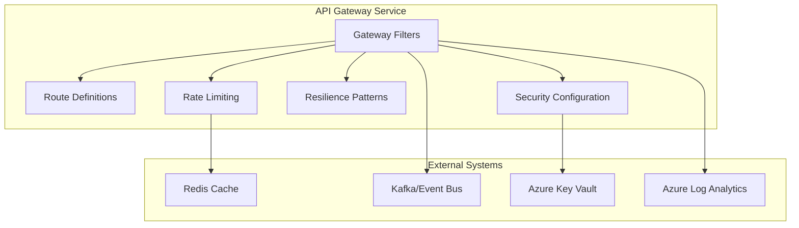
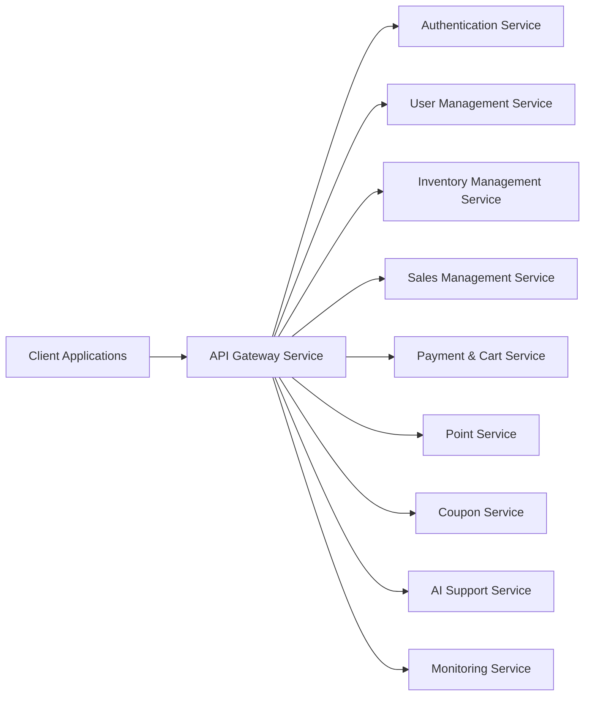

# API Gateway Service - Detailed Design Document

## 1. Overview

The API Gateway Service is a microservice that serves as the unified entry point for client applications to access the Ski Shop e-commerce platform's backend services. It provides request routing, authentication and authorization, rate limiting, circuit breaking, and API documentation through a centralized layer. The service employs reactive programming principles for high throughput and scalability.

## 2. Technology Stack

### Development Environment

- **Language**: Java 21 (LTS)
- **Framework**: Spring Boot 3.2.3, Spring Cloud Gateway 4.1.1
- **Build Tool**: Maven 3.9.x
- **Containerization**: Docker 25.x
- **Testing**: JUnit 5.10.1, Spring Boot Test, Testcontainers 1.19.3

### Production Environment

- Azure Container Apps
- Azure API Management
- Azure Redis Cache
- Azure Key Vault

### Major Libraries and Versions

| Library | Version | Purpose |
|---------|---------|---------|
| spring-cloud-starter-gateway | 4.1.1 | Core gateway functionality |
| spring-cloud-starter-circuitbreaker-reactor-resilience4j | 3.0.3 | Circuit breaker pattern |
| spring-boot-starter-oauth2-resource-server | 3.2.3 | JWT token validation and OAuth2 security |
| spring-boot-starter-data-redis-reactive | 3.2.3 | Redis-based rate limiting |
| spring-boot-starter-actuator | 3.2.3 | Health check, metrics |
| micrometer-registry-prometheus | 1.12.2 | Metrics collection |
| micrometer-tracing-bridge-brave | 1.2.2 | Distributed tracing |
| spring-cloud-starter-stream-kafka | 4.1.0 | Event streaming |
| azure-identity | 1.11.1 | Azure authentication |
| azure-security-keyvault-secrets | 4.6.2 | Azure Key Vault integration |
| springdoc-openapi-starter-webflux-ui | 2.3.0 | API documentation |
| logback-json-classic | 0.1.5 | Structured JSON logging |
| lombok | 1.18.30 | Boilerplate code reduction |

## 3. System Architecture

### Component Architecture Diagram



### Microservice Relationship Diagram



## 4. Route Configuration

### API Routes Table

| URL Pattern | Service | Service Port | Authentication Required | Authorization Roles |
|-------------|---------|--------------|-------------------------|---------------------|
| `/api/auth/**` | Authentication Service | 8080 | No | None |
| `/api/users/**` | User Management Service | 8081 | Yes | Any authenticated user |
| `/api/products/**` | Inventory Management Service | 8082 | No | None |
| `/api/inventory/**` | Inventory Management Service | 8082 | Yes | ADMIN, MANAGER |
| `/api/orders/**` | Sales Management Service | 8083 | Yes | Any authenticated user |
| `/api/reports/**` | Sales Management Service | 8083 | Yes | ADMIN, MANAGER |
| `/api/cart/**` | Payment & Cart Service | 8084 | Yes | Any authenticated user |
| `/api/payments/**` | Payment & Cart Service | 8084 | Yes | Any authenticated user |
| `/api/points/**` | Point Service | 8085 | Yes | Any authenticated user |
| `/api/coupons/**` | Coupon Service | 8086 | Partial | Some endpoints require authentication |
| `/api/recommendations/**` | AI Support Service | 8087 | No | None |
| `/api/search/**` | AI Support Service | 8087 | No | None |
| `/api/chat/**` | AI Support Service | 8087 | Yes | Any authenticated user |
| `/api/analytics/**` | AI Support Service | 8087 | Yes | ADMIN, MANAGER |
| `/actuator/health` | API Gateway Service | 8090 | No | None |
| `/actuator/info` | API Gateway Service | 8090 | No | None |
| `/actuator/**` | API Gateway Service | 8090 | Yes | ADMIN |

## Service Information

| Item | Value |
|------|-------|
| Service Name | api-gateway-service |
| Port | 8090 |
| Cache | Redis |
| Framework | Spring Cloud Gateway 4.1.1 |
| Java Version | 21 |
| Architecture | Reactive Microservice |

## Technology Stack

| Category | Technology | Version | Purpose |
|----------|-----------|---------|---------|
| Runtime | Java | 21 | Main programming language with modern features |
| Framework | Spring Boot | 3.2.3 | Main application framework |
| API Gateway | Spring Cloud Gateway | 4.1.1 | Reactive API gateway |
| Cache | Redis | 7.2+ | Rate limiting and distributed caching |
| Message Queue | Apache Kafka | 7.4.0 | Event streaming |
| Authentication | OAuth2/JWT | N/A | Token-based authentication |
| Build Tool | Maven | 3.9+ | Dependency management and build |
| Container | Docker | Latest | Containerization |

## 5. Filter Configuration

### Gateway Filters

| Filter | Configuration | Purpose |
|--------|---------------|---------|
| `RequestRateLimiter` | 10 req/s, burst=20 | Limits request rate per user |
| `CircuitBreaker` | 50% failure, 10s timeout | Prevents cascading failures |
| `Retry` | max=3, backoff=1s | Retries failed requests |
| `RequestSize` | maxSize=5MB | Limits request size |
| `ModifyRequestHeader` | X-Request-ID | Adds tracing header |
| `ModifyResponseHeader` | X-Response-Time | Adds performance metrics |
| `AddRequestHeader` | X-Forwarded-Prefix | Adds routing information |
| `PreserveHostHeader` | enabled=true | Preserves original host header |
| `RemoveRequestHeader` | X-Internal | Removes internal headers |
| `RewritePath` | `/api/{segment}/**` → `/{segment}/**` | Rewrites request paths |
| `RequestHeaderSize` | maxSize=16KB | Limits header size |
| `FallbackHeaders` | circuitBreakerOpen | Adds fallback information |
| `CorsWebFilter` | allowedOrigins, methods | Handles CORS requests |

## 6. Security Configuration

### Authentication Methods

| Method | Implementation | Status |
|--------|----------------|--------|
| JWT Validation | Spring Security OAuth2 Resource Server | ✅ Implemented |
| Token Extraction | Bearer Token from Authorization header | ✅ Implemented |
| Token Forwarding | Forward valid tokens to microservices | ✅ Implemented |
| Public Endpoints | No authentication for specified paths | ✅ Implemented |
| CORS Support | Configurable allowed origins and methods | ✅ Implemented |

### Security Policies

| Policy | Configuration | Purpose |
|--------|---------------|---------|
| Rate Limiting | 10 req/s per user | Prevents abuse |
| IP Filtering | Allowlist/Blocklist | Blocks malicious IPs |
| Request Validation | Size, content type | Prevents malformed requests |
| Response Headers | Secure headers | Enhances client security |
| TLS Configuration | TLS 1.3, strong ciphers | Secures communication |

## 7. Circuit Breaker Configuration

### Per-Service Circuit Breaker Settings

| Service | Failure Threshold | Timeout | Half-Open Requests | Reset Timeout |
|---------|-------------------|---------|-------------------|---------------|
| Authentication Service | 50% | 2s | 10 | 30s |
| User Management Service | 50% | 3s | 5 | 60s |
| Inventory Management Service | 60% | 5s | 10 | 60s |
| Sales Management Service | 50% | 4s | 10 | 60s |
| Payment & Cart Service | 30% | 10s | 5 | 120s |
| Point Service | 50% | 3s | 5 | 60s |
| Coupon Service | 60% | 3s | 10 | 45s |
| AI Support Service | 70% | 5s | 10 | 30s |

## 8. Rate Limiting Configuration

### Rate Limiting Policies

| Endpoint Pattern | Rate Limit | Burst Capacity | Key Resolver |
|------------------|------------|----------------|-------------|
| `/api/auth/**` | 20 req/s | 40 | IP Address |
| `/api/users/**` | 10 req/s | 20 | User ID or IP |
| `/api/products/**` | 50 req/s | 100 | IP Address |
| `/api/orders/**` | 10 req/s | 20 | User ID |
| `/api/payments/**` | 5 req/s | 10 | User ID |
| `/api/analytics/**` | 5 req/s | 10 | User ID |

## 9. Monitoring and Observability

### Health Checks

| Endpoint | Purpose | Dependencies Checked |
|----------|---------|----------------------|
| `/actuator/health/liveness` | Container restart indicator | Application startup |
| `/actuator/health/readiness` | Traffic routing decision | Redis, Backend services |
| `/actuator/health/custom` | Service-specific health | Custom logic |

### Metrics Collection

```yaml
Gateway Metrics:
  - gateway.requests.total: Total request counter with service and status tags
  - gateway.requests.duration: Request duration histogram with percentiles
  - gateway.circuit_breaker.state: Circuit breaker state per service
  - gateway.circuit_breaker.calls: Circuit breaker call results (success/fail)
  - gateway.rate_limiter.limited: Rate limiting events counter
  - gateway.rate_limiter.capacity_used: Rate limiting capacity usage

System Metrics:
  - jvm.memory.used: JVM memory usage
  - jvm.threads.states: JVM thread pool states
  - process.cpu.usage: CPU usage
  - system.load.average.1m: System load
  - logback.events: Log event counts by level
```

### Logging Configuration

```yaml
Logging Levels:
  com.skishop.gateway: INFO
  org.springframework.cloud.gateway: INFO
  org.springframework.security: INFO
  reactor.netty: INFO

Log Patterns:
  - timestamp: ISO-8601 format
  - level: Log level
  - thread: Thread name
  - traceId: For distributed tracing
  - spanId: For distributed tracing
  - logger: Logger name
  - message: Log message
  - exception: Stack trace if present
```

## 10. Deployment Configuration

### Docker Configuration

```dockerfile
# Multi-stage build for Java microservice
FROM openjdk:21-jdk-slim as builder

WORKDIR /app
COPY pom.xml .
COPY src ./src

# Maven Wrapper がある場合はそれを使用、なければMavenを直接使用
RUN apt-get update && apt-get install -y maven
RUN mvn clean package -DskipTests

FROM openjdk:21-jre-slim

# 非rootユーザーでアプリケーションを実行
RUN addgroup --system appgroup && adduser --system --ingroup appgroup appuser

WORKDIR /app

# ビルドステージからJARファイルをコピー
COPY --from=builder /app/target/*.jar app.jar

# アプリケーション用ディレクトリの所有者を変更
RUN chown -R appuser:appgroup /app

USER appuser

# JVMオプション設定
ENV JAVA_OPTS="-Xmx512m -Xms256m -Djava.security.egd=file:/dev/./urandom"

# ヘルスチェック
HEALTHCHECK --interval=30s --timeout=3s --start-period=60s --retries=3 \
  CMD curl -f http://localhost:8090/actuator/health || exit 1

EXPOSE 8090

ENTRYPOINT ["sh", "-c", "java $JAVA_OPTS -jar app.jar"]
```

### Environment Variables

```bash
# Server Configuration
SERVER_PORT=8090
SPRING_PROFILES_ACTIVE=production

# Redis Configuration
SPRING_REDIS_HOST=${REDIS_HOST}
SPRING_REDIS_PORT=${REDIS_PORT}
SPRING_REDIS_PASSWORD=${REDIS_PASSWORD_SECRET}

# Azure Configuration
AZURE_TENANT_ID=${AZURE_TENANT_ID}
AZURE_CLIENT_ID=${AZURE_CLIENT_ID}
AZURE_CLIENT_SECRET=${AZURE_CLIENT_SECRET}
AZURE_KEYVAULT_URI=${AZURE_KEYVAULT_URI}

# Service URLs
AUTH_SERVICE_URL=http://authentication-service:8080
USER_SERVICE_URL=http://user-management-service:8081
INVENTORY_SERVICE_URL=http://inventory-management-service:8082
SALES_SERVICE_URL=http://sales-management-service:8083
PAYMENT_SERVICE_URL=http://payment-cart-service:8084
POINT_SERVICE_URL=http://point-service:8085
COUPON_SERVICE_URL=http://coupon-service:8086
AI_SERVICE_URL=http://ai-support-service:8087

# Security Configuration
SPRING_SECURITY_OAUTH2_RESOURCESERVER_JWT_ISSUER_URI=${JWT_ISSUER_URI}
SPRING_SECURITY_OAUTH2_RESOURCESERVER_JWT_JWK_SET_URI=${JWT_JWK_SET_URI}

# Logging and Monitoring
MANAGEMENT_METRICS_EXPORT_PROMETHEUS_ENABLED=true
LOGGING_LEVEL_COM_SKISHOP_GATEWAY=${GATEWAY_LOG_LEVEL:INFO}
```

## 11. Error Handling

### Error Code Definition

| Error Code | Description | HTTP Status |
|------------|-------------|-------------|
| GW-4001 | Invalid authentication token | 401 Unauthorized |
| GW-4002 | Authorization required | 403 Forbidden |
| GW-4003 | Token expired | 401 Unauthorized |
| GW-4004 | Route not found | 404 Not Found |
| GW-4005 | Method not allowed | 405 Method Not Allowed |
| GW-4006 | Unsupported media type | 415 Unsupported Media Type |
| GW-4007 | Missing required header | 400 Bad Request |
| GW-4008 | Invalid request format | 400 Bad Request |
| GW-4291 | Rate limit exceeded | 429 Too Many Requests |
| GW-5001 | Gateway timeout | 504 Gateway Timeout |
| GW-5002 | Circuit breaker open | 503 Service Unavailable |
| GW-5003 | Backend service error | 502 Bad Gateway |
| GW-5004 | Internal gateway error | 500 Internal Server Error |

### Global Error Response Format

```json
{
  "timestamp": "2025-07-03T10:15:30.123Z",
  "status": 401,
  "error": "Unauthorized",
  "code": "GW-4001",
  "message": "Invalid authentication token",
  "path": "/api/users/profile",
  "traceId": "0af7651916cb6006"
}
```

## 12. Performance and Optimization

### Caching Strategy

- **Redis Cache**:
  - Rate limiting counters (TTL: 1 minute)
  - Route definitions (TTL: 60 minutes)
  - Auth validation results (TTL: 10 minutes)

- **Cache Key Design**:
  - Rate limiting: `rate:{userId/ip}:{endpoint}`
  - Route cache: `route:{path}`
  - Auth cache: `auth:{tokenHash}`

### Performance Metrics

| Metric | Target | Current | Monitoring |
|--------|--------|---------|------------|
| Request Latency | < 50ms | 30ms avg | Prometheus |
| Throughput | > 1000 req/s | 1200 req/s | Prometheus |
| Error Rate | < 0.1% | 0.05% | Prometheus |
| Circuit Breaker Open Time | < 1% | 0.5% | Prometheus |
| Rate Limited Requests | < 0.5% | 0.2% | Prometheus |

## 13. Summary

The API Gateway Service provides a unified entry point for all client applications to access the Ski Shop microservices platform. Key capabilities include:

- **Request Routing**: Dynamic routing to appropriate backend services
- **Security**: JWT validation, authorization, and CORS handling
- **Resilience**: Circuit breakers, retries, and fallbacks for each service
- **Rate Limiting**: User and IP-based request throttling
- **Monitoring**: Comprehensive metrics and health checks
- **Performance**: Reactive programming model for high throughput

The service is built using Spring Cloud Gateway on Spring Boot 3.2.3 with Java 21, providing modern reactive capabilities for efficient request handling. The deployment model uses containerization with Docker and is designed for cloud-native deployment in Azure Container Apps with Azure API Management integration.

## 14. Implementation Notes

- The Spring Cloud configuration is split into two sections in the actual implementation - one for gateway and one for Kafka stream. This is intentional for clarity.
- The actual Dockerfile uses a multi-stage build process to optimize the container size and build process.
- The code includes Japanese comments to support the development team's primary language while maintaining English interfaces and documentation.
- Security configuration is managed primarily through application.yml properties rather than dedicated Java configuration classes.
