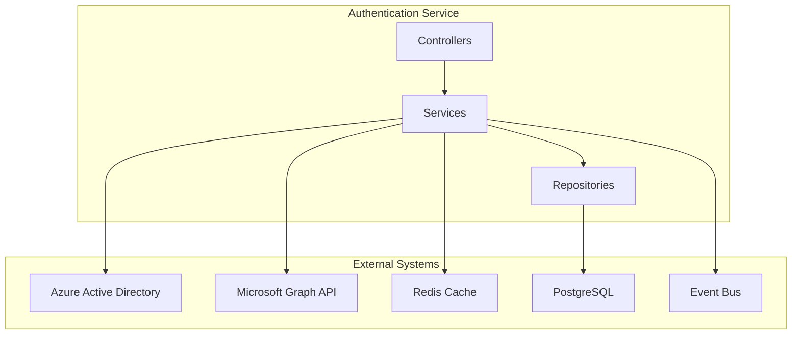
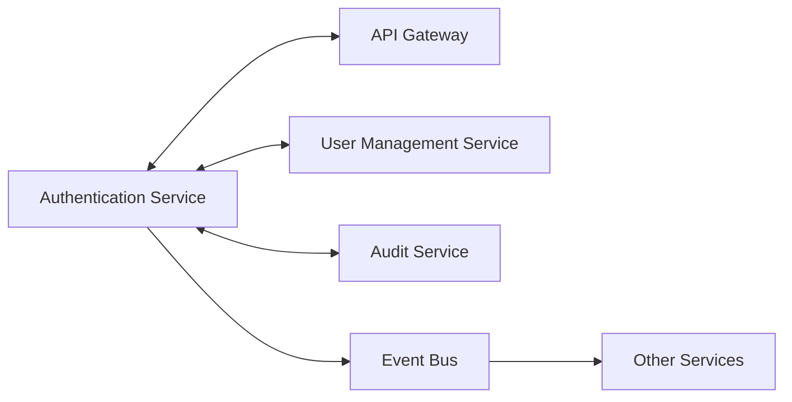
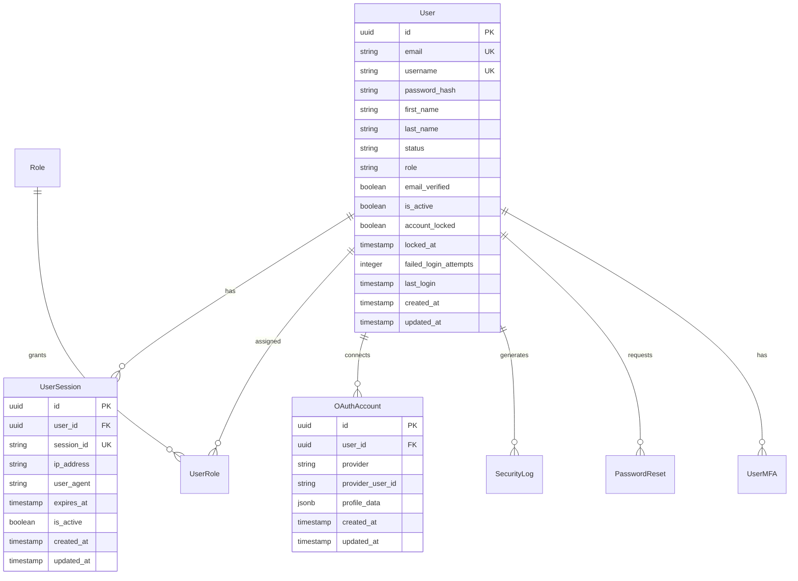

# Authentication Service - Detailed Design Document

## 1. Overview

The Authentication Service is a microservice that manages user authentication and authorization for the Ski Shop e-commerce platform. It provides secure authentication through Microsoft Entra ID integration, JWT token management, user session handling, and role-based access control. The service handles OAuth2/OpenID Connect flows, user registration, MFA capabilities, and comprehensive security monitoring.

## 2. Technology Stack

### Development Environment

- **Language**: Java 21 (LTS)
- **Framework**: Spring Boot 3.2.3
- **Build Tool**: Maven 3.9.x
- **Containerization**: Docker 25.x
- **Testing**: JUnit 5.10.1, Spring Boot Test, Testcontainers 1.19.3

### Production Environment

- Azure Container Apps
- Azure Database for PostgreSQL
- Azure Service Bus / Apache Kafka
- Azure Active Directory (Entra ID)

### Major Libraries and Versions

| Library | Version | Purpose |
|---------|---------|---------|
| spring-boot-starter-web | 3.2.3 | REST API Endpoints |
| spring-boot-starter-data-jpa | 3.2.3 | JPA Data Access |
| spring-boot-starter-security | 3.2.3 | Security Configuration |
| spring-boot-starter-oauth2-client | 3.2.3 | OAuth2 Client Support |
| spring-cloud-azure-starter-active-directory | 5.8.0 | Azure AD Integration |
| spring-boot-starter-data-redis | 3.2.3 | Redis Session Storage |
| spring-boot-starter-validation | 3.2.3 | Input Validation |
| spring-boot-starter-actuator | 3.2.3 | Health Check, Metrics |
| spring-kafka | 3.1.0 | Event Publishing/Subscribing |
| azure-servicebus-jms-spring-boot-starter | 4.15.0 | Azure Service Bus Integration |
| hibernate-core | 6.4.1 | ORM Mapping |
| postgresql | 42.7.1 | PostgreSQL JDBC Driver |
| jjwt-api | 0.12.3 | JWT Token Handling |
| lombok | 1.18.30 | Boilerplate Code Reduction |
| micrometer-registry-prometheus | 1.12.2 | Metrics Collection |
| springdoc-openapi-starter-webmvc-ui | 2.3.0 | API Documentation |
| azure-identity | 1.11.1 | Azure Authentication |
| mapstruct | 1.5.5.Final | Object Mapping |

## 3. System Architecture

### Component Architecture Diagram



### Microservice Relationship Diagram



## 4. Data Model

### Entity Relationship Diagram



## Service Information

| Item | Value |
|------|-------|
| Service Name | authentication-service |
| Port | 8080 |
| Database | PostgreSQL (skishop_auth) |
| Framework | Spring Boot 3.2.3 |
| Java Version | 21 |
| Architecture | Microservice with Event-Driven Architecture |

## Technology Stack

| Category | Technology | Version | Purpose |
|----------|-----------|---------|---------|
| Runtime | Java | 21 | Main programming language with modern features |
| Framework | Spring Boot | 3.2.3 | Main application framework |
| Database | PostgreSQL | 16+ | Primary data storage |
| Cache | Redis | 7.2+ | Session storage and rate limiting |
| Message Queue | Apache Kafka / Azure Service Bus | 7.4.0 | Event streaming |
| Identity Provider | Microsoft Entra ID | Latest | OAuth2/OpenID Connect authentication |
| Search | Microsoft Graph API | v1.0 | User profile and organization data |
| Build Tool | Maven | 3.9+ | Dependency management and build |
| Container | Docker | Latest | Containerization |

## Database Schema

### users table

| Column | Data Type | Constraints | Description |
|--------|-----------|-------------|-------------|
| id | UUID | PK | User ID |
| email | VARCHAR(255) | NOT NULL, UNIQUE | User email address |
| username | VARCHAR(100) | UNIQUE | Username |
| password_hash | VARCHAR(255) | NULL | Password hash (bcrypt) |
| first_name | VARCHAR(100) | NULL | First name |
| last_name | VARCHAR(100) | NULL | Last name |
| status | VARCHAR(50) | NULL | User status (PENDING_VERIFICATION, ACTIVE, SUSPENDED) |
| role | VARCHAR(50) | NOT NULL, DEFAULT 'USER' | User role enum |
| email_verified | BOOLEAN | NOT NULL, DEFAULT false | Email verification status |
| is_active | BOOLEAN | NOT NULL, DEFAULT true | Account active status |
| account_locked | BOOLEAN | NOT NULL, DEFAULT false | Account locked status |
| locked_at | TIMESTAMP | NULL | Lock timestamp |
| failed_login_attempts | INTEGER | NOT NULL, DEFAULT 0 | Failed login attempts counter |
| last_login | TIMESTAMP | NULL | Last successful login |
| created_at | TIMESTAMP | NOT NULL | Created timestamp |
| updated_at | TIMESTAMP | NOT NULL | Updated timestamp |

### user_sessions table

| Column | Data Type | Constraints | Description |
|--------|-----------|-------------|-------------|
| id | UUID | PK | Session ID |
| user_id | UUID | FK, NOT NULL | User ID reference |
| session_id | VARCHAR(255) | NOT NULL, UNIQUE | Session identifier |
| ip_address | VARCHAR(45) | NULL | Client IP address |
| user_agent | TEXT | NULL | Client user agent |
| expires_at | TIMESTAMP | NOT NULL | Session expiration |
| is_active | BOOLEAN | NOT NULL, DEFAULT true | Session active status |
| created_at | TIMESTAMP | NOT NULL | Created timestamp |
| updated_at | TIMESTAMP | NOT NULL | Updated timestamp |

### oauth_accounts table

| Column | Data Type | Constraints | Description |
|--------|-----------|-------------|-------------|
| id | UUID | PK | OAuth account ID |
| user_id | UUID | FK, NOT NULL | User ID reference |
| provider | VARCHAR(50) | NOT NULL | OAuth provider (azure, google, etc.) |
| provider_user_id | VARCHAR(255) | NOT NULL | Provider user ID |
| profile_data | JSONB | NULL | Provider profile data |
| created_at | TIMESTAMP | NOT NULL | Created timestamp |
| updated_at | TIMESTAMP | NOT NULL | Updated timestamp |

### security_logs table

| Column | Data Type | Constraints | Description |
|--------|-----------|-------------|-------------|
| id | UUID | PK | Log entry ID |
| user_id | UUID | FK, NULL | User ID reference |
| event_type | VARCHAR(50) | NOT NULL | Event type |
| ip_address | VARCHAR(45) | NULL | Client IP address |
| user_agent | TEXT | NULL | Client user agent |
| details | JSONB | NULL | Event details |
| created_at | TIMESTAMP | NOT NULL | Created timestamp |

### user_roles table

| Column | Data Type | Constraints | Description |
|--------|-----------|-------------|-------------|
| id | UUID | PK | User role ID |
| user_id | UUID | FK, NOT NULL | User ID reference |
| role_id | UUID | FK, NOT NULL | Role ID reference |
| expires_at | TIMESTAMP | NULL | Role expiration |
| created_at | TIMESTAMP | NOT NULL | Created timestamp |
| updated_at | TIMESTAMP | NOT NULL | Updated timestamp |

### password_resets table

| Column | Data Type | Constraints | Description |
|--------|-----------|-------------|-------------|
| id | UUID | PK | Password reset ID |
| user_id | UUID | FK, NOT NULL | User ID reference |
| token | VARCHAR(255) | NOT NULL, UNIQUE | Reset token |
| expires_at | TIMESTAMP | NOT NULL | Token expiration |
| used | BOOLEAN | NOT NULL, DEFAULT false | Token used status |
| created_at | TIMESTAMP | NOT NULL | Created timestamp |

### user_mfa table

| Column | Data Type | Constraints | Description |
|--------|-----------|-------------|-------------|
| id | UUID | PK | MFA ID |
| user_id | UUID | FK, NOT NULL, UNIQUE | User ID reference |
| secret_key | VARCHAR(255) | NULL | TOTP secret key |
| backup_codes | TEXT | NULL | Backup codes (JSON array) |
| is_enabled | BOOLEAN | NOT NULL, DEFAULT false | MFA enabled status |
| verified_at | TIMESTAMP | NULL | Verification timestamp |
| created_at | TIMESTAMP | NOT NULL | Created timestamp |
| updated_at | TIMESTAMP | NOT NULL | Updated timestamp |

## API Design

### REST API Endpoints

#### Authentication API

| Method | Path | Description | Parameters | Response |
|---------|-----|------------|------------|----------|
| POST | /api/v1/auth/login | User login with credentials | LoginRequest | LoginResponse |
| POST | /api/v1/auth/refresh | Refresh access token | TokenRefreshRequest | TokenRefreshResponse |
| POST | /api/v1/auth/logout | User logout | Authorization header | LogoutResponse |
| POST | /api/v1/auth/validate | Validate token | Authorization header | TokenValidationResponse |
| GET | /api/v1/auth/me | Get current user info | Authorization header | UserInfoResponse |

#### MFA API

| Method | Path | Description | Parameters | Response |
|---------|-----|------------|------------|----------|
| POST | /api/v1/auth/mfa/verify | Verify MFA code | MfaVerificationRequest | LoginResponse |
| POST | /api/v1/auth/mfa/setup | Setup MFA for user | Authorization header | MfaSetupResponse |
| DELETE | /api/v1/auth/mfa/disable | Disable MFA | Authorization header | MessageResponse |

#### Password Management API

| Method | Path | Description | Parameters | Response |
|---------|-----|------------|------------|----------|
| POST | /api/v1/auth/password/reset | Request password reset | PasswordResetRequest | MessageResponse |
| POST | /api/v1/auth/password/confirm | Confirm password reset | PasswordResetConfirmRequest | MessageResponse |
| PUT | /api/v1/auth/password/change | Change password | PasswordChangeRequest | MessageResponse |

#### User Registration API

| Method | Path | Description | Parameters | Response |
|---------|-----|------------|------------|----------|
| POST | /api/auth/users | Register new user | UserCreateRequest | UserResponse |
| DELETE | /api/auth/users/{userId} | Soft delete user | userId, reason | MessageResponse |
| DELETE | /api/auth/users/{userId}/hard | Hard delete user (admin only) | userId, reason | MessageResponse |

#### OAuth2 Web Endpoints

| Method | Path | Description | Parameters | Response |
|---------|-----|------------|------------|----------|
| GET | /oauth2/authorization/azure | Initiate Azure AD OAuth2 flow | None | 302 Redirect |
| GET | /login/oauth2/code/azure | OAuth2 callback | code, state | 302 Redirect |
| GET | / | Home page | None | HTML |
| GET | /home | Authenticated home | Principal | HTML |
| GET | /profile | User profile page | Principal | HTML |
| GET | /call_graph | Microsoft Graph API call | Authentication | HTML |

#### Microsoft Graph API Endpoints

| Method | Path | Description | Parameters | Response |
|---------|-----|------------|------------|----------|
| GET | /api/user/me | Get user info from session | Principal | UserInfoResponse |
| GET | /api/graph/user | Get user from Microsoft Graph | Authentication | GraphUserResponse |

#### Monitoring Endpoints

| Method | Path | Description | Parameters | Response |
|---------|-----|------------|------------|----------|
| GET | /actuator/health | Service health check | None | HealthResponse |
| GET | /actuator/prometheus | Prometheus metrics | None | Metrics (text/plain) |
| GET | /actuator/info | Service information | None | InfoResponse |

### Request/Response Examples

#### Login Request

```json
{
  "email": "user@example.com",
  "password": "SecurePassword123!"
}
```

#### Login Response

```json
{
  "success": true,
  "accessToken": "eyJhbGciOiJIUzUxMiJ9...",
  "refreshToken": "eyJhbGciOiJIUzUxMiJ9...",
  "tokenType": "Bearer",
  "expiresIn": 3600,
  "user": {
    "id": "550e8400-e29b-41d4-a716-446655440000",
    "email": "user@example.com",
    "firstName": "John",
    "lastName": "Doe",
    "role": "USER"
  }
}
```

#### User Registration Request

```json
{
  "username": "johndoe",
  "email": "john.doe@example.com",
  "password": "SecurePassword123!",
  "firstName": "John",
  "lastName": "Doe"
}
```

## Event Design

### Published Events

| Event Name | Description | Payload | Topic |
|-----------|-------------|---------|-------|
| UserRegistered | Published when user registers | User ID, Email, Registration data | auth.users |
| UserAuthenticated | Published when user logs in | User ID, Login timestamp, IP, Device info | auth.sessions |
| UserLoggedOut | Published when user logs out | User ID, Session ID, Logout timestamp | auth.sessions |
| LoginFailed | Published when login fails | Email, IP address, Failure reason, Timestamp | auth.security |
| AccountLocked | Published when account is locked | User ID, Lock reason, Lock duration | auth.security |
| PasswordChanged | Published when password is changed | User ID, Change timestamp | auth.security |
| MfaEnabled | Published when MFA is enabled | User ID, Setup timestamp | auth.security |
| SecurityIncident | Published on suspicious activity | User ID, Incident type, Risk score, Details | auth.security |

### Subscribed Events

| Event Name | Description | Source Service | Action |
|-----------|-------------|----------------|--------|
| UserDeleted | Subscribed when user is deleted | User Management Service | Deactivate user account, cleanup sessions |
| PermissionsUpdated | Subscribed when user permissions change | User Management Service | Update role assignments, invalidate tokens |

### Event Schema Examples

#### UserAuthenticated Event

```json
{
  "eventId": "f47ac10b-58cc-4372-a567-0e02b2c3d479",
  "eventType": "UserAuthenticated",
  "timestamp": "2024-07-03T10:15:30.123Z",
  "source": "authentication-service",
  "data": {
    "userId": "550e8400-e29b-41d4-a716-446655440000",
    "email": "user@example.com",
    "sessionId": "sess_abc123def456",
    "ipAddress": "192.168.1.100",
    "userAgent": "Mozilla/5.0...",
    "authMethod": "password",
    "mfaUsed": false
  }
}
```

## 7. Security Features

### Account Security

| Feature | Implementation | Configuration |
|---------|----------------|---------------|
| Password Hashing | BCrypt with strength 12 | configurable in application.yml |
| Account Lockout | 5 failed attempts → account locked | auth.max-failed-attempts=5 |
| Session Timeout | 30 minutes idle timeout | spring.session.timeout=1800s |
| JWT Token Security | HS512 algorithm, secure secret | jwt.secret (512+ bits) |
| Rate Limiting | Redis-based sliding window | 100 requests/minute per IP |
| CSRF Protection | Spring Security CSRF tokens | enabled for web endpoints |

### Authentication Methods

| Method | Implementation | Status |
|--------|----------------|--------|
| Username/Password | Spring Security with BCrypt | ✅ Complete |
| Microsoft Entra ID | OAuth2/OpenID Connect | ✅ Complete |
| JWT Tokens | Custom implementation | ✅ Complete |
| MFA (TOTP) | Google Authenticator compatible | 🔄 In Progress |
| Session-based | Redis session store | ✅ Complete |

### Role-Based Access Control

| Role | Description | Permissions |
|------|-------------|-------------|
| ADMIN | System administrator | Full system access |
| MANAGER | Store manager | User management, reports |
| STAFF | Store staff | Limited order management |
| EMPLOYEE | Employee access | Basic system access |
| USER | Regular user | Profile management |
| CUSTOMER | Customer access | Shopping, order history |

## 8. Error Handling

### Error Code Definition

| Error Code | Description | HTTP Status |
|------------|-------------|-------------|
| AUTH-4001 | Invalid credentials | 401 Unauthorized |
| AUTH-4002 | Account locked | 423 Locked |
| AUTH-4003 | Account not verified | 403 Forbidden |
| AUTH-4004 | Token expired | 401 Unauthorized |
| AUTH-4005 | Invalid token | 401 Unauthorized |
| AUTH-4006 | MFA required | 202 Accepted |
| AUTH-4007 | Invalid MFA code | 400 Bad Request |
| AUTH-4008 | Password reset required | 403 Forbidden |
| AUTH-4041 | User not found | 404 Not Found |
| AUTH-4091 | Email already exists | 409 Conflict |
| AUTH-4092 | Username already exists | 409 Conflict |
| AUTH-4221 | Weak password | 422 Unprocessable Entity |
| AUTH-4222 | Password policy violation | 422 Unprocessable Entity |
| AUTH-4291 | Rate limit exceeded | 429 Too Many Requests |
| AUTH-5001 | Internal authentication error | 500 Internal Server Error |
| AUTH-5002 | External service unavailable | 503 Service Unavailable |

### Global Error Response Format

```json
{
  "success": false,
  "error": {
    "code": "AUTH-4001",
    "message": "Invalid credentials provided",
    "details": "Email or password is incorrect",
    "timestamp": "2024-07-03T10:15:30.123Z",
    "path": "/api/v1/auth/login"
  }
}
```

## 9. Performance and Optimization

### Caching Strategy

- **Redis Cache**:
  - User sessions (TTL: 30 minutes)
  - Rate limiting counters (TTL: 1 minute)
  - OAuth2 tokens (TTL: token lifetime)
  - Failed login attempts (TTL: 15 minutes)

- **Cache Key Design**:
  - User session: `session:{sessionId}`
  - Rate limiting: `rate:{ipAddress}:{endpoint}`
  - Login attempts: `attempts:{email}`
  - JWT blacklist: `blacklist:{tokenId}`

### Index Design

| Table | Index | Column | Description |
|-------|-------|--------|-------------|
| users | idx_users_email | email | Primary lookup by email |
| users | idx_users_username | username | Lookup by username |
| users | idx_users_status | status | Filter by user status |
| user_sessions | idx_sessions_user_id | user_id | User's sessions lookup |
| user_sessions | idx_sessions_session_id | session_id | Session ID lookup |
| user_sessions | idx_sessions_expires_at | expires_at | Cleanup expired sessions |
| security_logs | idx_security_user_id | user_id | User's security events |
| security_logs | idx_security_event_type | event_type | Filter by event type |
| security_logs | idx_security_created_at | created_at | Time-based queries |
| oauth_accounts | idx_oauth_provider_user | provider, provider_user_id | OAuth account lookup |

### Performance Metrics

| Metric | Target | Current | Monitoring |
|--------|--------|---------|------------|
| Login Response Time | < 200ms | 150ms avg | Prometheus |
| Token Validation | < 50ms | 30ms avg | Prometheus |
| Database Query Time | < 100ms | 80ms avg | Prometheus |
| Redis Operations | < 10ms | 5ms avg | Prometheus |
| OAuth2 Flow | < 2s | 1.5s avg | Prometheus |

## 10. Monitoring and Observability

### Health Checks

| Endpoint | Purpose | Dependencies |
|----------|---------|--------------|
| /actuator/health/liveness | Container restart indicator | Application startup |
| /actuator/health/readiness | Traffic routing decision | Database, Redis, Azure AD |
| /actuator/health/db | Database connectivity | PostgreSQL |
| /actuator/health/redis | Cache connectivity | Redis |
| /actuator/health/azure | Azure services connectivity | Azure AD, Graph API |

### Metrics Collection

```yaml
Authentication Metrics:
  - auth_login_attempts_total: Total login attempts counter
  - auth_login_success_total: Successful logins counter  
  - auth_login_failures_total: Failed login attempts counter
  - auth_active_sessions: Active sessions gauge
  - auth_token_generation_duration: Token generation time histogram
  - auth_password_reset_requests_total: Password reset requests counter
  - auth_mfa_verifications_total: MFA verification attempts counter
  - auth_account_lockouts_total: Account lockout events counter

System Metrics:
  - http_server_requests_duration_seconds: HTTP request duration
  - jvm_memory_used_bytes: JVM memory usage
  - jvm_gc_pause_seconds: Garbage collection timing
  - hikari_connections_active: Database connection pool usage
  - redis_commands_processed_total: Redis command execution count
```

### Logging Configuration

```yaml
Logging Levels:
  com.skishop.auth: INFO
  org.springframework.security: INFO
  org.springframework.web: WARN
  com.azure.spring: DEBUG

Security Event Logging:
  - All authentication attempts (success/failure)
  - Authorization decisions  
  - Token operations (generation/validation/revocation)
  - Account state changes (lock/unlock/activation)
  - Administrative actions
  - Suspicious activity detection
  - Rate limiting violations
```

## 11. Deployment Configuration

### Docker Configuration

```dockerfile
FROM eclipse-temurin:21-jre-jammy
RUN addgroup --system appgroup && adduser --system --ingroup appgroup appuser
WORKDIR /app
COPY target/authentication-service-*.jar app.jar
RUN chown -R appuser:appgroup /app
USER appuser

ENV JAVA_OPTS="-Xmx512m -Xms256m"
HEALTHCHECK --interval=30s --timeout=3s --start-period=60s --retries=3 \
  CMD curl -f http://localhost:8080/actuator/health || exit 1

EXPOSE 8080
ENTRYPOINT ["sh", "-c", "java $JAVA_OPTS -jar app.jar"]
```

### Environment Variables

```bash
# Application Configuration
SPRING_PROFILES_ACTIVE=production
SERVER_PORT=8080

# Database Configuration
DB_URL=jdbc:postgresql://localhost:5432/skishop_auth
DB_USERNAME=auth_user
DB_PASSWORD=${DB_PASSWORD_SECRET}

# Redis Configuration
REDIS_HOST=localhost
REDIS_PORT=6379
REDIS_PASSWORD=${REDIS_PASSWORD_SECRET}

# Azure Configuration
AZURE_TENANT_ID=${AZURE_TENANT_ID}
AZURE_CLIENT_ID=${AZURE_CLIENT_ID}
AZURE_CLIENT_SECRET=${AZURE_CLIENT_SECRET}

# JWT Configuration
JWT_SECRET=${JWT_SECRET_KEY}
JWT_ACCESS_EXPIRATION=3600
JWT_REFRESH_EXPIRATION=604800

# Event Configuration
SKISHOP_EVENT_BROKER_TYPE=kafka
KAFKA_BROKERS=localhost:9092
```

## 12. Summary

The Authentication Service provides comprehensive identity and access management for the Ski Shop platform with the following key capabilities:

- **Secure Authentication**: Microsoft Entra ID integration with OAuth2/OpenID Connect
- **Session Management**: Redis-based session storage with configurable timeouts
- **JWT Token Support**: Secure token generation and validation for API access
- **Role-Based Access Control**: Flexible RBAC system with role hierarchy
- **Multi-Factor Authentication**: TOTP-based MFA support (in development)
- **Security Monitoring**: Comprehensive audit logging and suspicious activity detection
- **Event-Driven Architecture**: Publishes authentication events for downstream services
- **High Performance**: Optimized with caching and efficient database queries
- **Production Ready**: Docker containerization with health checks and monitoring

The service is built using modern Java 21 features and Spring Boot 3.2.3, ensuring maintainability and performance while providing enterprise-grade security features required for an e-commerce platform.
