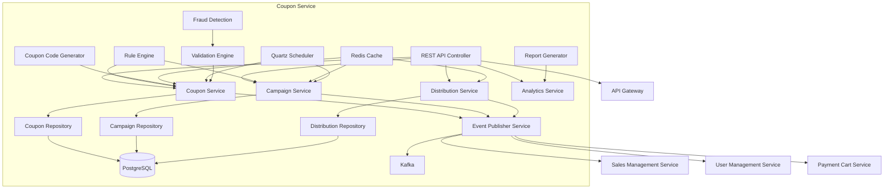
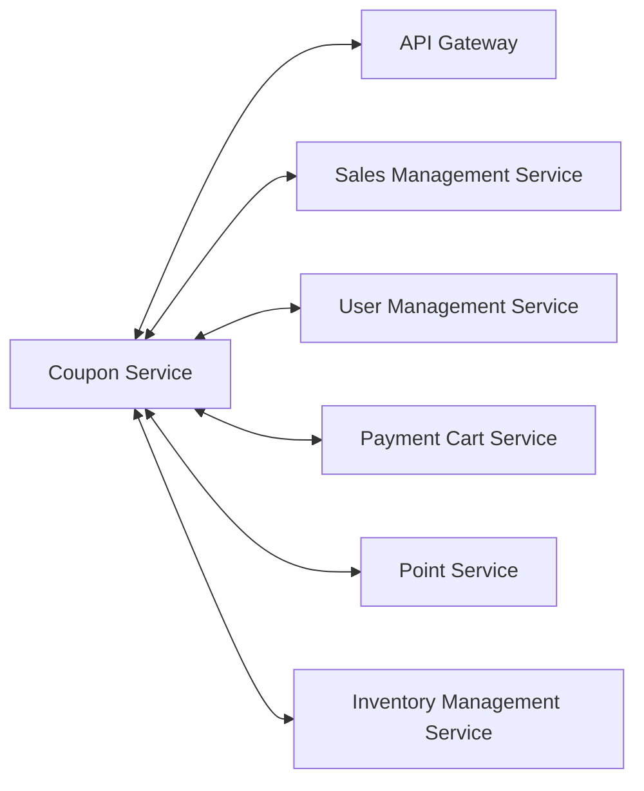
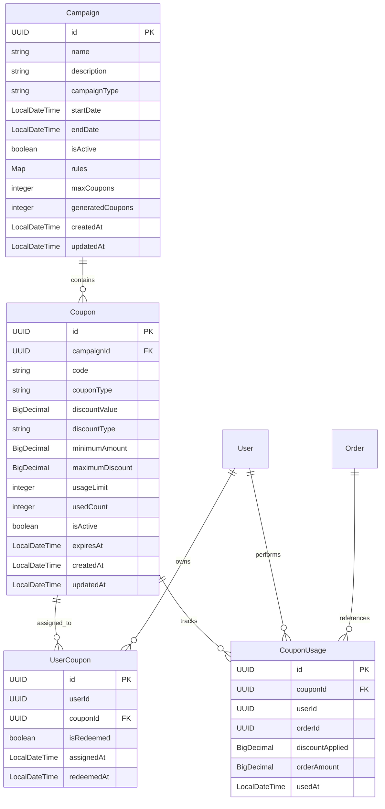

# Coupon Service - Detailed Design Document

## 1. Overview

The Coupon Service is a microservice that manages promotional campaigns, discount coupons, and voucher systems for the ski shop e-commerce platform. It handles the complete coupon lifecycle including creation, validation, redemption, distribution, and analytics. The service enables marketing teams to create targeted promotional campaigns that drive customer acquisition, retention, and sales through sophisticated discount mechanisms and usage tracking.

### Service Responsibilities

- **Coupon Management**: Creation, validation, redemption, and lifecycle management
- **Campaign Management**: Promotional campaign creation, scheduling, and monitoring
- **Distribution Engine**: Automated and manual coupon distribution to target user segments
- **Rule Engine**: Complex business rule evaluation for coupon eligibility
- **Usage Tracking**: Real-time usage analytics and fraud detection
- **Analytics & Reporting**: Campaign performance analysis and optimization insights
- **Event Integration**: Seamless integration with order, payment, and user management services

## 2. Technology Stack

### Development Environment

- **Language**: Java 21 (LTS)
- **Framework**: Spring Boot 3.2.3
- **Build Tool**: Maven 3.9.x
- **Containerization**: Docker 25.x
- **Testing**: JUnit 5.10.1, Spring Boot Test, Testcontainers 1.19.3

### Production Environment

- Azure Container Apps
- Azure Database for PostgreSQL
- Azure Cache for Redis
- Azure Service Bus (Kafka)

### Major Libraries and Versions

| Library | Version | Purpose |
|---------|---------|---------|
| spring-boot-starter-web | 3.2.3 | REST API endpoints |
| spring-boot-starter-data-jpa | 3.2.3 | JPA data access |
| spring-boot-starter-data-redis | 3.2.3 | Redis caching |
| spring-boot-starter-validation | 3.2.3 | Input validation |
| spring-boot-starter-security | 3.2.3 | Security configuration |
| spring-boot-starter-actuator | 3.2.3 | Health checks, metrics |
| spring-boot-starter-quartz | 3.2.3 | Scheduling |
| spring-cloud-starter-stream-kafka | 2023.0.0 | Event publishing/subscribing |
| postgresql | 42.7.1 | PostgreSQL driver |
| flyway-core | 9.5.1 | Database migration |
| hypersistence-utils-hibernate-62 | 3.5.1 | JSON support for Hibernate |
| mapstruct | 1.5.5.Final | Object mapping |
| lombok | 1.18.30 | Boilerplate code reduction |
| micrometer-registry-prometheus | 1.12.2 | Metrics collection |
| springdoc-openapi-starter-webmvc-ui | 2.3.0 | API documentation |
| azure-identity | 1.12.2 | Azure authentication |
| azure-security-keyvault-secrets | 4.6.2 | Azure Key Vault integration |

## 3. System Architecture

### Component Architecture Diagram



### Microservice Relationship Diagram



## 4. Data Model

### Entity Relationship Diagram



## Service Information

| Item | Value |
|------|-------|
| Service Name | coupon-service |
| Port | 8088 |
| Database | PostgreSQL (coupon_db) |
| Framework | Spring Boot 3.2.3 |
| Java Version | 21 |
| Architecture | Microservice with Event-Driven Architecture |

## Technology Stack

| Category | Technology | Version | Purpose |
|----------|-----------|---------|---------|
| Runtime | Java | 21 | Main programming language with modern features |
| Framework | Spring Boot | 3.2.3 | Main application framework |
| Database | PostgreSQL | 16+ | Primary data storage |
| Cache | Redis | 7.2+ | Caching and session storage |
| Message Queue | Apache Kafka | 7.4.0 | Event streaming |
| Scheduler | Quartz | 2.3.2 | Job scheduling and automation |
| Build Tool | Maven | 3.9+ | Dependency management and build |
| Container | Docker | Latest | Containerization |

## Database Schema

### campaigns table

| Column | Data Type | Constraints | Description |
|--------|-----------|-------------|-------------|
| id | UUID | PK | Campaign ID |
| name | VARCHAR(255) | NOT NULL | Campaign name |
| description | TEXT | NULL | Campaign description |
| campaign_type | VARCHAR(50) | NOT NULL CHECK (campaign_type IN ('PERCENTAGE', 'FIXED_AMOUNT', 'BOGO', 'FREE_SHIPPING')) | Campaign type |
| start_date | TIMESTAMP | NOT NULL | Campaign start date |
| end_date | TIMESTAMP | NOT NULL | Campaign end date |
| is_active | BOOLEAN | DEFAULT FALSE | Campaign active status |
| rules | JSONB | DEFAULT '{}' | Campaign rules |
| max_coupons | INTEGER | NULL CHECK (max_coupons IS NULL OR max_coupons > 0) | Maximum number of coupons |
| generated_coupons | INTEGER | DEFAULT 0 CHECK (generated_coupons >= 0) | Number of generated coupons |
| created_at | TIMESTAMP | DEFAULT CURRENT_TIMESTAMP | Created timestamp |
| updated_at | TIMESTAMP | DEFAULT CURRENT_TIMESTAMP | Updated timestamp |

### coupons table

| Column | Data Type | Constraints | Description |
|--------|-----------|-------------|-------------|
| id | UUID | PK | Coupon ID |
| campaign_id | UUID | FK, NOT NULL | Campaign ID |
| code | VARCHAR(50) | NOT NULL, UNIQUE | Coupon code |
| coupon_type | VARCHAR(50) | NOT NULL CHECK (coupon_type IN ('PERCENTAGE', 'FIXED_AMOUNT', 'FREE_SHIPPING')) | Coupon type |
| discount_value | DECIMAL(10,2) | NOT NULL CHECK (discount_value > 0) | Discount value |
| discount_type | VARCHAR(20) | NOT NULL CHECK (discount_type IN ('PERCENTAGE', 'FIXED')) | Discount type |
| minimum_amount | DECIMAL(10,2) | DEFAULT 0 CHECK (minimum_amount >= 0) | Minimum order amount |
| maximum_discount | DECIMAL(10,2) | NULL CHECK (maximum_discount IS NULL OR maximum_discount >= 0) | Maximum discount amount |
| usage_limit | INTEGER | DEFAULT 1 CHECK (usage_limit > 0) | Usage limit per coupon |
| used_count | INTEGER | DEFAULT 0 CHECK (used_count >= 0 AND used_count <= usage_limit) | Number of times used |
| is_active | BOOLEAN | DEFAULT TRUE | Coupon active status |
| expires_at | TIMESTAMP | NOT NULL | Expiration timestamp |
| created_at | TIMESTAMP | DEFAULT CURRENT_TIMESTAMP | Created timestamp |
| updated_at | TIMESTAMP | DEFAULT CURRENT_TIMESTAMP | Updated timestamp |

### user_coupons table

| Column | Data Type | Constraints | Description |
|--------|-----------|-------------|-------------|
| id | UUID | PK | User coupon ID |
| user_id | UUID | NOT NULL | User ID |
| coupon_id | UUID | FK, NOT NULL | Coupon ID |
| is_redeemed | BOOLEAN | DEFAULT FALSE | Redemption status |
| assigned_at | TIMESTAMP | DEFAULT CURRENT_TIMESTAMP | Assignment timestamp |
| redeemed_at | TIMESTAMP | NULL | Redemption timestamp |

### coupon_usage table

| Column | Data Type | Constraints | Description |
|--------|-----------|-------------|-------------|
| id | UUID | PK | Usage ID |
| coupon_id | UUID | FK, NOT NULL | Coupon ID |
| user_id | UUID | NOT NULL | User ID |
| order_id | UUID | NOT NULL | Order ID |
| discount_applied | DECIMAL(10,2) | NOT NULL CHECK (discount_applied >= 0) | Discount amount applied |
| order_amount | DECIMAL(10,2) | NOT NULL CHECK (order_amount > 0) | Order amount |
| used_at | TIMESTAMP | DEFAULT CURRENT_TIMESTAMP | Usage timestamp |

## API Design

### REST API Endpoints

#### Coupon Management API

| Method | Path | Description | Parameters | Response |
|---------|-----|------------|------------|----------|
| POST | /api/v1/coupons | Create coupon | CouponCreateRequest | CouponResponse |
| GET | /api/v1/coupons | Get coupon list by campaign | campaignId, pageable | `Page<CouponResponse>` |
| GET | /api/v1/coupons/{code} | Get coupon by code | code | CouponResponse |
| POST | /api/v1/coupons/validate | Validate coupon | CouponValidationRequest | CouponValidationResponse |
| POST | /api/v1/coupons/redeem | Redeem coupon | CouponRedemptionRequest | Void |
| GET | /api/v1/coupons/usage/{couponId} | Get coupon usage | couponId, pageable | `Page<CouponUsageResponse>` |
| POST | /api/v1/coupons/bulk-generate | Bulk coupon generation | BulkGenerationRequest | BulkGenerationResponse |
| GET | /api/v1/coupons/user/available | Get user available coupons | - | `List<CouponResponse>` |

#### Campaign Management API

| Method | Path | Description | Parameters | Response |
|---------|-----|------------|------------|----------|
| POST | /api/v1/campaigns | Create campaign | CampaignCreateRequest | CampaignResponse |
| GET | /api/v1/campaigns | Get campaign list | pageable, status | `Page<CampaignResponse>` |
| GET | /api/v1/campaigns/{campaignId} | Get campaign details | campaignId | CampaignResponse |
| PUT | /api/v1/campaigns/{campaignId} | Update campaign | campaignId, CampaignUpdateRequest | CampaignResponse |
| POST | /api/v1/campaigns/{campaignId}/activate | Activate campaign | campaignId | CampaignResponse |
| GET | /api/v1/campaigns/{campaignId}/analytics | Campaign analytics | campaignId, fromDate, toDate | CampaignAnalyticsResponse |
| GET | /api/v1/campaigns/active | Get active campaigns | - | `List<CampaignResponse>` |

#### Distribution Management API

| Method | Path | Description | Parameters | Response |
|---------|-----|------------|------------|----------|
| GET | /api/v1/distributions/rules/{campaignId} | Get distribution rules | campaignId | `List<DistributionRuleResponse>` |
| POST | /api/v1/distributions/rules/{campaignId} | Create distribution rule | campaignId, DistributionRuleRequest | DistributionRuleResponse |
| PUT | /api/v1/distributions/rules/{ruleId} | Update distribution rule | ruleId, DistributionRuleUpdateRequest | DistributionRuleResponse |
| DELETE | /api/v1/distributions/rules/{ruleId} | Delete distribution rule | ruleId | Void |
| POST | /api/v1/distributions/execute/{campaignId} | Execute coupon distribution | campaignId, DistributionExecutionRequest | DistributionExecutionResponse |
| GET | /api/v1/distributions/history/{campaignId} | Get distribution history | campaignId, pageable | `Page<DistributionHistoryResponse>` |

### Implementation Notes

- **Authentication**: All admin endpoints require ADMIN role, user endpoints require valid JWT token
- **Rate Limiting**: Validation and redemption endpoints have rate limiting to prevent abuse
- **Idempotency**: Redemption endpoints support idempotency keys to prevent duplicate processing
- **Java 21 Features**: Service leverages modern Java features including records, switch expressions, and pattern matching
- **Caching**: Frequently accessed coupons and campaigns are cached in Redis for performance

### Request/Response Examples

#### Campaign Creation Request (CampaignCreateRequest)

```json
{
  "name": "Winter Sale 2024",
  "description": "Winter seasonal promotion with percentage discounts",
  "campaignType": "PERCENTAGE",
  "startDate": "2024-01-01T00:00:00Z",
  "endDate": "2024-03-31T23:59:59Z",
  "maxCoupons": 1000,
  "rules": {
    "userSegment": "all",
    "minOrderAmount": 5000,
    "productCategories": ["ski", "snowboard"],
    "maxUsagePerUser": 1
  }
}
```

#### Campaign Response (CampaignResponse)

```json
{
  "id": "550e8400-e29b-41d4-a716-446655440000",
  "name": "Winter Sale 2024",
  "description": "Winter seasonal promotion with percentage discounts",
  "campaignType": "PERCENTAGE",
  "startDate": "2024-01-01T00:00:00Z",
  "endDate": "2024-03-31T23:59:59Z",
  "status": "ACTIVE",
  "maxCoupons": 1000,
  "generatedCoupons": 250,
  "rules": {
    "userSegment": "all",
    "minOrderAmount": 5000,
    "productCategories": ["ski", "snowboard"],
    "maxUsagePerUser": 1
  },
  "createdAt": "2024-01-01T10:00:00Z",
  "updatedAt": "2024-01-01T10:00:00Z",
  "createdBy": "admin-user-id"
}
```

#### Coupon Creation Request (CouponCreateRequest)

```json
{
  "campaignId": "550e8400-e29b-41d4-a716-446655440000",
  "code": "WINTER20",
  "couponType": "PERCENTAGE",
  "discountType": "PERCENTAGE",
  "discountValue": 20.00,
  "minimumAmount": 5000.00,
  "maximumDiscount": 10000.00,
  "usageLimit": 1,
  "expiresAt": "2024-03-31T23:59:59Z",
  "rules": {
    "productCategories": ["ski", "snowboard"],
    "maxUsagePerUser": 1
  }
}
```

#### Coupon Validation Request (CouponValidationRequest)

```json
{
  "code": "WINTER20",
  "cartAmount": 15000.00,
  "userId": "user-123",
  "productIds": ["prod-1", "prod-2"],
  "metadata": {
    "ipAddress": "192.168.1.1",
    "userAgent": "Mozilla/5.0..."
  }
}
```

#### Coupon Validation Response (CouponValidationResponse)

```json
{
  "isValid": true,
  "discountAmount": 3000.00,
  "finalAmount": 12000.00,
  "couponDetails": {
    "id": "coupon-uuid",
    "code": "WINTER20",
    "discountType": "PERCENTAGE",
    "discountValue": 20.00,
    "expiresAt": "2024-03-31T23:59:59Z"
  },
  "validationResult": {
    "rulesMatched": ["userSegment", "productCategory", "minimumAmount"],
    "rulesFailed": [],
    "message": "Coupon is valid and applicable"
  }
}
```

## Event Design

### Published Events

| Event Name | Description | Payload | Topic |
|-----------|-------------|---------|-------|
| CouponCreated | Published when a coupon is created | Coupon ID, Campaign ID, Code, Created By | coupon.lifecycle |
| CouponValidated | Published when a coupon is validated | Coupon ID, User ID, Validation Result, IP Address | coupon.validation |
| CouponRedeemed | Published when a coupon is redeemed | Coupon ID, User ID, Order ID, Discount Applied | coupon.redemption |
| CampaignActivated | Published when a campaign is activated | Campaign ID, Name, Start Date, End Date, Rules | campaign.lifecycle |
| CampaignCompleted | Published when a campaign ends | Campaign ID, Total Coupons, Total Usage, Completion Reason | campaign.lifecycle |
| DistributionExecuted | Published when coupons are distributed | Campaign ID, Target Users, Distribution Count, Rules Applied | coupon.distribution |

### Subscribed Events

| Event Name | Source Service | Handling Action | Business Logic |
|-----------|---------------|-----------------|---------------|
| OrderCreated | Sales Management | Validate and apply coupon usage | Confirm coupon redemption and update usage counts |
| OrderCancelled | Sales Management | Revert coupon usage | Restore coupon usage if order is cancelled |
| UserRegistered | User Management | Distribute welcome coupons | Automatically assign welcome coupons to new users |
| PaymentCompleted | Payment Cart | Finalize coupon usage | Mark coupon as successfully used after payment |

### Event Schema Examples

#### CouponRedeemed Event

```json
{
  "eventType": "coupon.redeemed",
  "version": "1.0",
  "timestamp": "2024-01-15T10:30:00Z",
  "source": "coupon-service",
  "data": {
    "couponId": "550e8400-e29b-41d4-a716-446655440000",
    "campaignId": "campaign-uuid",
    "code": "WINTER20",
    "userId": "user-123",
    "orderId": "order-456",
    "orderAmount": 15000.00,
    "discountApplied": 3000.00,
    "finalAmount": 12000.00,
    "usedAt": "2024-01-15T10:30:00Z",
    "ipAddress": "192.168.1.1",
    "metadata": {
      "userAgent": "Mozilla/5.0...",
      "sessionId": "session-789"
    }
  }
}
```

#### CampaignActivated Event

```json
{
  "eventType": "campaign.activated",
  "version": "1.0",
  "timestamp": "2024-01-01T00:00:00Z",
  "source": "coupon-service",
  "data": {
    "campaignId": "550e8400-e29b-41d4-a716-446655440000",
    "name": "Winter Sale 2024",
    "campaignType": "PERCENTAGE",
    "startDate": "2024-01-01T00:00:00Z",
    "endDate": "2024-03-31T23:59:59Z",
    "maxCoupons": 1000,
    "rules": {
      "userSegment": "all",
      "minOrderAmount": 5000,
      "productCategories": ["ski", "snowboard"]
    },
    "activatedBy": "admin-user-id"
  }
}
```

## 7. Rule Engine Specification

### Rule Types and Evaluation

#### User Segment Rules

- **New Customers**: Coupons for first-time purchasers
- **Loyalty Tiers**: Special discounts for VIP customers
- **Dormant Customers**: Re-engagement coupons for users with no recent purchases
- **Purchase History**: Distribution based on past purchase amount and frequency
- **Geographic Targeting**: Location-based coupon distribution

#### Product Category Rules

- **Category Limited**: Apply only to specific product categories
- **Brand Limited**: Apply only to specified brand products
- **Price Range Limited**: Apply only to products above certain price
- **SKU Specific**: Apply to specific product SKUs
- **Exclusion Rules**: Exclude certain products from promotion

#### Time-based Rules

- **Limited Period**: Valid only within specific periods
- **Day/Time**: Apply only on specific days/hours
- **Event-linked**: Valid only during specific events
- **Seasonal**: Automatic activation during specific seasons
- **Flash Sales**: Short-duration high-impact promotions

#### Usage Rules

- **Usage Limit**: Limit on usage count per user
- **Combination Restrictions**: Whether can be combined with other coupons
- **Minimum Purchase Amount**: Minimum purchase amount required for application
- **Maximum Discount Cap**: Maximum discount amount per transaction
- **Velocity Limits**: Rate limiting for fraud prevention

### Rule Evaluation Engine

```java
@Component
public class CouponRuleEngine {
    
    public ValidationResult evaluateRules(Coupon coupon, ValidationContext context) {
        List<RuleValidationResult> results = new ArrayList<>();
        
        // Evaluate user segment rules
        if (coupon.getRules().hasUserSegmentRules()) {
            results.add(evaluateUserSegmentRules(coupon.getRules().getUserSegmentRules(), context));
        }
        
        // Evaluate product rules
        if (coupon.getRules().hasProductRules()) {
            results.add(evaluateProductRules(coupon.getRules().getProductRules(), context));
        }
        
        // Evaluate time-based rules
        if (coupon.getRules().hasTimeRules()) {
            results.add(evaluateTimeRules(coupon.getRules().getTimeRules(), context));
        }
        
        // Evaluate usage rules
        if (coupon.getRules().hasUsageRules()) {
            results.add(evaluateUsageRules(coupon.getRules().getUsageRules(), context));
        }
        
        return ValidationResult.aggregate(results);
    }
    
    private RuleValidationResult evaluateUserSegmentRules(UserSegmentRules rules, ValidationContext context) {
        // Implementation for user segment validation
        return RuleValidationResult.success();
    }
    
    private RuleValidationResult evaluateProductRules(ProductRules rules, ValidationContext context) {
        // Implementation for product rules validation
        return RuleValidationResult.success();
    }
}
```

## 8. Error Handling

### Error Code Definition

| Error Code | Description | HTTP Status |
|------------|-------------|-------------|
| CPN-4001 | Invalid coupon code format | 400 Bad Request |
| CPN-4002 | Invalid campaign configuration | 400 Bad Request |
| CPN-4003 | Invalid distribution criteria | 400 Bad Request |
| CPN-4004 | Invalid date range | 400 Bad Request |
| CPN-4041 | Coupon not found | 404 Not Found |
| CPN-4042 | Campaign not found | 404 Not Found |
| CPN-4043 | Distribution rule not found | 404 Not Found |
| CPN-4091 | Duplicate coupon code | 409 Conflict |
| CPN-4092 | Campaign already active | 409 Conflict |
| CPN-4221 | Coupon expired | 422 Unprocessable Entity |
| CPN-4222 | Coupon usage limit exceeded | 422 Unprocessable Entity |
| CPN-4223 | Minimum order amount not met | 422 Unprocessable Entity |
| CPN-4224 | Product not eligible for coupon | 422 Unprocessable Entity |
| CPN-4225 | User not eligible for coupon | 422 Unprocessable Entity |
| CPN-4291 | Too many requests | 429 Too Many Requests |
| CPN-5001 | Internal server error | 500 Internal Server Error |
| CPN-5002 | External service integration error | 503 Service Unavailable |

### Global Error Handling

```java
@RestControllerAdvice
public class CouponServiceExceptionHandler {
    
    @ExceptionHandler(CouponNotFoundException.class)
    public ResponseEntity<ErrorResponse> handleCouponNotFound(CouponNotFoundException ex) {
        ErrorResponse error = ErrorResponse.builder()
            .code("CPN-4041")
            .message("Coupon not found")
            .details(ex.getMessage())
            .timestamp(LocalDateTime.now())
            .build();
        return ResponseEntity.status(HttpStatus.NOT_FOUND).body(error);
    }
    
    @ExceptionHandler(CouponValidationException.class)
    public ResponseEntity<ErrorResponse> handleCouponValidation(CouponValidationException ex) {
        ErrorResponse error = ErrorResponse.builder()
            .code(ex.getErrorCode())
            .message(ex.getMessage())
            .details(ex.getValidationDetails())
            .timestamp(LocalDateTime.now())
            .build();
        return ResponseEntity.status(HttpStatus.UNPROCESSABLE_ENTITY).body(error);
    }
    
    @ExceptionHandler(RateLimitExceededException.class)
    public ResponseEntity<ErrorResponse> handleRateLimit(RateLimitExceededException ex) {
        ErrorResponse error = ErrorResponse.builder()
            .code("CPN-4291")
            .message("Rate limit exceeded")
            .details("Too many requests. Please try again later.")
            .timestamp(LocalDateTime.now())
            .build();
        return ResponseEntity.status(HttpStatus.TOO_MANY_REQUESTS).body(error);
    }
}
```

## 9. Performance and Optimization

### Caching Strategy

| Cache Type | TTL | Key Pattern | Purpose |
|------------|-----|-------------|---------|
| Active Coupons | 30 minutes | `coupon:active:{code}` | Fast coupon validation |
| Campaign Data | 1 hour | `campaign:{id}` | Campaign information caching |
| User Coupons | 15 minutes | `user:coupons:{userId}` | User's available coupons |
| Validation Results | 5 minutes | `validation:{code}:{userId}` | Cache validation results |
| Distribution Rules | 2 hours | `distribution:{campaignId}` | Campaign distribution rules |

### Index Design

```sql
-- Coupon indexes for performance
CREATE INDEX idx_coupons_code ON coupons(code);
CREATE INDEX idx_coupons_campaign_id ON coupons(campaign_id);
CREATE INDEX idx_coupons_status ON coupons(status);
CREATE INDEX idx_coupons_expires_at ON coupons(expires_at);
CREATE INDEX idx_coupons_campaign_status ON coupons(campaign_id, status);

-- Campaign indexes
CREATE INDEX idx_campaigns_status ON campaigns(status);
CREATE INDEX idx_campaigns_dates ON campaigns(start_date, end_date);
CREATE INDEX idx_campaigns_created_by ON campaigns(created_by);

-- Usage tracking indexes
CREATE INDEX idx_coupon_usage_user_id ON coupon_usage(user_id);
CREATE INDEX idx_coupon_usage_coupon_id ON coupon_usage(coupon_id);
CREATE INDEX idx_coupon_usage_used_at ON coupon_usage(used_at);
CREATE INDEX idx_coupon_usage_order_id ON coupon_usage(order_id);

-- User coupon indexes
CREATE INDEX idx_user_coupons_user_id ON user_coupons(user_id);
CREATE INDEX idx_user_coupons_status ON user_coupons(user_id, status);
CREATE INDEX idx_user_coupons_assigned_at ON user_coupons(assigned_at);
```

### Query Optimization

```java
@Repository
public class CouponRepository {
    
    @Query("""
        SELECT c FROM Coupon c 
        WHERE c.code = :code 
        AND c.status = 'ACTIVE' 
        AND c.expiresAt > CURRENT_TIMESTAMP 
        AND c.usedCount < c.usageLimit
        """)
    Optional<Coupon> findValidCoupon(@Param("code") String code);
    
    @Query("""
        SELECT c FROM Coupon c 
        JOIN c.campaign camp 
        WHERE camp.id = :campaignId 
        AND c.status = 'ACTIVE' 
        ORDER BY c.createdAt DESC
        """)
    Page<Coupon> findActiveCouponsByCampaign(
        @Param("campaignId") UUID campaignId, 
        Pageable pageable
    );
}
```

### Performance Metrics

- **Validation Response Time**: Target < 100ms (95th percentile)
- **Redemption Response Time**: Target < 200ms (95th percentile)
- **Concurrent Validations**: Support 2000+ concurrent requests
- **Throughput**: 1000 validations/second peak capacity
- **Cache Hit Ratio**: Target > 85% for active coupons

## 10. Security Measures

### Data Security

- **Encryption**: Sensitive coupon data encrypted at rest using AES-256
- **PII Protection**: User data anonymization for analytics
- **Access Controls**: Role-based access control (RBAC) for admin operations
- **Audit Trail**: Complete audit logging for all coupon operations
- **Data Retention**: Automatic cleanup of expired data per retention policy

### API Security

```java
@Configuration
@EnableWebSecurity
public class CouponSecurityConfig {
    
    @Bean
    public SecurityFilterChain filterChain(HttpSecurity http) throws Exception {
        return http
            .authorizeHttpRequests(auth -> auth
                .requestMatchers("/api/v1/coupons/validate").hasRole("USER")
                .requestMatchers("/api/v1/coupons/redeem").hasRole("USER")
                .requestMatchers("/api/v1/campaigns/**").hasRole("ADMIN")
                .requestMatchers("/api/v1/distributions/**").hasRole("ADMIN")
                .requestMatchers("/actuator/health").permitAll()
                .anyRequest().authenticated()
            )
            .oauth2ResourceServer(oauth2 -> oauth2.jwt())
            .csrf(csrf -> csrf.disable())
            .build();
    }
}
```

### Fraud Prevention

- **Rate Limiting**: Per-user and per-IP rate limiting
- **Velocity Checks**: Detect rapid successive coupon usage attempts
- **IP Analysis**: Monitor for suspicious IP patterns
- **Device Fingerprinting**: Track device characteristics for fraud detection
- **Behavioral Analysis**: Analyze user behavior patterns for anomalies

## 11. Monitoring and Logging

### Monitoring Metrics

| Metric Type | Metrics | Purpose |
|-------------|---------|---------|
| Business | Total coupons created, Redemption rate, Campaign conversion rate | Business KPI tracking |
| Technical | Response times, Error rates, Cache hit ratio | System performance monitoring |
| Usage | Active campaigns, User engagement, Fraud detection alerts | Service utilization |
| Infrastructure | CPU/Memory usage, Database connections, Queue depth | Resource monitoring |

### Log Design

```java
@Component
public class CouponAuditLogger {
    
    private static final Logger auditLogger = LoggerFactory.getLogger("AUDIT");
    
    public void logCouponValidation(String couponCode, String userId, ValidationResult result) {
        auditLogger.info("Coupon validation: code={}, userId={}, result={}, timestamp={}", 
            couponCode, userId, result.isValid(), Instant.now());
    }
    
    public void logCouponRedemption(String couponCode, String userId, String orderId, BigDecimal discount) {
        auditLogger.info("Coupon redeemed: code={}, userId={}, orderId={}, discount={}, timestamp={}", 
            couponCode, userId, orderId, discount, Instant.now());
    }
    
    public void logSuspiciousActivity(String userId, String activity, String reason) {
        auditLogger.warn("Suspicious activity detected: userId={}, activity={}, reason={}, timestamp={}", 
            userId, activity, reason, Instant.now());
    }
}
```

### Health Checks

```java
@Component
public class CouponServiceHealthIndicator implements HealthIndicator {
    
    @Override
    public Health health() {
        try {
            // Check database connectivity
            boolean dbHealthy = checkDatabaseHealth();
            
            // Check Redis connectivity
            boolean cacheHealthy = checkCacheHealth();
            
            // Check campaign scheduler
            boolean schedulerHealthy = checkSchedulerHealth();
            
            if (dbHealthy && cacheHealthy && schedulerHealthy) {
                return Health.up()
                    .withDetail("database", "healthy")
                    .withDetail("cache", "healthy")
                    .withDetail("scheduler", "healthy")
                    .build();
            } else {
                return Health.down()
                    .withDetail("database", dbHealthy ? "healthy" : "unhealthy")
                    .withDetail("cache", cacheHealthy ? "healthy" : "unhealthy")
                    .withDetail("scheduler", schedulerHealthy ? "healthy" : "unhealthy")
                    .build();
            }
        } catch (Exception e) {
            return Health.down().withException(e).build();
        }
    }
}
```

## 12. Testing Strategy

### Unit Testing

```java
@ExtendWith(MockitoExtension.class)
class CouponServiceTest {
    
    @Mock
    private CouponRepository couponRepository;
    
    @Mock
    private CouponRuleEngine ruleEngine;
    
    @InjectMocks
    private CouponService couponService;
    
    @Test
    void shouldValidateActiveCoupon() {
        // Given
        String couponCode = "WINTER20";
        Coupon activeCoupon = createActiveCoupon(couponCode);
        ValidationContext context = createValidationContext();
        
        when(couponRepository.findValidCoupon(couponCode))
            .thenReturn(Optional.of(activeCoupon));
        when(ruleEngine.evaluateRules(activeCoupon, context))
            .thenReturn(ValidationResult.success());
        
        // When
        ValidationResult result = couponService.validateCoupon(couponCode, context);
        
        // Then
        assertThat(result.isValid()).isTrue();
        assertThat(result.getDiscountAmount()).isEqualTo(new BigDecimal("3000.00"));
    }
    
    @Test
    void shouldRejectExpiredCoupon() {
        // Given
        String couponCode = "EXPIRED20";
        
        when(couponRepository.findValidCoupon(couponCode))
            .thenReturn(Optional.empty());
        
        // When & Then
        assertThatThrownBy(() -> couponService.validateCoupon(couponCode, createValidationContext()))
            .isInstanceOf(CouponNotFoundException.class)
            .hasMessage("Coupon not found or expired");
    }
}
```

### Integration Testing

```java
@SpringBootTest(webEnvironment = SpringBootTest.WebEnvironment.RANDOM_PORT)
@Testcontainers
class CouponServiceIntegrationTest {
    
    @Container
    static PostgreSQLContainer<?> postgres = new PostgreSQLContainer<>("postgres:15")
            .withDatabaseName("test_coupon_db")
            .withUsername("test")
            .withPassword("test");
    
    @Container
    static GenericContainer<?> redis = new GenericContainer<>("redis:7-alpine")
            .withExposedPorts(6379);
    
    @Autowired
    private TestRestTemplate restTemplate;
    
    @Test
    void shouldCreateAndValidateCoupon() {
        // Create campaign
        CampaignCreateRequest campaignRequest = createCampaignRequest();
        ResponseEntity<CampaignResponse> campaignResponse = 
            restTemplate.postForEntity("/api/v1/campaigns", campaignRequest, CampaignResponse.class);
        
        assertThat(campaignResponse.getStatusCode()).isEqualTo(HttpStatus.CREATED);
        UUID campaignId = campaignResponse.getBody().getId();
        
        // Create coupon
        CouponCreateRequest couponRequest = createCouponRequest(campaignId);
        ResponseEntity<CouponResponse> couponResponse = 
            restTemplate.postForEntity("/api/v1/coupons", couponRequest, CouponResponse.class);
        
        assertThat(couponResponse.getStatusCode()).isEqualTo(HttpStatus.CREATED);
        
        // Validate coupon
        CouponValidationRequest validationRequest = createValidationRequest(couponRequest.getCode());
        ResponseEntity<CouponValidationResponse> validationResponse = 
            restTemplate.postForEntity("/api/v1/coupons/validate", validationRequest, CouponValidationResponse.class);
        
        assertThat(validationResponse.getStatusCode()).isEqualTo(HttpStatus.OK);
        assertThat(validationResponse.getBody().isValid()).isTrue();
    }
}
```

### End-to-End Testing

- **Campaign Lifecycle**: Create campaign → Generate coupons → Activate → Distribute → Validate → Redeem → Analytics
- **User Journey**: Register → Receive welcome coupon → Browse products → Apply coupon → Complete purchase
- **Admin Workflow**: Create campaign → Set distribution rules → Monitor performance → Analyze results
- **Error Scenarios**: Expired coupons, usage limit exceeded, invalid user segments, fraud detection

## 13. Deployment

### Container Configuration

```dockerfile
FROM openjdk:21-jdk-slim AS builder

WORKDIR /app
COPY mvnw .
COPY .mvn .mvn
COPY pom.xml .
COPY src src

RUN ./mvnw clean package -DskipTests

FROM openjdk:21-jdk-slim

WORKDIR /app
COPY --from=builder /app/target/coupon-service-1.0.0-SNAPSHOT.jar app.jar

EXPOSE 8088

ENTRYPOINT ["java", "-jar", "app.jar"]
```

### Azure Container Apps Configuration

```yaml
apiVersion: v1
kind: ConfigMap
metadata:
  name: coupon-service-config
data:
  spring.profiles.active: "production"
  server.port: "8088"
  management.endpoints.web.exposure.include: "health,info,metrics,prometheus"

---
apiVersion: apps/v1
kind: Deployment
metadata:
  name: coupon-service
  labels:
    app: coupon-service
spec:
  replicas: 3
  selector:
    matchLabels:
      app: coupon-service
  template:
    metadata:
      labels:
        app: coupon-service
    spec:
      containers:
      - name: coupon-service
        image: skishop/coupon-service:latest
        ports:
        - containerPort: 8088
        env:
        - name: SPRING_PROFILES_ACTIVE
          value: "production"
        - name: DATABASE_URL
          valueFrom:
            secretKeyRef:
              name: coupon-service-secrets
              key: database-url
        - name: REDIS_URL
          valueFrom:
            secretKeyRef:
              name: coupon-service-secrets
              key: redis-url
        resources:
          requests:
            memory: "512Mi"
            cpu: "250m"
          limits:
            memory: "1Gi"
            cpu: "500m"
        livenessProbe:
          httpGet:
            path: /actuator/health
            port: 8088
          initialDelaySeconds: 60
          periodSeconds: 30
        readinessProbe:
          httpGet:
            path: /actuator/health
            port: 8088
          initialDelaySeconds: 30
          periodSeconds: 10
```

### Environment Configuration

- **Development**: Local PostgreSQL, Redis, H2 for testing, mock external services
- **Staging**: Managed Azure databases, staging data, performance testing
- **Production**: HA databases, Redis cluster, full monitoring, security hardening

## 14. Operations and Maintenance

### Monitoring and Alerting

- **Performance Alerts**: Response time > 500ms, Error rate > 1%
- **Business Alerts**: Fraud detection triggers, Campaign performance anomalies
- **Infrastructure Alerts**: High CPU/Memory usage, Database connection issues

### Backup and Recovery

- **Database Backup**: Automated daily backups with 30-day retention
- **Configuration Backup**: Environment configurations stored in version control
- **Disaster Recovery**: Cross-region backup replication with 4-hour RPO

### Maintenance Procedures

- **Campaign Cleanup**: Automated cleanup of expired campaigns and coupons
- **Performance Optimization**: Monthly index analysis and optimization
- **Security Updates**: Automated security patch deployment
- **Capacity Planning**: Monthly capacity analysis and scaling recommendations

## 15. Configuration Reference

### Application Properties

```yaml
server:
  port: 8088

spring:
  application:
    name: coupon-service
  
  datasource:
    url: jdbc:postgresql://${DATABASE_HOST:localhost}:${DATABASE_PORT:5432}/${DATABASE_NAME:skishop_coupon}
    username: ${DATABASE_USERNAME:postgres}
    password: ${DATABASE_PASSWORD:password}
    hikari:
      maximum-pool-size: 20
      minimum-idle: 5
      connection-timeout: 30000
  
  data:
    redis:
      host: ${REDIS_HOST:localhost}
      port: ${REDIS_PORT:6379}
      password: ${REDIS_PASSWORD:}
      timeout: 2000ms
      lettuce:
        pool:
          max-active: 20
          max-idle: 10
  
  kafka:
    bootstrap-servers: ${KAFKA_BOOTSTRAP_SERVERS:localhost:9092}
    producer:
      key-serializer: org.apache.kafka.common.serialization.StringSerializer
      value-serializer: org.springframework.kafka.support.serializer.JsonSerializer
    consumer:
      group-id: coupon-service
      key-deserializer: org.apache.kafka.common.serialization.StringDeserializer
      value-deserializer: org.springframework.kafka.support.serializer.JsonDeserializer

# Application-specific configuration
coupon:
  code:
    generator:
      default-length: 8
      allowed-characters: "ABCDEFGHIJKLMNOPQRSTUVWXYZ0123456789"
      exclude-similar: true
  
  validation:
    cache-ttl: 300 # 5 minutes
    max-user-coupons: 100
    rate-limit:
      requests-per-minute: 60
      burst-capacity: 10
  
  campaign:
    max-active: 50
    auto-expire: true
    expire-check-interval: 3600 # 1 hour
    
  distribution:
    batch-size: 1000
    max-concurrent-distributions: 5
    retry-attempts: 3

management:
  endpoints:
    web:
      exposure:
        include: health,info,metrics,prometheus
  endpoint:
    health:
      show-details: when-authorized
  metrics:
    export:
      prometheus:
        enabled: true
```

### Environment Variables

| Variable | Description | Default | Required |
|----------|-------------|---------|----------|
| `DATABASE_HOST` | PostgreSQL host | `localhost` | No |
| `DATABASE_PORT` | PostgreSQL port | `5432` | No |
| `DATABASE_NAME` | Database name | `skishop_coupon` | No |
| `DATABASE_USERNAME` | Database username | `postgres` | No |
| `DATABASE_PASSWORD` | Database password | `password` | Yes (Production) |
| `REDIS_HOST` | Redis host | `localhost` | No |
| `REDIS_PORT` | Redis port | `6379` | No |
| `REDIS_PASSWORD` | Redis password | - | No |
| `KAFKA_BOOTSTRAP_SERVERS` | Kafka brokers | `localhost:9092` | No |
| `AZURE_CLIENT_ID` | Azure Entra ID Client ID | - | Yes (Production) |
| `AZURE_CLIENT_SECRET` | Azure Entra ID Client Secret | - | Yes (Production) |
| `AZURE_TENANT_ID` | Azure Entra ID Tenant ID | - | Yes (Production) |

## 16. Troubleshooting Guide

### Common Issues and Solutions

| Issue | Possible Cause | Solution |
|-------|---------------|----------|
| Application won't start | Port 8088 already in use | 1. Find process using `lsof -ti:8088` 2. Kill process or change port |
| Database connection timeout | PostgreSQL not running or network issues | 1. Verify PostgreSQL status 2. Check network connectivity 3. Verify credentials |
| Redis connection failed | Redis not running or configuration issues | 1. Check Redis status 2. Verify connection settings 3. Check firewall rules |
| Coupon validation slow | Cache miss or database performance | 1. Check Redis cache hit ratio 2. Analyze database query performance 3. Review index usage |
| High error rate | Invalid coupon codes or rule failures | 1. Check coupon status and expiration 2. Review rule configuration 3. Analyze validation logs |

### Log Analysis and Debugging

- **Log Search Query Examples**:

  ```text
  # Search for coupon validation errors
  level:ERROR AND message:"Coupon validation failed" AND service:"coupon-service"
  
  # Track specific coupon usage
  couponCode:"WINTER20" AND service:"coupon-service"
  
  # Search for suspicious activity
  level:WARN AND message:"Suspicious activity" AND service:"coupon-service"
  
  # Performance monitoring
  responseTime:>500 AND service:"coupon-service"
  ```

- **Key Debugging Points**:
  - Coupon validation rule evaluation
  - Database query performance
  - Cache hit/miss ratios
  - Event publishing and consumption
  - Rate limiting and fraud detection

### Performance Tuning

- **Database Optimization**: Regular VACUUM and ANALYZE operations
- **Cache Tuning**: Adjust TTL values based on usage patterns
- **Connection Pooling**: Optimize pool sizes for workload
- **Index Maintenance**: Regular index analysis and optimization

## Key Implementation Features

### Java 21 Modern Features

The Coupon Service leverages Java 21's modern features:

1. **Records**: Used for immutable DTOs and request/response objects
   - CouponCreateRequest, CampaignCreateRequest, ValidationContext
   - Clean data transfer with automatic equals/hashCode/toString

2. **Switch Expressions**: Enhanced pattern matching in rule evaluation
   - Used in RuleEngine for different rule type processing
   - Enables more readable and maintainable condition handling

3. **Text Blocks**: For SQL queries and JSON templates
   - Improves readability of multi-line strings
   - Used in complex queries and API documentation

4. **Pattern Matching**: For type checking and casting
   - Enhanced instanceof operations in validation logic
   - Cleaner null-safe operations

### Spring Boot 3.2.3 Features

- **Native Image Support**: Ready for GraalVM native compilation
- **Observability**: Built-in metrics and tracing with Micrometer
- **Security**: Enhanced security configurations with Spring Security 6
- **Performance**: Improved startup time and memory usage optimization

### Business Features

- **Advanced Rule Engine**: Complex business rule evaluation
- **Fraud Detection**: Real-time suspicious activity monitoring
- **Campaign Analytics**: Comprehensive performance tracking
- **Distribution Automation**: Intelligent coupon distribution
- **Multi-tenant Support**: Campaign isolation and management

## Summary

The Coupon Service is a sophisticated, cloud-native microservice built with Java 21 and Spring Boot 3.2.3. It provides comprehensive coupon and campaign management capabilities including:

- Advanced coupon creation and validation
- Intelligent campaign management and scheduling
- Automated distribution with targeting rules
- Real-time fraud detection and prevention
- Comprehensive analytics and reporting
- Event-driven integration with other services

The service is designed for:

- **High Performance**: Optimized caching and validation with sub-100ms response times
- **Scalability**: Horizontal scaling with stateless design and distributed caching
- **Reliability**: Comprehensive error handling, monitoring, and fraud prevention
- **Security**: Multi-layered security with rate limiting and audit trails
- **Maintainability**: Clean architecture leveraging modern Java features

For detailed setup instructions, see the [README.md](../coupon-service/README.md) file in the service directory.

Detailed API documentation is available through Swagger/OpenAPI:

- **Development Environment**: <http://localhost:8088/swagger-ui.html>
- **API Documentation**: <http://localhost:8088/api-docs>
- **Health Check**: <http://localhost:8088/actuator/health>
