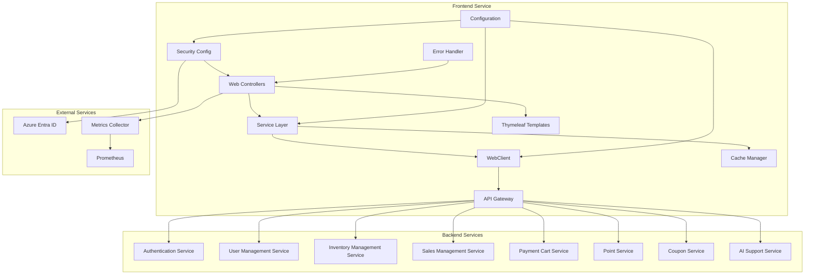
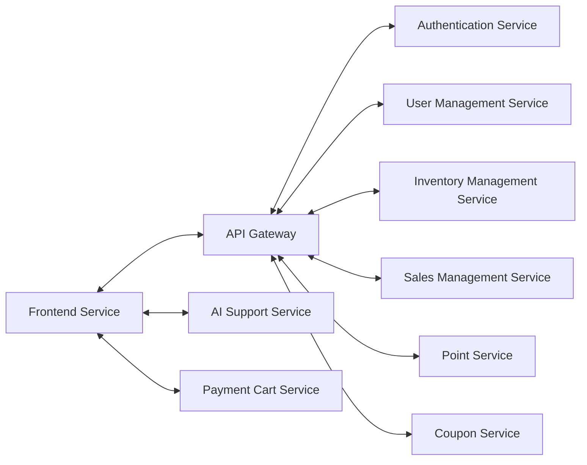
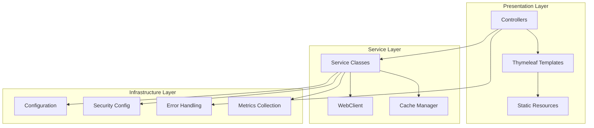
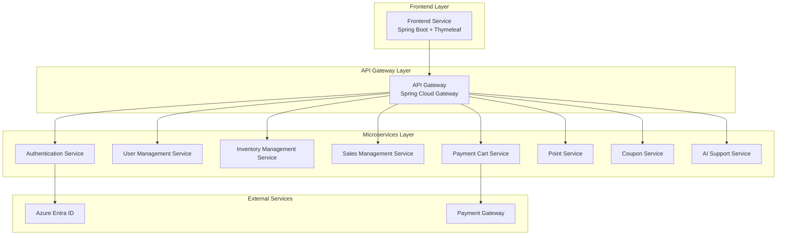

# Frontend Service - Detailed Design Document

## 1. Overview

The Frontend Service is a web application that provides a unified user interface for the Azure SkiShop application. It serves as the presentation layer that integrates with backend microservices to deliver a complete e-commerce experience for both customers and administrators. The service handles user interactions, displays product information, manages shopping cart functionality, and provides administrative interfaces for business operations.

## 2. Technology Stack

### Development Environment

- **Language**: Java 21 (LTS)
- **Framework**: Spring Boot 3.2.0
- **Template Engine**: Thymeleaf 3.1.x
- **UI Framework**: Bootstrap 5.3.x
- **Build Tool**: Maven 3.9.x
- **Containerization**: Docker 25.x
- **Testing**: JUnit 5.10.1, Spring Boot Test, WebMvcTest

### Production Environment

- Azure Container Apps
- Azure Entra ID (OAuth 2.0)
- Azure Application Insights

### Major Libraries and Versions

| Library | Version | Purpose |
|---------|---------|---------|
| spring-boot-starter-web | 3.2.0 | Web MVC Framework |
| spring-boot-starter-thymeleaf | 3.2.0 | Server-side Template Engine |
| spring-boot-starter-security | 3.2.0 | Security Configuration |
| spring-boot-starter-oauth2-client | 3.2.0 | OAuth 2.0 Client Support |
| spring-boot-starter-webflux | 3.2.0 | WebClient for API Calls |
| spring-boot-starter-actuator | 3.2.0 | Health Check, Metrics |
| spring-boot-starter-cache | 3.2.0 | Caching Functionality |
| spring-boot-starter-validation | 3.2.0 | Input Validation |
| thymeleaf-layout-dialect | 3.3.0 | Layout Management |
| bootstrap | 5.3.2 | UI Framework (WebJars) |
| jquery | 3.7.1 | JavaScript Library (WebJars) |
| font-awesome | 6.4.0 | Icon Library (WebJars) |
| caffeine | 3.1.8 | High Performance Caching |
| httpclient5 | 5.2.1 | HTTP Client for WebClient |
| jackson-databind | 2.15.3 | JSON Processing |
| micrometer-registry-prometheus | 1.12.2 | Metrics Collection |

## 3. System Architecture

### Component Architecture Diagram



### Microservice Relationship Diagram



## 4. Service Information

| Item | Value |
|------|-------|
| Service Name | frontend-service |
| Port | 8080 |
| Database | None (Stateless Web Application) |
| Framework | Spring Boot 3.2.x |
| Java Version | 21 |
| Architecture | MVC Web Application with Microservice Integration |

## 5. Technology Stack

| Category | Technology | Version | Purpose |
|----------|-----------|---------|---------|
| Runtime | Java | 21 | Main programming language with modern features |
| Framework | Spring Boot | 3.2.x | Main application framework |
| Template Engine | Thymeleaf | 3.1.x | Server-side rendering |
| UI Framework | Bootstrap | 5.3.x | Responsive UI components |
| JavaScript | jQuery | 3.7.1 | Client-side interactivity |
| Icons | Font Awesome | 6.4.0 | Icon library |
| Cache | Caffeine | 3.1.8 | In-memory caching |
| HTTP Client | Apache HttpClient | 5.2.1 | External API communication |
| Build Tool | Maven | 3.9+ | Dependency management and build |
| Container | Docker | Latest | Containerization |

## 6. Data Models

### DTO Classes

#### ProductDto

```java
public record ProductDto(
    String id,
    String name,
    String description,
    BigDecimal price,
    String category,
    String brand,
    String imageUrl,
    Integer stockQuantity,
    BigDecimal rating,
    Integer reviewCount,
    String sku
) {}
```

#### CartItemDto

```java
public record CartItemDto(
    String productId,
    String productName,
    BigDecimal unitPrice,
    Integer quantity,
    BigDecimal subtotal,
    String imageUrl
) {}
```

#### OrderDto

```java
public record OrderDto(
    String id,
    String orderNumber,
    String customerId,
    LocalDateTime orderDate,
    String status,
    BigDecimal totalAmount,
    List<OrderItemDto> items,
    ShippingAddressDto shippingAddress
) {}
```

#### CustomerDto

```java
public record CustomerDto(
    String id,
    String username,
    String email,
    String firstName,
    String lastName,
    String phoneNumber,
    LocalDateTime createdAt,
    List<AddressDto> addresses
) {}
```

## 7. Architecture Design

### 7.1 Layer Architecture



### 7.2 System Architecture Diagram



## 8. API Design

### Frontend Endpoint Structure

#### Customer Pages

| Method | Path | Description | Parameters | Response |
|---------|-----|------------|------------|----------|
| GET | / | Home page | - | Home view with featured products |
| GET | /products | Product list page | category, brand, search, page, size | Product list view |
| GET | /products/{id} | Product detail page | id | Product detail view |
| GET | /cart | Shopping cart page | - | Cart view with items |
| POST | /cart/add | Add product to cart | productId, quantity | Redirect to cart |
| PUT | /cart/update | Update cart item | itemId, quantity | Redirect to cart |
| DELETE | /cart/remove | Remove cart item | itemId | Redirect to cart |
| GET | /checkout | Checkout page | - | Checkout form view |
| POST | /checkout | Process order | OrderCreateRequest | Order confirmation view |
| GET | /profile | User profile page | - | User profile view |
| GET | /orders | Order history | page, size | Order history view |
| GET | /orders/{id} | Order detail | id | Order detail view |

#### AI Chat Integration

| Method | Path | Description | Parameters | Response |
|---------|-----|------------|------------|----------|
| GET | /chat | AI chat interface | - | Chat view |
| POST | /api/chat/send | Send chat message | message, sessionId | ChatResponse JSON |
| GET | /api/chat/history | Get chat history | sessionId | Chat history JSON |

#### Admin Pages (Admin Role Required)

| Method | Path | Description | Parameters | Response |
|---------|-----|------------|------------|----------|
| GET | /admin | Admin dashboard | - | Dashboard view with KPIs |
| GET | /admin/products | Product management | page, size, search | Product management view |
| GET | /admin/orders | Order management | status, page, size | Order list view |
| PUT | /admin/orders/{id}/status | Update order status | id, status | Redirect to order list |
| GET | /admin/customers | Customer management | page, size, search | Customer list view |
| GET | /admin/reports | Reports page | - | Reports view |

### Backend API Integration

#### Product Service Integration

| Backend API | Frontend Usage | Caching | Error Handling |
|-------------|----------------|---------|----------------|
| GET /api/v1/products | Product list, search | 5 minutes | Show cached data or error page |
| GET /api/v1/products/{id} | Product detail | 10 minutes | Show 404 page |
| GET /api/v1/categories | Category filter | 30 minutes | Hide filter or default |

#### User Management Integration

| Backend API | Frontend Usage | Caching | Error Handling |
|-------------|----------------|---------|----------------|
| GET /api/v1/users/profile | User profile page | Session-based | Redirect to login |
| PUT /api/v1/users/profile | Profile update | Clear cache | Show validation errors |
| GET /api/v1/users/{id}/addresses | Address management | No caching | Show empty state |

#### Order Management Integration

| Backend API | Frontend Usage | Caching | Error Handling |
|-------------|----------------|---------|----------------|
| POST /api/v1/orders | Checkout process | No caching | Show error message |
| GET /api/v1/orders/customer/{id} | Order history | 2 minutes | Show empty state |
| GET /api/v1/orders/{id} | Order detail | 5 minutes | Show 404 page |

#### Cart Service Integration

| Backend API | Frontend Usage | Caching | Error Handling |
|-------------|----------------|---------|----------------|
| GET /api/v1/cart/{sessionId} | Display cart items | Session-based | Show empty cart |
| POST /api/v1/cart/items | Add to cart | Clear cache | Show error toast |
| PUT /api/v1/cart/items/{id} | Update quantity | Clear cache | Revert UI state |
| DELETE /api/v1/cart/items/{id} | Remove item | Clear cache | Show undo option |

### WebClient Configuration Examples

#### Product Service Client

```java
@Service
public class ProductService {
    
    private final WebClient webClient;
    private final CacheManager cacheManager;
    
    @Cacheable(value = "products", key = "#page + '-' + #size + '-' + #sortBy")
    public Mono<ProductSearchResponse> getProducts(int page, int size, String sortBy, String category, String brand) {
        return webClient.get()
            .uri(uriBuilder -> uriBuilder
                .path("/api/v1/products")
                .queryParam("page", page)
                .queryParam("size", size)
                .queryParam("sort", sortBy)
                .queryParamIfPresent("category", Optional.ofNullable(category))
                .queryParamIfPresent("brand", Optional.ofNullable(brand))
                .build())
            .retrieve()
            .onStatus(HttpStatusCode::is4xxClientError, this::handle4xxError)
            .onStatus(HttpStatusCode::is5xxServerError, this::handle5xxError)
            .bodyToMono(ProductSearchResponse.class)
            .timeout(Duration.ofSeconds(10))
            .onErrorResume(TimeoutException.class, ex -> {
                logger.warn("Product search timeout, returning cached data");
                return getCachedProducts(page, size, sortBy, category, brand);
            });
    }
}
```

## 9. Event Design

### Frontend Event Handling

The Frontend Service handles events for user interactions and real-time updates from backend services.

#### User Interaction Events

| Event Type | Trigger | Handler | Description |
|------------|---------|---------|-------------|
| ProductView | User views product detail | `trackProductView()` | Track product views for analytics |
| AddToCart | User adds product to cart | `addToCartHandler()` | Add product to session cart |
| CartUpdate | User updates cart quantity | `updateCartHandler()` | Update cart item quantity |
| SearchQuery | User searches products | `searchHandler()` | Process search with debouncing |
| FilterApply | User applies product filters | `filterHandler()` | Apply filters and refresh results |

#### Real-time Event Handling

```javascript
// WebSocket connection for real-time updates
const eventSource = new EventSource('/api/events/stream');

eventSource.addEventListener('stockUpdate', function(event) {
    const data = JSON.parse(event.data);
    updateProductStock(data.productId, data.stockQuantity);
});

eventSource.addEventListener('priceUpdate', function(event) {
    const data = JSON.parse(event.data);
    updateProductPrice(data.productId, data.newPrice);
});
```

#### Form Validation Events

| Form | Validation Events | Error Handling |
|------|------------------|----------------|
| Login Form | `validate-email`, `validate-password` | Display inline error messages |
| Registration Form | `validate-all-fields`, `check-email-exists` | Real-time validation feedback |
| Checkout Form | `validate-shipping`, `validate-payment` | Prevent form submission on errors |
| Profile Update | `validate-profile`, `confirm-changes` | Show confirmation dialog |

### Event Publishing to Backend

#### Order Events

```java
@Component
public class OrderEventPublisher {
    
    private final WebClient webClient;
    
    public void publishOrderPlaced(OrderDto order) {
        OrderPlacedEvent event = new OrderPlacedEvent(
            order.id(),
            order.customerId(),
            order.totalAmount(),
            LocalDateTime.now()
        );
        
        // Publish to backend via API
        webClient.post()
            .uri("/api/events/order-placed")
            .bodyValue(event)
            .retrieve()
            .bodyToMono(Void.class)
            .doOnError(ex -> logger.error("Failed to publish order event", ex))
            .subscribe();
    }
}
```

## 10. Error Handling

### Error Code Definition

| Error Code | Description | HTTP Status | User Action |
|------------|-------------|-------------|-------------|
| FE-4001 | Invalid form data | 400 Bad Request | Show field validation errors |
| FE-4002 | Missing required parameters | 400 Bad Request | Highlight missing fields |
| FE-4003 | Invalid session or expired | 401 Unauthorized | Redirect to login page |
| FE-4004 | Access denied | 403 Forbidden | Show access denied page |
| FE-4041 | Page not found | 404 Not Found | Show 404 error page |
| FE-4042 | Product not found | 404 Not Found | Show product not available message |
| FE-4091 | Session conflict | 409 Conflict | Refresh page and retry |
| FE-5001 | Internal server error | 500 Internal Server Error | Show generic error page |
| FE-5002 | Backend service unavailable | 503 Service Unavailable | Show maintenance page |
| FE-5003 | Gateway timeout | 504 Gateway Timeout | Show retry option |

### Global Error Handling

```java
@ControllerAdvice
public class GlobalExceptionHandler {
    
    private static final Logger logger = LoggerFactory.getLogger(GlobalExceptionHandler.class);
    
    @ExceptionHandler(WebClientResponseException.class)
    public String handleWebClientException(WebClientResponseException ex, Model model) {
        logger.error("Backend service error: {}", ex.getMessage());
        
        return switch (ex.getStatusCode().value()) {
            case 404 -> {
                model.addAttribute("errorMessage", "要求されたリソースが見つかりません");
                yield "error/404";
            }
            case 500 -> {
                model.addAttribute("errorMessage", "サービスが一時的に利用できません");
                yield "error/500";
            }
            case 503 -> {
                model.addAttribute("errorMessage", "サービスメンテナンス中です");
                yield "error/maintenance";
            }
            default -> {
                model.addAttribute("errorMessage", "予期しないエラーが発生しました");
                yield "error/generic";
            }
        };
    }
    
    @ExceptionHandler(TimeoutException.class)
    public String handleTimeout(TimeoutException ex, Model model) {
        logger.error("Request timeout: {}", ex.getMessage());
        model.addAttribute("errorMessage", "リクエストがタイムアウトしました");
        model.addAttribute("retryAction", true);
        return "error/timeout";
    }
    
    @ExceptionHandler(MethodArgumentNotValidException.class)
    public String handleValidationError(MethodArgumentNotValidException ex, Model model) {
        Map<String, String> errors = new HashMap<>();
        ex.getBindingResult().getFieldErrors().forEach(error -> 
            errors.put(error.getField(), error.getDefaultMessage())
        );
        
        model.addAttribute("validationErrors", errors);
        return "error/validation";
    }
}
```

### Circuit Breaker Implementation

```java
@Component
public class ProductServiceClient {
    
    private final WebClient webClient;
    private final CircuitBreaker circuitBreaker;
    
    public ProductServiceClient(WebClient webClient) {
        this.webClient = webClient;
        this.circuitBreaker = CircuitBreaker.ofDefaults("productService");
        
        circuitBreaker.getEventPublisher()
            .onStateTransition(event -> 
                logger.info("Circuit breaker state transition: {}", event));
    }
    
    public Mono<ProductDto> getProduct(String productId) {
        return circuitBreaker.executeSupplier(() -> 
            webClient.get()
                .uri("/api/v1/products/{id}", productId)
                .retrieve()
                .bodyToMono(ProductDto.class)
                .block()
        );
    }
}
```

### Error Page Templates

#### 404 Error Page (error/404.html)

```html
<!DOCTYPE html>
<html xmlns:th="http://www.thymeleaf.org" 
      xmlns:layout="http://www.ultraq.net.nz/thymeleaf/layout"
      layout:decorate="~{layout/main}">
<head>
    <title>ページが見つかりません - Azure SkiShop</title>
</head>
<body>
<main layout:fragment="content">
    <div class="error-page">
        <div class="error-icon">
            <i class="fas fa-exclamation-triangle"></i>
        </div>
        <h1>404 - ページが見つかりません</h1>
        <p th:text="${errorMessage}">要求されたページが見つかりません</p>
        <div class="error-actions">
            <a href="/" class="btn btn-primary">ホームページに戻る</a>
            <a href="/products" class="btn btn-outline-primary">商品一覧を見る</a>
        </div>
    </div>
</main>
</body>
</html>
```

## 6. Key Screen Design

### 6.1 Home Page

- **Hero Section**: Large banner image with call-to-action buttons
- **Featured Products**: Carousel format with product cards
- **Category Grid**: Grid layout for product categories
- **New Products**: Horizontal scroll format
- **Sale Information**: Eye-catching banner display
- **AI Chat Button**: Floating action button for quick access

### 6.2 Product List Page

- **Filter Functionality**: Category, brand, price range, rating filters
- **Sort Functionality**: Price, popularity, newest, rating sort options
- **Grid View**: Product image, name, price, rating display
- **Pagination**: Infinite scroll or page numbers
- **Search Integration**: Real-time search with autocomplete

### 6.3 Product Detail Page

- **Product Image Gallery**: Main image with thumbnail carousel
- **Product Information**: Name, price, description, specifications
- **Inventory Status**: Real-time stock display
- **Add to Cart Button**: Prominent CTA button
- **Review Display**: Customer reviews and ratings
- **Related Products**: Similar product recommendations
- **AI Consultation Button**: Product-specific questions

### 6.4 Shopping Cart Page

- **Product List**: Product image, name, quantity, price
- **Quantity Control**: Increment/decrement buttons
- **Remove Function**: Product removal button
- **Total Amount Display**: Subtotal, tax, shipping, total
- **Checkout Button**: Prominent call-to-action

### 6.5 Admin Dashboard

- **KPI Cards**: Sales, order count, user count, inventory alerts
- **Sales Chart**: Time series chart visualization
- **Order Status**: Latest orders list
- **Inventory Alerts**: Low stock product warnings
- **System Status**: Microservice health monitoring

## 7. API Integration Design

### 7.1 WebClient Configuration

```java
@Configuration
public class WebClientConfig {

    @Value("${app.api-gateway.url}")
    private String apiGatewayUrl;

    @Bean
    public WebClient webClient() {
        HttpClient httpClient = HttpClient.create()
            .responseTimeout(Duration.ofSeconds(30))
            .option(ChannelOption.CONNECT_TIMEOUT_MILLIS, 10000);

        return WebClient.builder()
            .baseUrl(apiGatewayUrl)
            .clientConnector(new ReactorClientHttpConnector(httpClient))
            .codecs(configurer -> configurer
                .defaultCodecs()
                .maxInMemorySize(1024 * 1024) // 1MB
            )
            .build();
    }
}
```

### 7.2 Service Layer Implementation

```java
@Service
public class ProductService {
    
    private final WebClient webClient;
    
    public ProductService(WebClient webClient) {
        this.webClient = webClient;
    }
    
    @Cacheable(value = "products", key = "#page + '-' + #size + '-' + #sortBy")
    public Mono<ProductSearchResponse> getProducts(int page, int size, String sortBy, String category, String brand) {
        return webClient.get()
            .uri(uriBuilder -> uriBuilder
                .path("/api/products")
                .queryParam("page", page)
                .queryParam("size", size)
                .queryParam("sort", sortBy)
                .queryParamIfPresent("category", Optional.ofNullable(category))
                .queryParamIfPresent("brand", Optional.ofNullable(brand))
                .build())
            .retrieve()
            .bodyToMono(ProductSearchResponse.class)
            .timeout(Duration.ofSeconds(10))
            .onErrorResume(this::handleProductSearchError);
    }
}
```

### 7.3 Error Handling Strategy

```java
@Component
public class ApiErrorHandler {
    
    public <T> Mono<T> handleErrors(Mono<T> apiCall, T defaultValue) {
        return apiCall
            .onErrorResume(WebClientResponseException.class, ex -> {
                logger.error("API call failed: {}", ex.getMessage());
                return Mono.just(defaultValue);
            })
            .onErrorResume(TimeoutException.class, ex -> {
                logger.error("API call timeout: {}", ex.getMessage());
                return Mono.just(defaultValue);
            });
    }
}
```

## 8. Security Design

### 8.1 Authentication Configuration

```java
@Configuration
@EnableWebSecurity
public class SecurityConfig {
    
    @Bean
    public SecurityFilterChain filterChain(HttpSecurity http) throws Exception {
        http
            .authorizeHttpRequests(authz -> authz
                .requestMatchers("/", "/products/**", "/search/**", 
                               "/css/**", "/js/**", "/images/**", "/webjars/**").permitAll()
                .requestMatchers("/admin/**").hasRole("ADMIN")
                .requestMatchers("/profile/**", "/orders/**").hasRole("USER")
                .anyRequest().authenticated()
            )
            .oauth2Login(oauth2 -> oauth2
                .loginPage("/login")
                .defaultSuccessUrl("/dashboard", true)
                .failureUrl("/login?error=true")
            )
            .logout(logout -> logout
                .logoutUrl("/logout")
                .logoutSuccessUrl("/")
                .deleteCookies("JSESSIONID")
                .invalidateHttpSession(true)
            )
            .sessionManagement(session -> session
                .sessionCreationPolicy(SessionCreationPolicy.IF_REQUIRED)
                .maximumSessions(1)
                .maxSessionsPreventsLogin(false)
            );
            
        return http.build();
    }
}
```

#### Example: Profile-Based Security Configuration

```yaml
# Local development profile
spring:
  config:
    activate:
      on-profile: local
app:
  skishop:
    auth:
      enabled: false  # Disable OAuth in local development

---
# Production profile  
spring:
  config:
    activate:
      on-profile: production
  security:
    oauth2:
      client:
        registration:
          azure:
            client-id: ${AZURE_CLIENT_ID}
            client-secret: ${AZURE_CLIENT_SECRET}
            scope: openid,profile,email
            redirect-uri: "{baseUrl}/login/oauth2/code/{registrationId}"
        provider:
          azure:
            issuer-uri: https://login.microsoftonline.com/${AZURE_TENANT_ID}/v2.0
```

### 8.2 CSRF Protection

```java
@Configuration
public class CsrfConfig {
    
    @Bean
    public CsrfTokenRepository csrfTokenRepository() {
        CookieCsrfTokenRepository repository = CookieCsrfTokenRepository.withHttpOnlyFalse();
        repository.setCookieName("XSRF-TOKEN");
        repository.setHeaderName("X-XSRF-TOKEN");
        return repository;
    }
}
```

## 9. Performance Optimization

### 9.1 Caching Strategy

```java
@Configuration
@EnableCaching
public class CacheConfig {
    
    @Bean
    public CacheManager cacheManager() {
        CaffeineCacheManager cacheManager = new CaffeineCacheManager();
        cacheManager.setCaffeine(Caffeine.newBuilder()
            .maximumSize(1000)
            .expireAfterWrite(10, TimeUnit.MINUTES)
            .recordStats());
        return cacheManager;
    }
    
    @Bean
    public Cache productCache() {
        return Caffeine.newBuilder()
            .maximumSize(500)
            .expireAfterWrite(5, TimeUnit.MINUTES)
            .build();
    }
    
    @Bean 
    public Cache categoryCache() {
        return Caffeine.newBuilder()
            .maximumSize(100)
            .expireAfterWrite(30, TimeUnit.MINUTES)
            .build();
    }
}
```

#### Cache Configuration Details

| Cache Name | Max Size | TTL | Use Case |
|------------|----------|-----|----------|
| products | 500 | 5 minutes | Product details and search results |
| categories | 100 | 30 minutes | Category lists and filters |
| users | 200 | 10 minutes | User profile information |
| cart | 1000 | Session-based | Shopping cart contents |

### Frontend Performance Optimization

#### JavaScript and CSS Optimization

```html
<!-- CSS optimization with critical CSS inline -->
<style>
/* Critical CSS for above-the-fold content */
.navbar, .hero-section, .main-nav { /* Critical styles */ }
</style>

<!-- Non-critical CSS loaded asynchronously -->
<link rel="preload" href="/css/bootstrap.min.css" as="style" onload="this.onload=null;this.rel='stylesheet'">
<link rel="preload" href="/css/custom.css" as="style" onload="this.onload=null;this.rel='stylesheet'">

<!-- JavaScript with defer and async -->
<script defer src="/webjars/jquery/jquery.min.js"></script>
<script defer src="/webjars/bootstrap/js/bootstrap.bundle.min.js"></script>
<script async src="/js/analytics.js"></script>
```

### WebClient Optimization

```java
@Configuration
public class WebClientConfig {
    
    @Bean
    public WebClient webClient() {
        HttpClient httpClient = HttpClient.create()
            .responseTimeout(Duration.ofSeconds(30))
            .option(ChannelOption.CONNECT_TIMEOUT_MILLIS, 10000)
            .option(ChannelOption.SO_KEEPALIVE, true);
            
        ConnectionProvider connectionProvider = ConnectionProvider.builder("custom")
            .maxConnections(100)
            .maxIdleTime(Duration.ofSeconds(20))
            .maxLifeTime(Duration.ofSeconds(60))
            .pendingAcquireTimeout(Duration.ofSeconds(60))
            .build();
            
        return WebClient.builder()
            .clientConnector(new ReactorClientHttpConnector(httpClient))
            .codecs(configurer -> configurer
                .defaultCodecs()
                .maxInMemorySize(1024 * 1024) // 1MB
            )
            .build();
    }
}
```

## 12. Security Measures

### Authentication and Authorization

#### OAuth 2.0 Configuration

```java
@Configuration
@EnableWebSecurity
public class SecurityConfig {
    
    @Bean
    public SecurityFilterChain filterChain(HttpSecurity http) throws Exception {
        http
            .authorizeHttpRequests(authz -> authz
                .requestMatchers("/", "/products/**", "/search/**", 
                               "/css/**", "/js/**", "/images/**", "/webjars/**").permitAll()
                .requestMatchers("/admin/**").hasRole("ADMIN")
                .requestMatchers("/profile/**", "/orders/**").hasRole("USER")
                .anyRequest().authenticated()
            )
            .oauth2Login(oauth2 -> oauth2
                .loginPage("/login")
                .defaultSuccessUrl("/dashboard", true)
                .failureUrl("/login?error=true")
            )
            .logout(logout -> logout
                .logoutUrl("/logout")
                .logoutSuccessUrl("/")
                .deleteCookies("JSESSIONID")
                .invalidateHttpSession(true)
            )
            .sessionManagement(session -> session
                .sessionCreationPolicy(SessionCreationPolicy.IF_REQUIRED)
                .maximumSessions(1)
                .maxSessionsPreventsLogin(false)
            );
            
        return http.build();
    }
}
```

#### Profile-Based Security Configuration

```yaml
# Local development profile
spring:
  config:
    activate:
      on-profile: local
app:
  skishop:
    auth:
      enabled: false  # Disable OAuth in local development

---
# Production profile  
spring:
  config:
    activate:
      on-profile: production
  security:
    oauth2:
      client:
        registration:
          azure:
            client-id: ${AZURE_CLIENT_ID}
            client-secret: ${AZURE_CLIENT_SECRET}
            scope: openid,profile,email
            redirect-uri: "{baseUrl}/login/oauth2/code/{registrationId}"
        provider:
          azure:
            issuer-uri: https://login.microsoftonline.com/${AZURE_TENANT_ID}/v2.0
```

### Input Validation and Sanitization

```java
@Controller
public class ProductController {
    
    @PostMapping("/search")
    public String search(@Valid @ModelAttribute SearchRequest request, 
                        BindingResult result, Model model) {
        
        if (result.hasErrors()) {
            model.addAttribute("errors", result.getAllErrors());
            return "products/search";
        }
        
        // Sanitize search input
        String sanitizedQuery = HtmlUtils.htmlEscape(request.getQuery().trim());
        
        // Validate search query length
        if (sanitizedQuery.length() > 100) {
            model.addAttribute("error", "検索キーワードが長すぎます");
            return "products/search";
        }
        
        return "redirect:/products?search=" + URLEncoder.encode(sanitizedQuery, StandardCharsets.UTF_8);
    }
}

// Request validation
public record SearchRequest(
    @NotBlank(message = "検索キーワードを入力してください")
    @Size(max = 100, message = "検索キーワードは100文字以内で入力してください")
    @Pattern(regexp = "^[a-zA-Z0-9\\s\\u3040-\\u309F\\u30A0-\\u30FF\\u4E00-\\u9FAF]+$", 
             message = "無効な文字が含まれています")
    String query,
    
    @Pattern(regexp = "^(all|ski|snowboard|apparel|accessories)$", 
             message = "無効なカテゴリです")
    String category
) {}
```

## 13. Monitoring and Logging

### Health Check Implementation

```java
@Component
public class CustomHealthIndicator implements HealthIndicator {
    
    private final WebClient webClient;
    
    @Override
    public Health health() {
        try {
            // Check API Gateway connectivity
            webClient.get()
                .uri("/actuator/health")
                .retrieve()
                .bodyToMono(String.class)
                .timeout(Duration.ofSeconds(5))
                .block();
                
            return Health.up()
                .withDetail("apiGateway", "connected")
                .withDetail("timestamp", LocalDateTime.now())
                .build();
                
        } catch (Exception ex) {
            return Health.down()
                .withDetail("apiGateway", "disconnected")
                .withDetail("error", ex.getMessage())
                .withDetail("timestamp", LocalDateTime.now())
                .build();
        }
    }
}
```

### Metrics and Monitoring Configuration

```yaml
management:
  endpoints:
    web:
      exposure:
        include: health,info,metrics,prometheus
  endpoint:
    health:
      show-details: when-authorized
      group:
        custom:
          include: db,diskspace
    metrics:
      enabled: true
  metrics:
    export:
      prometheus:
        enabled: true
    distribution:
      percentiles-histogram:
        http.server.requests: true
      percentiles:
        http.server.requests: 0.5,0.95,0.99
```

### Custom Metrics

```java
@Component
public class CustomMetrics {
    
    private final Counter productViewCounter;
    private final Counter cartAddCounter;
    private final Timer searchTimer;
    
    public CustomMetrics(MeterRegistry meterRegistry) {
        this.productViewCounter = Counter.builder("frontend.product.views")
            .description("Number of product views")
            .tag("service", "frontend")
            .register(meterRegistry);
            
        this.cartAddCounter = Counter.builder("frontend.cart.additions")
            .description("Number of cart additions")
            .tag("service", "frontend")
            .register(meterRegistry);
            
        this.searchTimer = Timer.builder("frontend.search.duration")
            .description("Search request duration")
            .tag("service", "frontend")
            .register(meterRegistry);
    }
    
    public void incrementProductView(String productId) {
        productViewCounter.increment(Tags.of("productId", productId));
    }
    
    public void incrementCartAddition() {
        cartAddCounter.increment();
    }
    
    public Timer.Sample startSearchTimer() {
        return Timer.start();
    }
}
```

### Logging Configuration

```yaml
logging:
  level:
    com.skishop.frontend: INFO
    org.springframework.web: DEBUG
    org.springframework.security: DEBUG
    reactor.netty.http.client: DEBUG
    
  pattern:
    console: "%d{yyyy-MM-dd HH:mm:ss} [%thread] %-5level %logger{36} - %msg%n"
    file: "%d{yyyy-MM-dd HH:mm:ss} [%thread] %-5level %logger{36} - %msg%n"
    
  file:
    name: logs/frontend-service.log
    max-size: 100MB
    max-history: 30
```

## 14. Testing Strategy

### Unit Testing

```java
@WebMvcTest(ProductController.class)
class ProductControllerTest {
    
    @Autowired
    private MockMvc mockMvc;
    
    @MockBean
    private ProductService productService;
    
    @Test
    void shouldDisplayProductList() throws Exception {
        // Given
        ProductSearchResponse response = new ProductSearchResponse(
            List.of(new ProductDto("1", "Ski Boots", "High quality ski boots", 
                   new BigDecimal("25000"), "ski", "Brand A", "/images/1.jpg", 10, 
                   new BigDecimal("4.5"), 25, "SKI-001")),
            1, 0, 10, 1
        );
        
        when(productService.getProducts(any(Pageable.class), any()))
            .thenReturn(Mono.just(response));
        
        // When & Then
        mockMvc.perform(get("/products"))
            .andExpect(status().isOk())
            .andExpect(view().name("products/list"))
            .andExpect(model().attributeExists("products"))
            .andExpect(model().attributeExists("pagination"));
    }
}
```

### Integration Testing

```java
@SpringBootTest(webEnvironment = SpringBootTest.WebEnvironment.RANDOM_PORT)
@TestPropertySource(properties = {
    "app.api-gateway.url=http://localhost:8080",
    "app.skishop.auth.enabled=false"
})
class FrontendIntegrationTest {
    
    @Autowired
    private TestRestTemplate restTemplate;
    
    @MockBean
    private ProductService productService;
    
    @Test
    void shouldReturnHomePage() {
        // Given
        when(productService.getFeaturedProducts())
            .thenReturn(Mono.just(List.of()));
        
        // When
        ResponseEntity<String> response = restTemplate.getForEntity("/", String.class);
        
        // Then
        assertThat(response.getStatusCode()).isEqualTo(HttpStatus.OK);
        assertThat(response.getBody()).contains("Azure SkiShop");
    }
}
```

### End-to-End Testing

```java
@SpringBootTest(webEnvironment = SpringBootTest.WebEnvironment.RANDOM_PORT)
@AutoConfigureTestDatabase
@TestMethodOrder(OrderAnnotation.class)
class E2EFrontendTest {
    
    @Test
    @Order(1)
    void shouldCompleteShoppingFlow() {
        // 1. Access home page
        // 2. Search for products
        // 3. View product details
        // 4. Add to cart
        // 5. Proceed to checkout
        // 6. Complete order
    }
}
```

## 15. Deployment

### Docker Configuration

```dockerfile
FROM openjdk:21-jre-slim

LABEL maintainer="Azure SkiShop Team"
LABEL version="1.0.0"
LABEL description="Azure SkiShop Frontend Service"

# Set working directory
WORKDIR /app

# Copy application JAR file
COPY target/frontend-service-*.jar app.jar

# Expose port 8080
EXPOSE 8080

# Health check
HEALTHCHECK --interval=30s --timeout=3s --start-period=5s --retries=3 \
    CMD curl -f http://localhost:8080/actuator/health || exit 1

# Run application
ENTRYPOINT ["java", "-jar", "app.jar"]

# Production JVM options
ENV JAVA_OPTS="-Xmx512m -Xms256m -XX:+UseG1GC -XX:+UseContainerSupport"

# Set Spring profile to production
ENV SPRING_PROFILES_ACTIVE=production
```

### Azure Container Apps Deployment

```yaml
apiVersion: apps/v1
kind: Deployment
metadata:
  name: frontend-service
  namespace: skishop
spec:
  replicas: 3
  selector:
    matchLabels:
      app: frontend-service
  template:
    metadata:
      labels:
        app: frontend-service
    spec:
      containers:
      - name: frontend-service
        image: acrskishop.azurecr.io/frontend-service:latest
        ports:
        - containerPort: 8080
        env:
        - name: SPRING_PROFILES_ACTIVE
          value: "production"
        - name: API_GATEWAY_URL
          value: "http://api-gateway-service:8080"
        - name: AZURE_CLIENT_ID
          valueFrom:
            secretKeyRef:
              name: azure-credentials
              key: client-id
        - name: AZURE_CLIENT_SECRET
          valueFrom:
            secretKeyRef:
              name: azure-credentials
              key: client-secret
        - name: AZURE_TENANT_ID
          valueFrom:
            secretKeyRef:
              name: azure-credentials
              key: tenant-id
        resources:
          requests:
            memory: "256Mi"
            cpu: "100m"
          limits:
            memory: "512Mi"
            cpu: "500m"
        livenessProbe:
          httpGet:
            path: /actuator/health
            port: 8080
          initialDelaySeconds: 60
          periodSeconds: 30
        readinessProbe:
          httpGet:
            path: /actuator/health/readiness
            port: 8080
          initialDelaySeconds: 30
          periodSeconds: 10
```

## 16. Operations and Maintenance

### Operational Procedures

#### Deployment Process

1. **Pre-deployment Checks**

   ```bash
   # Verify Docker image
   docker pull acrskishop.azurecr.io/frontend-service:latest
   docker run --rm acrskishop.azurecr.io/frontend-service:latest java -version
   
   # Check dependencies
   curl -f http://api-gateway:8080/actuator/health
   ```

2. **Rolling Deployment**

   ```bash
   # Azure Container Apps deployment
   az containerapp update \
     --name frontend-service \
     --resource-group rg-skishop \
     --image acrskishop.azurecr.io/frontend-service:latest
   ```

3. **Post-deployment Verification**

   ```bash
   # Health check
   curl -f https://frontend.skishop.azure.com/actuator/health
   
   # Functional test
   curl -f https://frontend.skishop.azure.com/
   
   # Metrics verification
   curl -f https://frontend.skishop.azure.com/actuator/metrics
   ```

#### Monitoring and Alerting

| Metric | Threshold | Alert Action |
|--------|-----------|--------------|
| CPU Usage | > 80% for 5 minutes | Scale up replicas |
| Memory Usage | > 85% for 5 minutes | Scale up memory limits |
| Response Time | > 2 seconds average | Check backend services |
| Error Rate | > 5% for 5 minutes | Emergency notification |
| Disk Usage | > 90% | Clear logs and temporary files |

#### Backup and Recovery

- **Configuration Backup**: Store all configuration files in Git repository
- **Session Data**: No persistent data (stateless application)
- **Logs**: Automatically rotated and archived to Azure Storage
- **Metrics**: Retained in Prometheus for 30 days

#### Scaling Strategy

```yaml
# Horizontal Pod Autoscaler
apiVersion: autoscaling/v2
kind: HorizontalPodAutoscaler
metadata:
  name: frontend-service-hpa
spec:
  scaleTargetRef:
    apiVersion: apps/v1
    kind: Deployment
    name: frontend-service
  minReplicas: 3
  maxReplicas: 10
  metrics:
  - type: Resource
    resource:
      name: cpu
      target:
        type: Utilization
        averageUtilization: 70
  - type: Resource
    resource:
      name: memory
      target:
        type: Utilization
        averageUtilization: 80
```

## 17. Configuration Reference

### Complete Application Configuration

```yaml
# Complete application.yml configuration
server:
  port: 8080
  servlet:
    session:
      timeout: 30m

spring:
  application:
    name: frontend-service
  
  profiles:
    active: local
  
  thymeleaf:
    cache: false
    prefix: classpath:/templates/
    suffix: .html
    encoding: UTF-8
    mode: HTML
  
  web:
    resources:
      cache:
        cachecontrol:
          max-age: 1h
      chain:
        strategy:
          content:
            enabled: true
        gzipped: true
  
  cache:
    caffeine:
      spec: maximumSize=1000,expireAfterWrite=10m

management:
  endpoints:
    web:
      exposure:
        include: health,info,metrics,prometheus
  endpoint:
    health:
      show-details: when-authorized
  metrics:
    export:
      prometheus:
        enabled: true

# Application specific configuration
app:
  api-gateway:
    url: ${API_GATEWAY_URL:http://localhost:8080}
    timeout: 30s
    
  ai-support-service:
    url: ${AI_SUPPORT_SERVICE_URL:http://localhost:8084}
    
  payment-cart-service:
    url: ${PAYMENT_CART_SERVICE_URL:http://localhost:8085}
    
  skishop:
    auth:
      enabled: ${SKISHOP_AUTH_ENABLED:true}
    
    cache:
      products:
        ttl: 5m
        max-size: 500
      categories:
        ttl: 30m
        max-size: 100

logging:
  level:
    com.skishop.frontend: INFO
    org.springframework.web: WARN
    org.springframework.security: WARN
    reactor.netty.http.client: WARN
```

### Environment Variables

| Variable | Description | Default | Required |
|----------|-------------|---------|----------|
| `SPRING_PROFILES_ACTIVE` | Active Spring profile | `local` | No |
| `API_GATEWAY_URL` | API Gateway base URL | `http://localhost:8080` | No |
| `AI_SUPPORT_SERVICE_URL` | AI Support Service URL | `http://localhost:8084` | No |
| `PAYMENT_CART_SERVICE_URL` | Payment Cart Service URL | `http://localhost:8085` | No |
| `SKISHOP_AUTH_ENABLED` | Enable/disable authentication | `true` | No |
| `AZURE_CLIENT_ID` | Azure Entra ID Client ID | - | Yes (Production) |
| `AZURE_CLIENT_SECRET` | Azure Entra ID Client Secret | - | Yes (Production) |
| `AZURE_TENANT_ID` | Azure Entra ID Tenant ID | - | Yes (Production) |

## 18. Troubleshooting Guide

### Common Issues and Solutions

| Issue | Possible Cause | Solution |
|-------|---------------|----------|
| Application won't start | Port 8080 already in use | 1. Find process using `lsof -ti:8080` 2. Kill process or change port |
| 404 errors for static resources | Incorrect resource path configuration | 1. Check Spring web resources configuration 2. Verify WebJars dependencies |
| OAuth login failures | Incorrect Azure Entra ID configuration | 1. Verify client ID, secret, tenant ID 2. Check redirect URI configuration |
| Slow page loading | Backend service latency or cache miss | 1. Check WebClient timeout settings 2. Verify cache configuration 3. Monitor backend service response times |
| Session timeout issues | Incorrect session configuration | 1. Check session timeout settings 2. Verify session management configuration |

### Log Analysis and Debugging

- **Log Search Query Examples**:

  ```text
  # Tracking specific user session
  sessionId:"ABCD1234-SESSION-ID"
  
  # Search for authentication errors
  level:ERROR AND message:"Authentication failed" AND service:"frontend"
  
  # Search for backend service call errors
  level:ERROR AND service:"frontend" AND component:"WebClient"
  ```

- **Key Debugging Points**:
  - WebClient request/response logs
  - Authentication and authorization flows
  - Template rendering errors
  - Cache hit/miss ratios

## Key Implementation Features

### Java 21 Modern Features

The Frontend Service leverages Java 21's modern features:

1. **Records**: Used for immutable DTOs
   - ProductDto, CartItemDto, OrderDto
   - Request/response objects for clean data transfer

2. **Switch Expressions**: Enhanced pattern matching in controllers
   - Used in error handling for HTTP status codes
   - Enables more readable condition handling

3. **Text Blocks**: For HTML templates and complex strings
   - Improves readability of multi-line HTML snippets
   - Used in email templates and documentation

### Spring Boot 3.2.0 Features

- **Native Image Support**: Ready for GraalVM native compilation
- **Observability**: Built-in metrics and tracing with Micrometer
- **Security**: Enhanced security configurations with Spring Security 6
- **Performance**: Improved startup time and memory usage optimization

### Frontend Features

- **Responsive Design**: Bootstrap 5.3.x with mobile-first approach
- **Accessibility**: WCAG 2.1 AA compliance
- **SEO Optimization**: Server-side rendering with Thymeleaf
- **Performance**: Lazy loading, caching, and resource optimization

## Summary

The Frontend Service is a modern, responsive web application built with Java 21 and Spring Boot 3.2.0. It provides a comprehensive user interface for the Azure SkiShop application including:

- Customer-facing e-commerce interface
- Administrative management interface  
- Real-time AI chat integration
- Responsive design for all devices
- Comprehensive security with Azure Entra ID integration

The service is designed for:

- **High Performance**: Optimized caching and resource loading
- **Scalability**: Stateless design with horizontal scaling
- **Reliability**: Comprehensive error handling and monitoring
- **Security**: Multi-layered security with input validation and CSRF protection
- **Maintainability**: Clean architecture and modern Java features

For detailed setup instructions, see the [README.md](../frontend-service/README.md) file in the service directory.
