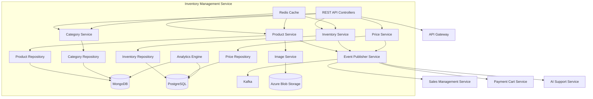
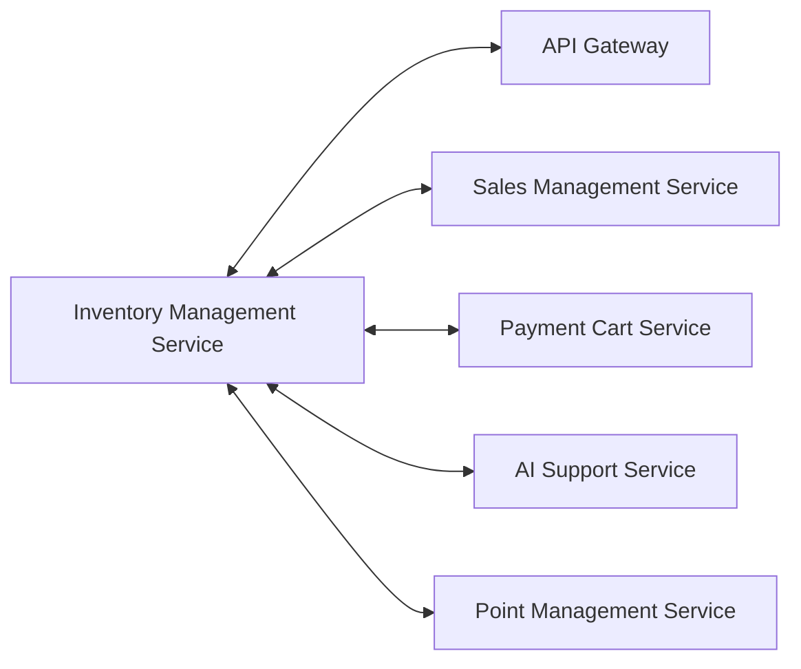
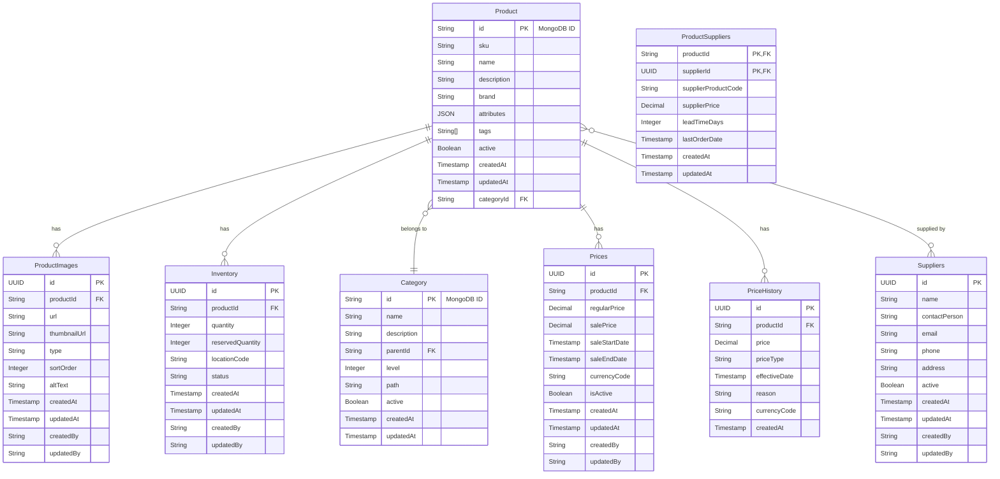
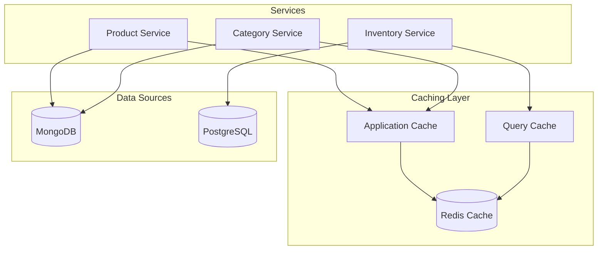

# Inventory Management Service - Detailed Design Document

## 1. Overview

The Inventory Management Service is a comprehensive microservice that manages the entire product lifecycle and inventory operations for the ski shop application. It handles product catalog management, inventory tracking, stock level monitoring, pricing management, and provides comprehensive APIs for inventory operations, product search, and category management. The service ensures real-time inventory accuracy across all sales channels while maintaining high performance through strategic caching and event-driven architecture.

## 2. Technology Stack

### Development Environment

- **Language**: Java 21 (LTS)
- **Framework**: Spring Boot 3.2.3
- **Build Tool**: Maven 3.9.x
- **Containerization**: Docker 25.x
- **Testing**: JUnit 5.10.1, Spring Boot Test, Testcontainers 1.19.3

### Production Environment

- Azure Container Apps
- Azure Cosmos DB (MongoDB API)
- Azure Database for PostgreSQL
- Azure Blob Storage

### Major Libraries and Versions

| Library | Version | Purpose |
|---------|---------|---------|
| spring-boot-starter-data-jpa | 3.2.3 | PostgreSQL JPA Data Access |
| spring-boot-starter-data-mongodb | 3.2.3 | MongoDB Data Access |
| spring-boot-starter-web | 3.2.3 | REST API Endpoints |
| spring-boot-starter-validation | 3.2.3 | Input Validation |
| spring-boot-starter-security | 3.2.3 | OAuth2 Resource Server |
| spring-boot-starter-actuator | 3.2.3 | Health Check, Metrics |
| spring-cloud-starter-stream-kafka | 4.1.0 | Event Publishing/Subscribing |
| spring-boot-starter-cache | 3.2.3 | Caching Functionality |
| spring-boot-starter-data-redis | 3.2.3 | Redis Cache |
| hibernate-core | 6.4.1 | ORM Mapping |
| postgresql | 42.7.1 | PostgreSQL JDBC Driver |
| flyway-core | 9.22.3 | Database Migration |
| mapstruct | 1.5.5.Final | Object Mapping |
| lombok | 1.18.30 | Boilerplate Code Reduction |
| micrometer-registry-prometheus | 1.12.2 | Metrics Collection |
| springdoc-openapi-starter-webmvc-ui | 2.3.0 | API Documentation |
| azure-storage-blob | 12.24.1 | Azure Blob Storage Integration |
| azure-identity | 1.11.1 | Azure Authentication |

## 3. System Architecture

### Component Architecture Diagram



### Microservice Relationship Diagram



### Class Structure

#### Key Classes

#### Controller Layer

- `ProductController`: REST API endpoints for product-related operations
- `CategoryController`: REST API endpoints for category-related operations
- `InventoryController`: REST API endpoints for inventory-related operations

#### Service Layer

- `ProductService`: Business logic for product-related operations
- `CategoryService`: Business logic for category-related operations
- `InventoryService`: Business logic for inventory-related operations
- `EventPublisherService`: Event publishing to Kafka

#### Repository Layer

**MongoDB Repositories** (package: `com.skishop.inventory.repository.mongo`)

- `ProductRepository`: Product data access (MongoDB)
- `CategoryRepository`: Category data access (MongoDB)

**JPA Repositories** (package: `com.skishop.inventory.repository.jpa`)

- `InventoryRepository`: Inventory data access (PostgreSQL)
- `PriceRepository`: Price data access (PostgreSQL)

#### Models

##### MongoDB Entities (package: `com.skishop.inventory.entity.mongo`)

- `Product`: Product entity (MongoDB document)
- `Category`: Category entity (MongoDB document)

##### JPA Entities (package: `com.skishop.inventory.entity.jpa`)

- `Inventory`: Inventory entity (PostgreSQL table)
- `Price`: Price entity (PostgreSQL table)
- `ProductImage`: Product image entity (PostgreSQL table)

#### DTOs (Java 21 Records)

- `ProductDTO`: Product data transfer object using Java 21 record
- `CategoryDTO`: Category data transfer object using Java 21 record
- `ProductImageDTO`: Product image data transfer object using Java 21 record

#### Request DTOs (package: `com.skishop.inventory.dto.request`)

- `ProductCreateRequest`: Request DTO for product creation
- `CategoryCreateRequest`: Request DTO for category creation
- `CategoryUpdateRequest`: Request DTO for category update

#### Mappers (MapStruct)

- `ProductMapper`: MapStruct mapping between product entities and DTOs
- `CategoryMapper`: MapStruct mapping between category entities and DTOs

#### Configuration

- `MongoConfig`: MongoDB configuration
- `CacheConfig`: Redis cache configuration
- `KafkaConfig`: Kafka configuration

#### Exception Handling (Java 21 Sealed Classes)

- `InventoryException`: Base sealed exception class for inventory-related errors
- `ResourceNotFoundException`: Custom exception for resource not found
- `InsufficientStockException`: Custom exception for insufficient stock
- `DuplicateResourceException`: Custom exception for duplicate resources

**Note**: The service uses Java 21 sealed classes for exception handling, providing type-safe error handling with compile-time guarantees.

## 4. Data Model

### Entity Relationship Diagram



## Database Schema

### MongoDB Collections

#### products collection

```javascript
{
  "_id": ObjectId("..."),
  "sku": "SKI-ATOMIC-001",
  "name": "Atomic Bent 100 Ski",
  "description": "The Atomic Bent 100 is a versatile all-mountain ski...",
  "brand": "Atomic",
  "attributes": {
    "length": "180cm",
    "width": "100mm",
    "color": "Red/Black",
    "material": "Wood core with carbon inserts",
    "yearModel": "2025"
  },
  "tags": ["all-mountain", "powder", "freeride", "2025-model"],
  "categoryId": "61f7c8a53e5c74a9a2f22b01",
  "active": true,
  "createdAt": ISODate("2025-01-15T09:30:00Z"),
  "updatedAt": ISODate("2025-06-01T10:15:00Z")
}
```

#### categories collection

```javascript
{
  "_id": ObjectId("..."),
  "name": "Skis",
  "description": "Alpine and all-mountain skis",
  "parentId": "61f7c8a53e5c74a9a2f22b00",
  "level": 2,
  "path": "/ski-equipment/skis",
  "active": true,
  "createdAt": ISODate("2025-01-01T00:00:00Z"),
  "updatedAt": ISODate("2025-01-01T00:00:00Z")
}
```

### PostgreSQL Tables

#### inventory table

| Column | Data Type | Constraints | Description |
|--------|-----------|-------------|-------------|
| id | UUID | PK | Inventory ID |
| product_id | VARCHAR(255) | NOT NULL | Product ID (MongoDB reference) |
| quantity | INTEGER | NOT NULL, DEFAULT 0 | Available quantity |
| reserved_quantity | INTEGER | NOT NULL, DEFAULT 0 | Reserved quantity |
| location_code | VARCHAR(20) | NOT NULL | Storage location |
| status | VARCHAR(50) | NOT NULL, DEFAULT 'IN_STOCK' | Inventory status |
| created_at | TIMESTAMP | NOT NULL | Created timestamp |
| updated_at | TIMESTAMP | NOT NULL | Updated timestamp |
| created_by | VARCHAR(255) | NULL | Created by user |
| updated_by | VARCHAR(255) | NULL | Updated by user |

#### prices table

| Column | Data Type | Constraints | Description |
|--------|-----------|-------------|-------------|
| id | UUID | PK | Price ID |
| product_id | VARCHAR(255) | NOT NULL | Product ID (MongoDB reference) |
| regular_price | DECIMAL(10,2) | NOT NULL | Regular price |
| sale_price | DECIMAL(10,2) | NULL | Sale price |
| sale_start_date | TIMESTAMP | NULL | Sale start date |
| sale_end_date | TIMESTAMP | NULL | Sale end date |
| currency_code | VARCHAR(3) | NOT NULL, DEFAULT 'JPY' | Currency code |
| is_active | BOOLEAN | NOT NULL, DEFAULT true | Active status |
| created_at | TIMESTAMP | NOT NULL | Created timestamp |
| updated_at | TIMESTAMP | NOT NULL | Updated timestamp |
| created_by | VARCHAR(255) | NULL | Created by user |
| updated_by | VARCHAR(255) | NULL | Updated by user |

#### product_images table

| Column | Data Type | Constraints | Description |
|--------|-----------|-------------|-------------|
| id | UUID | PK | Image ID |
| product_id | VARCHAR(255) | NOT NULL | Product ID (MongoDB reference) |
| url | VARCHAR(500) | NOT NULL | Image URL |
| thumbnail_url | VARCHAR(500) | NULL | Thumbnail URL |
| type | VARCHAR(50) | NOT NULL, DEFAULT 'MAIN' | Image type |
| sort_order | INTEGER | NOT NULL, DEFAULT 0 | Display order |
| alt_text | VARCHAR(200) | NULL | Alt text |
| created_at | TIMESTAMP | NOT NULL | Created timestamp |
| updated_at | TIMESTAMP | NOT NULL | Updated timestamp |
| created_by | VARCHAR(255) | NULL | Created by user |
| updated_by | VARCHAR(255) | NULL | Updated by user |

#### suppliers table

| Column | Data Type | Constraints | Description |
|--------|-----------|-------------|-------------|
| id | UUID | PK | Supplier ID |
| name | VARCHAR(255) | NOT NULL | Supplier name |
| contact_person | VARCHAR(255) | NULL | Contact person |
| email | VARCHAR(255) | NULL | Email address |
| phone | VARCHAR(50) | NULL | Phone number |
| address | TEXT | NULL | Address |
| active | BOOLEAN | NOT NULL, DEFAULT true | Active status |
| created_at | TIMESTAMP | NOT NULL | Created timestamp |
| updated_at | TIMESTAMP | NOT NULL | Updated timestamp |
| created_by | VARCHAR(255) | NULL | Created by user |
| updated_by | VARCHAR(255) | NULL | Updated by user |

#### product_suppliers table

| Column | Data Type | Constraints | Description |
|--------|-----------|-------------|-------------|
| product_id | VARCHAR(255) | PK,FK | Product ID |
| supplier_id | UUID | PK,FK | Supplier ID |
| supplier_product_code | VARCHAR(255) | NULL | Supplier's product code |
| supplier_price | DECIMAL(10,2) | NULL | Supplier price |
| lead_time_days | INTEGER | NULL | Lead time in days |
| last_order_date | TIMESTAMP | NULL | Last order date |
| created_at | TIMESTAMP | NOT NULL | Created timestamp |
| updated_at | TIMESTAMP | NOT NULL | Updated timestamp |

## Service Information

| Item | Value |
|------|-------|
| Service Name | inventory-management-service |
| Port | 8082 |
| Database | PostgreSQL (skishop_inventory), MongoDB (skishop_inventory) |
| Framework | Spring Boot 3.2.3 |
| Java Version | 21 |
| Architecture | Microservice with Event-Driven Architecture, Hybrid Database |

## 5. API Design

### REST API Endpoints

#### Product Management API

| Method | Path | Description | Parameters | Response |
|---------|-----|------------|------------|----------|
| GET | /api/products | Get product list with pagination | page, size, sortBy, sortDir | `Page<ProductDTO>` |
| GET | /api/products/{id} | Get product details by ID | id | ProductDTO |
| GET | /api/products/sku/{sku} | Get product by SKU | sku | ProductDTO |
| GET | /api/products/search | Search products by keyword | keyword, category, brand, pageable | `Page<ProductDTO>` |
| GET | /api/products/category/{categoryId} | Get products by category | categoryId, pageable | `Page<ProductDTO>` |
| POST | /api/products | Create new product | ProductCreateRequest | ProductDTO |
| POST | /api/products/batch | Get multiple products by IDs | List of productIds | `List<ProductDTO>` |

#### Category Management API

| Method | Path | Description | Parameters | Response |
|---------|-----|------------|------------|----------|
| GET | /api/categories | Get category list with pagination | page, size, name | `Page<CategoryDTO>` |
| GET | /api/categories/{id} | Get category details by ID | id | CategoryDTO |
| GET | /api/categories/{id}/products | Get products in category | id, pageable | `Page<ProductDTO>` |
| POST | /api/categories | Create new category | CategoryCreateRequest | CategoryDTO |
| PUT | /api/categories/{id} | Update category information | id, CategoryUpdateRequest | CategoryDTO |
| DELETE | /api/categories/{id} | Delete category | id | Success Response |

#### Inventory Management API

| Method | Path | Description | Parameters | Response |
|---------|-----|------------|------------|----------|
| GET | /api/inventory/{productId} | Get product inventory information | productId | InventoryDTO |
| GET | /api/inventory/status/{productId} | Get detailed inventory status | productId | InventoryStatusDTO |
| POST | /api/inventory/batch | Get multiple inventories by product IDs | List of productIds | `List<InventoryDTO>` |
| POST | /api/inventory/reserve | Reserve inventory stock | ReserveInventoryRequest | InventoryDTO |
| POST | /api/inventory/release | Release inventory reservation | ReleaseInventoryRequest | InventoryDTO |
| POST | /api/inventory/stock-in | Process stock in (receiving) | StockInRequest | InventoryDTO |
| POST | /api/inventory/stock-out | Process stock out (adjustment) | StockOutRequest | InventoryDTO |
| GET | /api/inventory/low-stock | Get low stock products | threshold, pageable | `Page<InventoryDTO>` |

#### Price Management API

| Method | Path | Description | Parameters | Response |
|---------|-----|------------|------------|----------|
| GET | /api/prices/{productId} | Get product pricing information | productId | PriceDTO |
| POST | /api/prices | Create/update product price | PriceCreateRequest | PriceDTO |
| PUT | /api/prices/{productId} | Update product price | productId, PriceUpdateRequest | PriceDTO |
| GET | /api/prices/history/{productId} | Get price history | productId, pageable | `Page<PriceHistoryDTO>` |

### Implementation Notes

- **Authentication**: All write operations require appropriate role-based authentication
- **Java 21 Features**: The service leverages Java 21's modern features including records, switch expressions, and pattern matching
- **Hybrid Database**: MongoDB for flexible product/category data, PostgreSQL for structured inventory/pricing data
- **Caching**: Intelligent caching strategy for frequently accessed data
- **Event-Driven**: Publishes events for inventory changes, price updates, and product modifications

### API Request & Response Examples

#### Product List Request

```http
GET /api/products?category=ski&page=0&size=10 HTTP/1.1
```

#### Product List Response

```http
HTTP/1.1 200 OK
Content-Type: application/json

{
  "content": [
    {
      "id": "61f7c8a53e5c74a9a2f22b8b",
      "sku": "SKI-ATOMIC-001",
      "name": "Atomic Bent 100 Ski",
      "description": "The Atomic Bent 100 is a versatile all-mountain ski that delivers...",
      "brand": "Atomic",
      "attributes": {
        "length": "180cm",
        "width": "100mm",
        "color": "Red/Black",
        "material": "Wood core with carbon inserts",
        "yearModel": "2025"
      },
      "price": {
        "regularPrice": 65000,
        "salePrice": 58500,
        "currencyCode": "JPY",
        "onSale": true
      },
      "inventory": {
        "status": "IN_STOCK",
        "quantity": 15
      },
      "category": {
        "id": "61f7c8a53e5c74a9a2f22b01",
        "name": "Skis"
      },
      "imageUrl": "https://storage.skieshop.com/products/atomic-bent-100-main.jpg",
      "active": true
    },
    // Other products...
  ],
  "pageable": {
    "pageNumber": 0,
    "pageSize": 10,
    "sort": {
      "sorted": true,
      "unsorted": false
    }
  },
  "totalElements": 42,
  "totalPages": 5,
  "last": false,
  "first": true,
  "size": 10,
  "number": 0
}
```

#### Product Details Request

```http
GET /api/products/61f7c8a53e5c74a9a2f22b8b HTTP/1.1
```

#### Product Details Response

```http
HTTP/1.1 200 OK
Content-Type: application/json

{
  "id": "61f7c8a53e5c74a9a2f22b8b",
  "sku": "SKI-ATOMIC-001",
  "name": "Atomic Bent 100 Ski",
  "description": "The Atomic Bent 100 is a versatile all-mountain ski that delivers exceptional performance across various snow conditions. With a 100mm waist and rockered tip and tail, it floats effortlessly in powder while maintaining stability on groomed runs. The lightweight wood core with carbon inserts provides the perfect balance of strength and flexibility.",
  "brand": "Atomic",
  "attributes": {
    "length": "180cm",
    "width": "100mm",
    "color": "Red/Black",
    "material": "Wood core with carbon inserts",
    "yearModel": "2025",
    "skill": "Intermediate to Advanced",
    "terrain": "All Mountain",
    "flex": "Medium",
    "radius": "19m"
  },
  "price": {
    "regularPrice": 65000,
    "salePrice": 58500,
    "currencyCode": "JPY",
    "onSale": true,
    "saleStartDate": "2025-06-01T00:00:00Z",
    "saleEndDate": "2025-07-31T23:59:59Z"
  },
  "inventory": {
    "status": "IN_STOCK",
    "quantity": 15,
    "availableSizes": ["170cm", "180cm", "190cm"]
  },
  "category": {
    "id": "61f7c8a53e5c74a9a2f22b01",
    "name": "Skis",
    "path": "Ski Equipment/Skis"
  },
  "images": [
    {
      "id": "61f7c8a53e5c74a9a2f33c01",
      "url": "https://storage.skieshop.com/products/atomic-bent-100-main.jpg",
      "thumbnailUrl": "https://storage.skieshop.com/products/thumbnails/atomic-bent-100-main.jpg",
      "altText": "Atomic Bent 100 Side View",
      "sortOrder": 1
    },
    {
      "id": "61f7c8a53e5c74a9a2f33c02",
      "url": "https://storage.skieshop.com/products/atomic-bent-100-bottom.jpg",
      "thumbnailUrl": "https://storage.skieshop.com/products/thumbnails/atomic-bent-100-bottom.jpg",
      "altText": "Atomic Bent 100 Bottom View",
      "sortOrder": 2
    }
  ],
  "tags": ["all-mountain", "powder", "freeride", "2025-model"],
  "active": true,
  "createdAt": "2025-01-15T09:30:00Z",
  "updatedAt": "2025-06-01T10:15:00Z"
}
```

## 6. Event Design

### Published Events

| Event Name | Description | Payload | Topic |
|-----------|-------------|---------|-------|
| ProductCreated | Published when product is created | Product ID, SKU, name, category, created timestamp | inventory.products |
| ProductUpdated | Published when product information is updated | Product ID, updated fields, updated timestamp | inventory.products |
| ProductDeleted | Published when product is deleted | Product ID, deleted timestamp | inventory.products |
| InventoryUpdated | Published when inventory quantity is updated | Product ID, new quantity, update reason, updated timestamp | inventory.levels |
| InventoryLow | Published when inventory is low | Product ID, remaining quantity, threshold, timestamp | inventory.alerts |
| InventoryOutOfStock | Published when inventory is out of stock | Product ID, timestamp | inventory.alerts |
| InventoryReserved | Published when inventory is reserved | Product ID, reserved quantity, reservation ID, timestamp | inventory.reservations |
| PriceUpdated | Published when price is updated | Product ID, old price, new price, updated timestamp | inventory.pricing |
| PriceSaleStarted | Published when sale starts | Product ID, regular price, sale price, start timestamp, end timestamp | inventory.pricing |
| PriceSaleEnded | Published when sale ends | Product ID, regular price, sale price, end timestamp | inventory.pricing |

### Subscribed Events

| Event Name | Description | Source Service | Action |
|-----------|-------------|----------------|--------|
| OrderCreated | Subscribed when order is created | Sales Management Service | Reserve inventory |
| OrderCompleted | Subscribed when order is completed | Sales Management Service | Confirm inventory decrease |
| OrderCancelled | Subscribed when order is cancelled | Sales Management Service | Release inventory reservation |
| ShipmentCompleted | Subscribed when shipment is completed | Sales Management Service | Update actual inventory count |
| ReturnProcessed | Subscribed when return is processed | Sales Management Service | Restore inventory |

### Event Schema Examples

#### InventoryUpdated Event

```json
{
  "eventId": "3e7f8c9a-2d56-4e78-9b12-f67abc890de1",
  "eventType": "InventoryUpdated",
  "timestamp": "2025-07-03T14:30:00Z",
  "version": "1.0",
  "payload": {
    "productId": "61f7c8a53e5c74a9a2f22b8b",
    "sku": "SKI-ATOMIC-001",
    "previousQuantity": 10,
    "newQuantity": 15,
    "reason": "STOCK_IN",
    "locationCode": "TOKYO_WH",
    "updatedAt": "2025-07-03T14:30:00Z",
    "referenceId": "PO-2025-0703-001"
  }
}
```

#### ProductCreated Event

```json
{
  "eventId": "f8e9d1c2-4a5b-6c7d-8e9f-0a1b2c3d4e5f",
  "eventType": "ProductCreated",
  "timestamp": "2025-07-03T14:30:00Z",
  "version": "1.0",
  "payload": {
    "productId": "61f7c8a53e5c74a9a2f22b8b",
    "sku": "SKI-ATOMIC-001",
    "name": "Atomic Bent 100 Ski",
    "brand": "Atomic",
    "categoryId": "61f7c8a53e5c74a9a2f22b01",
    "categoryName": "Skis",
    "createdAt": "2025-07-03T14:30:00Z"
  }
}
```

## 7. Security Design

### Authentication & Authorization

- JWT token-based authentication
- Role-based access control (RBAC)
- Authorization filters using Spring Security
- Separation of public/private APIs

### Data Protection

- Data in transit encrypted with TLS 1.3
- Encryption of sensitive data using keys managed by Azure Key Vault
- Database access based on principle of least privilege
- Access restrictions for sensitive pricing and inventory information

### API Security

- Implementation of rate limiting
- Proper CORS configuration
- Input validation and sanitization
- SQL injection protection (using JPA/MongoDB repositories)
- Cross-site scripting (XSS) protection

### Image Security

- Secure file upload validation
- File type and size restrictions
- Image metadata removal
- Access control using Azure Blob Storage SAS tokens

## 8. Configuration

### Application Configuration

Key configuration properties in `application.yml`:

```yaml
# Spring Boot Configuration
server:
  port: 8082

spring:
  application:
    name: inventory-management-service
  profiles:
    active: local
  
  # MongoDB Configuration (for Product and Category)
  data:
    mongodb:
      host: localhost
      port: 27017
      database: skishop_inventory
      auto-index-creation: true
  
  # PostgreSQL Configuration (for Inventory and Price)
  datasource:
    url: jdbc:postgresql://localhost:5432/skishop_inventory
    username: postgres
    password: postgres
    driver-class-name: org.postgresql.Driver
    hikari:
      maximum-pool-size: 20
      minimum-idle: 5
      connection-timeout: 30000
      idle-timeout: 600000
      max-lifetime: 1800000
  
  # JPA Configuration
  jpa:
    hibernate:
      ddl-auto: validate
    show-sql: false
    properties:
      hibernate:
        dialect: org.hibernate.dialect.PostgreSQLDialect
        format_sql: true
        jdbc:
          batch_size: 25
        order_inserts: true
        order_updates: true
  
  # Flyway Configuration
  flyway:
    enabled: true
    locations: classpath:db/migration
    baseline-on-migrate: true
    validate-on-migrate: true
  
  # Redis Cache Configuration
  redis:
    host: localhost
    port: 6379
    password: redis_password
    timeout: 2000ms
    lettuce:
      pool:
        max-active: 8
        max-idle: 8
        min-idle: 0
  
  # Cache Configuration
  cache:
    type: redis
    redis:
      time-to-live: 600000  # 10 minutes
      cache-null-values: false
  
  # Kafka Configuration
  cloud:
    stream:
      kafka:
        binder:
          brokers: localhost:9092
          auto-create-topics: true
        bindings:
          inventory-events:
            destination: inventory-events
            content-type: application/json
          product-events:
            destination: product-events
            content-type: application/json
  
  # Security Configuration
  security:
    oauth2:
      resourceserver:
        jwt:
          issuer-uri: https://login.microsoftonline.com/{tenant-id}/v2.0
          audiences: api://inventory-service

# Management and Monitoring
management:
  endpoints:
    web:
      exposure:
        include: health,info,metrics,prometheus
  endpoint:
    health:
      show-details: always
  metrics:
    export:
      prometheus:
        enabled: true
  health:
    mongo:
      enabled: true
    redis:
      enabled: true

# Application-specific Configuration
inventory:
  cache:
    enabled: true
    default-ttl: 600  # 10 minutes
    product-ttl: 1800  # 30 minutes for products
    category-ttl: 3600  # 1 hour for categories
  
  events:
    enabled: true
    retry:
      max-attempts: 3
      delay: 1000
  
  image:
    upload:
      max-size: 10MB
      allowed-types: jpg,jpeg,png,webp
      storage-path: /uploads/products
  
  inventory:
    low-stock-threshold: 10
    auto-reorder-enabled: false
    reservation-timeout: 900  # 15 minutes

# Logging Configuration
logging:
  level:
    com.skishop.inventory: INFO
    org.springframework.web: DEBUG
    org.springframework.data: DEBUG
  pattern:
    console: "%d{yyyy-MM-dd HH:mm:ss.SSS} [%thread] %-5level [%X{traceId},%X{spanId}] %logger{36} - %msg%n"
    file: "%d{yyyy-MM-dd HH:mm:ss.SSS} [%thread] %-5level [%X{traceId},%X{spanId}] %logger{36} - %msg%n"
  file:
    name: logs/inventory-management.log
    max-size: 100MB
    max-history: 30
```

### Environment-Specific Configuration

For production deployment, override configurations using environment variables:

```bash
# Database Configuration
SPRING_DATASOURCE_URL=jdbc:postgresql://prod-db:5432/skishop_inventory
SPRING_DATASOURCE_USERNAME=${DB_USERNAME}
SPRING_DATASOURCE_PASSWORD=${DB_PASSWORD}
SPRING_DATA_MONGODB_HOST=${MONGODB_HOST}
SPRING_DATA_MONGODB_PORT=${MONGODB_PORT}
SPRING_DATA_MONGODB_DATABASE=${MONGODB_DATABASE}

# Redis Configuration
SPRING_REDIS_HOST=${REDIS_HOST}
SPRING_REDIS_PASSWORD=${REDIS_PASSWORD}

# Kafka Configuration
SPRING_CLOUD_STREAM_KAFKA_BINDER_BROKERS=${KAFKA_BROKERS}

# Security Configuration
SPRING_SECURITY_OAUTH2_RESOURCESERVER_JWT_ISSUER_URI=${JWT_ISSUER_URI}

# Azure Configuration
AZURE_STORAGE_ACCOUNT_NAME=${STORAGE_ACCOUNT_NAME}
AZURE_STORAGE_ACCOUNT_KEY=${STORAGE_ACCOUNT_KEY}
```

## 9. Caching Strategy

### Cache Architecture



### Cache Configuration

#### Product Cache

```java
@Cacheable(value = "products", key = "#id", unless = "#result == null")
public ProductDTO getProductById(String id) {
    // Implementation
}

@CacheEvict(value = "products", key = "#productId")
public void updateProduct(String productId, ProductUpdateRequest request) {
    // Implementation
}
```

#### Category Cache

```java
@Cacheable(value = "categories", key = "'all'", unless = "#result.isEmpty()")
public List<CategoryDTO> getAllCategories() {
    // Implementation
}

@Cacheable(value = "categories", key = "#categoryId", unless = "#result == null")
public CategoryDTO getCategoryById(String categoryId) {
    // Implementation
}
```

#### Inventory Cache

```java
@Cacheable(value = "inventory", key = "#productId", unless = "#result == null")
public InventoryStatusDTO getInventoryStatus(String productId) {
    // Implementation
}

@CacheEvict(value = "inventory", key = "#productId")
public void updateInventory(String productId, InventoryUpdateRequest request) {
    // Implementation
}
```

### Cache TTL Settings

| Cache Name | TTL | Reason |
|------------|-----|---------|
| products | 30 minutes | Product data changes infrequently |
| categories | 1 hour | Category structure is relatively stable |
| inventory | 5 minutes | Inventory changes frequently |
| price | 15 minutes | Prices change moderately |
| product-search | 10 minutes | Search results should be relatively fresh |

### Cache Invalidation Strategy

1. **Time-based Expiration**: Automatic TTL-based cache eviction
2. **Event-driven Invalidation**: Cache invalidation triggered by domain events
3. **Manual Invalidation**: Administrative cache clearing endpoints
4. **Warm-up Strategy**: Pre-populate cache with frequently accessed data

## 10. Error Handling

### Error Code Design

| Error Code | HTTP Status | Description |
|------------|-------------|-------------|
| PROD_001 | 400 | Invalid request format |
| PROD_002 | 400 | Validation error |
| PROD_003 | 409 | SKU duplication |
| PROD_004 | 404 | Product not found |
| PROD_005 | 404 | Category not found |
| INV_001 | 400 | Insufficient inventory |
| INV_002 | 400 | Invalid inventory operation |
| INV_003 | 409 | Inventory already reserved |
| PRICE_001 | 400 | Invalid price setting |
| PRICE_002 | 404 | Price information not found |
| MEDIA_001 | 400 | Invalid file format |
| MEDIA_002 | 400 | File size exceeded |
| MEDIA_003 | 500 | File upload failed |

### Basic Error Response Format

```json
{
  "timestamp": "2025-06-19T14:35:00Z",
  "status": 400,
  "error": "Bad Request",
  "code": "INV_001",
  "message": "Insufficient inventory",
  "details": {
    "productId": "61f7c8a53e5c74a9a2f22b8b",
    "requestedQuantity": 10,
    "availableQuantity": 5
  },
  "path": "/api/inventory/reserve"
}
```

### Error Response Format

```json
{
  "timestamp": "2025-06-19T14:35:00Z",
  "status": 400,
  "error": "Bad Request",
  "code": "INV_001",
  "message": "Insufficient inventory",
  "details": {
    "productId": "61f7c8a53e5c74a9a2f22b8b",
    "requestedQuantity": 10,
    "availableQuantity": 5,
    "locationCode": "TOKYO_WH"
  },
  "path": "/api/inventory/reserve",
  "traceId": "3e7f8c9a-2d56-4e78-9b12-f67abc890de1"
}
```

### Exception Hierarchy

```java
// Base sealed exception (Java 21 feature)
public sealed class InventoryException extends RuntimeException
    permits ResourceNotFoundException, InsufficientStockException, 
            DuplicateResourceException, ValidationException {
    
    private final String errorCode;
    private final Map<String, Object> details;
    
    public InventoryException(String errorCode, String message, Map<String, Object> details) {
        super(message);
        this.errorCode = errorCode;
        this.details = details != null ? details : Map.of();
    }
}

// Specific exception types
public final class ResourceNotFoundException extends InventoryException {
    public ResourceNotFoundException(String resourceType, String resourceId) {
        super("RESOURCE_NOT_FOUND", 
              String.format("%s not found with id: %s", resourceType, resourceId),
              Map.of("resourceType", resourceType, "resourceId", resourceId));
    }
}

public final class InsufficientStockException extends InventoryException {
    public InsufficientStockException(String productId, int requested, int available) {
        super("INV_001", 
              "Insufficient inventory",
              Map.of("productId", productId, 
                     "requestedQuantity", requested, 
                     "availableQuantity", available));
    }
}
```

### Global Exception Handler

```java
@RestControllerAdvice
@Slf4j
public class GlobalExceptionHandler {

    @ExceptionHandler(InventoryException.class)
    public ResponseEntity<ErrorResponse> handleInventoryException(InventoryException ex) {
        log.error("Inventory exception: {}", ex.getMessage(), ex);
        
        ErrorResponse errorResponse = ErrorResponse.builder()
            .timestamp(Instant.now())
            .status(getHttpStatus(ex))
            .error(getHttpStatus(ex).getReasonPhrase())
            .code(ex.getErrorCode())
            .message(ex.getMessage())
            .details(ex.getDetails())
            .path(getCurrentPath())
            .traceId(getTraceId())
            .build();
            
        return ResponseEntity.status(getHttpStatus(ex)).body(errorResponse);
    }
    
    @ExceptionHandler(ValidationException.class)
    public ResponseEntity<ErrorResponse> handleValidationException(ValidationException ex) {
        // Handle validation errors with field-specific details
    }
    
    @ExceptionHandler(DataIntegrityViolationException.class)
    public ResponseEntity<ErrorResponse> handleDataIntegrityViolation(DataIntegrityViolationException ex) {
        // Handle database constraint violations
    }
}
```

### Circuit Breaker Configuration

```java
@Component
public class ExternalServiceCircuitBreaker {
    
    @CircuitBreaker(name = "inventory-check", fallbackMethod = "fallbackInventoryCheck")
    @Retry(name = "inventory-check")
    @TimeLimiter(name = "inventory-check")
    public CompletableFuture<InventoryStatus> checkInventory(String productId) {
        return CompletableFuture.supplyAsync(() -> {
            // External inventory check implementation
        });
    }
    
    public CompletableFuture<InventoryStatus> fallbackInventoryCheck(String productId, Exception ex) {
        log.warn("Fallback triggered for inventory check: {}", productId, ex);
        return CompletableFuture.completedFuture(
            InventoryStatus.builder()
                .productId(productId)
                .status(InventoryStatusType.UNKNOWN)
                .message("Service temporarily unavailable")
                .build()
        );
    }
}
```

## 11. Performance Optimization

### Database Optimization

#### MongoDB Indexing Strategy

```javascript
// Product collection indexes
db.products.createIndex({ "sku": 1 }, { unique: true })
db.products.createIndex({ "categoryId": 1 })
db.products.createIndex({ "brand": 1 })
db.products.createIndex({ "tags": 1 })
db.products.createIndex({ "active": 1 })
db.products.createIndex({ "createdAt": -1 })
db.products.createIndex({ 
  "name": "text", 
  "description": "text", 
  "brand": "text" 
}, { 
  name: "product_search_index",
  weights: { "name": 3, "brand": 2, "description": 1 }
})

// Category collection indexes
db.categories.createIndex({ "parentId": 1 })
db.categories.createIndex({ "level": 1 })
db.categories.createIndex({ "path": 1 })
db.categories.createIndex({ "active": 1 })
```

#### PostgreSQL Indexing Strategy

```sql
-- Inventory table indexes
CREATE INDEX idx_inventory_product_id ON inventory(product_id);
CREATE INDEX idx_inventory_location ON inventory(location_code);
CREATE INDEX idx_inventory_status ON inventory(status);
CREATE INDEX idx_inventory_updated_at ON inventory(updated_at);
CREATE INDEX idx_inventory_product_location ON inventory(product_id, location_code);

-- Price table indexes
CREATE INDEX idx_price_product_id ON price(product_id);
CREATE INDEX idx_price_active ON price(is_active);
CREATE INDEX idx_price_sale_dates ON price(sale_start_date, sale_end_date);
CREATE INDEX idx_price_updated_at ON price(updated_at);

-- Product image indexes
CREATE INDEX idx_product_image_product_id ON product_image(product_id);
CREATE INDEX idx_product_image_sort_order ON product_image(product_id, sort_order);
```

### Query Optimization

#### Efficient Product Search

```java
@Service
public class ProductSearchService {
    
    @Cacheable(value = "product-search", key = "#searchCriteria.cacheKey()")
    public Page<ProductDTO> searchProducts(ProductSearchCriteria searchCriteria, Pageable pageable) {
        // Use MongoDB aggregation pipeline for complex searches
        Aggregation aggregation = Aggregation.newAggregation(
            match(buildSearchCriteria(searchCriteria)),
            lookup("categories", "categoryId", "_id", "category"),
            unwind("category", true),
            sort(Sort.by(getSortDirection(searchCriteria), getSortField(searchCriteria))),
            skip(pageable.getOffset()),
            limit(pageable.getPageSize())
        );
        
        return mongoTemplate.aggregate(aggregation, "products", Product.class)
            .getMappedResults()
            .stream()
            .map(productMapper::toDTO)
            .collect(Collectors.toList());
    }
}
```

#### Batch Operations

```java
@Service
public class BatchInventoryService {
    
    @Transactional
    public List<InventoryDTO> updateInventoriesBatch(List<InventoryUpdateRequest> requests) {
        // Batch update for better performance
        List<Inventory> inventories = requests.stream()
            .map(this::buildInventoryUpdate)
            .collect(Collectors.toList());
            
        List<Inventory> saved = inventoryRepository.saveAll(inventories);
        
        // Publish batch events
        eventPublisherService.publishInventoryBatchUpdate(saved);
        
        return saved.stream()
            .map(inventoryMapper::toDTO)
            .collect(Collectors.toList());
    }
}
```

### Connection Pool Optimization

```yaml
spring:
  datasource:
    hikari:
      maximum-pool-size: 20
      minimum-idle: 5
      connection-timeout: 30000
      idle-timeout: 600000
      max-lifetime: 1800000
      leak-detection-threshold: 60000
  
  data:
    mongodb:
      uri: mongodb://localhost:27017/ski_shop_inventory?maxPoolSize=20&minPoolSize=5&maxIdleTimeMS=300000
```

### Response Time Optimization

#### Pagination Best Practices

```java
@GetMapping("/products")
public ResponseEntity<Page<ProductDTO>> getProducts(
    @RequestParam(defaultValue = "0") int page,
    @RequestParam(defaultValue = "20") int size,
    @RequestParam(defaultValue = "createdAt") String sortBy,
    @RequestParam(defaultValue = "desc") String sortDir) {
    
    // Limit page size to prevent memory issues
    size = Math.min(size, 100);
    
    Sort sort = Sort.by(
        "desc".equalsIgnoreCase(sortDir) ? Sort.Direction.DESC : Sort.Direction.ASC,
        sortBy
    );
    
    Pageable pageable = PageRequest.of(page, size, sort);
    Page<ProductDTO> products = productService.getProducts(pageable);
    
    return ResponseEntity.ok(products);
}
```

## 12. Monitoring and Observability

### Metrics Collection

#### Custom Metrics

```java
@Component
public class InventoryMetrics {
    
    private final Counter inventoryUpdates;
    private final Timer inventoryCheckDuration;
    private final Gauge lowStockProducts;
    
    public InventoryMetrics(MeterRegistry meterRegistry) {
        this.inventoryUpdates = Counter.builder("inventory.updates")
            .description("Number of inventory updates")
            .tag("service", "inventory-management")
            .register(meterRegistry);
            
        this.inventoryCheckDuration = Timer.builder("inventory.check.duration")
            .description("Duration of inventory checks")
            .register(meterRegistry);
            
        this.lowStockProducts = Gauge.builder("inventory.low_stock.count")
            .description("Number of products with low stock")
            .register(meterRegistry, this, InventoryMetrics::getLowStockCount);
    }
    
    public void recordInventoryUpdate(String operation) {
        inventoryUpdates.increment(Tags.of("operation", operation));
    }
    
    public Timer.Sample startInventoryCheck() {
        return Timer.start(inventoryCheckDuration);
    }
    
    private double getLowStockCount() {
        return inventoryService.getLowStockProductCount();
    }
}
```

#### Health Checks

```java
@Component
public class InventoryHealthIndicator implements HealthIndicator {
    
    private final ProductRepository productRepository;
    private final InventoryRepository inventoryRepository;
    
    @Override
    public Health health() {
        try {
            // Check MongoDB connectivity
            long productCount = productRepository.count();
            
            // Check PostgreSQL connectivity  
            long inventoryCount = inventoryRepository.count();
            
            // Check critical business metrics
            long lowStockCount = inventoryRepository.countByQuantityLessThan(10);
            
            return Health.up()
                .withDetail("products", productCount)
                .withDetail("inventories", inventoryCount)
                .withDetail("lowStockAlerts", lowStockCount)
                .withDetail("lastCheck", Instant.now())
                .build();
                
        } catch (Exception e) {
            return Health.down()
                .withDetail("error", e.getMessage())
                .withDetail("lastCheck", Instant.now())
                .build();
        }
    }
}
```

### Logging Strategy

#### Structured Logging

```yaml
logging:
  level:
    com.skishop.inventory: INFO
    org.springframework.web: DEBUG
    org.springframework.data: DEBUG
  pattern:
    console: "%d{yyyy-MM-dd HH:mm:ss.SSS} [%thread] %-5level [%X{traceId},%X{spanId}] %logger{36} - %msg%n"
    file: "%d{yyyy-MM-dd HH:mm:ss.SSS} [%thread] %-5level [%X{traceId},%X{spanId}] %logger{36} - %msg%n"
  file:
    name: logs/inventory-management.log
    max-size: 100MB
    max-history: 30
```

#### Application Logging

```java
@Slf4j
@Service
public class InventoryService {
    
    public InventoryDTO updateInventory(String productId, InventoryUpdateRequest request) {
        log.info("Updating inventory for product: {} with quantity: {}", 
                productId, request.getQuantity());
        
        try {
            Inventory inventory = inventoryRepository.findByProductId(productId)
                .orElseThrow(() -> new InventoryNotFoundException(productId));
            
            int previousQuantity = inventory.getQuantity();
            inventory.setQuantity(request.getQuantity());
            inventory.setUpdatedAt(Instant.now());
            
            Inventory saved = inventoryRepository.save(inventory);
            
            log.info("Successfully updated inventory for product: {} from {} to {}", 
                    productId, previousQuantity, request.getQuantity());
            
            // Publish inventory update event
            eventPublisherService.publishInventoryUpdated(saved);
            
            return inventoryMapper.toDTO(saved);
            
        } catch (Exception e) {
            log.error("Failed to update inventory for product: {}", productId, e);
            throw new InventoryUpdateException("Failed to update inventory", e);
        }
    }
}
```

### Distributed Tracing

#### OpenTelemetry Configuration

```yaml
management:
  tracing:
    sampling:
      probability: 1.0
  zipkin:
    tracing:
      endpoint: http://localhost:9411/api/v2/spans
```

## 13. Testing Strategy

### Unit Testing

#### Service Layer Testing

```java
@ExtendWith(MockitoExtension.class)
class ProductServiceTest {
    
    @Mock
    private ProductRepository productRepository;
    
    @Mock
    private CategoryRepository categoryRepository;
    
    @Mock
    private ProductMapper productMapper;
    
    @InjectMocks
    private ProductService productService;
    
    @Test
    void shouldCreateProduct() {
        // Given
        CreateProductRequest request = CreateProductRequest.builder()
            .sku("SKI-TEST-001")
            .name("Test Ski")
            .description("Test Description")
            .brand("TestBrand")
            .categoryId("category-123")
            .build();
        
        Product product = Product.builder()
            .id("product-123")
            .sku("SKI-TEST-001")
            .name("Test Ski")
            .build();
        
        when(categoryRepository.existsById("category-123")).thenReturn(true);
        when(productRepository.save(any(Product.class))).thenReturn(product);
        when(productMapper.toDTO(product)).thenReturn(ProductDTO.builder()
            .id("product-123")
            .sku("SKI-TEST-001")
            .name("Test Ski")
            .build());
        
        // When
        ProductDTO result = productService.createProduct(request);
        
        // Then
        assertThat(result.getSku()).isEqualTo("SKI-TEST-001");
        assertThat(result.getName()).isEqualTo("Test Ski");
        verify(productRepository).save(any(Product.class));
    }
    
    @Test
    void shouldThrowExceptionWhenCategoryNotFound() {
        // Given
        CreateProductRequest request = CreateProductRequest.builder()
            .categoryId("non-existent-category")
            .build();
        
        when(categoryRepository.existsById("non-existent-category")).thenReturn(false);
        
        // When & Then
        assertThatThrownBy(() -> productService.createProduct(request))
            .isInstanceOf(CategoryNotFoundException.class)
            .hasMessage("Category not found: non-existent-category");
    }
}
```

#### Repository Testing

```java
@DataMongoTest
class ProductRepositoryTest {
    
    @Autowired
    private TestContainer testContainer;
    
    @Autowired
    private ProductRepository productRepository;
    
    @Test
    void shouldFindProductsByCategoryId() {
        // Given
        Product product1 = Product.builder()
            .sku("SKI-001")
            .name("Ski 1")
            .categoryId("category-123")
            .active(true)
            .build();
        
        Product product2 = Product.builder()
            .sku("SKI-002")
            .name("Ski 2")
            .categoryId("category-123")
            .active(true)
            .build();
        
        productRepository.saveAll(List.of(product1, product2));
        
        // When
        List<Product> products = productRepository.findByCategoryIdAndActiveTrue("category-123");
        
        // Then
        assertThat(products).hasSize(2);
        assertThat(products).extracting(Product::getSku)
            .containsExactlyInAnyOrder("SKI-001", "SKI-002");
    }
}
```

### Integration Testing

#### API Integration Tests

```java
@SpringBootTest(webEnvironment = SpringBootTest.WebEnvironment.RANDOM_PORT)
@Testcontainers
class ProductControllerIntegrationTest {
    
    @Container
    static MongoDBContainer mongoContainer = new MongoDBContainer("mongo:6.0")
            .withExposedPorts(27017);
    
    @Container
    static PostgreSQLContainer<?> postgresContainer = new PostgreSQLContainer<>("postgres:16")
            .withDatabaseName("testdb")
            .withUsername("test")
            .withPassword("test");
    
    @Autowired
    private TestRestTemplate restTemplate;
    
    @Autowired
    private ProductRepository productRepository;
    
    @DynamicPropertySource
    static void configureProperties(DynamicPropertyRegistry registry) {
        registry.add("spring.data.mongodb.uri", mongoContainer::getReplicaSetUrl);
        registry.add("spring.datasource.url", postgresContainer::getJdbcUrl);
        registry.add("spring.datasource.username", postgresContainer::getUsername);
        registry.add("spring.datasource.password", postgresContainer::getPassword);
    }
    
    @Test
    void shouldCreateAndRetrieveProduct() {
        // Given
        CreateProductRequest request = CreateProductRequest.builder()
            .sku("SKI-INTEGRATION-001")
            .name("Integration Test Ski")
            .description("Test Description")
            .brand("TestBrand")
            .categoryId("test-category")
            .build();
        
        // When - Create product
        ResponseEntity<ProductDTO> createResponse = restTemplate.postForEntity(
            "/api/v1/products", request, ProductDTO.class);
        
        // Then - Verify creation
        assertThat(createResponse.getStatusCode()).isEqualTo(HttpStatus.CREATED);
        assertThat(createResponse.getBody().getSku()).isEqualTo("SKI-INTEGRATION-001");
        
        String productId = createResponse.getBody().getId();
        
        // When - Retrieve product
        ResponseEntity<ProductDTO> getResponse = restTemplate.getForEntity(
            "/api/v1/products/" + productId, ProductDTO.class);
        
        // Then - Verify retrieval
        assertThat(getResponse.getStatusCode()).isEqualTo(HttpStatus.OK);
        assertThat(getResponse.getBody().getName()).isEqualTo("Integration Test Ski");
    }
}
```

### Performance Testing

#### Load Testing with JMeter

```xml
<?xml version="1.0" encoding="UTF-8"?>
<jmeterTestPlan version="1.2">
  <hashTree>
    <TestPlan testname="Inventory Management Load Test">
      <elementProp name="TestPlan.arguments" elementType="Arguments"/>
      <stringProp name="TestPlan.user_define_classpath"></stringProp>
      <boolProp name="TestPlan.functional_mode">false</boolProp>
      <boolProp name="TestPlan.serialize_threadgroups">false</boolProp>
    </TestPlan>
    <hashTree>
      <ThreadGroup testname="Product API Load Test">
        <stringProp name="ThreadGroup.num_threads">100</stringProp>
        <stringProp name="ThreadGroup.ramp_time">60</stringProp>
        <stringProp name="ThreadGroup.duration">300</stringProp>
        <stringProp name="ThreadGroup.delay"></stringProp>
        <boolProp name="ThreadGroup.scheduler">true</boolProp>
      </ThreadGroup>
    </hashTree>
  </hashTree>
</jmeterTestPlan>
```

### Test Coverage Requirements

| Test Type | Coverage Target | Tools |
|-----------|----------------|--------|
| Unit Tests | 80% | JUnit 5, Mockito, AssertJ |
| Integration Tests | 70% | Spring Boot Test, Testcontainers |
| API Tests | 90% | REST Assured, WireMock |
| Performance Tests | Critical paths | JMeter, Gatling |

## 14. Deployment

### Container Configuration

#### Dockerfile

```dockerfile
FROM openjdk:21-jdk-slim as builder

WORKDIR /app
COPY pom.xml .
COPY src ./src

RUN ./mvnw clean package -DskipTests

FROM openjdk:21-jdk-slim

RUN addgroup --system spring && adduser --system spring --ingroup spring
USER spring:spring

WORKDIR /app

COPY --from=builder /app/target/inventory-management-service-*.jar app.jar

EXPOSE 8082

HEALTHCHECK --interval=30s --timeout=3s --start-period=30s --retries=3 \
  CMD curl -f http://localhost:8082/actuator/health || exit 1

ENTRYPOINT ["java", "-jar", "app.jar"]
```

#### Docker Compose

```yaml
version: '3.8'

services:
  inventory-service:
    build: .
    ports:
      - "8082:8082"
    environment:
      - SPRING_PROFILES_ACTIVE=docker
      - SPRING_DATA_MONGODB_URI=mongodb://mongodb:27017/ski_shop_inventory
      - SPRING_DATASOURCE_URL=jdbc:postgresql://postgres:5432/ski_shop_inventory
      - SPRING_KAFKA_BOOTSTRAP_SERVERS=kafka:9092
      - SPRING_DATA_REDIS_HOST=redis
    depends_on:
      - mongodb
      - postgres
      - kafka
      - redis
    restart: unless-stopped
    healthcheck:
      test: ["CMD", "curl", "-f", "http://localhost:8082/actuator/health"]
      interval: 30s
      timeout: 10s
      retries: 3
      start_period: 60s

  mongodb:
    image: mongo:6.0
    ports:
      - "27017:27017"
    environment:
      - MONGO_INITDB_DATABASE=ski_shop_inventory
    volumes:
      - mongodb_data:/data/db
      - ./scripts/mongo-init.js:/docker-entrypoint-initdb.d/mongo-init.js:ro
    restart: unless-stopped

  postgres:
    image: postgres:16
    ports:
      - "5432:5432"
    environment:
      - POSTGRES_DB=ski_shop_inventory
      - POSTGRES_USER=inventory_user
      - POSTGRES_PASSWORD=inventory_pass
    volumes:
      - postgres_data:/var/lib/postgresql/data
      - ./scripts/init-postgres.sql:/docker-entrypoint-initdb.d/init.sql:ro
    restart: unless-stopped

  redis:
    image: redis:7.2-alpine
    ports:
      - "6379:6379"
    volumes:
      - redis_data:/data
    restart: unless-stopped
    command: redis-server --appendonly yes

volumes:
  mongodb_data:
  postgres_data:
  redis_data:
```

### Azure Container Apps Deployment

#### Container App Manifest

```yaml
# containerapp.yaml
properties:
  environmentId: /subscriptions/{subscription-id}/resourceGroups/{rg-name}/providers/Microsoft.App/managedEnvironments/{env-name}
  configuration:
    activeRevisionsMode: Multiple
    ingress:
      external: true
      targetPort: 8082
      allowInsecure: false
      traffic:
      - weight: 100
        latestRevision: true
    secrets:
    - name: mongodb-uri
      value: "mongodb://..."
    - name: postgres-url
      value: "postgresql://..."
    registries:
    - server: skishop.azurecr.io
      identity: /subscriptions/{subscription-id}/resourceGroups/{rg-name}/providers/Microsoft.ManagedIdentity/userAssignedIdentities/{identity-name}
  template:
    containers:
    - image: skishop.azurecr.io/inventory-management-service:latest
      name: inventory-management-service
      env:
      - name: SPRING_PROFILES_ACTIVE
        value: "azure"
      - name: SPRING_DATA_MONGODB_URI
        secretRef: mongodb-uri
      - name: SPRING_DATASOURCE_URL
        secretRef: postgres-url
      - name: SPRING_KAFKA_BOOTSTRAP_SERVERS
        value: "kafka-cluster.servicebus.windows.net:9093"
      resources:
        cpu: 0.5
        memory: 1Gi
      probes:
      - type: Liveness
        httpGet:
          path: /actuator/health/liveness
          port: 8082
        initialDelaySeconds: 60
        periodSeconds: 30
      - type: Readiness
        httpGet:
          path: /actuator/health/readiness
          port: 8082
        initialDelaySeconds: 30
        periodSeconds: 10
    scale:
      minReplicas: 2
      maxReplicas: 10
      rules:
      - name: cpu-scaling
        custom:
          type: cpu
          metadata:
            type: Utilization
            value: "70"
      - name: memory-scaling
        custom:
          type: memory
          metadata:
            type: Utilization
            value: "80"
```

#### Azure CLI Deployment Commands

```bash
# Create resource group
az group create --name rg-inventory-service --location japaneast

# Create container app environment
az containerapp env create \
  --name inventory-env \
  --resource-group rg-inventory-service \
  --location japaneast

# Create container app
az containerapp create \
  --name inventory-management-service \
  --resource-group rg-inventory-service \
  --environment inventory-env \
  --image skishop.azurecr.io/inventory-management-service:latest \
  --target-port 8082 \
  --ingress external \
  --min-replicas 2 \
  --max-replicas 10 \
  --cpu 0.5 \
  --memory 1Gi \
  --env-vars \
    SPRING_PROFILES_ACTIVE=azure \
    SPRING_KAFKA_BOOTSTRAP_SERVERS=kafka-cluster.servicebus.windows.net:9093 \
  --secrets \
    mongodb-uri="mongodb://..." \
    postgres-url="postgresql://..."

# Update container app with new image
az containerapp update \
  --name inventory-management-service \
  --resource-group rg-inventory-service \
  --image skishop.azurecr.io/inventory-management-service:${BUILD_ID}
```

#### Auto-scaling Configuration

```bash
# Configure auto-scaling rules
az containerapp revision set-mode \
  --name inventory-management-service \
  --resource-group rg-inventory-service \
  --mode Multiple

# Set scaling rules
az containerapp update \
  --name inventory-management-service \
  --resource-group rg-inventory-service \
  --scale-rule-name cpu-scaling \
  --scale-rule-type cpu \
  --scale-rule-metadata "type=Utilization" "value=70" \
  --scale-rule-auth "triggerParameter=targetValue"
```

### CI/CD Pipeline

#### GitHub Actions Workflow

```yaml
name: CI/CD Pipeline

on:
  push:
    branches: [ main, develop ]
  pull_request:
    branches: [ main ]

jobs:
  test:
    runs-on: ubuntu-latest
    steps:
    - uses: actions/checkout@v4
    
    - name: Set up JDK 21
      uses: actions/setup-java@v4
      with:
        java-version: '21'
        distribution: 'temurin'
        
    - name: Cache Maven dependencies
      uses: actions/cache@v3
      with:
        path: ~/.m2
        key: ${{ runner.os }}-m2-${{ hashFiles('**/pom.xml') }}
        
    - name: Run tests
      run: mvn clean test
      
    - name: Generate test report
      uses: dorny/test-reporter@v1
      if: success() || failure()
      with:
        name: Maven Tests
        path: target/surefire-reports/*.xml
        reporter: java-junit
        
    - name: Code coverage
      run: mvn jacoco:report
      
    - name: Upload coverage to Codecov
      uses: codecov/codecov-action@v3

  build-and-deploy:
    needs: test
    runs-on: ubuntu-latest
    if: github.ref == 'refs/heads/main'
    
    steps:
    - uses: actions/checkout@v4
    
    - name: Set up JDK 21
      uses: actions/setup-java@v4
      with:
        java-version: '21'
        distribution: 'temurin'
        
    - name: Build application
      run: mvn clean package -DskipTests
      
    - name: Login to Azure
      uses: azure/login@v1
      with:
        creds: ${{ secrets.AZURE_CREDENTIALS }}
        
    - name: Build Docker image
      run: docker build -t skishop.azurecr.io/inventory-management-service:${{ github.sha }} .
      
    - name: Push to Azure Container Registry
      run: |
        az acr login --name skishop
        docker push skishop.azurecr.io/inventory-management-service:${{ github.sha }}
        
    - name: Deploy to Azure Container Apps
      run: |
        az containerapp update \
          --name inventory-management-service \
          --resource-group rg-inventory-service \
          --image skishop.azurecr.io/inventory-management-service:${{ github.sha }}
```

## 15. Operations and Maintenance

### Health Monitoring

#### Custom Health Indicators

```java
@Component
public class BusinessHealthIndicator implements HealthIndicator {
    
    private final InventoryRepository inventoryRepository;
    private final ProductRepository productRepository;
    
    @Override
    public Health health() {
        try {
            // Check critical business metrics
            long totalProducts = productRepository.count();
            long activeProducts = productRepository.countByActiveTrue();
            long outOfStockProducts = inventoryRepository.countByQuantity(0);
            long lowStockProducts = inventoryRepository.countByQuantityBetween(1, 10);
            
            // Calculate health score
            double healthScore = calculateHealthScore(totalProducts, activeProducts, outOfStockProducts);
            
            HealthBuilder builder = healthScore > 0.8 ? Health.up() : 
                                   healthScore > 0.6 ? Health.status("DEGRADED") : 
                                   Health.down();
            
            return builder
                .withDetail("totalProducts", totalProducts)
                .withDetail("activeProducts", activeProducts)
                .withDetail("outOfStockProducts", outOfStockProducts)
                .withDetail("lowStockProducts", lowStockProducts)
                .withDetail("healthScore", healthScore)
                .withDetail("lastCheck", Instant.now())
                .build();
                
        } catch (Exception e) {
            return Health.down()
                .withDetail("error", e.getMessage())
                .withException(e)
                .build();
        }
    }
    
    private double calculateHealthScore(long total, long active, long outOfStock) {
        if (total == 0) return 0.0;
        double activeRatio = (double) active / total;
        double stockRatio = (double) (total - outOfStock) / total;
        return (activeRatio * 0.6) + (stockRatio * 0.4);
    }
}
```

### Backup and Recovery

#### Database Backup Scripts

```bash
#!/bin/bash
# MongoDB backup script

BACKUP_DIR="/backups/mongodb"
DATE=$(date +%Y%m%d_%H%M%S)
BACKUP_NAME="inventory_mongodb_$DATE"

# Create backup directory
mkdir -p $BACKUP_DIR

# MongoDB backup
mongodump --uri="mongodb://localhost:27017/ski_shop_inventory" \
          --out="$BACKUP_DIR/$BACKUP_NAME"

# Compress backup
tar -czf "$BACKUP_DIR/$BACKUP_NAME.tar.gz" -C "$BACKUP_DIR" "$BACKUP_NAME"

# Remove uncompressed backup
rm -rf "$BACKUP_DIR/$BACKUP_NAME"

# Keep only last 7 days of backups
find $BACKUP_DIR -name "inventory_mongodb_*.tar.gz" -mtime +7 -delete

echo "MongoDB backup completed: $BACKUP_NAME.tar.gz"
```

```bash
#!/bin/bash
# PostgreSQL backup script

BACKUP_DIR="/backups/postgresql"
DATE=$(date +%Y%m%d_%H%M%S)
BACKUP_NAME="inventory_postgres_$DATE.sql"

# Create backup directory
mkdir -p $BACKUP_DIR

# PostgreSQL backup
pg_dump -h localhost -U inventory_user -d ski_shop_inventory \
        --no-password --verbose --format=custom \
        --file="$BACKUP_DIR/$BACKUP_NAME"

# Compress backup
gzip "$BACKUP_DIR/$BACKUP_NAME"

# Keep only last 7 days of backups
find $BACKUP_DIR -name "inventory_postgres_*.sql.gz" -mtime +7 -delete

echo "PostgreSQL backup completed: $BACKUP_NAME.gz"
```

### Maintenance Procedures

#### Database Maintenance

```java
@Component
@Slf4j
public class DatabaseMaintenanceService {
    
    @Scheduled(cron = "0 2 * * SUN") // Every Sunday at 2 AM
    public void performWeeklyMaintenance() {
        log.info("Starting weekly database maintenance");
        
        try {
            // Clean up old audit logs
            cleanupAuditLogs();
            
            // Update database statistics
            updateDatabaseStatistics();
            
            // Reindex collections
            reindexCollections();
            
            // Cleanup orphaned records
            cleanupOrphanedRecords();
            
            log.info("Weekly database maintenance completed successfully");
            
        } catch (Exception e) {
            log.error("Weekly database maintenance failed", e);
            // Send alert to operations team
            alertService.sendMaintenanceAlert("Weekly maintenance failed", e);
        }
    }
    
    private void cleanupAuditLogs() {
        // Remove audit logs older than 90 days
        Instant cutoffDate = Instant.now().minus(90, ChronoUnit.DAYS);
        auditLogRepository.deleteByCreatedAtBefore(cutoffDate);
        log.info("Cleaned up audit logs older than {}", cutoffDate);
    }
    
    private void cleanupOrphanedRecords() {
        // Find and remove orphaned inventory records
        List<String> productIds = productRepository.findAllIds();
        List<Inventory> orphanedInventories = inventoryRepository
            .findByProductIdNotIn(productIds);
        
        if (!orphanedInventories.isEmpty()) {
            inventoryRepository.deleteAll(orphanedInventories);
            log.info("Cleaned up {} orphaned inventory records", orphanedInventories.size());
        }
    }
}
```

### Operational Runbooks

#### High Memory Usage Response

```yaml
Alert: High Memory Usage
Trigger: Memory usage > 85% for 5 minutes
Severity: Warning

Investigation Steps:
1. Check application metrics in Grafana dashboard
2. Review recent deployments and traffic patterns
3. Analyze heap dump if available
4. Check for memory leaks in custom code

Immediate Actions:
1. Scale horizontally by increasing container app replicas
2. Restart service if memory usage > 95%
3. Enable detailed memory profiling

Long-term Actions:
1. Optimize queries and caching strategies
2. Review and tune JVM memory settings
3. Identify and fix memory leaks
```

## 16. Development Environment Setup

### Prerequisites

```bash
# Required software versions
Java 21+
Maven 3.9+
Docker 24.0+
Docker Compose 2.0+
Node.js 18+ (for frontend integration)
```

### Local Development Setup

#### Step 1: Clone and Setup Repository

```bash
# Clone the repository
git clone https://github.com/skishop/inventory-management-service.git
cd inventory-management-service

# Copy environment template
cp .env.template .env

# Edit environment variables
vim .env
```

#### Step 2: Start Dependencies

```bash
# Start database and messaging services
docker-compose -f docker-compose.dev.yml up -d

# Wait for services to be ready
./scripts/wait-for-services.sh

# Initialize databases
./scripts/init-dev-data.sh
```

#### Step 3: Run Application

```bash
# Development mode with hot reload
mvn spring-boot:run -Dspring-boot.run.profiles=dev

# Or using IDE
# Set active profile: dev
# Set environment variables from .env file
# Run InventoryManagementApplication.main()
```

#### Step 4: Verify Installation

```bash
# Check application health
curl http://localhost:8082/actuator/health

# Access API documentation
open http://localhost:8082/swagger-ui.html

# Run integration tests
mvn test -P integration-tests
```

### IDE Configuration

#### IntelliJ IDEA Setup

```xml
<!-- .idea/runConfigurations/Inventory_Management_Dev.xml -->
<component name="ProjectRunConfigurationManager">
  <configuration default="false" name="Inventory Management Dev" type="SpringBootApplicationConfigurationType">
    <module name="inventory-management-service" />
    <option name="SPRING_BOOT_MAIN_CLASS" value="com.skishop.inventory.InventoryManagementApplication" />
    <option name="ACTIVE_PROFILES" value="dev" />
    <option name="PROGRAM_PARAMETERS" value="" />
    <option name="ALTERNATIVE_JRE_PATH" />
    <envs>
      <env name="SPRING_DATA_MONGODB_URI" value="mongodb://localhost:27017/ski_shop_inventory" />
      <env name="SPRING_DATASOURCE_URL" value="jdbc:postgresql://localhost:5432/ski_shop_inventory" />
    </envs>
  </configuration>
</component>
```

#### VS Code Configuration

```json
// .vscode/launch.json
{
    "version": "0.2.0",
    "configurations": [
        {
            "type": "java",
            "name": "Inventory Management Dev",
            "request": "launch",
            "mainClass": "com.skishop.inventory.InventoryManagementApplication",
            "projectName": "inventory-management-service",
            "args": "--spring.profiles.active=dev",
            "env": {
                "SPRING_DATA_MONGODB_URI": "mongodb://localhost:27017/ski_shop_inventory",
                "SPRING_DATASOURCE_URL": "jdbc:postgresql://localhost:5432/ski_shop_inventory"
            }
        }
    ]
}
```

### Development Workflow

#### Feature Development Process

```bash
# 1. Create feature branch
git checkout -b feature/add-product-variants

# 2. Make changes and test locally
mvn clean test
mvn spring-boot:run -Dspring-boot.run.profiles=dev

# 3. Run integration tests
mvn test -P integration-tests

# 4. Check code quality
mvn spotbugs:check
mvn checkstyle:check

# 5. Create pull request
git push origin feature/add-product-variants
```

#### Database Migration Process

```bash
# 1. Create new migration file
./scripts/create-migration.sh "add_product_variants_table"

# 2. Write migration SQL
vim src/main/resources/db/migration/V3__add_product_variants_table.sql

# 3. Test migration
mvn flyway:migrate -P dev

# 4. Verify migration
mvn flyway:info -P dev
```

### Troubleshooting Development Issues

#### Common Issues and Solutions

| Issue | Symptoms | Solution |
|-------|----------|----------|
| Port Already in Use | Application fails to start on port 8082 | `lsof -ti:8082 \| xargs kill -9` |
| MongoDB Connection Failed | MongoTimeoutException on startup | Check MongoDB container: `docker logs mongo-dev` |
| PostgreSQL Connection Failed | SQLException on startup | Reset PostgreSQL: `docker-compose restart postgres` |
| Maven Dependencies Issues | ClassNotFoundException | Clear cache: `mvn clean install -U` |
| Hot Reload Not Working | Changes not reflected without restart | Check IDE build settings and Spring DevTools |

## 17. Future Enhancement Plans

### Phase 1: Advanced Inventory Features (Q1)

#### Multi-Location Inventory

```java
@Entity
@Table(name = "inventory_locations")
public class InventoryLocation {
    @Id
    private UUID id;
    
    @Column(name = "product_id")
    private String productId;
    
    @Column(name = "location_code")
    private String locationCode;
    
    @Column(name = "warehouse_zone")
    private String warehouseZone;
    
    @Column(name = "quantity")
    private Integer quantity;
    
    @Column(name = "reserved_quantity")
    private Integer reservedQuantity;
    
    @Column(name = "minimum_stock_level")
    private Integer minimumStockLevel;
    
    @Column(name = "maximum_stock_level")
    private Integer maximumStockLevel;
    
    // Additional fields for advanced inventory tracking
}
```

#### Inventory Forecasting

```java
@Service
public class InventoryForecastingService {
    
    public InventoryForecast generateForecast(String productId, int daysAhead) {
        // Implement machine learning based forecasting
        // Consider seasonal trends, historical sales, events
        List<SalesData> historicalData = salesDataRepository
            .findByProductIdAndDateRange(productId, getDateRange(365));
        
        // Use time series analysis for prediction
        ForecastModel model = timeSeriesAnalyzer.buildModel(historicalData);
        
        return model.predict(daysAhead);
    }
}
```

### Phase 2: AI-Powered Features (Q2)

#### Intelligent Pricing

```java
@Service
public class IntelligentPricingService {
    
    public PricingRecommendation generatePricingRecommendation(String productId) {
        // Analyze market conditions, competitor pricing, demand patterns
        MarketData marketData = marketDataService.getMarketData(productId);
        CompetitorData competitorData = competitorAnalysisService.analyze(productId);
        DemandForecast demandForecast = demandForecastService.forecast(productId);
        
        // Use ML model to recommend optimal pricing
        return pricingMLModel.recommend(marketData, competitorData, demandForecast);
    }
}
```

#### Automated Reordering

```java
@Service
public class AutomatedReorderingService {
    
    @Scheduled(cron = "0 0 6 * * *") // Daily at 6 AM
    public void evaluateReorderPoints() {
        List<Product> products = productService.getAllActiveProducts();
        
        for (Product product : products) {
            InventoryStatus status = inventoryService.getInventoryStatus(product.getId());
            ReorderRecommendation recommendation = reorderAnalyzer
                .analyzeReorderNeed(product, status);
            
            if (recommendation.shouldReorder()) {
                createAutomaticPurchaseOrder(product, recommendation);
            }
        }
    }
}
```

### Phase 3: Advanced Analytics (Q3)

#### Real-time Inventory Analytics

```java
@Component
public class InventoryAnalytics {
    
    public InventoryInsights generateInsights(String timeframe) {
        return InventoryInsights.builder()
            .turnoverRatio(calculateTurnoverRatio(timeframe))
            .deadStockAnalysis(analyzeDeadStock())
            .fastMovingItems(identifyFastMovingItems())
            .seasonalTrends(analyzeSeasonalTrends())
            .profitabilityAnalysis(analyzeProfitability())
            .build();
    }
    
    public List<InventoryAlert> generateAlerts() {
        List<InventoryAlert> alerts = new ArrayList<>();
        
        // Low stock alerts
        alerts.addAll(generateLowStockAlerts());
        
        // Overstock alerts
        alerts.addAll(generateOverstockAlerts());
        
        // Dead stock alerts
        alerts.addAll(generateDeadStockAlerts());
        
        // Price anomaly alerts
        alerts.addAll(generatePriceAnomalyAlerts());
        
        return alerts;
    }
}
```

### Phase 4: Integration Enhancements (Q4)

#### Enhanced ERP Integration

```java
@Service
public class ERPIntegrationService {
    
    public void syncWithERP() {
        // Two-way sync with enterprise systems
        ERPSyncResult result = erpClient.synchronizeInventory();
        
        // Handle conflicts and reconciliation
        reconciliationService.resolveConflicts(result.getConflicts());
        
        // Update local inventory based on ERP data
        updateLocalInventory(result.getUpdates());
    }
}
```

#### IoT Integration for Real-time Tracking

```java
@Service
public class IoTInventoryTrackingService {
    
    @EventListener
    public void handleRFIDScanEvent(RFIDScanEvent event) {
        // Process RFID tag scans for real-time inventory updates
        String productId = rfidMappingService.getProductId(event.getTagId());
        String locationCode = event.getLocationCode();
        
        inventoryService.updateLocationTracking(productId, locationCode, event.getTimestamp());
    }
    
    @EventListener
    public void handleWeightSensorEvent(WeightSensorEvent event) {
        // Process smart shelf weight changes
        estimateQuantityChange(event);
    }
}
```

### Technology Roadmap

| Quarter | Focus Area | Key Technologies |
|---------|------------|------------------|
| Q1 2024 | Multi-location Support | PostgreSQL partitioning, Redis Cluster |
| Q2 2024 | AI/ML Features | TensorFlow, Scikit-learn, MLflow |
| Q3 2024 | Advanced Analytics | Apache Spark, ClickHouse, Grafana |
| Q4 2024 | IoT Integration | MQTT, Time Series DB, Edge Computing |

## 18. Troubleshooting Guide

### Production Issues and Solutions

#### Database Connection Issues

**Issue**: Application fails to connect to MongoDB

```bash
Error: com.mongodb.MongoTimeoutException: Timed out after 30000 ms
```

**Solution**:

```bash
# Check MongoDB status
docker logs mongodb-container

# Verify connection string
echo $SPRING_DATA_MONGODB_URI

# Test connection manually
mongosh "mongodb://localhost:27017/ski_shop_inventory"

# Restart MongoDB if needed
docker-compose restart mongodb
```

**Issue**: PostgreSQL connection pool exhausted

```bash
Error: HikariPool-1 - Connection is not available
```

**Solution**:

```yaml
# Adjust connection pool settings in application.yml
spring:
  datasource:
    hikari:
      maximum-pool-size: 25
      minimum-idle: 5
      connection-timeout: 20000
      leak-detection-threshold: 60000
```

#### Performance Issues

**Issue**: Slow product search queries

```bash
# Symptoms: Search API response time > 2 seconds
```

**Investigation**:

```bash
# Check MongoDB query performance
db.products.explain("executionStats").find({
  $text: { $search: "ski" },
  "active": true
})

# Monitor application metrics
curl http://localhost:8082/actuator/metrics/timer.http.server.requests
```

**Solution**:

```javascript
// Add compound indexes
db.products.createIndex({ 
  "active": 1, 
  "categoryId": 1, 
  "brand": 1 
})

// Enable text search index
db.products.createIndex({
  "name": "text",
  "description": "text",
  "brand": "text"
})
```

#### Memory Issues

**Issue**: OutOfMemoryError during bulk operations

```bash
Error: java.lang.OutOfMemoryError: Java heap space
```

**Solution**:

```yaml
# Increase JVM heap size
JAVA_OPTS: "-Xmx2g -Xms1g -XX:+UseG1GC"

# Optimize batch processing
spring:
  jpa:
    properties:
      hibernate:
        jdbc:
          batch_size: 100
        order_inserts: true
        order_updates: true
```

#### Event Processing Issues

**Issue**: Kafka consumer lag increasing

```bash
# Check consumer lag
kafka-consumer-groups --bootstrap-server localhost:9092 --describe --group inventory-service
```

**Solution**:

```yaml
# Tune consumer configuration
spring:
  kafka:
    consumer:
      max-poll-records: 100
      enable-auto-commit: false
      fetch-min-size: 1024
    listener:
      concurrency: 3
      ack-mode: batch
```

### Monitoring and Alerting

#### Critical Alerts

```yaml
# Grafana Alert Rules
groups:
  - name: inventory-service-alerts
    rules:
    - alert: HighErrorRate
      expr: rate(http_server_requests_seconds_count{status=~"5.."}[5m]) > 0.1
      for: 5m
      labels:
        severity: critical
      annotations:
        summary: "High error rate in inventory service"
        
    - alert: DatabaseConnectionFailure
      expr: hikaricp_connections_active / hikaricp_connections_max > 0.9
      for: 2m
      labels:
        severity: warning
      annotations:
        summary: "Database connection pool near exhaustion"
```

#### Health Check Failures

**Issue**: Application health check failing

```bash
# Check health endpoint
curl -v http://localhost:8082/actuator/health
```

**Common Causes**:

1. Database connectivity issues
2. Kafka broker unavailable
3. Redis connection timeout
4. Custom health indicator failures

**Investigation Steps**:

```bash
# Check detailed health information
curl http://localhost:8082/actuator/health/details

# Review application logs
docker logs inventory-service --tail 100

# Check system resources
docker stats inventory-service
```

### Disaster Recovery Procedures

#### Service Recovery Checklist

1. **Immediate Response** (0-15 minutes)
   - [ ] Verify incident and assess scope
   - [ ] Check monitoring dashboards
   - [ ] Review recent deployments
   - [ ] Check infrastructure status

2. **Investigation** (15-30 minutes)
   - [ ] Analyze application logs
   - [ ] Check database connectivity
   - [ ] Verify message queue status
   - [ ] Review system resources

3. **Recovery Actions** (30-60 minutes)
   - [ ] Restart failed services
   - [ ] Scale resources if needed
   - [ ] Apply hotfixes if required
   - [ ] Verify data consistency

4. **Post-Incident** (1-24 hours)
   - [ ] Conduct post-mortem review
   - [ ] Update runbooks
   - [ ] Implement preventive measures
   - [ ] Update monitoring and alerts

## 19. Summary

The Inventory Management Service is a comprehensive, production-ready microservice designed to handle all aspects of product and inventory management for the ski shop application. This design document provides a complete blueprint for building and operating a scalable, maintainable, and secure inventory management system.

### Key Architectural Decisions

#### Hybrid Database Strategy

- **MongoDB** for product catalog and categories (document-based flexibility)
- **PostgreSQL** for inventory, pricing, and transactional data (ACID compliance)
- **Redis** for caching and performance optimization

#### Event-Driven Architecture

- Asynchronous communication through Apache Kafka
- Event sourcing for inventory changes
- Eventual consistency with other microservices

#### Cloud-Native Design

- Container-first architecture with Docker and Azure Container Apps
- Horizontal scaling capabilities
- Health checks and observability built-in

### Core Capabilities

#### Product Management

- Comprehensive product catalog with flexible attributes
- Hierarchical category management
- Multi-media support with Azure Blob Storage
- SKU-based product identification

#### Inventory Control

- Real-time inventory tracking
- Multi-location support
- Automated stock level monitoring
- Reservation and allocation management

#### Pricing Management

- Dynamic pricing with sale periods
- Multi-currency support
- Price history and auditing
- Bulk pricing operations

#### Integration & Events

- RESTful API with comprehensive endpoints
- Event publishing for inventory changes
- Integration with sales, payment, and user management services
- Supplier management and procurement support

### Technical Excellence

#### Performance & Scalability

- Optimized database queries with proper indexing
- Redis caching for frequently accessed data
- Connection pooling and resource management
- Horizontal scaling support

#### Security & Compliance

- JWT-based authentication and authorization
- Role-based access control (RBAC)
- Data encryption in transit and at rest
- Input validation and sanitization
- Audit logging for compliance

#### Monitoring & Operations

- Comprehensive health checks and metrics
- Structured logging with correlation IDs
- Distributed tracing with OpenTelemetry
- Custom business metrics and alerting
- Automated deployment and scaling

#### Testing & Quality

- Multi-layer testing strategy (unit, integration, performance)
- Testcontainers for realistic integration tests
- Code coverage requirements and quality gates
- Load testing with JMeter and Gatling

### Development & Operations

#### Developer Experience

- Comprehensive API documentation with OpenAPI/Swagger
- Docker-based local development environment
- IDE configurations for IntelliJ IDEA and VS Code
- Automated code quality checks and formatting

#### Deployment & CI/CD

- GitHub Actions for automated testing and deployment
- Docker containerization with multi-stage builds
- Azure Container Apps manifests for production deployment
- Blue-green deployment strategy support

#### Maintenance & Support

- Automated backup and recovery procedures
- Database maintenance scripts and procedures
- Comprehensive troubleshooting guide
- Operational runbooks for common scenarios

### Future Roadmap

The service is designed with extensibility in mind, supporting future enhancements such as:

- **AI-Powered Features**: Intelligent pricing, demand forecasting, automated reordering
- **Advanced Analytics**: Real-time inventory insights, profitability analysis, trend detection
- **IoT Integration**: RFID tracking, smart shelves, real-time location tracking
- **Enhanced ERP Integration**: Deeper integration with enterprise systems
- **Multi-tenant Support**: SaaS capabilities for multiple ski shops

### Getting Started

The service includes comprehensive setup instructions for both development and production environments:

```bash
# Quick start for development
git clone https://github.com/skishop/inventory-management-service.git
cd inventory-management-service
docker-compose up -d
mvn spring-boot:run

# Verify installation
curl http://localhost:8082/actuator/health
open http://localhost:8082/swagger-ui.html
```

### Conclusion

This Inventory Management Service represents a modern, scalable approach to inventory management in a microservices architecture. It balances functional requirements with operational excellence, providing a solid foundation for the ski shop application while maintaining flexibility for future enhancements.

The comprehensive design addresses real-world challenges in inventory management while adhering to cloud-native principles and microservice best practices. With its robust testing strategy, monitoring capabilities, and operational procedures, the service is ready for production deployment and long-term maintenance.

---

**Document Version**: 2.0  
**Last Updated**: January 2025  
**Next Review**: April 2025
