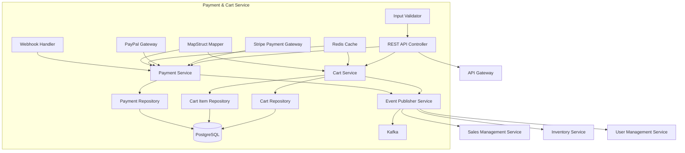
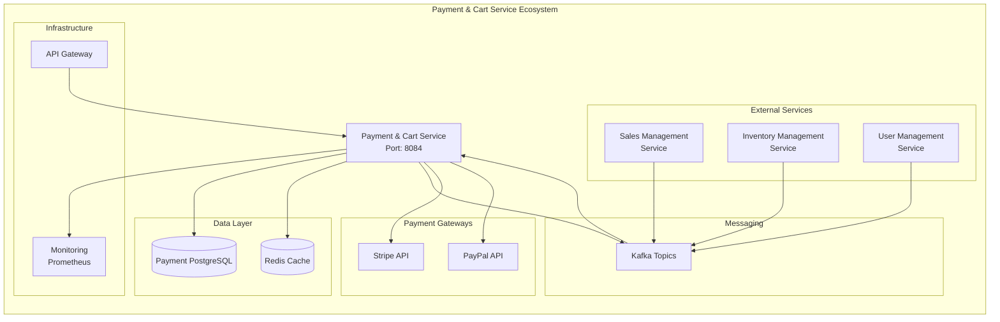
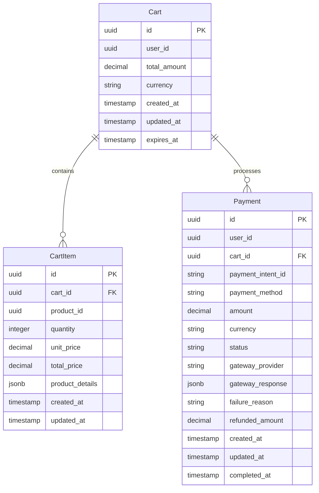

# Payment & Cart Service - Detailed Design Document

## 1. Overview

The Payment & Cart Service is a microservice that manages shopping cart functionality and payment processing for the ski shop e-commerce platform. It handles cart operations, payment gateway integration, order confirmation, payment status tracking, and provides comprehensive payment analytics. The service manages the critical conversion funnel from cart management through payment completion, ensuring secure and reliable transaction processing.

### Service Responsibilities

- **Cart Management**: Shopping cart lifecycle management with item operations
- **Payment Processing**: Secure payment gateway integration and transaction handling
- **Session Management**: Cart persistence and user session management
- **Payment Gateway Integration**: Multi-provider payment processing (Stripe primary)
- **Transaction Tracking**: Payment status monitoring and history management
- **Refund Processing**: Return and cancellation payment handling
- **Security Compliance**: PCI DSS compliance and data protection
- **Cart Expiration**: Automated cart cleanup and expiration management
- **Event Integration**: Seamless integration with order and inventory services

## 2. Technology Stack

### Development Environment

- **Language**: Java 21 (LTS)
- **Framework**: Spring Boot 3.2.3
- **Build Tool**: Maven 3.9.x
- **Containerization**: Docker 25.x
- **Testing**: JUnit 5.10.1, Spring Boot Test, Testcontainers 1.19.3

### Production Environment

- Azure Container Apps
- Azure Database for PostgreSQL
- Azure Cache for Redis
- Azure Service Bus (Kafka)

### Major Libraries and Versions

| Library | Version | Purpose |
|---------|---------|---------|
| spring-boot-starter-data-jpa | 3.2.3 | JPA data access |
| spring-boot-starter-web | 3.2.3 | REST API endpoints |
| spring-boot-starter-validation | 3.2.3 | Input validation |
| spring-boot-starter-security | 3.2.3 | Security configuration |
| spring-boot-starter-actuator | 3.2.3 | Health checks, metrics |
| spring-boot-starter-data-redis | 3.2.3 | Redis cache |
| spring-cloud-starter-stream-kafka | 4.1.0 | Event publishing/subscription |
| stripe-java | 24.16.0 | Stripe payment API |
| postgresql | runtime | PostgreSQL JDBC driver |
| flyway-core | 9.22.3 | Database migration |
| mapstruct | 1.5.5.Final | Object mapping |
| lombok | 1.18.30 | Boilerplate code reduction |
| micrometer-registry-prometheus | 1.12.2 | Metrics collection |
| springdoc-openapi-starter-webmvc-ui | 2.3.0 | API documentation |
| testcontainers | 1.19.3 | Integration testing |

## 3. System Architecture

### Component Architecture Diagram



### Microservice Relationship Diagram



### Service Layer Architecture

The Payment & Cart Service follows a clean layered architecture pattern:

1. **Controller Layer**: REST API endpoints with OpenAPI documentation and validation
2. **Service Layer**: Business logic implementation with transaction management and caching
3. **Repository Layer**: JPA repositories with custom queries for data access optimization
4. **Entity Layer**: JPA entities with proper relationships and constraints
5. **DTO Layer**: Data transfer objects for API communication and event messaging
6. **Payment Gateway Layer**: External payment service integration
7. **Event Layer**: Kafka integration for domain event publishing

### Key Components

- **CartController**: REST API endpoints for cart management operations
- **PaymentController**: REST API endpoints for payment processing and management
- **CartServiceImpl**: Core business logic for cart operations with session management
- **PaymentServiceImpl**: Payment processing, gateway integration, and transaction management
- **Stripe Integration**: Primary payment gateway integration with webhook handling
- **Event Publishers**: Kafka integration for domain event publishing
- **MapStruct Mappers**: Object mapping between DTOs and entities
- **Flyway Migrations**: Database schema versioning and deployment

## 4. Data Model

### Entity Relationship Diagram



### Database Schema Details

#### Cart Table

**Purpose**: Stores shopping cart information with expiration management

```sql
CREATE TABLE carts (
    id UUID PRIMARY KEY DEFAULT gen_random_uuid(),
    user_id UUID NOT NULL,
    total_amount DECIMAL(10,2) DEFAULT 0.00,
    currency VARCHAR(3) DEFAULT 'JPY',
    created_at TIMESTAMP DEFAULT CURRENT_TIMESTAMP,
    updated_at TIMESTAMP DEFAULT CURRENT_TIMESTAMP,
    expires_at TIMESTAMP DEFAULT (CURRENT_TIMESTAMP + INTERVAL '7 days')
);
```

**Key Features**:

- Automatic 7-day expiration for cart cleanup
- Precise decimal handling for monetary values
- Automatic timestamp management via triggers
- User-specific cart isolation

#### CartItem Table

**Purpose**: Stores individual items within shopping carts

```sql
CREATE TABLE cart_items (
    id UUID PRIMARY KEY DEFAULT gen_random_uuid(),
    cart_id UUID NOT NULL,
    product_id UUID NOT NULL,
    quantity INTEGER NOT NULL CHECK (quantity > 0),
    unit_price DECIMAL(10,2) NOT NULL,
    total_price DECIMAL(10,2) NOT NULL,
    product_details JSONB,
    created_at TIMESTAMP DEFAULT CURRENT_TIMESTAMP,
    updated_at TIMESTAMP DEFAULT CURRENT_TIMESTAMP,
    CONSTRAINT fk_cartitem_cart FOREIGN KEY (cart_id) REFERENCES carts(id) ON DELETE CASCADE,
    UNIQUE(cart_id, product_id)
);
```

#### Payment Table

**Purpose**: Stores payment transaction information and status

```sql
CREATE TABLE payments (
    id UUID PRIMARY KEY DEFAULT gen_random_uuid(),
    user_id UUID NOT NULL,
    cart_id UUID,
    payment_intent_id VARCHAR(255) UNIQUE,
    payment_method VARCHAR(50) NOT NULL,
    amount DECIMAL(10,2) NOT NULL,
    currency VARCHAR(3) DEFAULT 'JPY',
    status VARCHAR(20) DEFAULT 'PENDING',
    gateway_provider VARCHAR(50) NOT NULL,
    gateway_response JSONB,
    failure_reason VARCHAR(500),
    refunded_amount DECIMAL(10,2) DEFAULT 0.00,
    created_at TIMESTAMP DEFAULT CURRENT_TIMESTAMP,
    updated_at TIMESTAMP DEFAULT CURRENT_TIMESTAMP,
    completed_at TIMESTAMP,
    CONSTRAINT fk_payment_cart FOREIGN KEY (cart_id) REFERENCES carts(id)
);
```

### Data Integrity Constraints

- **Referential Integrity**: All foreign keys enforced at database level
- **Check Constraints**: Quantity validation (quantity > 0) and positive amounts
- **Unique Constraints**: Prevent duplicate cart items (cart_id, product_id) and payment intents
- **Not Null Constraints**: Critical fields protected from null values
- **Trigger Functions**: Automatic timestamp updates for audit trails

### Database Indexes

```sql
-- Performance indexes
CREATE INDEX idx_carts_user_id ON carts(user_id);
CREATE INDEX idx_carts_expires_at ON carts(expires_at);
CREATE INDEX idx_cart_items_cart_id ON cart_items(cart_id);
CREATE INDEX idx_cart_items_product_id ON cart_items(product_id);
CREATE INDEX idx_payments_user_id ON payments(user_id);
CREATE INDEX idx_payments_status ON payments(status);
CREATE INDEX idx_payments_payment_intent_id ON payments(payment_intent_id);
CREATE INDEX idx_payments_created_at ON payments(created_at);
```

## 5. REST API Endpoints

### Cart Management API

| Method | Path | Description | Parameters | Response |
|---------|-----|------------|------------|----------|
| POST | /api/v1/cart/items | Add item to cart | AddCartItemRequest | `ApiResponse<CartResponse>` |
| PUT | /api/v1/cart/items/{itemId} | Update cart item | itemId, UpdateCartItemRequest | `ApiResponse<CartResponse>` |
| DELETE | /api/v1/cart/items/{itemId} | Remove cart item | itemId | `ApiResponse<Void>` |
| GET | /api/v1/cart | Get user cart | - | `ApiResponse<CartResponse>` |
| DELETE | /api/v1/cart | Clear cart | - | `ApiResponse<Void>` |

### Payment Management API

| Method | Path | Description | Parameters | Response |
|---------|-----|------------|------------|----------|
| POST | /api/v1/payments/intent | Create payment intent | CreatePaymentIntentRequest | `ApiResponse<PaymentIntentResponse>` |
| POST | /api/v1/payments/{paymentId}/process | Process payment | paymentId, ProcessPaymentRequest | `ApiResponse<PaymentResponse>` |
| GET | /api/v1/payments/{paymentId} | Get payment status | paymentId | `ApiResponse<PaymentResponse>` |
| GET | /api/v1/payments/history | Get payment history | - | `ApiResponse<List<PaymentResponse>` |
| POST | /api/v1/payments/{paymentId}/refund | Process refund | paymentId, RefundRequest | `ApiResponse<PaymentResponse>` |
| POST | /api/v1/payments/webhook | Handle payment webhook | payload, signature | String |

### Implementation Notes

- **Port Configuration**: The service runs on port 8084 by default
- **Authentication**: All endpoints require JWT authentication via Spring Security
- **Validation**: Jakarta Bean Validation applied to all request DTOs
- **OpenAPI Documentation**: Available at `/swagger-ui.html` and `/v3/api-docs`
- **Response Wrapper**: All responses wrapped in `ApiResponse<T>` for consistency
- **Java 21 Features**: Service leverages modern Java features including records and switch expressions

### Request/Response Examples

#### Add Cart Item Request (AddCartItemRequest)

```json
{
  "productId": "550e8400-e29b-41d4-a716-446655440000",
  "quantity": 2,
  "productDetails": {
    "name": "Ski Jacket",
    "size": "L",
    "color": "Blue"
  }
}
```

#### Cart Response (CartResponse)

```json
{
  "success": true,
  "message": "Item added to cart successfully",
  "data": {
    "id": "f47ac10b-58cc-4372-a567-0e02b2c3d479",
    "userId": "550e8400-e29b-41d4-a716-446655440000",
    "items": [
      {
        "id": "cart-item-uuid",
        "productId": "550e8400-e29b-41d4-a716-446655440000",
        "quantity": 2,
        "unitPrice": 15000,
        "totalPrice": 30000,
        "productDetails": {
          "name": "Ski Jacket",
          "size": "L",
          "color": "Blue"
        }
      }
    ],
    "totalAmount": 30000,
    "currency": "JPY",
    "itemCount": 1,
    "expiresAt": "2024-01-22T10:30:00Z"
  },
  "timestamp": "2024-01-15T10:30:00Z"
}
```

#### Create Payment Intent Request (CreatePaymentIntentRequest)

```json
{
  "cartId": "f47ac10b-58cc-4372-a567-0e02b2c3d479",
  "paymentMethod": "card",
  "currency": "JPY",
  "billingDetails": {
    "name": "John Doe",
    "email": "john.doe@example.com",
    "address": {
      "line1": "1-1-1 Shibuya",
      "city": "Tokyo",
      "postalCode": "150-0002",
      "country": "JP"
    }
  }
}
```

#### Payment Intent Response (PaymentIntentResponse)

```json
{
  "success": true,
  "message": "Payment intent created successfully",
  "data": {
    "paymentId": "payment-uuid",
    "clientSecret": "pi_xxx_secret_xxx",
    "amount": 30000,
    "currency": "JPY",
    "status": "PENDING"
  },
  "timestamp": "2024-01-15T10:30:00Z"
}
```

#### Process Payment Request (ProcessPaymentRequest)

```json
{
  "paymentMethodId": "pm_xxx",
  "billingDetails": {
    "name": "John Doe",
    "email": "john.doe@example.com",
    "address": {
      "line1": "1-1-1 Shibuya",
      "city": "Tokyo",
      "postalCode": "150-0002",
      "country": "JP"
    }
  }
}
```

#### Payment Response (PaymentResponse)

```json
{
  "success": true,
  "message": "Payment processed successfully",
  "data": {
    "id": "payment-uuid",
    "paymentIntentId": "pi_xxx",
    "status": "COMPLETED",
    "amount": 30000,
    "currency": "JPY",
    "paymentMethod": "card",
    "gatewayProvider": "stripe",
    "completedAt": "2024-01-15T10:35:00Z"
  },
  "timestamp": "2024-01-15T10:35:00Z"
}
```

## Service Information

| Item | Value |
|------|-------|
| Service Name | payment-cart-service |
| Port | 8084 |
| Database | PostgreSQL (skishop_payment) |
| Framework | Spring Boot 3.2.3 |
| Java Version | 21 |
| Architecture | Microservice with Event-Driven Architecture |

## 6. Event Design

### Published Events

| Event Name | Description | Payload | Topic |
|-----------|-------------|---------|-------|
| CartItemAdded | Published when item is added to cart | User ID, Cart ID, Product ID, Quantity | cart.items |
| CartItemUpdated | Published when cart item is updated | User ID, Cart ID, Item ID, Quantity | cart.items |
| CartItemRemoved | Published when item is removed from cart | User ID, Cart ID, Item ID | cart.items |
| CartCleared | Published when cart is cleared | User ID, Cart ID | cart.items |
| PaymentIntentCreated | Published when payment intent is created | Payment ID, User ID, Amount, Currency | payment.intents |
| PaymentProcessed | Published when payment is successfully processed | Payment ID, User ID, Amount, Status | payment.completed |
| PaymentFailed | Published when payment processing fails | Payment ID, User ID, Amount, Reason | payment.failed |
| RefundProcessed | Published when refund is processed | Payment ID, User ID, Refund amount | payment.refunds |

### Subscribed Events

| Event Name | Description | Source Service | Action |
|-----------|-------------|----------------|--------|
| UserRegistered | Subscribed when new user registers | User Management Service | Initialize user cart if needed |
| InventoryUpdated | Subscribed when inventory changes | Inventory Management Service | Update cart item availability |
| OrderCompleted | Subscribed when order is completed | Sales Management Service | Clear cart after successful order |
| ProductPriceUpdated | Subscribed when product price changes | Inventory Management Service | Update cart item prices |

### Event Schema Examples

#### CartItemAdded Event

```json
{
  "eventId": "e8766215-8c62-4bf6-92c5-a9414e456789",
  "eventType": "CartItemAdded",
  "timestamp": "2024-01-15T10:30:00Z",
  "version": "1.0",
  "payload": {
    "userId": "550e8400-e29b-41d4-a716-446655440000",
    "cartId": "f47ac10b-58cc-4372-a567-0e02b2c3d479",
    "productId": "prod-123",
    "quantity": 2,
    "unitPrice": 25000.00,
    "totalPrice": 50000.00
  }
}
```

#### PaymentProcessed Event

```json
{
  "eventId": "a1234567-1234-1234-1234-123456789abc",
  "eventType": "PaymentProcessed",
  "timestamp": "2024-01-15T10:35:00Z",
  "version": "1.0",
  "payload": {
    "paymentId": "payment-123",
    "userId": "550e8400-e29b-41d4-a716-446655440000",
    "amount": 50000.00,
    "currency": "JPY",
    "paymentMethod": "CREDIT_CARD",
    "gatewayProvider": "stripe",
    "paymentIntentId": "pi_1234567890",
    "status": "COMPLETED"
  }
}
```

## 7. Error Handling

### Error Code Definition

| Error Code | Description | HTTP Status |
|------------|-------------|-------------|
| CART-4001 | Invalid cart data | 400 Bad Request |
| CART-4002 | Cart item not found | 404 Not Found |
| CART-4003 | Product not available | 400 Bad Request |
| CART-4004 | Invalid quantity | 400 Bad Request |
| CART-4005 | Cart expired | 410 Gone |
| PAY-4001 | Invalid payment data | 400 Bad Request |
| PAY-4002 | Payment not found | 404 Not Found |
| PAY-4003 | Payment already processed | 409 Conflict |
| PAY-4004 | Insufficient funds | 402 Payment Required |
| PAY-4005 | Payment method declined | 402 Payment Required |
| PAY-4006 | Invalid payment method | 400 Bad Request |
| PAY-5001 | Payment gateway error | 503 Service Unavailable |
| PAY-5002 | Internal payment processing error | 500 Internal Server Error |

### Global Error Handling

```java
@RestControllerAdvice
public class GlobalExceptionHandler {

    private static final Logger log = LoggerFactory.getLogger(GlobalExceptionHandler.class);

    @ExceptionHandler(CartNotFoundException.class)
    public ResponseEntity<ApiResponse<Void>> handleCartNotFoundException(CartNotFoundException ex) {
        return ResponseEntity.status(HttpStatus.NOT_FOUND)
            .body(ApiResponse.error("CART-4002", ex.getMessage()));
    }
    
    @ExceptionHandler(CartExpiredException.class)
    public ResponseEntity<ApiResponse<Void>> handleCartExpiredException(CartExpiredException ex) {
        return ResponseEntity.status(HttpStatus.GONE)
            .body(ApiResponse.error("CART-4005", ex.getMessage()));
    }
    
    @ExceptionHandler(PaymentNotFoundException.class)
    public ResponseEntity<ApiResponse<Void>> handlePaymentNotFoundException(PaymentNotFoundException ex) {
        return ResponseEntity.status(HttpStatus.NOT_FOUND)
            .body(ApiResponse.error("PAY-4002", ex.getMessage()));
    }
    
    @ExceptionHandler(PaymentProcessingException.class)
    public ResponseEntity<ApiResponse<Void>> handlePaymentProcessingException(PaymentProcessingException ex) {
        return ResponseEntity.status(HttpStatus.SERVICE_UNAVAILABLE)
            .body(ApiResponse.error("PAY-5001", ex.getMessage()));
    }
    
    @ExceptionHandler(ValidationException.class)
    public ResponseEntity<ApiResponse<Void>> handleValidationException(ValidationException ex) {
        return ResponseEntity.status(HttpStatus.BAD_REQUEST)
            .body(ApiResponse.error("CART-4001", ex.getMessage()));
    }
    
    @ExceptionHandler(Exception.class)
    public ResponseEntity<ApiResponse<Void>> handleGenericException(Exception ex) {
        log.error("Unhandled exception occurred", ex);
        return ResponseEntity.status(HttpStatus.INTERNAL_SERVER_ERROR)
            .body(ApiResponse.error("PAY-5002", "A system error occurred. Please try again later."));
    }
}
```

## 8. Performance and Optimization

### Service Caching Strategy

- **Redis Cache**:
  - Cart data (TTL: 7 days)
  - Payment status cache (TTL: 1 hour)
  - Product price cache (TTL: 30 minutes)

- **Cache Key Design**:
  - Cart data: `cart:user:{userId}`
  - Payment status: `payment:{paymentId}`
  - Product prices: `product:price:{productId}`

### Index Design

| Table | Index | Column | Description |
|-------|-------|--------|-------------|
| carts | idx_carts_user_id | user_id | Accelerate user cart retrieval |
| carts | idx_carts_expires_at | expires_at | Accelerate cart expiration processing |
| cart_items | idx_cart_items_cart_id | cart_id | Accelerate cart item queries |
| cart_items | idx_cart_items_product_id | product_id | Accelerate product-based queries |
| payments | idx_payments_user_id | user_id | Accelerate user payment history |
| payments | idx_payments_status | status | Accelerate status-based queries |
| payments | idx_payments_payment_intent_id | payment_intent_id | Accelerate Stripe integration |
| payments | idx_payments_created_at | created_at | Accelerate time-based queries |

### Query Optimization

- **Connection Pooling**: HikariCP for optimized database connections
- **Lazy Loading**: Implement lazy loading for cart items and payment details
- **Batch Operations**: Use batch operations for bulk cart updates
- **Read Replicas**: Route read-only operations to read replicas when available

## 9. Security Measures

### Data Security

- **PCI DSS Compliance**:
  - Secure handling of payment card data
  - No storage of sensitive payment information
  - Tokenization of payment methods

- **Data Encryption**:
  - Encryption at rest for sensitive data
  - TLS encryption for data in transit
  - Secure key management with Azure Key Vault

### API Security

- **Authentication & Authorization**:
  - JWT token-based authentication
  - Role-based access control
  - Rate limiting to prevent abuse

- **Input Validation**:
  - Bean Validation for all input data
  - SQL injection prevention
  - XSS protection for user inputs

## 10. Monitoring and Logging

### Monitoring Metrics

| Metric | Description | Threshold |
|---------|-------------|-----------|
| cart-operation-rate | Cart operations per minute | Warning: > 1000/min, Alert: > 2000/min |
| cart-operation-time | Cart operation response time | Warning: > 500ms, Alert: > 1sec |
| payment-success-rate | Payment processing success rate | Warning: < 98%, Alert: < 95% |
| payment-processing-time | Payment processing duration | Warning: > 3sec, Alert: > 10sec |
| cache-hit-rate | Redis cache hit rate | Warning: < 80%, Alert: < 70% |
| api-error-rate | API error rate | Warning: > 1%, Alert: > 5% |

### Log Design

- **Structured Logging**: JSON format for easy parsing
- **Correlation IDs**: Track requests across services
- **Security Logging**: Log authentication and authorization events
- **Performance Logging**: Log slow operations and bottlenecks

## 11. Testing Strategy

### Unit Testing

- **Test Coverage**: Minimum 80% code coverage
- **Service Layer**: Business logic testing with mocked dependencies
- **Controller Layer**: API endpoint testing with MockMvc

### Integration Testing

- **Database Integration**: Repository layer testing with Testcontainers
- **Redis Integration**: Cache functionality testing
- **Payment Gateway**: Mock Stripe API testing

### End-to-End Testing

- **API Testing**: Complete user journey testing
- **Performance Testing**: Load testing with realistic traffic patterns

## 12. Deployment

### Docker Configuration

```dockerfile
FROM eclipse-temurin:21-jre-alpine

WORKDIR /app

COPY target/payment-cart-service-*.jar app.jar

ENV JAVA_OPTS="-Xms512m -Xmx1024m -XX:+UseG1GC"

EXPOSE 8084

HEALTHCHECK --interval=30s --timeout=3s --retries=3 \
  CMD wget -q --spider http://localhost:8084/actuator/health || exit 1

ENTRYPOINT ["sh", "-c", "java $JAVA_OPTS -jar app.jar"]
```

### Azure Container Apps Configuration

```yaml
apiVersion: apps/v1
kind: Deployment
metadata:
  name: payment-cart-service
spec:
  replicas: 2
  selector:
    matchLabels:
      app: payment-cart-service
  template:
    metadata:
      labels:
        app: payment-cart-service
    spec:
      containers:
      - name: payment-cart-service
        image: ${ACR_NAME}.azurecr.io/payment-cart-service:${IMAGE_TAG}
        ports:
        - containerPort: 8084
        env:
        - name: SPRING_PROFILES_ACTIVE
          value: "prod"
        - name: DB_HOST
          valueFrom:
            secretKeyRef:
              name: payment-secrets
              key: db-host
        resources:
          limits:
            cpu: "1"
            memory: "1Gi"
          requests:
            cpu: "500m"
            memory: "512Mi"
```

## 13. Operations and Maintenance

### Backup Strategy

- **Database Backup**: Automated daily backups with 30-day retention
- **Redis Backup**: Periodic snapshots for cache recovery
- **Configuration Backup**: Version control for configuration files

### Monitoring and Alerting

- **Health Checks**: Comprehensive health monitoring
- **Performance Metrics**: Real-time performance tracking
- **Error Tracking**: Automated error detection and alerting

### Scaling Strategy

- **Horizontal Scaling**: Auto-scaling based on CPU and memory usage
- **Database Scaling**: Read replicas for improved performance
- **Cache Scaling**: Redis cluster for high availability

### Regular Maintenance Tasks

- **Cart Cleanup**: Automated expired cart removal
- **Payment Reconciliation**: Daily payment status verification
- **Performance Tuning**: Regular performance analysis and optimization
- **Security Updates**: Regular security patches and updates

## 14. Future Enhancement Plans

### Short-term Enhancements (3-6 months)

- **Payment Gateway Expansion**:
  - Integration with additional payment providers (PayPal, Apple Pay, Google Pay)
  - BNPL (Buy Now Pay Later) service integration
  - Multi-currency payment support

- **Cart Enhancement**:
  - Saved cart items across devices
  - Cart sharing and collaboration features
  - Smart cart recommendations based on user behavior

### Medium-term Enhancements (6-12 months)

- **Advanced Payment Features**:
  - Subscription payment support
  - Installment payment options
  - Dynamic pricing and real-time promotional discounts

- **Analytics and Insights**:
  - Cart abandonment analysis and recovery
  - Payment conversion funnel optimization
  - Real-time payment fraud detection

### Long-term Enhancements (12+ months)

- **AI-driven Features**:
  - Machine learning-based fraud detection
  - Personalized cart recommendations
  - Dynamic pricing optimization based on demand

- **Global Expansion Support**:
  - Regional payment method compliance
  - Currency conversion with dynamic rates
  - Tax calculation for multiple jurisdictions

## 15. Development Environment and Setup Instructions

### Prerequisites

- Java 21 or later
- Maven 3.9 or later
- Docker and Docker Compose
- PostgreSQL 16 (for local development)
- Redis 7.2+ (for caching)
- Kafka (for event streaming)

### Local Development Environment Setup

```bash
# Clone the repository
git clone https://github.com/your-org/GHCP-Workshop.git
cd GHCP-Workshop/Ski-Shop-App-with-GHCP-AI-DrivenDev-EN/payment-cart-service

# Install dependencies
mvn clean compile

# Set up local database
createdb skishop_payment

# Run the application (development mode)
mvn spring-boot:run -Dspring-boot.run.profiles=dev
```

### Database Setup

The service uses PostgreSQL with Flyway for database migrations. The database schema is automatically created when the application starts using the migration file `V1__Create_payment_cart_tables.sql` located in `src/main/resources/db/migration/`.

**Migration Features:**

- Automatic table creation for carts, cart_items, and payments
- Proper foreign key relationships and constraints
- Optimized indexes for performance
- Auto-updating triggers for `updated_at` timestamp fields

**Default Database Configuration:**

- Host: localhost
- Port: 5432
- Database: skishop_payment
- Username: postgres
- Password: postgres

### Required Infrastructure Services

For full functionality, the following services are required:

1. **PostgreSQL Database** (Port 5432)

   ```bash
   docker run -d \
     --name payment-postgres \
     -e POSTGRES_DB=skishop_payment \
     -e POSTGRES_USER=postgres \
     -e POSTGRES_PASSWORD=postgres \
     -p 5432:5432 \
     postgres:16-alpine
   ```

2. **Redis Cache** (Port 6379)

   ```bash
   docker run -d \
     --name payment-redis \
     -p 6379:6379 \
     redis:7.2-alpine
   ```

3. **Kafka** (Port 9092)

   ```bash
   # Use Confluent Kafka for development
   docker run -d \
     --name payment-kafka \
     -p 9092:9092 \
     -e KAFKA_ZOOKEEPER_CONNECT=zookeeper:2181 \
     -e KAFKA_ADVERTISED_LISTENERS=PLAINTEXT://localhost:9092 \
     -e KAFKA_OFFSETS_TOPIC_REPLICATION_FACTOR=1 \
     confluentinc/cp-kafka:7.4.0
   ```

### Docker Compose Setup (Recommended)

Create a `docker-compose.yml` file in the payment-cart-service directory:

```yaml
version: '3.8'

services:
  postgres:
    image: postgres:16-alpine
    container_name: payment-postgres
    environment:
      POSTGRES_DB: skishop_payment
      POSTGRES_USER: postgres
      POSTGRES_PASSWORD: postgres
    ports:
      - "5432:5432"
    volumes:
      - payment-data:/var/lib/postgresql/data
    healthcheck:
      test: ["CMD-SHELL", "pg_isready -U postgres -d skishop_payment"]
      interval: 10s
      timeout: 5s
      retries: 5

  redis:
    image: redis:7.2-alpine
    container_name: payment-redis
    ports:
      - "6379:6379"
    volumes:
      - redis-data:/data
    command: redis-server --appendonly yes

  zookeeper:
    image: confluentinc/cp-zookeeper:7.4.0
    container_name: payment-zookeeper
    environment:
      ZOOKEEPER_CLIENT_PORT: 2181
      ZOOKEEPER_TICK_TIME: 2000
    ports:
      - "2181:2181"

  kafka:
    image: confluentinc/cp-kafka:7.4.0
    container_name: payment-kafka
    depends_on:
      - zookeeper
    ports:
      - "9092:9092"
    environment:
      KAFKA_BROKER_ID: 1
      KAFKA_ZOOKEEPER_CONNECT: zookeeper:2181
      KAFKA_ADVERTISED_LISTENERS: PLAINTEXT://localhost:9092
      KAFKA_LISTENER_SECURITY_PROTOCOL_MAP: PLAINTEXT:PLAINTEXT
      KAFKA_INTER_BROKER_LISTENER_NAME: PLAINTEXT
      KAFKA_OFFSETS_TOPIC_REPLICATION_FACTOR: 1

volumes:
  payment-data:
  redis-data:
```

### Running the Application

#### 1. Start Infrastructure Services

```bash
# Navigate to the service directory
cd payment-cart-service

# Start all infrastructure services
docker-compose up -d

# Verify all services are running
docker-compose ps

# Check service health status
docker-compose logs postgres
docker-compose logs redis
docker-compose logs kafka
```

#### 2. Verify Database Setup

```bash
# Check if PostgreSQL is ready
docker exec -it payment-postgres pg_isready -U postgres -d skishop_payment

# Connect to PostgreSQL to verify database exists
docker exec -it payment-postgres psql -U postgres -d skishop_payment -c "\dt"

# If database doesn't exist, create it
docker exec -it payment-postgres psql -U postgres -c "CREATE DATABASE skishop_payment;"
```

#### 3. Run the Application

Choose one of the following methods to start the application:

##### Method A: Development Mode with Maven

```bash
# Build and run the application
mvn clean compile
mvn spring-boot:run
```

##### Method B: Run with Specific Profile

```bash
mvn spring-boot:run -Dspring-boot.run.arguments="--spring.profiles.active=dev"
```

##### Method C: Build and Run as JAR

```bash
# Build the JAR file
mvn clean package

# Run the JAR file
java -jar target/payment-cart-service-1.0.0-SNAPSHOT.jar
```

#### 4. Verify Application Startup

```bash
# Check application health
curl http://localhost:8084/actuator/health

# Expected response:
# {"status":"UP","groups":["liveness","readiness"]}

# Access API documentation
open http://localhost:8084/swagger-ui.html

# Check metrics
curl http://localhost:8084/actuator/metrics
```

#### 5. Test Core Functionality

```bash
# Test cart creation API (requires authentication)
curl -X POST http://localhost:8084/api/v1/cart/items \
  -H "Content-Type: application/json" \
  -H "Authorization: Bearer <jwt-token>" \
  -d '{
    "productId": "product-001",
    "quantity": 2,
    "productDetails": {
      "name": "Test Ski Boots",
      "size": "L",
      "color": "Blue"
    }
  }'

# Get cart (requires authentication)
curl -H "Authorization: Bearer <jwt-token>" \
  http://localhost:8084/api/v1/cart

# Test payment intent creation (requires authentication)
curl -X POST http://localhost:8084/api/v1/payments/intent \
  -H "Content-Type: application/json" \
  -H "Authorization: Bearer <jwt-token>" \
  -d '{
    "cartId": "cart-uuid",
    "paymentMethod": "card",
    "currency": "JPY"
  }'
```

## 16. Troubleshooting Guide

### Common Issues and Solutions

| Issue | Possible Cause | Solution |
|-------|---------------|----------|
| Slow cart operations | High Redis latency or cache misses | 1. Check Redis connection and memory usage 2. Review cache TTL settings 3. Optimize cache keys |
| Payment processing errors | Stripe API connectivity issues | 1. Check Stripe API status 2. Verify API keys 3. Review webhook endpoint configuration |
| Cart expiration issues | Clock synchronization problems | 1. Check server time settings 2. Verify timezone configuration 3. Review expiration logic |
| Database connection failures | Connection pool exhaustion | 1. Check connection pool settings 2. Monitor active connections 3. Optimize query performance |
| Event publishing failures | Kafka connectivity issues | 1. Check Kafka broker status 2. Verify topic configuration 3. Review producer settings |

### Log Analysis and Debugging

- **Log Search Query Examples**:

  ```text
  # Tracking specific cart operations
  cartId:"f47ac10b-58cc-4372-a567-0e02b2c3d479"
  
  # Search for payment processing errors
  level:ERROR AND message:"Payment processing failed" AND service:"payment-cart"
  
  # Search for Stripe integration errors
  level:ERROR AND service:"payment-cart" AND component:"StripePaymentGateway"
  
  # Search for cart expiration processing
  level:INFO AND message:"Cart expired" AND service:"payment-cart"
  ```

- **Key Debugging Points**:
  - Cart lifecycle event logs
  - Payment gateway API call response times and results
  - Database transaction commits and rollbacks
  - Event publishing and consumption verification
  - Cache hit/miss ratios and performance metrics

### Performance Issues

#### Cart Performance Issues

```bash
# Check cart retrieval performance
curl -w "@curl-format.txt" -o /dev/null -s "http://localhost:8084/api/v1/cart"

# Monitor cache performance
redis-cli --latency-history -i 1

# Check database query performance
tail -f logs/payment-cart-service.log | grep "slow query"
```

#### Payment Processing Issues

```bash
# Check Stripe API latency
curl -w "@curl-format.txt" -o /dev/null -s "https://api.stripe.com/v1/charges"

# Monitor payment processing times
curl http://localhost:8084/actuator/metrics/timer.payment.processing

# Check webhook processing
tail -f logs/payment-cart-service.log | grep "webhook"
```

### Database Issues

#### Connection Pool Monitoring

```bash
# Check HikariCP metrics
curl http://localhost:8084/actuator/metrics/hikaricp.connections.active

# Monitor connection usage
curl http://localhost:8084/actuator/metrics/hikaricp.connections.usage
```

#### Query Performance

```sql
-- Check slow queries in PostgreSQL
SELECT query, calls, total_time, mean_time 
FROM pg_stat_statements 
WHERE total_time > 1000 
ORDER BY total_time DESC;

-- Check index usage
SELECT schemaname, tablename, indexname, idx_tup_read, idx_tup_fetch 
FROM pg_stat_user_indexes 
WHERE idx_tup_read > 0;
```

## API Documentation

Detailed API documentation is available through Swagger/OpenAPI:

- **Development Environment**: <http://localhost:8084/swagger-ui.html>
- **API Documentation**: <http://localhost:8084/api-docs>
- **Health Check**: <http://localhost:8084/actuator/health>

### Key API Endpoints

#### Cart Management

- `POST /api/v1/cart/items` - Add item to cart
- `PUT /api/v1/cart/items/{itemId}` - Update cart item
- `DELETE /api/v1/cart/items/{itemId}` - Remove cart item
- `GET /api/v1/cart` - Get user cart
- `DELETE /api/v1/cart` - Clear cart

#### Payment Processing

- `POST /api/v1/payments/intent` - Create payment intent
- `POST /api/v1/payments/{paymentId}/process` - Process payment
- `GET /api/v1/payments/{paymentId}` - Get payment status
- `GET /api/v1/payments/history` - Get payment history
- `POST /api/v1/payments/{paymentId}/refund` - Process refund
- `POST /api/v1/payments/webhook` - Handle payment webhook

### Authentication

All API endpoints require JWT authentication. Include the JWT token in the Authorization header:

```bash
Authorization: Bearer <jwt-token>
```

### Rate Limiting

The API implements rate limiting to prevent abuse:

- Cart operations: 100 requests per minute per user
- Payment operations: 50 requests per minute per user
- Webhook endpoints: 1000 requests per minute (no user limit)

## Key Implementation Features

### Java 21 Modern Features

The Payment & Cart Service leverages Java 21's modern features:

1. **Records**: Used for immutable DTOs and request/response objects
   - `AddCartItemRequest`, `CreatePaymentIntentRequest`
   - `PaymentResponse`, `CartResponse` for clean data transfer

2. **Switch Expressions**: Enhanced pattern matching in payment status processing
   - Used in PaymentController for status determination
   - Enables more readable and maintainable condition handling

3. **Text Blocks**: For JSON templates and multi-line strings
   - Improves readability of API documentation
   - Used in test data creation

4. **Pattern Matching**: For type checking and casting
   - Enhanced instanceof operations
   - Cleaner null-safe operations in payment processing

### Spring Boot 3.2.3 Features

- **Native Image Support**: Ready for GraalVM native compilation
- **Observability**: Built-in metrics and tracing with Micrometer
- **Security**: Enhanced security configurations with Spring Security 6
- **Performance**: Improved startup time and memory usage optimization

### Database Features

- **Flyway Migrations**: Automated database schema management
- **JPA with Hibernate**: Object-relational mapping with UUIDs
- **Connection Pooling**: HikariCP for optimized database connections
- **Indexes**: Strategic indexing for cart and payment queries
- **JSONB Support**: Flexible product details and gateway response storage

### Payment Gateway Integration

- **Stripe Integration**: Primary payment gateway with webhook support
- **Multi-Provider Support**: Extensible architecture for additional gateways
- **PCI Compliance**: Secure handling of payment data
- **Webhook Verification**: Secure webhook signature validation

### Event-Driven Architecture

- **Kafka Integration**: Asynchronous event processing
- **Event Publishing**: Cart and payment lifecycle events
- **Event Consumption**: Integration with inventory and order services
- **Domain Events**: Cart updates, payment completions, and failures

### Caching Strategy

- **Redis Integration**: High-performance caching for cart data
- **Cache-Aside Pattern**: Manual cache management for consistency
- **TTL Management**: Appropriate cache expiration policies
- **Cache Warming**: Proactive cache population for frequently accessed data

### Security Implementation

- **JWT Authentication**: Stateless authentication with Spring Security
- **Input Validation**: Comprehensive validation with Jakarta Bean Validation
- **SQL Injection Prevention**: Parameterized queries and JPA protection
- **Rate Limiting**: API endpoint protection against abuse
- **PCI DSS Compliance**: Secure payment data handling

## Summary

The Payment & Cart Service is a modern, cloud-native microservice built with Java 21 and Spring Boot 3.2.3. It provides comprehensive shopping cart and payment processing capabilities including:

### Core Functionality

- **Cart Management**: Full lifecycle cart operations with item management
- **Payment Processing**: Secure payment gateway integration with Stripe
- **Session Management**: Persistent cart storage with Redis caching
- **Event Integration**: Seamless integration with other microservices
- **Security Compliance**: PCI DSS compliant payment handling

### Key Characteristics

- **High Performance**: Optimized with Redis caching and database indexing
- **Scalability**: Stateless design enabling horizontal scaling
- **Reliability**: Comprehensive error handling and monitoring
- **Security**: JWT authentication and secure payment processing
- **Maintainability**: Clean architecture with modern Java features

### Technology Highlights

- **Modern Java**: Leverages Java 21 features for cleaner code
- **Cloud Native**: Built for containerized deployment on Azure
- **Event Driven**: Kafka-based event publishing and consumption
- **Observability**: Built-in metrics, logging, and health checks
- **Extensible**: Plugin architecture for additional payment gateways

### Business Value

- **Conversion Optimization**: Streamlined cart and checkout experience
- **Payment Flexibility**: Multiple payment methods and currencies
- **Risk Management**: Fraud detection and secure transaction processing
- **Customer Experience**: Fast, reliable cart and payment operations
- **Integration Ready**: Easy integration with existing e-commerce platforms

The service is designed to handle high transaction volumes while maintaining security and performance standards required for e-commerce payment processing. It serves as a critical component in the ski shop's digital commerce infrastructure, enabling seamless shopping experiences for customers worldwide.

For detailed setup instructions and API documentation, refer to the respective sections above or visit the Swagger UI at <http://localhost:8084/swagger-ui.html> when running the service locally.
