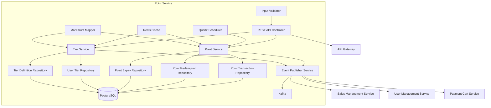
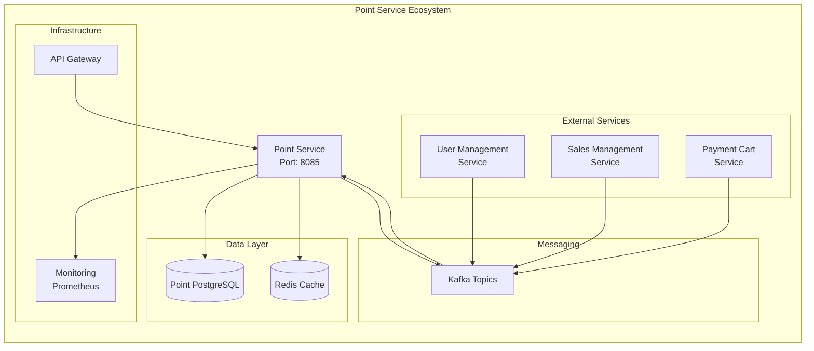
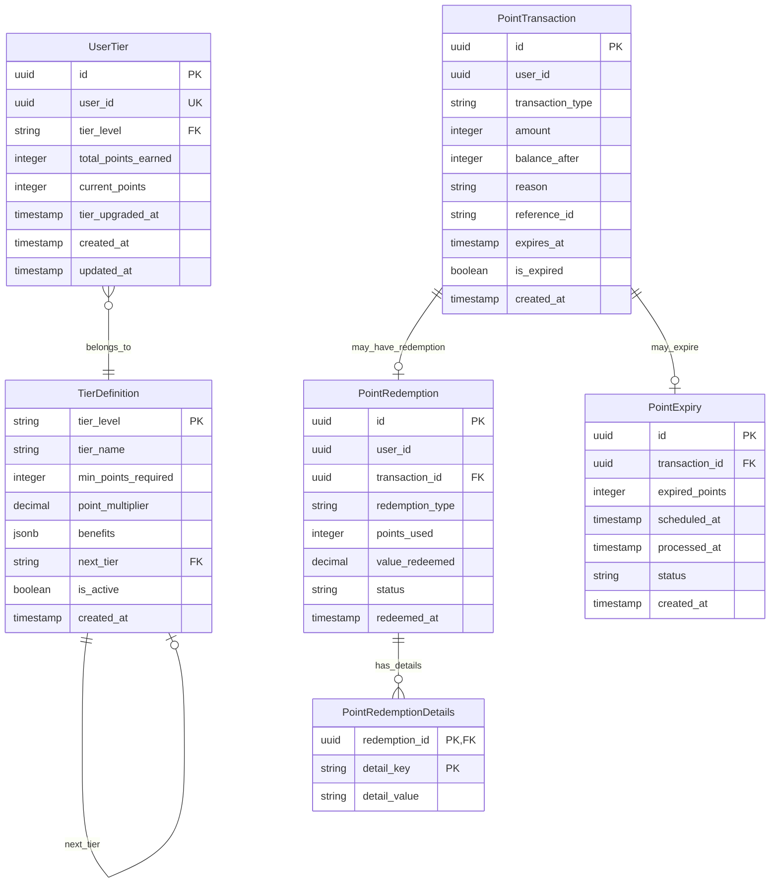

# Point Service - Detailed Design Document

## 1. Overview

The Point Service is a microservice that manages the customer loyalty point system for the ski shop e-commerce platform. It handles point accumulation from purchases, point redemption for discounts and rewards, customer tier management, point expiration processing, and provides comprehensive analytics for loyalty program optimization. The service promotes customer retention and engagement through sophisticated point-based rewards and tier benefits system.

### Service Responsibilities

- **Point Management**: Point earning, redemption, transfer, and balance tracking
- **Tier System**: Customer tier calculation, upgrade processing, and benefit management  
- **Point Lifecycle**: Automated point expiration processing and notifications
- **Transaction History**: Complete audit trail of all point-related activities
- **Analytics & Reporting**: Point usage analytics and tier progression reporting
- **Event Integration**: Seamless integration with order, payment, and user management services
- **Scheduled Processing**: Automated batch processing for point expiry and tier upgrades

## 2. Technology Stack

### Development Environment

- **Language**: Java 21 (LTS)
- **Framework**: Spring Boot 3.2.3
- **Build Tool**: Maven 3.9.x
- **Containerization**: Docker 25.x
- **Testing**: JUnit 5.10.1, Spring Boot Test, Testcontainers 1.19.3

### Production Environment

- Azure Container Apps
- Azure Database for PostgreSQL
- Azure Cache for Redis
- Azure Service Bus (Kafka)

### Major Libraries and Versions

| Library | Version | Purpose |
|---------|---------|---------|
| spring-boot-starter-web | 3.2.3 | REST API endpoints |
| spring-boot-starter-data-jpa | 3.2.3 | JPA data access |
| spring-boot-starter-data-redis | 3.2.3 | Redis caching |
| spring-boot-starter-validation | 3.2.3 | Input validation |
| spring-boot-starter-security | 3.2.3 | Security configuration |
| spring-boot-starter-actuator | 3.2.3 | Health checks, metrics |
| spring-boot-starter-quartz | 3.2.3 | Scheduler (point expiry management) |
| spring-cloud-starter-stream-kafka | 4.1.0 | Event publishing/subscribing |
| postgresql | 42.7.2 | PostgreSQL JDBC driver |
| flyway-core | 9.22.3 | Database migrations |
| mapstruct | 1.5.5.Final | Object mapping |
| lombok | 1.18.30 | Boilerplate code reduction |
| micrometer-registry-prometheus | 1.12.2 | Metrics collection |
| springdoc-openapi-starter-webmvc-ui | 2.3.0 | API documentation |
| azure-identity | 1.11.1 | Azure authentication |
| logback-json-classic | 0.1.5 | JSON log output |

## 3. System Architecture

### Component Architecture Diagram



### Microservice Relationship Diagram



### Service Layer Architecture

The Point Service follows a clean layered architecture pattern:

1. **Controller Layer**: REST API endpoints with OpenAPI documentation and validation
2. **Service Layer**: Business logic implementation with transaction management and caching
3. **Repository Layer**: JPA repositories with custom queries for data access optimization
4. **Entity Layer**: JPA entities with proper relationships and constraints
5. **DTO Layer**: Data transfer objects for API communication and event messaging
6. **Scheduler Layer**: Quartz-based scheduled jobs for automated processing

### Key Components

- **PointController**: REST API endpoints for point management operations
- **TierController**: REST API endpoints for tier management and eligibility
- **PointServiceImpl**: Core business logic for point operations with transaction management
- **TierServiceImpl**: Tier calculation, upgrade processing, and benefit management
- **Quartz Scheduler**: Automated point expiry and tier upgrade batch processing
- **Event Publishers**: Kafka integration for domain event publishing
- **MapStruct Mappers**: Object mapping between DTOs and entities
- **Flyway Migrations**: Database schema versioning and deployment

## 4. Data Model

### Entity Relationship Diagram



### Database Schema Details

#### TierDefinition Table

**Purpose**: Stores loyalty tier definitions with benefits and progression rules

```sql
CREATE TABLE tier_definitions (
    tier_level VARCHAR(20) PRIMARY KEY,
    tier_name VARCHAR(50) NOT NULL,
    min_points_required INTEGER NOT NULL DEFAULT 0,
    point_multiplier DECIMAL(3,2) NOT NULL DEFAULT 1.00,
    benefits JSONB DEFAULT '{}',
    next_tier VARCHAR(20),
    is_active BOOLEAN DEFAULT true,
    created_at TIMESTAMP DEFAULT CURRENT_TIMESTAMP,
    CONSTRAINT fk_tier_next FOREIGN KEY (next_tier) REFERENCES tier_definitions(tier_level)
);
```

**Key Features**:

- Self-referencing foreign key for tier progression
- JSONB column for flexible benefit storage
- Point multiplier for earning rate calculation
- Hierarchical tier structure support

**Default Data**:

- **Bronze**: Entry level (0 points, 1.0x multiplier)
- **Silver**: 10,000 points required (1.25x multiplier)
- **Gold**: 25,000 points required (1.5x multiplier)  
- **Platinum**: 50,000 points required (2.0x multiplier)

#### UserTier Table

**Purpose**: Tracks individual user tier status and point balances

```sql
CREATE TABLE user_tiers (
    id UUID PRIMARY KEY DEFAULT gen_random_uuid(),
    user_id UUID UNIQUE NOT NULL,
    tier_level VARCHAR(20) NOT NULL DEFAULT 'bronze',
    total_points_earned INTEGER DEFAULT 0,
    current_points INTEGER DEFAULT 0,
    tier_upgraded_at TIMESTAMP,
    created_at TIMESTAMP DEFAULT CURRENT_TIMESTAMP,
    updated_at TIMESTAMP DEFAULT CURRENT_TIMESTAMP,
    CONSTRAINT fk_usertier_tier FOREIGN KEY (tier_level) REFERENCES tier_definitions(tier_level)
);
```

**Key Features**:

- Unique constraint on user_id for one tier per user
- Automatic timestamp updates via triggers
- Cascading tier level validation
- Separate tracking of earned vs current points

#### PointTransaction Table

**Purpose**: Records all point-related activities with full audit trail

```sql
CREATE TABLE point_transactions (
    id UUID PRIMARY KEY DEFAULT gen_random_uuid(),
    user_id UUID NOT NULL,
    transaction_type VARCHAR(20) NOT NULL CHECK (transaction_type IN ('earned', 'redeemed', 'expired', 'transferred_in', 'transferred_out')),
    amount INTEGER NOT NULL,
    balance_after INTEGER NOT NULL,
    reason VARCHAR(100) NOT NULL,
    reference_id VARCHAR(100),
    expires_at TIMESTAMP,
    is_expired BOOLEAN DEFAULT false,
    created_at TIMESTAMP DEFAULT CURRENT_TIMESTAMP
);
```

**Transaction Types**:

- **earned**: Points awarded for purchases, activities
- **redeemed**: Points used for discounts, rewards
- **expired**: Points automatically expired
- **transferred_in**: Points received from other users
- **transferred_out**: Points sent to other users

#### PointRedemption Table

**Purpose**: Tracks point redemption activities with detailed information

```sql
CREATE TABLE point_redemptions (
    id UUID PRIMARY KEY DEFAULT gen_random_uuid(),
    user_id UUID NOT NULL,
    transaction_id UUID NOT NULL,
    redemption_type VARCHAR(50) NOT NULL,
    points_used INTEGER NOT NULL,
    value_redeemed DECIMAL(10,2) NOT NULL,
    status VARCHAR(20) DEFAULT 'completed',
    redeemed_at TIMESTAMP DEFAULT CURRENT_TIMESTAMP,
    CONSTRAINT fk_redemption_transaction FOREIGN KEY (transaction_id) REFERENCES point_transactions(id)
);
```

**Redemption Types**:

- **discount**: Direct order discount
- **cashback**: Cash equivalent redemption
- **product**: Physical product redemption
- **gift_card**: Gift card generation

#### PointExpiry Table

**Purpose**: Manages scheduled point expiration processing

```sql
CREATE TABLE point_expiry (
    id UUID PRIMARY KEY DEFAULT gen_random_uuid(),
    transaction_id UUID NOT NULL,
    expired_points INTEGER NOT NULL,
    scheduled_at TIMESTAMP NOT NULL,
    processed_at TIMESTAMP,
    status VARCHAR(20) DEFAULT 'scheduled',
    created_at TIMESTAMP DEFAULT CURRENT_TIMESTAMP,
    CONSTRAINT fk_expiry_transaction FOREIGN KEY (transaction_id) REFERENCES point_transactions(id)
);
```

**Status Values**:

- **scheduled**: Awaiting expiry processing
- **processing**: Currently being processed
- **completed**: Successfully expired
- **failed**: Processing failed

### Performance Indexes

| Table | Index Name | Columns | Purpose |
|-------|------------|---------|---------|
| user_tiers | idx_user_tiers_user_id | user_id | Fast user tier lookup |
| point_transactions | idx_point_transactions_user_id | user_id | User transaction history |
| point_transactions | idx_point_transactions_created_at | created_at | Time-based queries |
| point_transactions | idx_point_transactions_user_created | user_id, created_at | User history by date |
| point_transactions | idx_point_transactions_expires_at | expires_at (WHERE not expired) | Expiration processing |
| point_transactions | idx_point_transactions_reference | reference_id (WHERE not null) | External reference lookup |
| point_redemptions | idx_point_redemptions_user_id | user_id | User redemption history |
| point_redemptions | idx_point_redemptions_redeemed_at | redeemed_at | Redemption analytics |
| point_expiry | idx_point_expiry_scheduled_at | scheduled_at | Batch expiry processing |
| point_expiry | idx_point_expiry_status | status | Status-based filtering |

### Data Integrity Constraints

- **Referential Integrity**: All foreign keys enforced at database level
- **Check Constraints**: Transaction types validated via CHECK constraints
- **Unique Constraints**: One tier record per user enforced
- **Not Null Constraints**: Critical fields protected from null values
- **Trigger Functions**: Automatic timestamp updates for audit trails

## 5. REST API Endpoints

### Point Management API

| Method | Path | Description | Parameters | Response |
|---------|-----|------------|------------|----------|
| POST | /api/points/award | Award points to user | PointAwardRequest | PointTransactionDto |
| GET | /api/points/balance/{userId} | Get point balance | userId | PointBalanceResponse |
| GET | /api/points/history/{userId} | Get point history | userId, pageable | `List<PointTransactionDto>` |
| GET | /api/points/history/{userId}/range | Get point history by date range | userId, startDate, endDate | `List<PointTransactionDto>` |
| POST | /api/points/redeem | Redeem points | PointRedemptionRequest | Void |
| GET | /api/points/expiring/{userId} | Get expiring points | userId, days (default: 30) | `List<PointTransactionDto>` |
| POST | /api/points/transfer | Transfer points between users | fromUserId, toUserId, amount, reason | Void |
| POST | /api/points/process-expired | Process expired points (admin) | - | Void |

### Tier Management API

| Method | Path | Description | Parameters | Response |
|---------|-----|------------|------------|----------|
| GET | /api/tiers/user/{userId} | Get user tier info | userId | UserTierDto |
| GET | /api/tiers | Get all tier definitions | - | `List<TierDefinition>` |
| GET | /api/tiers/{tierLevel} | Get specific tier definition | tierLevel | TierDefinition |
| GET | /api/tiers/upgrade-eligibility/{userId} | Check upgrade eligibility | userId | UserTierDto |
| POST | /api/tiers/process-upgrades | Process all tier upgrades (admin) | - | Void |

### Implementation Notes

- **Port Configuration**: The service runs on port 8085 by default
- **Authentication**: All endpoints require appropriate authentication (future implementation)
- **Validation**: Jakarta Bean Validation applied to all request DTOs
- **OpenAPI Documentation**: Available at `/swagger-ui.html` and `/v3/api-docs`
- **Admin Operations**: Batch processing endpoints require admin privileges
- **Java 21 Features**: Service leverages modern Java features including records and switch expressions

### Request/Response Examples

#### Point Award Request (PointAwardRequest)

```json
{
  "userId": "550e8400-e29b-41d4-a716-446655440000",
  "amount": 100,
  "reason": "Purchase reward",
  "referenceId": "order-12345",
  "expiryDays": 365
}
```

#### Point Award Response (PointTransactionDto)

```json
{
  "id": "f47ac10b-58cc-4372-a567-0e02b2c3d479",
  "userId": "550e8400-e29b-41d4-a716-446655440000",
  "transactionType": "EARNED",
  "amount": 100,
  "balanceAfter": 1350,
  "reason": "Purchase reward",
  "referenceId": "order-12345",
  "expiresAt": "2025-01-15T23:59:59Z",
  "isExpired": false,
  "createdAt": "2024-01-15T10:30:00Z"
}
```

#### Point Balance Response (PointBalanceResponse)

```json
{
  "userId": "550e8400-e29b-41d4-a716-446655440000",
  "totalEarned": 5670,
  "totalRedeemed": 4420,
  "currentBalance": 1250,
  "expiringPoints": 100,
  "tierLevel": "silver",
  "tierName": "Silver",
  "pointsToNextTier": 750,
  "nextTier": "gold"
}
```

#### Point Redemption Request (PointRedemptionRequest)

```json
{
  "userId": "550e8400-e29b-41d4-a716-446655440000",
  "pointsToRedeem": 500,
  "redemptionType": "discount",
  "details": {
    "orderId": "order-12345",
    "discountAmount": "50.00"
  }
}
```

#### User Tier Response (UserTierDto)

```json
{
  "id": "tier-uuid",
  "userId": "550e8400-e29b-41d4-a716-446655440000",
  "tierLevel": "silver",
  "tierName": "Silver",
  "totalPointsEarned": 15670,
  "currentPoints": 1250,
  "tierUpgradedAt": "2024-01-01T10:30:00Z",
  "nextTier": "gold",
  "pointsToNextTier": 9330,
  "benefits": {
    "free_shipping_threshold": 75,
    "birthday_bonus": 1000,
    "early_access": true
  },
  "pointMultiplier": 1.25
}
```

## 6. Event Design

### Published Events

| Event Name | Description | Payload | Topic |
|-----------|-------------|---------|-------|
| PointsAwarded | Published when points are awarded | User ID, Points amount, Transaction ID, Tier info | points.awarded |
| PointsRedeemed | Published when points are redeemed | User ID, Points used, Redemption type, Value | points.redeemed |
| PointsExpired | Published when points expire | User ID, Expired points, Transaction ID | points.expired |
| PointsTransferred | Published when points are transferred | From/To User IDs, Amount, Reason | points.transferred |
| TierUpgraded | Published when user tier is upgraded | User ID, Old tier, New tier, Total earned | tier.upgraded |
| TierDowngraded | Published when user tier is downgraded | User ID, Old tier, New tier, Reason | tier.downgraded |

### Subscribed Events

| Event Name | Description | Source Service | Action |
|-----------|-------------|----------------|--------|
| OrderCompleted | Subscribed when order is completed | Sales Management Service | Award points based on order amount |
| UserRegistered | Subscribed when new user registers | User Management Service | Create initial bronze tier record |
| PaymentProcessed | Subscribed when payment is successful | Payment Service | Award points for payment method bonus |
| ReturnProcessed | Subscribed when return is processed | Sales Management Service | Deduct points if originally awarded |

### Event Schema Examples

#### PointsAwarded Event

```json
{
  "eventId": "e8766215-8c62-4bf6-92c5-a9414e456789",
  "eventType": "points.awarded",
  "version": "1.0",
  "timestamp": "2024-01-15T10:30:00Z",
  "source": "point-service",
  "data": {
    "transactionId": "f47ac10b-58cc-4372-a567-0e02b2c3d479",
    "userId": "550e8400-e29b-41d4-a716-446655440000",
    "pointsAwarded": 100,
    "reason": "Purchase reward",
    "referenceId": "order-12345",
    "balanceAfter": 1350,
    "tierLevel": "silver",
    "pointMultiplier": 1.25
  }
}
```

#### TierUpgraded Event

```json
{
  "eventId": "e8766215-8c62-4bf6-92c5-a9414e456790",
  "eventType": "tier.upgraded",
  "version": "1.0",
  "timestamp": "2024-01-15T10:35:00Z",
  "source": "point-service",
  "data": {
    "userId": "550e8400-e29b-41d4-a716-446655440000",
    "oldTier": "silver",
    "newTier": "gold",
    "totalPointsEarned": 25000,
    "currentPoints": 1350,
    "upgradedAt": "2024-01-15T10:35:00Z",
    "newBenefits": {
      "free_shipping_threshold": 50,
      "birthday_bonus": 2000,
      "early_access": true,
      "exclusive_products": true
    }
  }
}
```

## 7. Error Handling

### Error Code Definition

| Error Code | Description | HTTP Status |
|------------|-------------|-------------|
| PNT-4001 | Invalid point award request | 400 Bad Request |
| PNT-4002 | Invalid redemption request | 400 Bad Request |
| PNT-4003 | Invalid transfer request | 400 Bad Request |
| PNT-4004 | Invalid user ID format | 400 Bad Request |
| PNT-4041 | User tier not found | 404 Not Found |
| PNT-4042 | Point transaction not found | 404 Not Found |
| PNT-4043 | Tier definition not found | 404 Not Found |
| PNT-4221 | Insufficient points for redemption | 422 Unprocessable Entity |
| PNT-4222 | Points already expired | 422 Unprocessable Entity |
| PNT-4223 | Transfer amount exceeds balance | 422 Unprocessable Entity |
| PNT-4224 | Cannot transfer to same user | 422 Unprocessable Entity |
| PNT-4225 | Tier upgrade not eligible | 422 Unprocessable Entity |
| PNT-5001 | Internal point service error | 500 Internal Server Error |
| PNT-5002 | Database connection error | 503 Service Unavailable |
| PNT-5003 | Event publishing failed | 503 Service Unavailable |

### Global Error Handling

```java
@RestControllerAdvice
public class PointServiceExceptionHandler {

    private static final Logger log = LoggerFactory.getLogger(PointServiceExceptionHandler.class);

    @ExceptionHandler(UserTierNotFoundException.class)
    public ResponseEntity<ErrorResponse> handleUserTierNotFound(UserTierNotFoundException ex) {
        ErrorResponse error = new ErrorResponse("PNT-4041", ex.getMessage());
        return new ResponseEntity<>(error, HttpStatus.NOT_FOUND);
    }
    
    @ExceptionHandler(InsufficientPointsException.class)
    public ResponseEntity<ErrorResponse> handleInsufficientPoints(InsufficientPointsException ex) {
        ErrorResponse error = new ErrorResponse("PNT-4221", ex.getMessage());
        return new ResponseEntity<>(error, HttpStatus.UNPROCESSABLE_ENTITY);
    }
    
    @ExceptionHandler(PointsExpiredException.class)
    public ResponseEntity<ErrorResponse> handlePointsExpired(PointsExpiredException ex) {
        ErrorResponse error = new ErrorResponse("PNT-4222", ex.getMessage());
        return new ResponseEntity<>(error, HttpStatus.UNPROCESSABLE_ENTITY);
    }
    
    @ExceptionHandler(InvalidTransferException.class)
    public ResponseEntity<ErrorResponse> handleInvalidTransfer(InvalidTransferException ex) {
        ErrorResponse error = new ErrorResponse("PNT-4223", ex.getMessage());
        return new ResponseEntity<>(error, HttpStatus.UNPROCESSABLE_ENTITY);
    }
    
    @ExceptionHandler(ValidationException.class)
    public ResponseEntity<ErrorResponse> handleValidation(ValidationException ex) {
        ErrorResponse error = new ErrorResponse("PNT-4001", ex.getMessage());
        return new ResponseEntity<>(error, HttpStatus.BAD_REQUEST);
    }
    
    @ExceptionHandler(EventPublishingException.class)
    public ResponseEntity<ErrorResponse> handleEventPublishing(EventPublishingException ex) {
        ErrorResponse error = new ErrorResponse("PNT-5003", ex.getMessage());
        return new ResponseEntity<>(error, HttpStatus.SERVICE_UNAVAILABLE);
    }
    
    @ExceptionHandler(Exception.class)
    public ResponseEntity<ErrorResponse> handleGeneric(Exception ex) {
        log.error("Unhandled exception occurred", ex);
        ErrorResponse error = new ErrorResponse("PNT-5001", "A system error occurred. Please try again later.");
        return new ResponseEntity<>(error, HttpStatus.INTERNAL_SERVER_ERROR);
    }
}
```

### Business Rule Exceptions

```java
public class PointServiceException extends RuntimeException {
    public enum ErrorCode {
        INSUFFICIENT_POINTS("Not enough points available for redemption"),
        INVALID_TRANSFER_AMOUNT("Transfer amount must be positive and within balance"),
        POINTS_EXPIRED("Cannot operate on expired points"),
        TIER_UPGRADE_NOT_ELIGIBLE("User does not meet tier upgrade requirements"),
        DUPLICATE_TRANSACTION("Transaction with this reference ID already exists");
        
        private final String message;
        
        ErrorCode(String message) {
            this.message = message;
        }
        
        public String getMessage() {
            return message;
        }
    }
    
    private final ErrorCode errorCode;
    
    public PointServiceException(ErrorCode errorCode) {
        super(errorCode.getMessage());
        this.errorCode = errorCode;
    }
    
    public ErrorCode getErrorCode() {
        return errorCode;
    }
}
```

## 8. Performance and Optimization

### Performance Requirements

- **Point Balance Queries**: < 50ms response time (95th percentile)
- **Point Award Operations**: < 100ms response time (95th percentile)
- **Tier Calculation**: < 200ms response time (95th percentile)
- **Concurrent Users**: Support 1000+ concurrent point operations
- **Throughput**: 500+ point transactions/second peak capacity
- **Database Queries**: < 10ms for indexed lookups

### Caching Strategy

#### Redis Cache Implementation

- **Point Balance Cache**:
  - Key: `point:balance:{userId}`
  - TTL: 300 seconds (5 minutes)
  - Cache invalidation on point transactions

- **Tier Information Cache**:
  - Key: `tier:user:{userId}`
  - TTL: 1800 seconds (30 minutes)
  - Cache invalidation on tier upgrades

- **Tier Definitions Cache**:
  - Key: `tier:definitions`
  - TTL: 86400 seconds (24 hours)
  - Global cache for all tier configurations

```java
@Cacheable(value = "pointBalance", key = "#userId")
public PointBalanceResponse getPointBalance(UUID userId) {
    // Implementation with database fallback
}

@CacheEvict(value = "pointBalance", key = "#request.userId")
public PointTransactionDto awardPoints(PointAwardRequest request) {
    // Implementation with cache invalidation
}
```

### Query Optimization

#### Database Indexes

- **Composite Indexes**: Optimized for multi-column queries
- **Partial Indexes**: Filter conditions for better performance
- **Expression Indexes**: Computed column indexing

#### JPA Query Optimization

- **@Query Annotations**: Custom JPQL for complex operations
- **Batch Operations**: Bulk processing for expiry operations
- **Entity Graphs**: Fetch join optimization

```java
@Query("SELECT pt FROM PointTransaction pt WHERE pt.userId = :userId AND pt.expiresAt <= :expiredBefore AND pt.isExpired = false")
List<PointTransaction> findExpiringPoints(@Param("userId") UUID userId, @Param("expiredBefore") LocalDateTime expiredBefore);

@Modifying
@Query("UPDATE PointTransaction pt SET pt.isExpired = true WHERE pt.id IN :transactionIds")
int markPointsAsExpired(@Param("transactionIds") List<UUID> transactionIds);
```

### Connection Pooling

```yaml
spring:
  datasource:
    hikari:
      maximum-pool-size: 20
      minimum-idle: 5
      idle-timeout: 300000
      connection-timeout: 20000
      leak-detection-threshold: 60000
```

## 9. Security Measures

### Authentication & Authorization

- **Spring Security Integration**: Security configuration with JWT token validation
- **Method Security**: `@PreAuthorize` annotations for role-based access control
- **Input Validation**: Jakarta Bean Validation with custom validators
- **SQL Injection Prevention**: JPA parameterized queries and PreparedStatements

### Business Rule Security

- **Transaction Validation**: Comprehensive validation using custom annotations
- **Balance Verification**: Atomic operations ensuring point balance integrity
- **Audit Trail**: Complete transaction history with timestamps and references
- **Idempotency**: Reference ID validation to prevent duplicate transactions
- **Rate Limiting**: API rate limiting to prevent abuse

### Data Protection

```java
@Valid
@NotNull
public class PointAwardRequest {
    @NotNull(message = "User ID is required")
    private UUID userId;
    
    @Positive(message = "Amount must be positive")
    @Max(value = 100000, message = "Maximum 100,000 points per transaction")
    private Integer amount;
    
    @NotBlank(message = "Reason is required")
    @Size(max = 100, message = "Reason must not exceed 100 characters")
    private String reason;
    
    @Size(max = 100, message = "Reference ID must not exceed 100 characters")
    private String referenceId;
    
    @Min(value = 1, message = "Expiry days must be at least 1")
    @Max(value = 3650, message = "Expiry days must not exceed 10 years")
    private Integer expiryDays;
}
```

## 10. Monitoring and Logging

### Monitoring Metrics

| Metric | Description | Threshold |
|---------|-------------|-----------|
| point-award-rate | Points awarded per minute | Warning: > 1000/min, Alert: > 2000/min |
| point-redemption-rate | Points redeemed per minute | Warning: > 500/min, Alert: > 1000/min |
| tier-upgrade-rate | Tier upgrades per hour | Warning: > 50/hour, Alert: > 100/hour |
| point-expiry-processing-time | Batch expiry processing duration | Warning: > 30sec, Alert: > 60sec |
| api-response-time | API response time (95th percentile) | Warning: > 100ms, Alert: > 500ms |
| database-connection-usage | Database connection pool usage | Warning: > 80%, Alert: > 95% |
| cache-hit-ratio | Redis cache hit ratio | Warning: < 90%, Alert: < 80% |

### Health Check Implementation

```java
@Component
public class PointServiceHealthIndicator implements HealthIndicator {
    
    private final PointTransactionRepository pointTransactionRepository;
    private final RedisTemplate<String, Object> redisTemplate;
    
    @Override
    public Health health() {
        try {
            // Check database connectivity
            pointTransactionRepository.count();
            
            // Check Redis connectivity
            redisTemplate.opsForValue().get("health:check");
            
            return Health.up()
                    .withDetail("database", "accessible")
                    .withDetail("cache", "accessible")
                    .build();
        } catch (Exception ex) {
            return Health.down()
                    .withDetail("error", ex.getMessage())
                    .build();
        }
    }
}
```

### Structured Logging

```java
@Slf4j
@Service
public class PointServiceImpl implements PointService {
    
    @Override
    @Transactional
    public PointTransactionDto awardPoints(PointAwardRequest request) {
        log.info("Awarding points: userId={}, amount={}, reason={}", 
                request.getUserId(), request.getAmount(), request.getReason());
        
        try {
            // Business logic implementation
            PointTransaction transaction = processPointAward(request);
            
            log.info("Points awarded successfully: transactionId={}, balanceAfter={}", 
                    transaction.getId(), transaction.getBalanceAfter());
            
            return mapToDto(transaction);
        } catch (Exception ex) {
            log.error("Failed to award points: userId={}, amount={}, error={}", 
                    request.getUserId(), request.getAmount(), ex.getMessage(), ex);
            throw ex;
        }
    }
}
```

### Prometheus Metrics

```java
@Component
public class PointServiceMetrics {
    
    private final Counter pointsAwardedCounter = Counter.builder("points_awarded_total")
            .description("Total points awarded")
            .register(Metrics.globalRegistry);
    
    private final Counter pointsRedeemedCounter = Counter.builder("points_redeemed_total")
            .description("Total points redeemed")
            .register(Metrics.globalRegistry);
    
    private final Timer pointOperationTimer = Timer.builder("point_operation_duration")
            .description("Point operation processing time")
            .register(Metrics.globalRegistry);
    
    public void recordPointsAwarded(int amount) {
        pointsAwardedCounter.increment(amount);
    }
    
    public void recordPointsRedeemed(int amount) {
        pointsRedeemedCounter.increment(amount);
    }
    
    public Timer.Sample startTimer() {
        return Timer.start(Metrics.globalRegistry);
    }
}
```

## 11. Testing Strategy

### Unit Testing

```java
@ExtendWith(MockitoExtension.class)
class PointServiceImplTest {
    
    @Mock
    private PointTransactionRepository pointTransactionRepository;
    
    @Mock
    private UserTierRepository userTierRepository;
    
    @Mock
    private EventPublisher eventPublisher;
    
    @InjectMocks
    private PointServiceImpl pointService;
    
    @Test
    void shouldAwardPointsCorrectly() {
        // Given
        UUID userId = UUID.randomUUID();
        PointAwardRequest request = PointAwardRequest.builder()
                .userId(userId)
                .amount(100)
                .reason("Test reward")
                .expiryDays(365)
                .build();
        
        UserTier userTier = createUserTier(userId, 1000);
        when(userTierRepository.findByUserId(userId)).thenReturn(Optional.of(userTier));
        when(pointTransactionRepository.save(any())).thenAnswer(i -> i.getArgument(0));
        
        // When
        PointTransactionDto result = pointService.awardPoints(request);
        
        // Then
        assertThat(result.getAmount()).isEqualTo(100);
        assertThat(result.getBalanceAfter()).isEqualTo(1100);
        verify(eventPublisher).publishPointsAwardedEvent(any());
    }
    
    @Test
    void shouldThrowExceptionForInsufficientPoints() {
        // Given
        UUID userId = UUID.randomUUID();
        PointRedemptionRequest request = PointRedemptionRequest.builder()
                .userId(userId)
                .pointsToRedeem(500)
                .redemptionType("discount")
                .build();
        
        UserTier userTier = createUserTier(userId, 100); // Insufficient balance
        when(userTierRepository.findByUserId(userId)).thenReturn(Optional.of(userTier));
        
        // When & Then
        assertThatThrownBy(() -> pointService.redeemPoints(request))
                .isInstanceOf(InsufficientPointsException.class)
                .hasMessage("Insufficient points for redemption");
    }
}
```

### Integration Testing

```java
@SpringBootTest
@Testcontainers
@TestPropertySource(properties = {
        "spring.datasource.url=jdbc:tc:postgresql:14:///testdb",
        "spring.redis.host=localhost",
        "spring.redis.port=6379"
})
class PointServiceIntegrationTest {
    
    @Container
    static PostgreSQLContainer<?> postgres = new PostgreSQLContainer<>("postgres:14")
            .withDatabaseName("testdb")
            .withUsername("test")
            .withPassword("test");
    
    @Container
    static GenericContainer<?> redis = new GenericContainer<>("redis:7-alpine")
            .withExposedPorts(6379);
    
    @Autowired
    private TestRestTemplate restTemplate;
    
    @Autowired
    private PointTransactionRepository pointTransactionRepository;
    
    @Test
    void shouldAwardAndRedeemPointsEndToEnd() {
        // Given: Award points
        UUID userId = UUID.randomUUID();
        PointAwardRequest awardRequest = PointAwardRequest.builder()
                .userId(userId)
                .amount(1000)
                .reason("Integration test")
                .expiryDays(365)
                .build();
        
        // When: Award points via REST API
        ResponseEntity<PointTransactionDto> awardResponse = restTemplate.postForEntity(
                "/api/points/award", awardRequest, PointTransactionDto.class);
        
        // Then: Verify award
        assertThat(awardResponse.getStatusCode()).isEqualTo(HttpStatus.CREATED);
        assertThat(awardResponse.getBody().getAmount()).isEqualTo(1000);
        
        // When: Get balance
        ResponseEntity<PointBalanceResponse> balanceResponse = restTemplate.getForEntity(
                "/api/points/balance/" + userId, PointBalanceResponse.class);
        
        // Then: Verify balance
        assertThat(balanceResponse.getStatusCode()).isEqualTo(HttpStatus.OK);
        assertThat(balanceResponse.getBody().getCurrentBalance()).isEqualTo(1000);
        
        // When: Redeem points
        PointRedemptionRequest redemptionRequest = PointRedemptionRequest.builder()
                .userId(userId)
                .pointsToRedeem(500)
                .redemptionType("discount")
                .build();
        
        ResponseEntity<Void> redemptionResponse = restTemplate.postForEntity(
                "/api/points/redeem", redemptionRequest, Void.class);
        
        // Then: Verify redemption
        assertThat(redemptionResponse.getStatusCode()).isEqualTo(HttpStatus.OK);
        
        // Verify final balance
        ResponseEntity<PointBalanceResponse> finalBalanceResponse = restTemplate.getForEntity(
                "/api/points/balance/" + userId, PointBalanceResponse.class);
        assertThat(finalBalanceResponse.getBody().getCurrentBalance()).isEqualTo(500);
    }
}
```

### Load Testing

```java
@Component
public class PointServiceLoadTest {
    
    @Autowired
    private PointService pointService;
    
    public void performLoadTest() {
        int numberOfThreads = 50;
        int operationsPerThread = 100;
        ExecutorService executor = Executors.newFixedThreadPool(numberOfThreads);
        CountDownLatch latch = new CountDownLatch(numberOfThreads);
        
        for (int i = 0; i < numberOfThreads; i++) {
            executor.submit(() -> {
                try {
                    for (int j = 0; j < operationsPerThread; j++) {
                        UUID userId = UUID.randomUUID();
                        PointAwardRequest request = PointAwardRequest.builder()
                                .userId(userId)
                                .amount(100)
                                .reason("Load test")
                                .expiryDays(365)
                                .build();
                        pointService.awardPoints(request);
                    }
                } finally {
                    latch.countDown();
                }
            });
        }
        
        try {
            latch.await(60, TimeUnit.SECONDS);
        } catch (InterruptedException e) {
            Thread.currentThread().interrupt();
        }
        
        executor.shutdown();
    }
}
```

## 12. Deployment

### Docker Containerization

```dockerfile
FROM eclipse-temurin:21-jre-alpine

WORKDIR /app

COPY target/point-service-1.0.0-SNAPSHOT.jar app.jar

ENV JAVA_OPTS="-Xms256m -Xmx512m -XX:+UseG1GC"

EXPOSE 8085

HEALTHCHECK --interval=30s --timeout=3s --retries=3 \
    CMD wget -q --spider http://localhost:8085/actuator/health || exit 1

ENTRYPOINT ["sh", "-c", "java $JAVA_OPTS -jar app.jar"]
```

### Kubernetes/Azure Container Apps Configuration

```yaml
apiVersion: apps/v1
kind: Deployment
metadata:
  name: point-service
  labels:
    app: point-service
spec:
  replicas: 2
  selector:
    matchLabels:
      app: point-service
  template:
    metadata:
      labels:
        app: point-service
    spec:
      containers:
      - name: point-service
        image: ${ACR_NAME}.azurecr.io/point-service:${IMAGE_TAG}
        ports:
        - containerPort: 8085
        env:
        - name: SPRING_PROFILES_ACTIVE
          value: "prod"
        - name: DB_USERNAME
          valueFrom:
            secretKeyRef:
              name: point-db-secret
              key: username
        - name: DB_PASSWORD
          valueFrom:
            secretKeyRef:
              name: point-db-secret
              key: password
        - name: REDIS_HOST
          value: "point-redis-service"
        - name: KAFKA_BOOTSTRAP_SERVERS
          value: "kafka-service:9092"
        resources:
          requests:
            memory: "256Mi"
            cpu: "250m"
          limits:
            memory: "512Mi"
            cpu: "500m"
        livenessProbe:
          httpGet:
            path: /actuator/health/liveness
            port: 8085
          initialDelaySeconds: 30
          periodSeconds: 30
        readinessProbe:
          httpGet:
            path: /actuator/health/readiness
            port: 8085
          initialDelaySeconds: 5
          periodSeconds: 5
---
apiVersion: v1
kind: Service
metadata:
  name: point-service
spec:
  selector:
    app: point-service
  ports:
  - port: 80
    targetPort: 8085
  type: ClusterIP
```

### Environment Configuration

#### Production Configuration (application-prod.yml)

```yaml
server:
  port: 8085

spring:
  application:
    name: point-service
  
  datasource:
    url: ${DB_URL}
    username: ${DB_USERNAME}
    password: ${DB_PASSWORD}
    driver-class-name: org.postgresql.Driver
    hikari:
      maximum-pool-size: 20
      minimum-idle: 5
      idle-timeout: 300000
      connection-timeout: 20000
      leak-detection-threshold: 60000
    
  jpa:
    database-platform: org.hibernate.dialect.PostgreSQLDialect
    hibernate:
      ddl-auto: validate
    show-sql: false
    properties:
      hibernate:
        jdbc:
          batch_size: 20
        order_inserts: true
        order_updates: true
        
  flyway:
    enabled: true
    baseline-on-migrate: true
    baseline-version: 0
    schemas: public
    
  data:
    redis:
      host: ${REDIS_HOST}
      port: ${REDIS_PORT:6379}
      password: ${REDIS_PASSWORD:}
      database: 2
      timeout: 2000ms
      lettuce:
        pool:
          max-active: 8
          max-wait: -1ms
          max-idle: 8
          min-idle: 0
      
  kafka:
    bootstrap-servers: ${KAFKA_BOOTSTRAP_SERVERS}
    producer:
      key-serializer: org.apache.kafka.common.serialization.StringSerializer
      value-serializer: org.springframework.kafka.support.serializer.JsonSerializer
      acks: all
      retries: 3
      batch-size: 16384
      linger-ms: 5
    consumer:
      group-id: point-service
      key-deserializer: org.apache.kafka.common.serialization.StringDeserializer
      value-deserializer: org.springframework.kafka.support.serializer.JsonDeserializer
      auto-offset-reset: earliest
      enable-auto-commit: false
      properties:
        spring.json.trusted.packages: com.skishop.point.dto

management:
  endpoints:
    web:
      exposure:
        include: health,info,metrics,prometheus
  endpoint:
    health:
      show-details: when-authorized
  metrics:
    export:
      prometheus:
        enabled: true

logging:
  level:
    com.skishop.point: INFO
    org.springframework.security: WARN
    org.hibernate.SQL: WARN
  pattern:
    console: "%d{yyyy-MM-dd HH:mm:ss} [%thread] %-5level %logger{36} - %msg%n"
    file: "%d{yyyy-MM-dd HH:mm:ss} [%thread] %-5level %logger{36} - %msg%n"
  file:
    name: /app/logs/point-service.log
```

## 13. Development Environment and Setup Instructions

### Prerequisites

- **Java 21** or later (OpenJDK recommended)
- **Maven 3.9** or later
- **Docker and Docker Compose** (for dependencies)
- **PostgreSQL 14+** (for local development)
- **Redis 7.2+** (for caching)
- **Kafka** (for event streaming)

### Local Development Environment Setup

#### Step 1: Clone and Build

```bash
# Clone the repository
git clone https://github.com/your-org/GHCP-Workshop.git
cd GHCP-Workshop/Ski-Shop-App-with-GHCP-AI-DrivenDev-EN/point-service

# Build the application
mvn clean compile

# Run tests
mvn test

# Package the application
mvn clean package
```

#### Step 2: Infrastructure Services Setup

Create a `docker-compose.yml` file for local development:

```yaml
version: '3.8'

services:
  postgres:
    image: postgres:14-alpine
    container_name: point-postgres
    environment:
      POSTGRES_DB: skishop_points
      POSTGRES_USER: skishop
      POSTGRES_PASSWORD: skishop123
    ports:
      - "5432:5432"
    volumes:
      - point-data:/var/lib/postgresql/data
    healthcheck:
      test: ["CMD-SHELL", "pg_isready -U skishop -d skishop_points"]
      interval: 10s
      timeout: 5s
      retries: 5

  redis:
    image: redis:7.2-alpine
    container_name: point-redis
    ports:
      - "6379:6379"
    volumes:
      - redis-data:/data
    command: redis-server --appendonly yes

  zookeeper:
    image: confluentinc/cp-zookeeper:7.4.0
    container_name: point-zookeeper
    environment:
      ZOOKEEPER_CLIENT_PORT: 2181
      ZOOKEEPER_TICK_TIME: 2000
    ports:
      - "2181:2181"

  kafka:
    image: confluentinc/cp-kafka:7.4.0
    container_name: point-kafka
    depends_on:
      - zookeeper
    ports:
      - "9092:9092"
    environment:
      KAFKA_BROKER_ID: 1
      KAFKA_ZOOKEEPER_CONNECT: zookeeper:2181
      KAFKA_ADVERTISED_LISTENERS: PLAINTEXT://localhost:9092
      KAFKA_OFFSETS_TOPIC_REPLICATION_FACTOR: 1
      KAFKA_GROUP_INITIAL_REBALANCE_DELAY_MS: 0
      KAFKA_CONFLUENT_SCHEMA_REGISTRY_URL: http://schema-registry:8081

volumes:
  point-data:
  redis-data:
```

#### Step 3: Start Infrastructure Services

```bash
# Start all infrastructure services
docker-compose up -d

# Verify services are running
docker-compose ps

# Check service health
docker-compose logs postgres
docker-compose logs redis
docker-compose logs kafka
```

#### Step 4: Database Setup

```bash
# Verify PostgreSQL is ready
docker exec -it point-postgres pg_isready -U skishop -d skishop_points

# Connect to verify database
docker exec -it point-postgres psql -U skishop -d skishop_points -c "\dt"

# If database doesn't exist, create it
docker exec -it point-postgres psql -U skishop -c "CREATE DATABASE skishop_points;"
```

#### Step 5: Application Configuration

Create `application-dev.yml` for development:

```yaml
spring:
  profiles:
    active: dev
  datasource:
    url: jdbc:postgresql://localhost:5432/skishop_points
    username: skishop
    password: skishop123
  
  jpa:
    hibernate:
      ddl-auto: validate
    show-sql: true
    
  data:
    redis:
      host: localhost
      port: 6379
      database: 2
      
  kafka:
    bootstrap-servers: localhost:9092

logging:
  level:
    com.skishop.point: DEBUG
    org.hibernate.SQL: DEBUG
```

#### Step 6: Run the Application

Choose one of the following methods:

##### Method A: Maven Spring Boot Plugin

```bash
mvn spring-boot:run -Dspring-boot.run.profiles=dev
```

##### Method B: Java JAR

```bash
# Build JAR
mvn clean package -DskipTests

# Run JAR
java -jar target/point-service-1.0.0-SNAPSHOT.jar --spring.profiles.active=dev
```

##### Method C: IDE Integration

Import the Maven project into your IDE and run `PointServiceApplication.main()` with VM options:

```bash
-Dspring.profiles.active=dev
```

#### Step 7: Verify Application Startup

```bash
# Check application health
curl http://localhost:8085/actuator/health

# Expected response:
# {"status":"UP","groups":["liveness","readiness"]}

# Access API documentation
open http://localhost:8085/swagger-ui.html

# Check metrics
curl http://localhost:8085/actuator/metrics
```

#### Step 8: Test Core Functionality

```bash
# Test point award API
curl -X POST http://localhost:8085/api/points/award \
  -H "Content-Type: application/json" \
  -d '{
    "userId": "550e8400-e29b-41d4-a716-446655440000",
    "amount": 100,
    "reason": "Test reward",
    "expiryDays": 365
  }'

# Get point balance
curl "http://localhost:8085/api/points/balance/550e8400-e29b-41d4-a716-446655440000"

# Get user tier information
curl "http://localhost:8085/api/tiers/user/550e8400-e29b-41d4-a716-446655440000"
```

### Database Migrations

The application uses Flyway for database schema management:

```bash
# Apply migrations manually (optional, done automatically on startup)
mvn flyway:migrate

# Check migration status
mvn flyway:info

# Clean database (development only)
mvn flyway:clean
```

#### Troubleshooting

##### Common Issues

1. **Port already in use**:

   ```bash
   # Check what's using port 8085
   lsof -i :8085
   # Change server.port in application.yml if needed
   ```

2. **Database connection failed**:

   ```bash
   # Verify PostgreSQL is running
   docker ps | grep postgres
   # Check connection
   docker exec -it point-postgres pg_isready -U skishop
   ```

3. **Redis connection failed**:

   ```bash
   # Verify Redis is running
   docker ps | grep redis
   # Test connection
   docker exec -it point-redis redis-cli ping
   ```

4. **Kafka connection issues**:

   ```bash
   # Check Kafka is running
   docker ps | grep kafka
   # List topics
   docker exec -it point-kafka kafka-topics --bootstrap-server localhost:9092 --list
   ```

##### Useful Commands

```bash
# Clean restart of all services
docker-compose down -v
docker-compose up -d

# View application logs
tail -f logs/point-service.log

# Monitor database connections
docker exec -it point-postgres psql -U skishop -d skishop_points -c "SELECT * FROM pg_stat_activity;"

# Monitor Redis
docker exec -it point-redis redis-cli monitor
```

## 14. Operations and Maintenance

### Backup Strategy

- **Database Backup**:
  - Azure Database for PostgreSQL automatic backup (daily)
  - Point-in-time restore capability (up to 35 days)
  - Manual backup before major releases

- **Disaster Recovery Plan**:
  - RPO (Recovery Point Objective): Within 1 hour
  - RTO (Recovery Time Objective): Within 2 hours
  - Cross-region backup replication

### Scaling Strategy

- **Horizontal Scaling**:
  - Auto-scale based on CPU usage (> 70%) and memory usage (> 80%)
  - Minimum instances: 2, Maximum instances: 10
  - Scale-in protection during high transaction periods

- **Database Scaling**:
  - Read replicas for balance/history queries
  - Connection pooling optimization
  - Query performance monitoring

### Maintenance Tasks

#### Daily Operations

- **Health Monitoring**: Automated health checks via Azure Monitor
- **Performance Metrics**: Monitor response times, throughput, error rates
- **Log Analysis**: Automated log analysis for error patterns

#### Weekly Operations

- **Database Maintenance**: Index optimization and statistics updates
- **Cache Warmup**: Redis cache preloading for optimal performance
- **Security Scanning**: Automated vulnerability scans

#### Monthly Operations

- **Capacity Planning**: Resource usage analysis and forecasting
- **Performance Review**: Query optimization and index analysis
- **Data Archival**: Archive old point transactions (> 2 years)

```sql
-- Monthly data archival script
CREATE TABLE point_transactions_archive AS 
SELECT * FROM point_transactions 
WHERE created_at < NOW() - INTERVAL '2 years';

DELETE FROM point_transactions 
WHERE created_at < NOW() - INTERVAL '2 years';
```

## 15. Future Enhancement Plans

### Phase 1: Enhanced Features (Next 3 months)

- **Point Pooling**: Family/group point sharing functionality
- **Advanced Tier Benefits**: Dynamic benefit configuration
- **Point Forecasting**: Predictive analytics for point expiration
- **Mobile Push Notifications**: Point balance and expiry alerts

### Phase 2: Analytics & Intelligence (Next 6 months)

- **Machine Learning Integration**: Personalized point earning recommendations
- **Advanced Analytics Dashboard**: Comprehensive point usage analytics
- **A/B Testing Framework**: Tier benefit optimization testing
- **Real-time Recommendations**: Context-aware point usage suggestions

### Phase 3: Advanced Capabilities (Next 12 months)

- **Blockchain Integration**: Immutable point transaction records
- **Partner Integration**: Third-party loyalty program integration
- **Gamification Engine**: Achievement badges and challenges
- **API Gateway Integration**: Advanced rate limiting and authentication

## 16. Conclusion

The Point Service represents a sophisticated, production-ready microservice that effectively manages customer loyalty programs for the ski shop e-commerce platform. Built on modern Java 21 and Spring Boot 3.2.3, it demonstrates enterprise-grade architecture patterns and best practices.

### Key Architectural Achievements

1. **Scalable Design**: Clean layered architecture supporting horizontal scaling
2. **Data Integrity**: Robust database schema with comprehensive constraints
3. **Performance Optimization**: Strategic caching and database indexing
4. **Event-Driven Integration**: Seamless communication with other microservices
5. **Comprehensive Testing**: Multi-layer testing strategy ensuring reliability
6. **Production Readiness**: Complete monitoring, logging, and deployment automation

### Technical Excellence

- **Modern Java Features**: Utilization of Java 21 capabilities for enhanced performance
- **Spring Boot Best Practices**: Proper configuration management and auto-configuration
- **Database Optimization**: Flyway migrations with performance-focused schema design
- **Security Implementation**: Comprehensive input validation and business rule enforcement
- **Monitoring Integration**: Prometheus metrics and structured logging

### Business Value Delivery

The Point Service enables sophisticated customer retention strategies through:

- **Flexible Point Management**: Support for various earning and redemption scenarios
- **Tier-based Benefits**: Automated tier progression with configurable benefits
- **Operational Efficiency**: Automated point expiry and batch processing
- **Analytics Capability**: Comprehensive transaction history for business insights

This implementation provides a solid foundation for customer loyalty programs and can be extended to support advanced features as business requirements evolve. The service demonstrates how modern microservice architecture can deliver both technical excellence and business value in enterprise applications.
