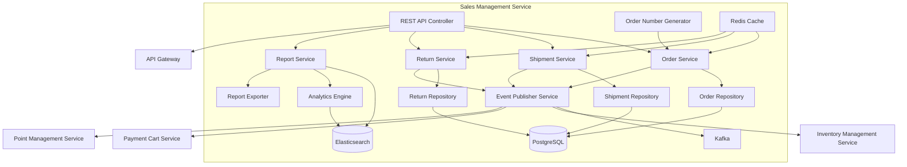
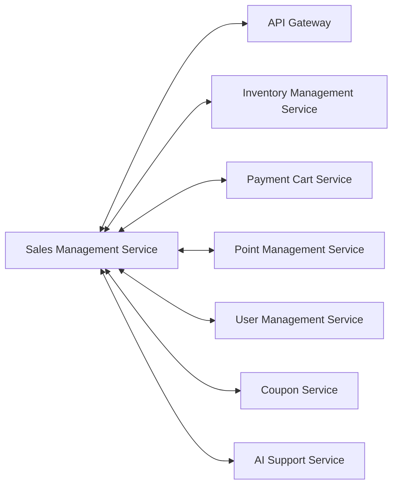
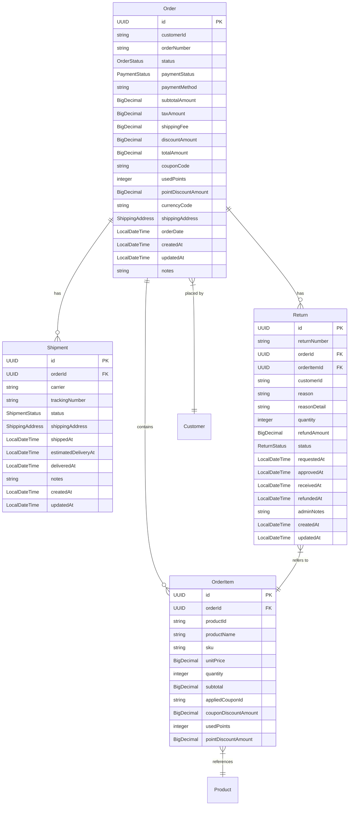
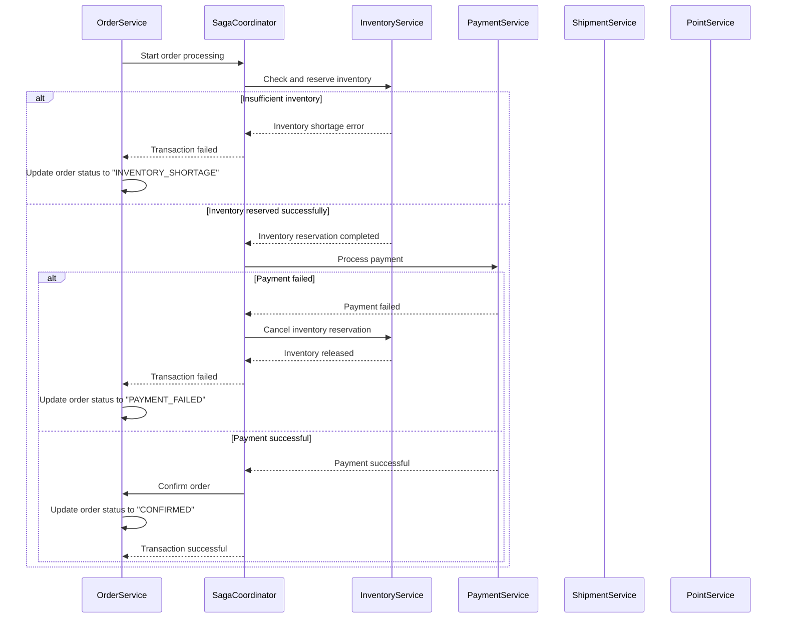

# Sales Management Service - Detailed Design Document

## 1. Overview

The Sales Management Service is a microservice that manages order processing and management, sales analysis and reporting, return/exchange processing, shipping arrangement and tracking, and sales history management. It handles the entire process from receiving customer orders to delivery and returns, providing sales data analysis and visualization.

## 2. Technology Stack

### Development Environment

- **Language**: Java 21 (LTS)
- **Framework**: Spring Boot 3.2.3
- **Build Tool**: Maven 3.9.x
- **Containerization**: Docker 25.x
- **Testing**: JUnit 5.10.1, Spring Boot Test, Testcontainers 1.19.3

### Production Environment

- Azure Container Apps
- Azure Database for PostgreSQL
- Elasticsearch 8.12

### Major Libraries and Versions

| Library | Version | Purpose |
|---------|---------|---------|
| spring-boot-starter-data-jpa | 3.2.3 | JPA Data Access |
| spring-boot-starter-web | 3.2.3 | REST API Endpoints |
| spring-boot-starter-validation | 3.2.3 | Input Validation |
| spring-boot-starter-security | 3.2.3 | Security Configuration |
| spring-boot-starter-actuator | 3.2.3 | Health Check, Metrics |
| spring-cloud-starter-stream-kafka | 4.1.0 | Event Publishing/Subscribing |
| spring-cloud-starter-circuitbreaker-resilience4j | 3.0.3 | Circuit Breaker |
| spring-boot-starter-data-elasticsearch | 3.2.3 | Elasticsearch Integration |
| spring-boot-starter-cache | 3.2.3 | Caching Functionality |
| spring-boot-starter-data-redis | 3.2.3 | Redis Cache |
| hibernate-core | 6.4.1 | ORM Mapping |
| postgresql | 42.7.1 | PostgreSQL JDBC Driver |
| querydsl-jpa | 5.0.0 | Dynamic Query Builder |
| flyway-core | 9.22.3 | Database Migration |
| mapstruct | 1.5.5.Final | Object Mapping |
| lombok | 1.18.30 | Boilerplate Code Reduction |
| micrometer-registry-prometheus | 1.12.2 | Metrics Collection |
| springdoc-openapi-starter-webmvc-ui | 2.3.0 | API Documentation |
| azure-identity | 1.11.1 | Azure Authentication |
| azure-security-keyvault-secrets | 4.6.2 | Azure Key Vault Integration |
| poi | 5.4.0 | Excel Report Generation |
| itextpdf | 5.5.13.3 | PDF Report Generation |

## 3. System Architecture

### Component Architecture Diagram



### Microservice Relationship Diagram



## 4. Data Model

### Entity Relationship Diagram



## Service Information

| Item | Value |
|------|-------|
| Service Name | sales-management-service |
| Port | 8083 |
| Database | PostgreSQL (skishop_sales) |
| Framework | Spring Boot 3.2.3 |
| Java Version | 21 |
| Architecture | Microservice with Event-Driven Architecture |

## Technology Stack

| Category | Technology | Version | Purpose |
|----------|-----------|---------|---------|
| Runtime | Java | 21 | Main programming language with modern features |
| Framework | Spring Boot | 3.2.3 | Main application framework |
| Database | PostgreSQL | 16+ | Primary data storage |
| Cache | Redis | 7.2+ | Caching and session storage |
| Message Queue | Apache Kafka | 7.4.0 | Event streaming |
| Search Engine | Elasticsearch | 8.12.0 | Search and analytics |
| Build Tool | Maven | 3.9+ | Dependency management and build |
| Container | Docker | Latest | Containerization |

## Database Schema

### orders table

| Column | Data Type | Constraints | Description |
|--------|-----------|-------------|-------------|
| id | UUID | PK | Order ID |
| order_number | VARCHAR(50) | NOT NULL, UNIQUE | Order number |
| customer_id | VARCHAR(100) | NOT NULL | Customer ID |
| order_date | TIMESTAMP | NOT NULL | Order date |
| status | VARCHAR(20) | NOT NULL | Order status |
| payment_status | VARCHAR(20) | NOT NULL | Payment status |
| payment_method | VARCHAR(50) | NOT NULL | Payment method |
| subtotal_amount | DECIMAL(10,2) | NOT NULL | Subtotal amount |
| tax_amount | DECIMAL(10,2) | NOT NULL | Tax amount |
| shipping_fee | DECIMAL(10,2) | NOT NULL | Shipping fee |
| discount_amount | DECIMAL(10,2) | NOT NULL | Discount amount |
| total_amount | DECIMAL(10,2) | NOT NULL | Total amount |
| coupon_code | VARCHAR(50) | NULL | Coupon code |
| used_points | INTEGER | DEFAULT 0 | Used points |
| point_discount_amount | DECIMAL(10,2) | DEFAULT 0 | Point discount amount |
| shipping_postal_code | VARCHAR(10) | NULL | Shipping postal code |
| shipping_prefecture | VARCHAR(50) | NULL | Shipping prefecture |
| shipping_city | VARCHAR(100) | NULL | Shipping city |
| shipping_address_line1 | VARCHAR(200) | NULL | Shipping address line 1 |
| shipping_address_line2 | VARCHAR(200) | NULL | Shipping address line 2 |
| shipping_recipient_name | VARCHAR(100) | NULL | Shipping recipient name |
| shipping_phone_number | VARCHAR(20) | NULL | Shipping phone number |
| currency_code | VARCHAR(3) | NOT NULL, DEFAULT 'JPY' | Currency code |
| notes | TEXT | NULL | Notes |
| created_at | TIMESTAMP | NOT NULL | Created timestamp |
| updated_at | TIMESTAMP | NOT NULL | Updated timestamp |

### order_items table

| Column | Data Type | Constraints | Description |
|--------|-----------|-------------|-------------|
| id | UUID | PK | Order item ID |
| order_id | UUID | FK, NOT NULL | Order ID |
| product_id | VARCHAR(100) | NOT NULL | Product ID |
| product_name | VARCHAR(200) | NOT NULL | Product name |
| sku | VARCHAR(100) | NOT NULL | Product SKU |
| unit_price | DECIMAL(10,2) | NOT NULL | Unit price |
| quantity | INTEGER | NOT NULL | Quantity |
| subtotal | DECIMAL(10,2) | NOT NULL | Subtotal |
| applied_coupon_id | VARCHAR(100) | NULL | Applied coupon ID |
| coupon_discount_amount | DECIMAL(10,2) | DEFAULT 0 | Coupon discount amount |
| used_points | INTEGER | DEFAULT 0 | Used points |
| point_discount_amount | DECIMAL(10,2) | DEFAULT 0 | Point discount amount |

### shipments table

| Column | Data Type | Constraints | Description |
|--------|-----------|-------------|-------------|
| id | UUID | PK | Shipment ID |
| order_id | UUID | FK, NOT NULL, UNIQUE | Order ID |
| carrier | VARCHAR(100) | NOT NULL | Carrier |
| tracking_number | VARCHAR(100) | NULL | Tracking number |
| status | VARCHAR(20) | NOT NULL | Shipment status |
| shipping_postal_code | VARCHAR(10) | NULL | Shipping postal code |
| shipping_prefecture | VARCHAR(50) | NULL | Shipping prefecture |
| shipping_city | VARCHAR(100) | NULL | Shipping city |
| shipping_address_line1 | VARCHAR(200) | NULL | Shipping address line 1 |
| shipping_address_line2 | VARCHAR(200) | NULL | Shipping address line 2 |
| shipping_recipient_name | VARCHAR(100) | NULL | Shipping recipient name |
| shipping_phone_number | VARCHAR(20) | NULL | Shipping phone number |
| shipped_at | TIMESTAMP | NULL | Shipped timestamp |
| estimated_delivery_at | TIMESTAMP | NULL | Estimated delivery timestamp |
| delivered_at | TIMESTAMP | NULL | Delivered timestamp |
| notes | TEXT | NULL | Notes |
| created_at | TIMESTAMP | NOT NULL | Created timestamp |
| updated_at | TIMESTAMP | NOT NULL | Updated timestamp |

### returns table

| Column | Data Type | Constraints | Description |
|--------|-----------|-------------|-------------|
| id | UUID | PK | Return ID |
| return_number | VARCHAR(50) | NOT NULL, UNIQUE | Return number |
| order_id | UUID | FK, NOT NULL | Order ID |
| order_item_id | UUID | FK, NOT NULL | Order item ID |
| customer_id | VARCHAR(100) | NOT NULL | Customer ID |
| reason | VARCHAR(30) | NOT NULL | Return reason |
| reason_detail | TEXT | NULL | Detailed reason |
| quantity | INTEGER | NOT NULL | Return quantity |
| refund_amount | DECIMAL(10,2) | NOT NULL | Refund amount |
| status | VARCHAR(20) | NOT NULL | Return status |
| requested_at | TIMESTAMP | NOT NULL | Requested timestamp |
| approved_at | TIMESTAMP | NULL | Approved timestamp |
| received_at | TIMESTAMP | NULL | Received timestamp |
| refunded_at | TIMESTAMP | NULL | Refunded timestamp |
| admin_notes | TEXT | NULL | Admin notes |
| created_at | TIMESTAMP | NOT NULL | Created timestamp |
| updated_at | TIMESTAMP | NOT NULL | Updated timestamp |

## API Design

### REST API Endpoints

#### Order Management API

| Method | Path | Description | Parameters | Response |
|---------|-----|------------|------------|----------|
| GET | /api/v1/orders/{orderId} | Get order details | orderId | OrderResponse |
| GET | /api/v1/orders/number/{orderNumber} | Get order by number | orderNumber | OrderResponse |
| GET | /api/v1/orders/customer/{customerId} | Get customer order history | customerId, pageable | `Page<OrderResponse>` |
| POST | /api/v1/orders | Create order | OrderCreateRequest | OrderResponse |
| PUT | /api/v1/orders/{orderId}/status | Update order status | orderId, OrderStatusUpdateRequest | OrderResponse |
| PUT | /api/v1/orders/{orderId}/cancel | Cancel order | orderId, reason | OrderResponse |
| GET | /api/v1/orders/search | Search orders (Currently returns empty results - stub implementation) | customerId, status, paymentStatus, pageable | `Page<OrderResponse>` |

#### Shipment Management API

| Method | Path | Description | Parameters | Response |
|---------|-----|------------|------------|----------|
| GET | /api/v1/shipments | Get shipment list | page, size, sort, status | ShipmentListResponse |
| GET | /api/v1/shipments/{id} | Get shipment details | id (Long) | ShipmentDetailResponse |
| POST | /api/v1/shipments | Create shipment | ShipmentCreateRequest | ShipmentResponse |
| PUT | /api/v1/shipments/{id}/status | Update shipment status | id (Long), ShipmentStatusUpdateRequest | ShipmentResponse |
| GET | /api/v1/shipments/order/{orderId} | Get order shipment info | orderId (Long) | ShipmentListResponse |
| PUT | /api/v1/shipments/{id}/tracking | Update tracking info | id (Long), TrackingUpdateRequest | ShipmentResponse |

#### Return Management API

| Method | Path | Description | Parameters | Response |
|---------|-----|------------|------------|----------|
| GET | /api/v1/returns | Get return list | page, size, sort, status | ReturnListResponse |
| GET | /api/v1/returns/{id} | Get return details | id (Long) | ReturnDetailResponse |
| POST | /api/v1/returns | Create return request | ReturnCreateRequest | ReturnResponse |
| PUT | /api/v1/returns/{id}/status | Update return status | id (Long), ReturnStatusUpdateRequest | ReturnResponse |
| GET | /api/v1/returns/order/{orderId} | Get order return info | orderId | ReturnListResponse |

#### Reports API

| Method | Path | Description | Parameters | Response |
|---------|-----|------------|------------|----------|
| GET | /api/v1/reports/sales | Get sales report | fromDate, toDate, groupBy | SalesReportResponse |
| GET | /api/v1/reports/products | Get product sales report | fromDate, toDate, limit | ProductSalesReportResponse |
| GET | /api/v1/reports/export/sales | Export sales report | fromDate, toDate, format | File Download |
| GET | /api/v1/reports/shipping | Get shipping report | fromDate, toDate, carrier | ShippingReportResponse |
| GET | /api/v1/reports/returns | Get return analysis report | fromDate, toDate, reason | ReturnReportResponse |

### Implementation Notes

- **Search Orders Endpoint**: The `/api/v1/orders/search` endpoint is currently implemented as a stub and returns empty results. The implementation includes placeholder logic for future enhancement with proper search functionality based on customer ID, order status, and payment status.
- **ID Type Inconsistency**: There is currently an inconsistency where Shipment and Return entities use UUID as primary keys (as defined in the database schema), but the REST controllers accept Long type for ID parameters. This should be corrected in future updates.
- **Java 21 Features**: The service leverages Java 21's modern features including switch expressions, text blocks, and records for improved code quality and maintainability.
- **Authentication**: All endpoints require appropriate role-based authentication as specified in the `@PreAuthorize` annotations.

### Request/Response Examples

#### Order Creation Request (OrderCreateRequest)

```json
{
  "customerId": "550e8400-e29b-41d4-a716-446655440000",
  "items": [
    {
      "productId": "prod-123",
      "productName": "Ski Boots",
      "sku": "SKI-BOOT-001",
      "unitPrice": 25000.00,
      "quantity": 1
    }
  ],
  "shippingAddress": {
    "recipientName": "Taro Yamada",
    "postalCode": "100-0001",
    "prefecture": "Tokyo",
    "city": "Chiyoda",
    "addressLine1": "1-1-1 Chiyoda",
    "addressLine2": "Apt 101",
    "phoneNumber": "03-1234-5678"
  },
  "paymentMethod": "CREDIT_CARD",
  "couponCode": "WINTER2024",
  "usedPoints": 500,
  "notes": "Please deliver in the afternoon"
}
```

#### Order Response (OrderResponse)

```json
{
  "id": "f47ac10b-58cc-4372-a567-0e02b2c3d479",
  "orderNumber": "ORD-20240415-00001",
  "customerId": "550e8400-e29b-41d4-a716-446655440000",
  "orderDate": "2024-04-15T14:30:25.123Z",
  "status": "PENDING",
  "paymentStatus": "PENDING",
  "paymentMethod": "CREDIT_CARD",
  "subtotalAmount": 25000.00,
  "taxAmount": 2500.00,
  "shippingFee": 500.00,
  "discountAmount": 1000.00,
  "totalAmount": 27000.00,
  "couponCode": "WINTER2024",
  "usedPoints": 500,
  "pointDiscountAmount": 500.00,
  "currencyCode": "JPY",
  "items": [
    {
      "id": "item-123",
      "productId": "prod-123",
      "productName": "Ski Boots",
      "sku": "SKI-BOOT-001",
      "unitPrice": 25000.00,
      "quantity": 1,
      "subtotal": 25000.00
    }
  ],
  "shippingAddress": {
    "recipientName": "Taro Yamada",
    "postalCode": "100-0001",
    "prefecture": "Tokyo",
    "city": "Chiyoda",
    "addressLine1": "1-1-1 Chiyoda",
    "addressLine2": "Apt 101",
    "phoneNumber": "03-1234-5678"
  },
  "notes": "Please deliver in the afternoon",
  "createdAt": "2024-04-15T14:30:25.123Z",
  "updatedAt": "2024-04-15T14:30:25.123Z"
}
```

## Event Design

### Published Events

| Event Name | Description | Payload | Topic |
|-----------|-------------|---------|-------|
| OrderCreated | Published when order is created | Order ID, Customer ID, Order details, Amount info | sales.orders |
| OrderStatusUpdated | Published when order status changes | Order ID, Old status, New status, Change reason | sales.orders |
| OrderCancelled | Published when order is cancelled | Order ID, Customer ID, Cancellation reason | sales.orders |
| ShipmentCreated | Published when shipment info is created | Shipment ID, Order ID, Shipping address info | sales.shipments |
| ShipmentStatusUpdated | Published when shipment status is updated | Shipment ID, Order ID, Old status, New status | sales.shipments |
| ReturnRequested | Published when return is requested | Return ID, Order ID, Product ID, Quantity, Reason | sales.returns |
| ReturnProcessed | Published when return processing is completed | Return ID, Order ID, Processing result, Refund amount | sales.returns |

### Subscribed Events

| Event Name | Description | Source Service | Action |
|-----------|-------------|----------------|--------|
| InventoryReserved | Subscribed when inventory is reserved | Inventory Management Service | Update order status to "CONFIRMED" |
| InventoryReservationFailed | Subscribed when inventory reservation fails | Inventory Management Service | Update order status to "INVENTORY_SHORTAGE" |
| PaymentProcessed | Subscribed when payment processing is completed | Payment Service | Update payment status, set order status to "PAID" |
| PaymentFailed | Subscribed when payment processing fails | Payment Service | Update payment status to "FAILED", set order status to "PAYMENT_FAILED" |
| PointsAwarded | Subscribed when points are awarded | Point Management Service | Record point award information in order |

### Event Schema Examples

#### OrderCreated Event

```json
{
  "eventId": "e8766215-8c62-4bf6-92c5-a9414e456789",
  "eventType": "OrderCreated",
  "timestamp": "2024-04-15T14:30:25.123Z",
  "version": "1.0",
  "payload": {
    "orderId": "f47ac10b-58cc-4372-a567-0e02b2c3d479",
    "orderNumber": "ORD-20240415-00001",
    "customerId": "550e8400-e29b-41d4-a716-446655440000",
    "totalAmount": 27000.00,
    "subtotalAmount": 25000.00,
    "taxAmount": 2500.00,
    "shippingFee": 500.00,
    "discountAmount": 1000.00,
    "items": [
      {
        "productId": "prod-123",
        "productName": "Ski Boots",
        "sku": "SKI-BOOT-001",
        "quantity": 1,
        "unitPrice": 25000.00,
        "subtotal": 25000.00
      }
    ],
    "shippingAddress": {
      "recipientName": "Taro Yamada",
      "postalCode": "100-0001",
      "prefecture": "Tokyo",
      "city": "Chiyoda",
      "addressLine1": "1-1-1 Chiyoda",
      "phoneNumber": "03-1234-5678"
    },
    "couponCode": "WINTER2024",
    "usedPoints": 500,
    "currencyCode": "JPY"
  }
}
```

## 7. Distributed Transaction Management (Saga Pattern)

### Order Processing Saga



### Compensating Transactions

| Step | Compensating Action |
|------|-------------------|
| Inventory reservation | Cancel inventory reservation - InventoryService.releaseReservation() |
| Payment processing | Cancel payment - PaymentService.cancelPayment() |
| Order confirmation | Cancel order - OrderService.cancelOrder() |
| Shipment arrangement | Cancel shipment - ShipmentService.cancelShipment() |
| Points award | Cancel points - PointService.cancelPointAward() |

## 8. Error Handling

### Error Code Definition

| Error Code | Description | HTTP Status |
|------------|-------------|-------------|
| ORD-4001 | Invalid order data | 400 Bad Request |
| ORD-4002 | Order item does not exist | 400 Bad Request |
| ORD-4003 | Invalid payment information | 400 Bad Request |
| ORD-4004 | Incomplete shipping information | 400 Bad Request |
| ORD-4005 | Invalid coupon | 400 Bad Request |
| ORD-4006 | Below minimum order amount | 400 Bad Request |
| ORD-4041 | Order not found | 404 Not Found |
| ORD-4042 | Shipment information not found | 404 Not Found |
| ORD-4043 | Return information not found | 404 Not Found |
| ORD-4091 | Duplicate order number | 409 Conflict |
| ORD-4092 | Order already processed | 409 Conflict |
| ORD-4221 | Insufficient inventory | 422 Unprocessable Entity |
| ORD-4222 | Payment processing failed | 422 Unprocessable Entity |
| ORD-4223 | Order status change not allowed | 422 Unprocessable Entity |
| ORD-5001 | Internal server error | 500 Internal Server Error |
| ORD-5002 | External service integration error | 503 Service Unavailable |

### Global Error Handling

```java
@RestControllerAdvice
public class GlobalExceptionHandler {

    private static final Logger log = LoggerFactory.getLogger(GlobalExceptionHandler.class);

    @ExceptionHandler(ResourceNotFoundException.class)
    public ResponseEntity<ErrorResponse> handleResourceNotFoundException(ResourceNotFoundException ex) {
        ErrorResponse error = new ErrorResponse("ORD-4041", ex.getMessage());
        return new ResponseEntity<>(error, HttpStatus.NOT_FOUND);
    }
    
    @ExceptionHandler(InsufficientStockException.class)
    public ResponseEntity<ErrorResponse> handleInsufficientStockException(InsufficientStockException ex) {
        ErrorResponse error = new ErrorResponse("ORD-4221", ex.getMessage());
        return new ResponseEntity<>(error, HttpStatus.UNPROCESSABLE_ENTITY);
    }
    
    @ExceptionHandler(PaymentProcessingException.class)
    public ResponseEntity<ErrorResponse> handlePaymentProcessingException(PaymentProcessingException ex) {
        ErrorResponse error = new ErrorResponse("ORD-4222", ex.getMessage());
        return new ResponseEntity<>(error, HttpStatus.UNPROCESSABLE_ENTITY);
    }
    
    @ExceptionHandler(ValidationException.class)
    public ResponseEntity<ErrorResponse> handleValidationException(ValidationException ex) {
        ErrorResponse error = new ErrorResponse("ORD-4001", ex.getMessage());
        return new ResponseEntity<>(error, HttpStatus.BAD_REQUEST);
    }
    
    @ExceptionHandler(InvalidOrderStateException.class)
    public ResponseEntity<ErrorResponse> handleInvalidOrderStateException(InvalidOrderStateException ex) {
        ErrorResponse error = new ErrorResponse("ORD-4223", ex.getMessage());
        return new ResponseEntity<>(error, HttpStatus.UNPROCESSABLE_ENTITY);
    }
    
    @ExceptionHandler(ExternalServiceException.class)
    public ResponseEntity<ErrorResponse> handleExternalServiceException(ExternalServiceException ex) {
        ErrorResponse error = new ErrorResponse("ORD-5002", ex.getMessage());
        return new ResponseEntity<>(error, HttpStatus.SERVICE_UNAVAILABLE);
    }
    
    @ExceptionHandler(Exception.class)
    public ResponseEntity<ErrorResponse> handleGenericException(Exception ex) {
        log.error("Unhandled exception occurred", ex);
        ErrorResponse error = new ErrorResponse("ORD-5001", "A system error occurred. Please try again later.");
        return new ResponseEntity<>(error, HttpStatus.INTERNAL_SERVER_ERROR);
    }
}
```

## 9. Performance and Optimization

### Caching Strategy

- **Redis Cache**:
  - Frequently accessed order data (TTL: 1 hour)
  - Statistics and report data (TTL: 1 day)
  - Shipment tracking information (TTL: 30 minutes)

- **Cache Key Design**:
  - Order details: `order:{orderId}`
  - User order list: `orders:user:{userId}`
  - Daily sales report: `report:sales:daily:{date}`

### Index Design

| Table | Index | Column | Description |
|-------|-------|--------|-------------|
| orders | idx_orders_customer_id | customer_id | Accelerate customer order search |
| orders | idx_orders_status | status | Accelerate status-based order search |
| orders | idx_orders_order_date | order_date | Accelerate date range search |
| order_items | idx_order_items_product_id | product_id | Accelerate product-based order search |
| shipments | idx_shipments_order_id | order_id | Accelerate order shipment search |
| shipments | idx_shipments_status | status | Accelerate status-based shipment search |
| returns | idx_returns_order_id | order_id | Accelerate order return search |
| returns | idx_returns_status | status | Accelerate status-based return search |

### Query Optimization

- **Pagination Implementation**:
  - Use Keyset Pagination for large data retrieval
  - Set appropriate `page` and `size` limits

- **N+1 Problem Avoidance**:
  - Use JPA EntityGraph
  - Batch retrieval with custom JPQL queries

- **Read Replica Usage**:
  - Route report generation and analytics queries to read replicas
  - Proper use of @Transactional(readOnly = true)

| shipments | idx_shipments_order_id | order_id | Optimize shipment searches by order |
| shipments | idx_shipments_status | status | Optimize shipment searches by status |
| returns | idx_returns_order_id | order_id | Optimize return searches by order |
| returns | idx_returns_status | status | Optimize return searches by status |

### Advanced Query Optimization

- **Pagination Implementation**:
  - Use Keyset Pagination for large data sets
  - Proper `page` and `size` limit configuration

- **N+1 Problem Avoidance**:
  - JPA EntityGraph utilization
  - Custom JPQL queries for batch fetching

- **Read Replica Usage**:
  - Route report generation and analytics queries to read replicas
  - Proper use of @Transactional(readOnly = true)

## 10. Security Measures

### Data Security

- **Sensitive Data Encryption**:
  - Field-level encryption for payment information (partial credit card numbers, etc.)
  - Encryption of personal identification information at storage

- **Data Access Control**:
  - Fine-grained access control through Spring Security method security
  - Role-based authorization restrictions

### API Security

- **Authentication & Authorization**:
  - JWT token-based authentication
  - OAuth 2.0 / OpenID Connect utilization
  - Scope-based permission management

- **Input Validation**:
  - Bean Validation for input data verification
  - XSS attack prevention through sanitization
  - API rate limiting implementation

## 11. Monitoring and Logging

### Monitoring Metrics

| Metric | Description | Threshold |
|---------|-------------|-----------|
| order-creation-rate | Orders created per minute | Warning: > 100/min, Alert: > 200/min |
| order-processing-time | Order processing duration | Warning: > 2sec, Alert: > 5sec |
| payment-success-rate | Payment processing success rate | Warning: < 95%, Alert: < 90% |
| inventory-check-time | Inventory check response time | Warning: > 500ms, Alert: > 1sec |
| saga-completion-rate | Saga transaction completion rate | Warning: < 98%, Alert: < 95% |
| api-error-rate | API error rate | Warning: > 1%, Alert: > 5% |

### Log Design

- **Structured Logging**:
  - JSON format log output
  - Consistent recording of trace ID and span ID

- **Log Levels**:
  - ERROR: System errors, exception occurrences
  - WARN: Business warnings, system warnings
  - INFO: Normal operations, event processing
  - DEBUG: Detailed information, development use
  - TRACE: Most detailed information, problem diagnosis

- **Key Log Points**:
  - Order creation start/completion
  - Payment processing start/completion
  - Saga transaction steps
  - API call/response
  - Error occurrences and exception stacks

## 12. Testing Strategy

### Unit Testing

- **Test Targets**:
  - Service layer business logic
  - Validation rules
  - Helper utilities

- **Testing Framework**:
  - JUnit 5
  - Mockito
  - AssertJ

### Integration Testing

- **Test Targets**:
  - Repository layer and database integration
  - Event publishing and consumption
  - External service integration

- **Testing Framework**:
  - Spring Boot Test
  - Testcontainers
  - WireMock

### API Testing

- **Test Targets**:
  - REST API endpoints
  - Request/response validation
  - Error handling

- **Testing Framework**:
  - REST Assured
  - SpringBootTest (WebEnvironment)

### Load Testing

- **Test Targets**:
  - API performance under high traffic
  - Concurrent order processing concurrency
  - Saga transaction throughput

- **Testing Framework**:
  - Gatling
  - JMeter

## 13. Deployment

### Docker Containerization

```dockerfile
FROM eclipse-temurin:21-jre-alpine

WORKDIR /app

COPY build/libs/sales-management-service-*.jar app.jar

ENV JAVA_OPTS="-Xms512m -Xmx1024m -XX:+UseG1GC"

EXPOSE 8083

HEALTHCHECK --interval=30s --timeout=3s --retries=3 CMD wget -q --spider http://localhost:8083/actuator/health || exit 1

ENTRYPOINT ["sh", "-c", "java $JAVA_OPTS -jar app.jar"]
```

### Kubernetes / Azure Container Apps Configuration

```yaml
apiVersion: apps/v1
kind: Deployment
metadata:
  name: sales-management-service
  labels:
    app: sales-management-service
spec:
  replicas: 2
  selector:
    matchLabels:
      app: sales-management-service
  template:
    metadata:
      labels:
        app: sales-management-service
    spec:
      containers:
      - name: sales-management-service
        image: ${ACR_NAME}.azurecr.io/sales-management-service:${IMAGE_TAG}
        ports:
        - containerPort: 8083
        env:
        - name: SPRING_PROFILES_ACTIVE
          value: "prod"
        - name: DB_HOST
          valueFrom:
            secretKeyRef:
              name: sales-management-secrets
              key: db-host
        - name: DB_NAME
          valueFrom:
            secretKeyRef:
              name: sales-management-secrets
              key: db-name
        - name: DB_USERNAME
          valueFrom:
            secretKeyRef:
              name: sales-management-secrets
              key: db-username
        - name: DB_PASSWORD
          valueFrom:
            secretKeyRef:
              name: sales-management-secrets
              key: db-password
        - name: KAFKA_BOOTSTRAP_SERVERS
          valueFrom:
            configMapKeyRef:
              name: kafka-config
              key: bootstrap-servers
        - name: ELASTICSEARCH_HOSTS
          valueFrom:
            configMapKeyRef:
              name: elasticsearch-config
              key: hosts
        resources:
          limits:
            cpu: "1"
            memory: "1Gi"
          requests:
            cpu: "500m"
            memory: "512Mi"
        readinessProbe:
          httpGet:
            path: /actuator/health/readiness
            port: 8083
          initialDelaySeconds: 30
          periodSeconds: 10
        livenessProbe:
          httpGet:
            path: /actuator/health/liveness
            port: 8083
          initialDelaySeconds: 60
          periodSeconds: 30
---
apiVersion: v1
kind: Service
metadata:
  name: sales-management-service
spec:
  selector:
    app: sales-management-service
  ports:
  - port: 80
    targetPort: 8083
  type: ClusterIP
```

### CI/CD Pipeline (GitHub Actions)

```yaml
name: Sales Management Service CI/CD

on:
  push:
    branches: [ main ]
    paths:
      - 'sales-management-service/**'
  pull_request:
    branches: [ main ]
    paths:
      - 'sales-management-service/**'

jobs:
  build:
    runs-on: ubuntu-latest
    steps:
    - uses: actions/checkout@v3
    
    - name: Set up JDK 21
      uses: actions/setup-java@v3
      with:
        java-version: '21'
        distribution: 'temurin'
        cache: maven
    
    - name: Build with Maven
      run: mvn clean compile
      working-directory: ./sales-management-service
    
    - name: Run tests
      run: mvn test
      working-directory: ./sales-management-service
    
    - name: Build Docker image
      if: github.event_name == 'push' && github.ref == 'refs/heads/main'
      run: |
        docker build -t sales-management-service:${{ github.sha }} .
      working-directory: ./sales-management-service
    
    - name: Login to Azure Container Registry
      if: github.event_name == 'push' && github.ref == 'refs/heads/main'
      uses: azure/docker-login@v1
      with:
        login-server: ${{ secrets.ACR_LOGIN_SERVER }}
        username: ${{ secrets.ACR_USERNAME }}
        password: ${{ secrets.ACR_PASSWORD }}
    
    - name: Push Docker image to ACR
      if: github.event_name == 'push' && github.ref == 'refs/heads/main'
      run: |
        docker tag sales-management-service:${{ github.sha }} ${{ secrets.ACR_LOGIN_SERVER }}/sales-management-service:${{ github.sha }}
        docker tag sales-management-service:${{ github.sha }} ${{ secrets.ACR_LOGIN_SERVER }}/sales-management-service:latest
        docker push ${{ secrets.ACR_LOGIN_SERVER }}/sales-management-service:${{ github.sha }}
        docker push ${{ secrets.ACR_LOGIN_SERVER }}/sales-management-service:latest
    
    - name: Deploy to Azure Container Apps
      if: github.event_name == 'push' && github.ref == 'refs/heads/main'
      uses: azure/CLI@v1
      with:
        inlineScript: |
          az containerapp update \
            --name sales-management-service \
            --resource-group ${{ secrets.RESOURCE_GROUP }} \
            --image ${{ secrets.ACR_LOGIN_SERVER }}/sales-management-service:${{ github.sha }}
```

## 14. Operations and Maintenance

### Backup Strategy

- **Database Backup**:
  - Azure Database for PostgreSQL automatic backup (daily)
  - Manual backup (before important changes)
  - Backup retention period: 35 days

- **Disaster Recovery Plan**:
  - RPO (Recovery Point Objective): Within 1 hour
  - RTO (Recovery Time Objective): Within 4 hours

### Scaling Strategy

- **Horizontal Scaling**:
  - Automatic scale-out when CPU usage exceeds 70%
  - Predictive scaling during peak hours (10:00-18:00)
  - Minimum instances: 2, Maximum instances: 10

- **Vertical Scaling**:
  - Monthly review for resource allocation adjustment
  - Resource enhancement planning before peak seasons

### Regular Maintenance

- **Data Cleanup**:
  - Archive old analytics data (older than 6 months)
  - Delete unnecessary logs (older than 3 months)

- **Performance Tuning**:
  - Monthly index rebuilding
  - Query performance analysis and optimization

## Development Environment and Setup Instructions

### Prerequisites

- Java 21 or later
- Maven 3.9 or later
- Docker and Docker Compose
- PostgreSQL 16 (for local development)
- Redis 7.2+ (for caching)
- Kafka (for event streaming)

### Local Development Environment Setup

```bash
# Clone the repository
git clone https://github.com/your-org/GHCP-Workshop.git
cd GHCP-Workshop/Ski-Shop-App-with-GHCP-AI-DrivenDev-EN/sales-management-service

# Install dependencies
mvn clean compile

# Set up local database
createdb skishop_sales

# Run the application (development mode)
mvn spring-boot:run -Dspring-boot.run.profiles=dev
```

### Database Setup

The service uses PostgreSQL with Flyway for database migrations. The database schema is automatically created when the application starts using the migration file `V1__Create_sales_tables.sql` located in `src/main/resources/db/migration/`.

**Migration Features:**

- Automatic table creation for orders, order_items, shipments, and returns
- Proper foreign key relationships and constraints
- Optimized indexes for performance
- Auto-updating triggers for `updated_at` timestamp fields

**Default Database Configuration:**

- Host: localhost
- Port: 5432
- Database: skishop_sales
- Username: postgres
- Password: password

### Required Infrastructure Services

For full functionality, the following services are required:

1. **PostgreSQL Database** (Port 5432)

   ```bash
   docker run -d \
     --name sales-postgres \
     -e POSTGRES_DB=skishop_sales \
     -e POSTGRES_USER=postgres \
     -e POSTGRES_PASSWORD=password \
     -p 5432:5432 \
     postgres:16-alpine
   ```

2. **Redis Cache** (Port 6379)

   ```bash
   docker run -d \
     --name sales-redis \
     -p 6379:6379 \
     redis:7.2-alpine
   ```

3. **Kafka** (Port 9092)

   ```bash
   # Use Confluent Kafka for development
   docker run -d \
     --name sales-kafka \
     -p 9092:9092 \
     -e KAFKA_ZOOKEEPER_CONNECT=zookeeper:2181 \
     -e KAFKA_ADVERTISED_LISTENERS=PLAINTEXT://localhost:9092 \
     -e KAFKA_OFFSETS_TOPIC_REPLICATION_FACTOR=1 \
     confluentinc/cp-kafka:7.4.0
   ```

### Docker Compose Setup (Recommended)

Create a `docker-compose.yml` file in the sales-management-service directory:

```yaml
version: '3.8'

services:
  postgres:
    image: postgres:16-alpine
    container_name: sales-postgres
    environment:
      POSTGRES_DB: skishop_sales
      POSTGRES_USER: postgres
      POSTGRES_PASSWORD: password
    ports:
      - "5432:5432"
    volumes:
      - sales-data:/var/lib/postgresql/data
    healthcheck:
      test: ["CMD-SHELL", "pg_isready -U postgres -d skishop_sales"]
      interval: 10s
      timeout: 5s
      retries: 5

  redis:
    image: redis:7.2-alpine
    container_name: sales-redis
    ports:
      - "6379:6379"
    volumes:
      - redis-data:/data
    command: redis-server --appendonly yes

  zookeeper:
    image: confluentinc/cp-zookeeper:7.4.0
    container_name: sales-zookeeper
    environment:
      ZOOKEEPER_CLIENT_PORT: 2181
      ZOOKEEPER_TICK_TIME: 2000
    ports:
      - "2181:2181"

  kafka:
    image: confluentinc/cp-kafka:7.4.0
    container_name: sales-kafka
    depends_on:
      - zookeeper
    ports:
      - "9092:9092"
    environment:
      KAFKA_BROKER_ID: 1
      KAFKA_ZOOKEEPER_CONNECT: zookeeper:2181
      KAFKA_ADVERTISED_LISTENERS: PLAINTEXT://localhost:9092
      KAFKA_LISTENER_SECURITY_PROTOCOL_MAP: PLAINTEXT:PLAINTEXT
      KAFKA_INTER_BROKER_LISTENER_NAME: PLAINTEXT
      KAFKA_OFFSETS_TOPIC_REPLICATION_FACTOR: 1

volumes:
  sales-data:
  redis-data:
```

### Running the Application

#### 1. Start Infrastructure Services

First, navigate to the sales-management-service directory and start all required infrastructure services:

```bash
# Navigate to the service directory
cd sales-management-service

# Start all infrastructure services (PostgreSQL, Redis, Kafka, Zookeeper)
docker-compose up -d

# Verify all services are running
docker-compose ps

# Check service health status
docker-compose logs postgres
docker-compose logs redis
docker-compose logs kafka
```

#### 2. Verify Database Setup

```bash
# Check if PostgreSQL is ready
docker exec -it sales-postgres pg_isready -U postgres -d skishop_sales

# Connect to PostgreSQL to verify database exists
docker exec -it sales-postgres psql -U postgres -d skishop_sales -c "\dt"

# If database doesn't exist, create it
docker exec -it sales-postgres psql -U postgres -c "CREATE DATABASE skishop_sales;"
```

#### 3. Run the Application

Choose one of the following methods to start the application:

##### Method A: Development Mode with Maven

```bash
# Build and run the application
mvn clean compile
mvn spring-boot:run
```

##### Method B: Run with Specific Profile

```bash
mvn spring-boot:run -Dspring-boot.run.arguments="--spring.profiles.active=dev"
```

##### Method C: Build and Run as JAR

```bash
# Build the JAR file
mvn clean package

# Run the JAR file
java -jar target/sales-management-service-1.0.0-SNAPSHOT.jar
```

##### Method D: Run with Docker

```bash
# Build Docker image
docker build -t sales-management-service .

# Run Docker container
docker run -p 8083:8083 \
  -e SPRING_DATASOURCE_URL=jdbc:postgresql://host.docker.internal:5432/skishop_sales \
  -e SPRING_REDIS_HOST=host.docker.internal \
  -e SPRING_KAFKA_BOOTSTRAP_SERVERS=host.docker.internal:9092 \
  sales-management-service
```

#### 4. Verify Application Startup

```bash
# Check application health
curl http://localhost:8083/actuator/health

# Expected response:
# {"status":"UP","groups":["liveness","readiness"]}

# Access API documentation
open http://localhost:8083/swagger-ui.html

# Check metrics
curl http://localhost:8083/actuator/metrics

# If Kafka UI is running, access it
open http://localhost:8080
```

#### 5. Test Core Functionality

```bash
# Test order creation API
curl -X POST http://localhost:8083/api/v1/orders \
  -H "Content-Type: application/json" \
  -d '{
    "customerId": "test-customer-001",
    "items": [
      {
        "productId": "product-001",
        "productName": "Test Ski Boots",
        "sku": "SKI-BOOT-001",
        "unitPrice": 25000.00,
        "quantity": 1
      }
    ],
    "shippingAddress": {
      "recipientName": "Test User",
      "postalCode": "100-0001",
      "prefecture": "Tokyo",
      "city": "Chiyoda",
      "addressLine1": "1-1-1 Test Street",
      "phoneNumber": "03-1234-5678"
    },
    "paymentMethod": "CREDIT_CARD"
  }'

# Get customer orders (replace customer ID as needed)
curl "http://localhost:8083/api/v1/orders/customer/test-customer-001"

# Get order by ID (replace with actual order ID from create response)
curl "http://localhost:8083/api/v1/orders/{order-id}"
```

### Testing and Verification

#### Health Check

After starting the application, verify it's running properly:

```bash
# Check application health
curl http://localhost:8083/actuator/health

# Check database connectivity
curl http://localhost:8083/actuator/health/db
```

#### API Testing (Manual)

The service provides OpenAPI documentation accessible at:

- Development: <http://localhost:8083/swagger-ui.html>
- API Docs: <http://localhost:8083/api-docs>

#### Sample API Calls

1. **Create an Order:**

   ```bash
   curl -X POST http://localhost:8083/api/v1/orders \
     -H "Content-Type: application/json" \
     -d '{
       "customerId": "customer-123",
       "items": [{
         "productId": "product-456",
         "productName": "Ski Boots",
         "sku": "SKI-BOOT-001",
         "unitPrice": 25000.00,
         "quantity": 1
       }],
       "shippingAddress": {
         "recipientName": "Test User",
         "postalCode": "100-0001",
         "prefecture": "Tokyo",
         "city": "Chiyoda",
         "addressLine1": "1-1-1 Test",
         "phoneNumber": "03-1234-5678"
       },
       "paymentMethod": "CREDIT_CARD"
     }'
   ```

2. **Get Order by ID:**

   ```bash
   curl http://localhost:8083/api/v1/orders/{orderId}
   ```

3. **Get Customer Orders:**

   ```bash
   curl http://localhost:8083/api/v1/orders/customer/{customerId}
   ```

#### Running Tests

```bash
# Run unit tests
mvn test

# Run integration tests
mvn integration-test

# Run with coverage
mvn test jacoco:report
```

### Configuration

#### Application Properties

Key configuration properties in `application.yml`:

```yaml
server:
  port: 8083

spring:
  application:
    name: sales-management-service
  
  datasource:
    url: jdbc:postgresql://localhost:5432/skishop_sales
    username: postgres
    password: password
  
  kafka:
    bootstrap-servers: localhost:9092
    producer:
      acks: all
      retries: 3
    consumer:
      group-id: sales-management-service
  
  redis:
    host: localhost
    port: 6379

app:
  order:
    expiry-hours: 24
    auto-cancel-enabled: true
  shipping:
    free-shipping-threshold: 5000
    default-shipping-fee: 500
  return:
    allowed-days: 30
    auto-approval-threshold: 10000
  kafka:
    topics:
      orders: sales.orders
      shipments: sales.shipments
      returns: sales.returns

management:
  endpoints:
    web:
      exposure:
        include: health,info,metrics,prometheus
  endpoint:
    health:
      show-details: always
```

#### Environment Variables

For production deployment, override configurations using environment variables:

- `SPRING_DATASOURCE_URL`: Database connection URL
- `SPRING_DATASOURCE_USERNAME`: Database username
- `SPRING_DATASOURCE_PASSWORD`: Database password
- `SPRING_KAFKA_BOOTSTRAP_SERVERS`: Kafka bootstrap servers
- `SPRING_REDIS_HOST`: Redis host
- `SPRING_REDIS_PORT`: Redis port

### Troubleshooting

#### Common Issues

1. **Database Connection Failed**
   - Verify PostgreSQL is running: `docker ps`
   - Check database exists: `psql -h localhost -U postgres -l`
   - Verify credentials in `application.yml`

2. **Kafka Connection Issues**
   - Check Kafka is running: `docker logs sales-kafka`
   - Verify topics exist (will be auto-created on first use)

3. **Redis Connection Issues**
   - Check Redis is running: `docker logs sales-redis`
   - Test connection: `redis-cli ping`

4. **Port Already in Use**
   - Check what's using port 8083: `lsof -i :8083`
   - Kill the process or change the port in `application.yml`

#### Logs

Application logs can be found in:

- Console output when running with Maven
- Container logs: `docker logs <container-name>`
- Log files: Configure in `application.yml` under `logging.file.name`

## 16. Future Enhancement Plans

### Short-term Enhancements (3-6 months)

- **Analytics Enhancement**:
  - Implementation of advanced sales prediction models
  - Real-time dashboard provision
  - Product performance report expansion

- **Shipping Integration Enhancement**:
  - Integration with multiple shipping carrier APIs
  - Real-time shipping cost calculation
  - Shipping delay prediction and notification features

### Medium-term Enhancements (6-12 months)

- **Return Process Automation**:
  - Return reason analysis and automatic approval rules
  - Automatic return label generation
  - Quality inspection and resale decision workflow for returned products

- **Customer Satisfaction Tracking**:
  - Post-order feedback collection
  - NPS (Net Promoter Score) integration
  - Customer journey analysis

### Long-term Enhancements (12+ months)

- **AI-driven Anomaly Detection**:
  - Fraudulent order detection system
  - Abnormal return pattern detection
  - Inventory and sales discrepancy detection

- **Global Expansion Support**:
  - Multi-currency support
  - International shipping and customs calculation
  - Regional regulation compliance

## 17. Troubleshooting Guide

### Common Issues and Solutions

| Issue | Possible Cause | Solution |
|-------|---------------|----------|
| Slow order creation | High latency in inventory check service | 1. Check circuit breaker configuration 2. Scale inventory service 3. Review cache strategy |
| Payment processing error | Connection issues with payment gateway | 1. Check external service status 2. Network connectivity troubleshooting 3. Verify fallback mechanism |
| Saga transaction failure | Compensation transaction execution error | 1. Check event logs 2. Verify each microservice status 3. Manual intervention for recovery |
| Slow report generation | Inefficient queries on large datasets | 1. Query optimization 2. Add indexes 3. Introduce aggregation tables |
| Cache consistency issues | Event processing delays or failures | 1. Adjust cache TTL 2. Run consistency check batch 3. Re-process events |

### Log Analysis and Debugging

- **Log Search Query Examples**:

  ```text
  # Tracking specific order processing
  orderId:"f47ac10b-58cc-4372-a567-0e02b2c3d479"
  
  # Search for failed Saga transactions
  level:ERROR AND message:"Saga transaction failed" AND service:"sales-management"
  
  # Search for payment processing errors
  level:ERROR AND service:"sales-management" AND component:"PaymentService"
  ```

- **Key Debugging Points**:
  - Saga coordinator step transition logs
  - External service call response times and results
  - Database transaction commits and rollbacks
  - Event publishing and consumption verification

## API Documentation

Detailed API documentation is available through Swagger/OpenAPI:

- **Development Environment**: <http://localhost:8083/swagger-ui.html>
- **API Documentation**: <http://localhost:8083/api-docs>
- **Health Check**: <http://localhost:8083/actuator/health>

## Key Implementation Features

### Java 21 Modern Features

The Sales Management Service leverages Java 21's modern features:

1. **Records**: Used for immutable DTOs and request/response objects
   - OrderCreateRequest, OrderStatusUpdateRequest
   - Various response DTOs for clean data transfer

2. **Switch Expressions**: Enhanced pattern matching in status processing
   - Used in OrderController for search criteria determination
   - Enables more readable and maintainable condition handling

3. **Text Blocks**: For SQL queries and JSON templates
   - Improves readability of multi-line strings
   - Used in complex queries and documentation

4. **Pattern Matching**: For type checking and casting
   - Enhanced instanceof operations
   - Cleaner null-safe operations

### Spring Boot 3.2.3 Features

- **Native Image Support**: Ready for GraalVM native compilation
- **Observability**: Built-in metrics and tracing with Micrometer
- **Security**: Enhanced security configurations with Spring Security 6
- **Performance**: Improved startup time and memory usage optimization

### Database Features

- **Flyway Migrations**: Automated database schema management
- **JPA with Hibernate**: Object-relational mapping
- **Connection Pooling**: Optimized database connections
- **Indexes**: Properly indexed for performance

### Event-Driven Architecture

- **Kafka Integration**: Asynchronous event processing
- **Event Publishing**: Order lifecycle events
- **Event Consumption**: Integration with other services
- **Saga Pattern**: Distributed transaction management

## Summary

The Sales Management Service is a modern, cloud-native microservice built with Java 21 and Spring Boot 3.2.3. It provides comprehensive order management capabilities including:

- Order creation and lifecycle management
- Shipment tracking and management
- Return processing and approval
- Sales reporting and analytics
- Event-driven integration with other services

The service is designed for:

- **High Performance**: Optimized queries and caching
- **Scalability**: Horizontal scaling with stateless design
- **Reliability**: Comprehensive error handling and monitoring
- **Maintainability**: Clean architecture and modern Java features

For detailed setup instructions, see the [README.md](../sales-management-service/README.md) file in the service directory.
